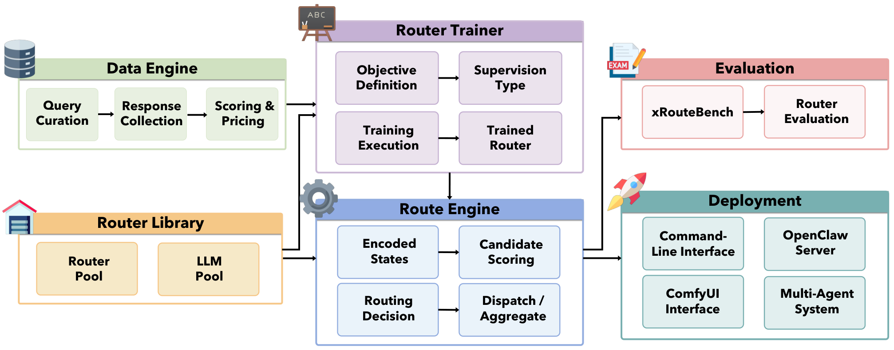
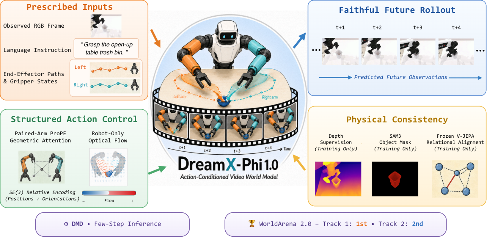
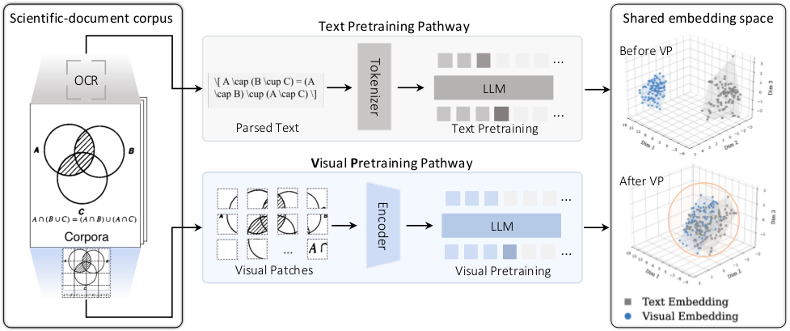
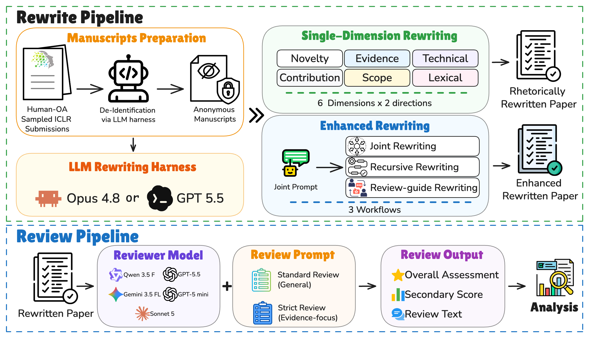
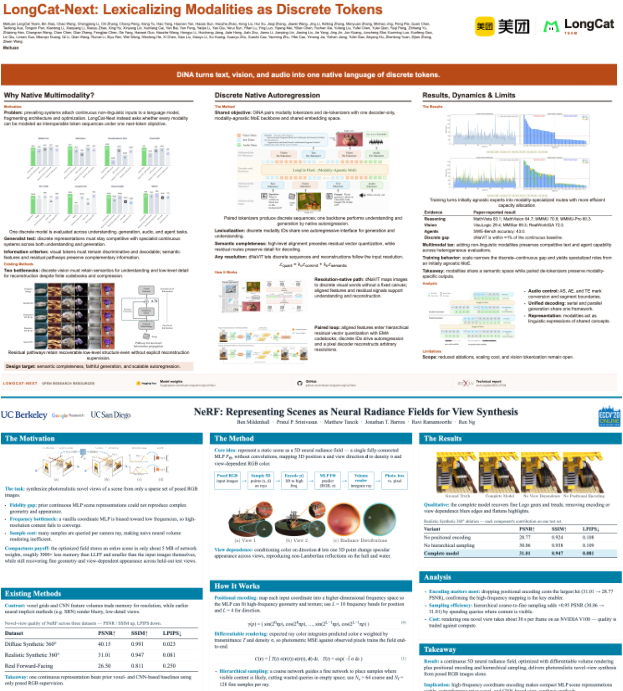
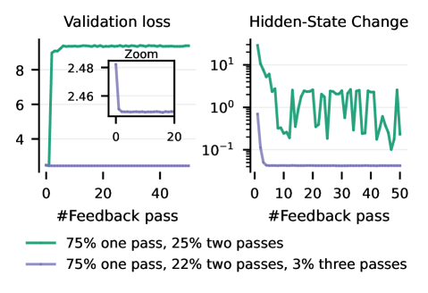
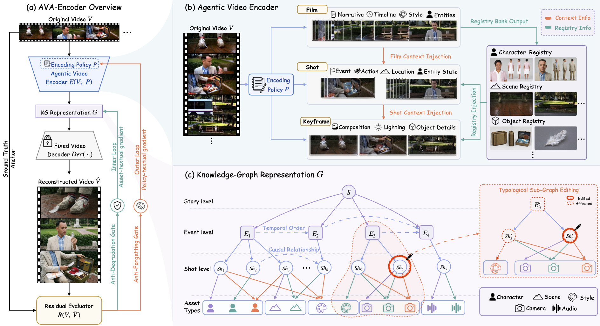
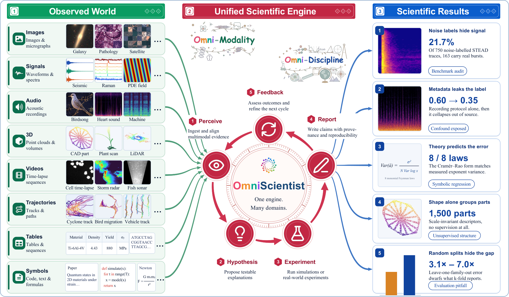
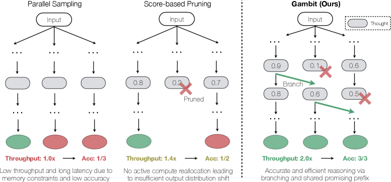
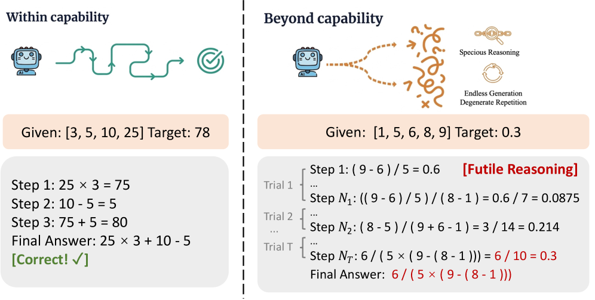

# Daily AI papers — 2026-08-14

*Curated from HF Daily Papers. 15 of ~32 papers kept after relevance filter.*

## Papers at a glance

| # | Title | Topics | Org |
| --- | --- | --- | --- |
| 1 | [LLMRouter: Unified Infrastructure for LLM Routers](#1-llmrouter-unified-infrastructure-for-llm-routers) | `LLM`, `efficient-inference`, `eval` | UIUC / U. Maryland |
| 2 | [Alaya-EVOKE: From Linear-Scaling Supervision to Endless World](#2-alaya-evoke-from-linear-scaling-supervision-to-endless-world) | `diffusion`, `world-model`, `distillation` | Shanghai AI Lab |
| 3 | [DreamX-Phi 1.0: Action-Conditioned Video World Model for Robotic Manipulation](#3-dreamx-phi-10-action-conditioned-video-world-model-for-robotic-manipulation) | `diffusion`, `world-model`, `multimodal` | Alibaba (Meituan/DAMO) |
| 4 | [DarwinX: Evolving Agent Harnesses Through Natural Selection](#4-darwinx-evolving-agent-harnesses-through-natural-selection) | `agents`, `evolutionary-search` | Salesforce AI Research |
| 5 | [Intern-S2-Preview: Scientific Agentic Foundation Model](#5-intern-s2-preview-scientific-agentic-foundation-model) | `LLM`, `agents`, `multimodal`, `RL` | Shanghai AI Lab |
| 6 | [How Can Rhetoric Reward-Hack AI Reviewers?](#6-how-can-rhetoric-reward-hack-ai-reviewers) | `safety`, `eval`, `LLM-as-judge` | UMD / UMBC |
| 7 | [AutoDesign: Meta-Harness Optimization for Long-Horizon Agentic Design](#7-autodesign-meta-harness-optimization-for-long-horizon-agentic-design) | `agents`, `multimodal`, `eval` | MBZUAI |
| 8 | [Spatial Memory Agent: Experience-Grounded Procedure Memory](#8-spatial-memory-agent-experience-grounded-procedure-memory) | `agents`, `multimodal` | anonymous |
| 9 | [Massive Activations in Hybrid Linear Attention LLMs](#9-massive-activations-in-hybrid-linear-attention-llms) | `interp`, `architecture` | HKU / Shanghai AI Lab |
| 10 | [Full-bandwidth Transformer](#10-full-bandwidth-transformer) | `architecture`, `LLM` | Microsoft Research |
| 11 | [AVA-Encoder: Agent-Native Video Representation Learning](#11-ava-encoder-agent-native-video-representation-learning) | `agents`, `multimodal` | Qwen / Alibaba |
| 12 | [OmniScientist: Omni-Modal Omni-Discipline AI Scientist](#12-omniscientist-omni-modal-omni-discipline-ai-scientist) | `agents`, `multimodal`, `eval` | NUS |
| 13 | [HPSE: Hybrid-Policy Self-Editing for Composable Knowledge Editing](#13-hpse-hybrid-policy-self-editing-for-composable-knowledge-editing) | `LLM`, `knowledge-editing`, `distillation` | Purdue / Rutgers |
| 14 | [Gambit: Thought-Level Beam Search for Reasoning](#14-gambit-thought-level-beam-search-for-reasoning) | `reasoning`, `efficient-inference` | Princeton / MIT / Meta |
| 15 | [CaRL: Knowing When to Quit — Aborting Futile Reasoning](#15-carl-knowing-when-to-quit--aborting-futile-reasoning) | `reasoning`, `RL`, `safety` | ISCAS / Tencent |

---

## 1. LLMRouter: Unified Infrastructure for LLM Routers

**Authors:** Tao Feng, Fangxu Yu, Haozhen Zhang, Zhongjie Dai, Liangqi Yuan, Zijie Lei, Weizhi Zhang, Kunlun Zhu, et al. — *UIUC, University of Maryland, NTU, Purdue, UIC*
**Links:** [arXiv:2608.06867](https://arxiv.org/abs/2608.06867) · [HF](https://huggingface.co/papers/2608.06867) · [AlphaXiv](https://www.alphaxiv.org/abs/2608.06867)
**Topics:** `LLM`, `efficient-inference`, `eval`

### TL;DR

A unifying formulation and open-source library for LLM routing — the "which model do I send this query to" layer that sits above a heterogeneous model pool. The paper reframes routers as sequential decision processes with five components (context encoder, model encoder, scorer, decision rule, learning signal), organizes 16+ existing methods into single-turn / multi-turn / personalized families, and ships them behind one plug-in interface with a matching benchmark, `xRouteBench`.

### Key idea

Every router — from a binary quality classifier to a cost-aware cascade to an agentic controller — can be written as a policy over (query, model-pool, budget) with a shared five-component decomposition. Fixing that interface lets a single training loop compare routers apples-to-apples on both response quality and inference cost, across generic, memory-augmented, vision, time-series, and personalized scenarios.

### Main finding

Learned routers beat the strongest fixed-model baseline by **14.6% relative** on `xRouteBench`. Router rankings **invert** under tighter cost constraints — heavyweight routers lose to lightweight designs once the budget bites — and user-conditioned routing produces consistent personalization gains. Adding a new router requires implementing only the routing method + loss.

### Why it matters

Model-routing has been fragmented into incompatible codebases and one-off benchmarks, blocking real comparison. A unified formulation + standardized eval makes it possible to reason about serving stacks the same way we reason about attention variants: as a design space with tradeoffs, not a bag of heuristics. Practical impact for anyone running multi-model deployments.

### Knowledge graph integration

**Builds on / relates to existing pages:**
- [../inference/README.md](../inference/README.md) — routing is a serving-layer concern that fits alongside batching / caching / speculative decoding
- [../evaluation/README.md](../evaluation/README.md) — `xRouteBench` is a new cross-domain LLM-routing benchmark

**Suggested new pages:**
- `inference/_llm-routing.md` *(taxonomy)* — covers binary quality routers, cost-aware cascades, graph routers, agentic routers
- `inference/llm-router-benchmark.md` *(depth)* — xRouteBench evaluation protocol

---

## 2. Alaya-EVOKE: From Linear-Scaling Supervision to Endless World

**Authors:** Yuanyang Yin, Gongxuan Wang, Yifan Zhan, Chuanhao Li, Kaipeng Zhang, Feng Zhao — *Shanghai AI Laboratory / USTC*
**Links:** [arXiv:2608.13546](https://arxiv.org/abs/2608.13546) · [HF](https://huggingface.co/papers/2608.13546) · [AlphaXiv](https://www.alphaxiv.org/abs/2608.13546)
**Topics:** `diffusion`, `world-model`, `distillation`

### TL;DR

An interactive video world model that keeps quality steady over unbounded horizons by externalizing world state and redesigning the teacher used for distillation. Scene geometry lives in a camera-indexed **world state bank** — the denoiser only pulls back the view-relevant chunk — while a sparse-attention teacher supervises long rollouts and hands off to a three-step student via 30-second distribution matching.

### Key idea

Two decoupled fixes. (1) **External memory:** persistent scene state is stored outside the denoiser and retrieved per camera pose, so context stays bounded even as sessions stretch to minutes. (2) **Long-horizon teacher:** chunk-wise + retrieval + linear-attention global state gives the teacher linear-cost attention over long sequences, so its distillation targets actually contain long-range structure the student can inherit.

### Main finding

State-of-the-art on **WBench** while remaining competitive on VBench-Long and VBench-2.0. Real-time on a single H200: each 1.5-second chunk generated in **2.11 s**, three student steps, no CFG. The 30-second self-forced rollout objective transfers both drift resistance and mid-sequence controllability to the student.

### Why it matters

Interactive world models have been stuck between "long but drifting" and "short but responsive". Externalizing state + retraining the teacher for length breaks that trade cleanly, and the recipe generalizes to any long-horizon few-step generator. World-model-as-service becomes more plausible when a chunk costs seconds, not minutes.

### Knowledge graph integration

**Builds on / relates to existing pages:**
- [../architectures/mla.md](../architectures/mla.md) — the linear-attention global state used by the teacher is in the same family of KV-compressing attention variants
- [../multimodal/README.md](../multimodal/README.md) — video world models are a core multimodal generation direction

**Suggested new pages:**
- `multimodal/_world-models.md` *(taxonomy)* — chunk-wise vs KV-cached vs external-memory world models
- `multimodal/interactive-video-diffusion.md` *(depth)* — the self-forced rollout + distribution matching recipe

---

## 3. DreamX-Phi 1.0: Action-Conditioned Video World Model for Robotic Manipulation

**Authors:** Rui Chen, Xiangxiang Chu, Geng Li, Jifan Li, Qingfeng Shi, Datao Tang, Jing Tang, Jun Wang, Pengfei Zhang — *Alibaba / Meituan (WorldArena 2.0 competitors)*
**Links:** [arXiv:2608.13489](https://arxiv.org/abs/2608.13489) · [HF](https://huggingface.co/papers/2608.13489) · [AlphaXiv](https://www.alphaxiv.org/abs/2608.13489)
**Topics:** `diffusion`, `world-model`, `multimodal`

*Borderline: robotics-flavored, but included because the contribution is a video-generation model with new conditioning + distillation tricks.*

### TL;DR

An action-conditioned video world model for robot manipulation: given a start frame, language instruction, and a scripted sequence of end-effector poses + gripper states, it predicts the resulting future frames. The core trick is baking per-arm SE(3) transforms directly into attention via a **PRoPE-style geometric encoding**, then adding lightweight depth + SAM3-mask supervision so the model keeps track of geometry and object identity.

### Key idea

"Realism ≠ faithfulness". A pretty video can still move the wrong arm or lose the manipulated object. So: (1) inject per-arm SE(3) transforms into attention via PRoPE-style geometric encoding (arm identity + rigid-motion structure preserved), (2) add a depth branch for scene geometry, (3) use SAM3 masks with a frozen V-JEPA teacher to enforce object consistency through grasping, then (4) distill the multi-step teacher into a few-step student via **distribution-matching distillation**.

### Main finding

**1st place on Track 1** and **2nd place on Track 2** of the WorldArena 2.0 Challenge. Geometric conditioning + object-consistency losses substantially reduce arm-swap and object-loss failures that persist under vanilla text/action conditioning.

### Why it matters

Video world models are a plausible base for scalable robot policy pretraining, but "photorealistic yet incorrect" rollouts poison downstream planning. Baking in geometric priors and object-identity teachers reframes the problem: video generation must respect physics for the medium to be useful, and shows one workable recipe.

### Knowledge graph integration

**Builds on / relates to existing pages:**
- [../fundamentals/rope.md](../fundamentals/rope.md) — PRoPE extends rotary encodings to per-arm SE(3) transforms
- [../multimodal/README.md](../multimodal/README.md) — action-conditioned video generation as a multimodal capability

**Suggested new pages:**
- `multimodal/action-conditioned-video.md` *(depth)* — the DreamX-Phi geometric-conditioning + distillation recipe

---

## 4. DarwinX: Evolving Agent Harnesses Through Natural Selection

**Authors:** Yifan Zhang, Yutong Dai, Juntao Tan, Luyu Yang, Rishi Mullur, Thai Hoang, Zhiyuan Hu, James Zhu, Phil Mui, Silvio Savarese, Ran Xu, Zeyuan Chen — *Salesforce AI Research / Agentforce*
**Links:** [arXiv:2608.07545](https://arxiv.org/abs/2608.07545) · [HF](https://huggingface.co/papers/2608.07545) · [AlphaXiv](https://www.alphaxiv.org/abs/2608.07545)
**Topics:** `agents`, `evolutionary-search`

### TL;DR

An LLM agent is model + **harness** (prompts, tools, skills, control flow); DarwinX freezes the model and runs population-based selection over harnesses. A **preserve-and-extend contract** only admits variants that add coverage without regressing existing tasks, an archive keeps alternative lineages for recombination, and edits come from failures, teacher demos, and self-derived contrasts.

### Key idea

Reframe self-improvement as evolutionary search over harnesses, not gradient descent over weights. Single-lineage self-editing is path-dependent and often regresses old tasks; a population with a strict non-regression contract, archive-based recombination, and a shared edit interface for failure/teacher/self signals turns evaluation compute into permanent harness capability. Fitness is per-benchmark verifier output — no gold solutions, no hand-picked winners.

### Main finding

One evolutionary loop adds **~17 points on average across four benchmarks**. Terminal-Bench 2.1: **+7.7 → 83.2%** (matched base), **84.7%** on a stronger one — verified frontier. TerminalWorld held-out split: **68.3%**, beating every off-the-shelf agent. WebArena-Infinity pass@1: **43.5% → 93.0%** audit-clean. The evolved Terminal-Bench harness transfers unchanged to SWE-bench Verified.

### Why it matters

If the harness is where large fractions of agent capability live, then "training" an agent doesn't require weight updates — it requires better *scaffolding*. DarwinX shows harness selection can transfer across benchmarks, verifiers, and even base models, which is the honest test of whether you've improved general capability vs. overfit to a scoreboard.

### Knowledge graph integration

**Builds on / relates to existing pages:**
- [../agents/README.md](../agents/README.md) — this is a training-free improvement path for LLM agents
- [../post-training/_post-training.md](../post-training/_post-training.md) — sits alongside RL as an alternative capability-uplift lever with frozen weights

**Suggested new pages:**
- `agents/_harness-optimization.md` *(taxonomy)* — single-lineage self-editing vs population evolution vs prompt-optimization
- `agents/darwinx.md` *(depth)* — preserve-and-extend contract + archive + tri-source edit interface

---

## 5. Intern-S2-Preview: Scientific Agentic Foundation Model

**Authors:** Shanghai AI Laboratory (~150 authors) — *Shanghai AI Lab et al.*
**Links:** [arXiv:2608.13505](https://arxiv.org/abs/2608.13505) · [HF](https://huggingface.co/papers/2608.13505) · [AlphaXiv](https://www.alphaxiv.org/abs/2608.13505)
**Topics:** `LLM`, `agents`, `multimodal`, `RL`

### TL;DR

Preview of a 397B scientific-agent foundation model built by pre-training on rendered scientific documents + interleaved image-text + scientific corpora, then post-training via SFT, multi-task RL, black- and white-box agentic RL, and on-policy distillation. Also introduces a separate **Memory Decoder** as a bolt-on for rapid specialization without touching the frozen 397B backbone.

### Key idea

A recipe that treats "scientific agent" as the target capability, not "LLM that answers science questions". Post-training stacks together several tricks: partial rollout with off-policy correction, adaptive length regularization, **online speculative decoding**, robust multi-task optimization, and trace-aware experience assembly for agentic rollouts. Architecture extends time-series modeling from long-sequence understanding to numerical forecasting.

### Main finding

Competitive-to-leading on scientific, multimodal, agentic, and general-purpose benchmarks. The time-series module improves signal understanding + forecasting on **SciTS**. The **Intern-MemDec-4B** memory extension bumps Biology-Instructions from **56.92 → 60.32** without modifying the 397B backbone.

### Why it matters

An honest end-to-end account of what a frontier open scientific-agent stack looks like today — architecture, data mix, RL recipe, deployment ergonomics — with novel bits (agentic RL variants, online speculative decoding, memory decoder) that are individually reusable. Foundational reference for the "agentic foundation model" pattern.

### Knowledge graph integration

**Builds on / relates to existing pages:**
- [../post-training/rlvr.md](../post-training/rlvr.md) — multi-task and agentic RL with verifiable signals
- [../systems/partial-rollouts.md](../systems/partial-rollouts.md) — partial rollout with off-policy correction is the same primitive
- [../post-training/reasoning/long-cot-rl.md](../post-training/reasoning/long-cot-rl.md) — long-form scientific reasoning
- [../case-studies/README.md](../case-studies/README.md) — this is a frontier tech-report-shaped release

**Suggested new pages:**
- `case-studies/intern-s2.md` *(case study)* — full Intern-S2-Preview breakdown
- `post-training/agentic-rl.md` *(depth)* — black-box + white-box agentic RL as decoupled training modes
- `inference/online-speculative-decoding.md` *(depth)* — running speculative decoding inside RL rollouts
- `architectures/memory-decoder.md` *(depth)* — bolt-on memory branch for frozen-backbone specialization

---

## 6. How Can Rhetoric Reward-Hack AI Reviewers?

**Authors:** Ming Li, Chenguang Wang, Xirui Li, Xinyue Zeng, Dianqi Li, Peng Shi, Dawei Zhou, Tianyi Zhou — *UMD / UMBC / Virginia Tech*
**Links:** [arXiv:2608.08975](https://arxiv.org/abs/2608.08975) · [HF](https://huggingface.co/papers/2608.08975) · [AlphaXiv](https://www.alphaxiv.org/abs/2608.08975)
**Topics:** `safety`, `eval`, `LLM-as-judge`

### TL;DR

Systematic study of rhetorical reward-hacking against LLM peer reviewers. Take **4,200 ICLR 2026 submissions**, use LLM rewriters to modify six rhetorical dimensions (evidence framing, novelty stance, tone, hedging, structure, prior-work positioning) while preserving scientific content, then measure how five different LLM reviewers change their scores.

### Key idea

Isolate rhetoric from science: rewrite the surface *without* changing the underlying claims/experiments/citations, and see how much the score moves. If it moves, that's reward-hacking headroom sitting inside every AI-review pipeline — a directly measurable safety property, not a hypothetical failure mode.

### Main finding

**Evidence framing** and **novelty stance** produce the largest positive-negative contrasts in overall assessment. Score changes are heavily conditioned on the reviewer's initial impression. Stricter review protocols drop overall scores by **~1.36 points** without substantially reducing rhetorical sensitivity — i.e. sternness alone doesn't fix it.

### Why it matters

LLM-as-judge is running in the reward loop of most modern RL pipelines and in early AI-review deployments. If a rewriter that preserves content can shift the judge, the judge is a compromised optimizer target. This gives a concrete measurement rig for reward-hackability of judge LLMs and a warning to anyone using them as scoreboards.

### Knowledge graph integration

**Builds on / relates to existing pages:**
- [../post-training/cot-reward-model.md](../post-training/cot-reward-model.md) — same failure class: reward-model surface sensitivity
- [../evaluation/README.md](../evaluation/README.md) — pairwise / rubric-based LLM-judge protocols
- [../safety/_attacks.md](../safety/_attacks.md) — rhetorical rewrite as an attack surface

**Suggested new pages:**
- `evaluation/llm-as-judge.md` *(depth)* — LLM-judge design space + failure modes
- `safety/rhetorical-reward-hacking.md` *(depth)* — the six-dimension rewriter attack

---

## 7. AutoDesign: Meta-Harness Optimization for Long-Horizon Agentic Design

**Authors:** Yaxin Luo, Haobin Jiang, Jialv Zou, Xu Huang, Wenhao Yan, Haodong Li, Zhengrong Yue, Jing Li, Xiaofu Chen, Xiaohan Zhao, Jiacheng Liu, Jiacheng Cui, Zhiqiang Shen, Xiaotong Li — *MBZUAI*
**Links:** [arXiv:2608.13560](https://arxiv.org/abs/2608.13560) · [HF](https://huggingface.co/papers/2608.13560) · [AlphaXiv](https://www.alphaxiv.org/abs/2608.13560)
**Topics:** `agents`, `multimodal`, `eval`

### TL;DR

Frames "multimodal → structured media" tasks (papers → posters, in this case) as long-horizon agentic loops with a **meta-harness optimizer** that iteratively improves the code agent's harness from rollout feedback. Introduces **PosterBench** (100 papers, 5 disciplines) as the concrete testbed.

### Key idea

Split the agent into two levels: an inner code agent that executes design steps, and an outer **meta-harness optimizer** that watches rollouts and recursively edits the harness (aligned with human design priors) to improve future runs. The optimizer accumulates reusable design experience, so the harness gets better over time on the same task family.

### Main finding

Highest PosterBench score of **78.32**, beating closed-source Claude Design by **+7.45**. Plugging the learned **DesignHarness** into seven different code-agent configurations lifts the average score from **54.99 → 67.39 (+12.4%)**. A fully autonomous 40-minute loop uses 253 tool calls, 11 editing turns, and costs **under $3** while reaching conference-poster human-preference quality.

### Why it matters

Similar in spirit to DarwinX (#4) but scoped to a specific creative task with structured metrics: shows meta-harness optimization also transfers across the base-model axis. The reusable-experience angle is what pushes long-horizon agents from "brittle demo" to "durable workflow".

### Knowledge graph integration

**Builds on / relates to existing pages:**
- [../agents/README.md](../agents/README.md) — long-horizon agent scaffolding
- [../evaluation/README.md](../evaluation/README.md) — PosterBench as an agent-quality benchmark

**Suggested new pages:**
- `agents/meta-harness-optimization.md` *(depth)* — the AutoDesign outer-loop training pattern

---

## 8. Spatial Memory Agent: Experience-Grounded Procedure Memory

**Authors:** Haokai Zhang, Yuhang Ding, Yunshu Zhou, Xinze Du, Shengtao Zhang, Zhiyue Zhao, Yuling Xi, Hao Chen — *affiliations not disclosed*
**Links:** [arXiv:2608.12743](https://arxiv.org/abs/2608.12743) · [HF](https://huggingface.co/papers/2608.12743) · [AlphaXiv](https://www.alphaxiv.org/abs/2608.12743)
**Topics:** `agents`, `multimodal`

### TL;DR

Improves VLM spatial reasoning without touching weights or calling external depth/3D tools. In a verifiable spatial environment, SMA queries the frozen VLM, gets an answer + reward, uses verifier-guided reflection to distill compact **transferable lessons** into a memory, and retrieves them at inference time by a semantic-filter + similarity-score ranking. Each lesson carries a **Transfer Reliability Score (TRS)** that's updated from later retrieval outcomes.

### Key idea

A parameter-update-free self-evolution loop: verifier reward → reflection → compact lesson → retrieval-augmented deployment. Novel bit is TRS calibration — lessons that keep proving useful get promoted, lessons that don't get demoted, so the memory bank stays sharp without gradient signal.

### Main finding

Across **5 spatial benchmarks × 4 base VLMs**, SMA achieves the highest macro average in every base-model block and the best accuracy in most of the 20 evaluations. Uses no expert spatial tools at inference time.

### Why it matters

Third paper in today's set (with DarwinX and AutoDesign) showing frozen-weight, memory/harness-based capability uplift for agents. Together they mark a real trend: post-training compute is expensive, harness/memory compute is cheap, and much of the gap can close via the latter.

### Knowledge graph integration

**Builds on / relates to existing pages:**
- [../agents/README.md](../agents/README.md) — memory-augmented agent pattern
- [../multimodal/README.md](../multimodal/README.md) — spatial reasoning in VLMs

**Suggested new pages:**
- `agents/experience-memory.md` *(depth)* — verifier → reflection → retrievable-lesson pattern with TRS

---

## 9. Massive Activations in Hybrid Linear Attention LLMs

**Authors:** Zunhai Su, Bohan Sun, Xialie Zhuang, Shuibai Zhang, He Xiao, Jing Xiong, Hengyuan Zhang, Zhongzhu Zhou, Tiantian Zhang, Ngai Wong, Chuan-Wei Kuo — *HKU / Shanghai AI Lab*
**Links:** [arXiv:2608.12149](https://arxiv.org/abs/2608.12149) · [HF](https://huggingface.co/papers/2608.12149) · [AlphaXiv](https://www.alphaxiv.org/abs/2608.12149)
**Topics:** `interp`, `architecture`

### TL;DR

First systematic study of **massive activations** in layer-interleaved hybrid linear-attention LLMs (linear-attention layers mixed with full-attention layers). Finds two architecture-aligned morphologies: **pre-attention spikes (PAS)** that appear right before every full-attention layer, and **inter-spike plateaus (ISP)** that carry the spike magnitude across the intervening linear-attention layers.

### Key idea

The location of massive activations is not random — it's **architecturally determined**. Spikes form immediately before full attention (which needs high-magnitude keys/queries), and the linear-attention layers between them preserve the magnitude as a plateau until the next full-attention layer cancels it. Output gating changes activation magnitudes but not the layerwise organization. Studied all the way up to 397B.

### Main finding

The MA lifecycle is **governed by full-attention timing**: birth → plateau → cancellation. Verified across multiple hybrid architectures and scales. Code released.

### Why it matters

Massive activations were understood as a full-attention/pure-Transformer phenomenon; showing they generalize to hybrid architectures — and that hybrid layer scheduling *shapes* them — has direct implications for quantization of hybrid models and for interpretability of Mamba+Attention style stacks now shipping in frontier models.

### Knowledge graph integration

**Builds on / relates to existing pages:**
- [../interpretability/README.md](../interpretability/README.md) — massive activations are a canonical interp target
- [../architectures/multi-head-attention.md](../architectures/multi-head-attention.md) — the full-attention layers whose timing gates MA lifecycle
- [../quantization/fp8.md](../quantization/fp8.md) — MAs directly determine quantization headroom

**Suggested new pages:**
- `interpretability/massive-activations.md` *(depth)* — MA phenomenology, causes, and PAS/ISP taxonomy in hybrid stacks
- `architectures/_linear-attention.md` *(taxonomy)* — hybrid linear-attention stacks and their layer-schedule design space

---

## 10. Full-bandwidth Transformer

**Authors:** Xi Wang, Ziyang Cai, Zheng Zhan, Harry Dong, Ying Fan, Gustavo de Rosa, Tim Pearce, John Langford — *Microsoft Research*
**Links:** [arXiv:2608.08888](https://arxiv.org/abs/2608.08888) · [HF](https://huggingface.co/papers/2608.08888) · [AlphaXiv](https://www.alphaxiv.org/abs/2608.08888)
**Topics:** `architecture`, `LLM`

### TL;DR

Widens the *vertical* feedback channel between decoding steps. Standard transformers throw the top-layer hidden state away at each step — only the sampled token comes back around. The **full-bandwidth transformer** fuses the previous top-layer hidden state with the next token embedding through a **gated linear unit** and feeds *that* back in, so non-verbalized computation gets a renewed depth budget across steps.

### Key idea

Latent feedback. Preserves the standard transformer, KV cache, and LM objective — the only architectural addition is a GLU gate that mixes the prior top-layer hidden state with the new token embedding at the input. To keep parallel teacher forcing during pretraining, they use a **scheduled multi-pass** objective: introduce latent feedback late, mix in a small fraction of deeper-feedback passes for stability.

### Main finding

Trained 1B-parameter full-bandwidth transformers on **up to 400B tokens**. Latent feedback improves validation loss, 5-shot LM eval, math + code generation, and instruction-tuned performance. Match or approach standard transformers trained with **~1.5× more tokens**. Produce **shorter reasoning traces at equal or better accuracy**. Negligible per-token decoding overhead.

### Why it matters

A clean architectural lever: same params, same objective, same KV cache, just recycle the top hidden state as a latent feedback signal. If the ~1.5× compute-efficiency gain holds at scale, this is the kind of small-change-big-win result that gets absorbed into the next generation of base architectures.

### Knowledge graph integration

**Builds on / relates to existing pages:**
- [../architectures/transformer-block.md](../architectures/transformer-block.md) — modifies the input side of the standard block
- [../fundamentals/attention.md](../fundamentals/attention.md) — same attention primitive, altered residual pathway

**Suggested new pages:**
- `architectures/full-bandwidth-transformer.md` *(depth)* — latent feedback + GLU + scheduled multi-pass training

---

## 11. AVA-Encoder: Agent-Native Video Representation Learning

**Authors:** Chuyue Li, Jinpeng Yu, Haozhe Wang, Tian Xueyun, Zhijing Zhang, Bingnan Li, Shuqi Gu, Kan Ren, Jiaming Liu, Ruihua Huang — *Qwen team, Alibaba / ShanghaiTech / HKUST*
**Links:** [arXiv:2608.12313](https://arxiv.org/abs/2608.12313) · [HF](https://huggingface.co/papers/2608.12313) · [AlphaXiv](https://www.alphaxiv.org/abs/2608.12313)
**Topics:** `agents`, `multimodal`

### TL;DR

An autoencoder for video where the *latent representation is a knowledge graph* an agent can query, edit, and reconstruct back into video. Hierarchy + state nodes hold structured text; an asset layer holds generated images / audio / video; typed edges preserve relations. Reconstruction differences drive a **textual-gradient** loop that updates the encoding policy in natural language.

### Key idea

Encoder + decoder are both agent policies over a KG-shaped latent. Outer loop: **Data-Independent Encoding Policy Pseudo-Training** uses textual gradients (natural-language update directions) to improve the encoder from reconstruction feedback. Optional inner loop: **Data-Dependent KG Representation Refinement** at test time. The whole "loss → parameter update" story is replaced with "eval feedback → natural-language patch".

### Main finding

**+20.7 percentage points** over the strongest external baseline on agentic video reconstruction. In a controlled policy-only setting, the pseudo-trained shot-level policy beats a carefully human-tuned policy while using **74.3% fewer** system-prompt tokens. Ships framework + reconstruction benchmark + first dataset of film KG representations.

### Why it matters

Textual-gradient training on structured latents is a plausible template for a broader class of agentic autoencoders across modalities. If your representation is human-legible, so is your update signal — you get the training loop for free with an agent that can read + write it.

### Knowledge graph integration

**Builds on / relates to existing pages:**
- [../multimodal/README.md](../multimodal/README.md) — video representation for downstream generation
- [../agents/README.md](../agents/README.md) — agentic autoencoding as a training paradigm

**Suggested new pages:**
- `agents/textual-gradient-training.md` *(depth)* — natural-language "gradient" updates for agent policies
- `multimodal/agentic-video-autoencoder.md` *(depth)* — KG-latent video autoencoder + eval loop

---

## 12. OmniScientist: An Omni-Modal Omni-Discipline AI Scientist

**Authors:** Bobo Li, Hao Fei, Tianjie Ju, Mong-Li Lee, Wynne Hsu — *National University of Singapore*
**Links:** [arXiv:2608.13558](https://arxiv.org/abs/2608.13558) · [HF](https://huggingface.co/papers/2608.13558) · [AlphaXiv](https://www.alphaxiv.org/abs/2608.13558)
**Topics:** `agents`, `multimodal`, `eval`

### TL;DR

End-to-end AI-scientist pipeline that reasons over raw heterogeneous evidence (images, signals, audio, video, 3-D structures, trajectories, tables, formulae, graphs) rather than pre-summarized features. A perception layer feeds three agents — ideation, experiment, writeup — inside a deterministic pipeline, with in-code novelty screening, statistical validity, execution provenance, and numerical traceability checks.

### Key idea

"Lifecycle-wide perception" — observation stays close to the agent from research-question generation through final claim, not just at input. The perception layer isn't a preprocessing step; it participates in every downstream decision. Rigor checks (novelty, statistics, provenance, numeric trace) run as executable code, not narrative claims.

### Main finding

Completes the full raw-data → compiled manuscript path in **all 36 real-data cases** across 5 discipline families. Mean overall paper score of **6.3** with the reference reasoning backbone. In paired comparisons vs. a "features-only" blind variant, direct perception wins on **all 7 evaluation dimensions** and **85% of head-to-head judgments**.

### Why it matters

An honest ablation of the perception → agent → paper pipeline that quantifies how much is lost by feeding agents pre-digested numerical features rather than raw evidence. Sets a concrete baseline for the AI-scientist evaluation harness.

### Knowledge graph integration

**Builds on / relates to existing pages:**
- [../agents/README.md](../agents/README.md) — multi-agent lifecycle pipelines
- [../multimodal/README.md](../multimodal/README.md) — omni-modal perception frontends

**Suggested new pages:**
- `agents/ai-scientist-pipeline.md` *(depth)* — perception → ideation → experiment → writeup with executable rigor checks

---

## 13. HPSE: Hybrid-Policy Self-Editing for Composable Knowledge Editing

**Authors:** Tianci Liu, Zihan Dong, Tianchun Li, Yi-Chung Chen, Qiming Cao, Xingchen Wang, Shiyang Wang, Zichen Miao, Linjun Zhang, Haoyu Wang, Jing Gao — *Purdue / Rutgers / U. Albany*
**Links:** [arXiv:2608.11660](https://arxiv.org/abs/2608.11660) · [HF](https://huggingface.co/papers/2608.11660) · [AlphaXiv](https://www.alphaxiv.org/abs/2608.11660)
**Topics:** `LLM`, `knowledge-editing`, `distillation`

### TL;DR

Existing unstructured-knowledge-editing (UKE) methods inject a free-form passage but the edited model can only recall it verbatim — it can't answer atomic questions or compose multi-hop reasoning over the new facts. HPSE recasts editing as **proactive self-distillation from a privileged in-context state** and uses a **hybrid rollout** that inserts missing facts into the student's own trajectory precisely where its coverage fails, staying on-policy elsewhere.

### Key idea

The current UKE editor is passive: it treats the injected passage as the sole learning source, so it never induces the model to *use* the new facts. HPSE distills from the model-with-passage-in-context (privileged teacher) into the model-without-context (student), and closes the pure-on-policy coverage gap by splicing missing facts into the student's rollouts at the right positions — a hybrid on/off-policy training signal.

### Main finding

Plug-and-play improvements across **4 LLM backbones × 2 KE editors** under various scenarios. Theoretical result: HPSE strictly dominates pure on-policy distillation when the injected knowledge is novel enough that the pre-edit model's own rollouts rarely cover it (which is exactly the regime KE cares about).

### Why it matters

Names and fixes a real UKE failure mode: **composability**. If a knowledge edit can't be used in multi-hop reasoning, it's not a useful edit. The hybrid-rollout distillation trick is the kind of primitive that reappears wherever a student policy is undertrained on rare-but-important states.

### Knowledge graph integration

**Builds on / relates to existing pages:**
- [../post-training/_post-training.md](../post-training/_post-training.md) — self-distillation as a post-training technique
- [../post-training/rejection-sampling.md](../post-training/rejection-sampling.md) — closely related on-policy/off-policy blending

**Suggested new pages:**
- `post-training/_knowledge-editing.md` *(taxonomy)* — locate-and-edit vs. hypernetwork vs. self-distillation editors
- `post-training/hpse.md` *(depth)* — hybrid-rollout self-distillation for composable editing

---

## 14. Gambit: Thought-Level Beam Search for Reasoning

**Authors:** Lijie Yang, Hongyin Luo, Jiawei Zhao, Tri Dao, Ravi Netravali — *Princeton / MIT CSAIL / Meta AI*
**Links:** [arXiv:2608.08020](https://arxiv.org/abs/2608.08020) · [HF](https://huggingface.co/papers/2608.08020) · [AlphaXiv](https://www.alphaxiv.org/abs/2608.08020)
**Topics:** `reasoning`, `efficient-inference`

### TL;DR

A test-time compute algorithm that runs **beam search at the granularity of thoughts** (not tokens). Periodically prunes unpromising trajectories and immediately branches from high-quality prefixes, with a lightweight scorer probing hidden states to keep the frontier fresh. Keeps hardware saturated where parallel sampling fragments memory and where subtractive pruning starves it.

### Key idea

Reframe test-time reasoning as a **constrained compute allocation problem over partial trajectories**. Independent parallel samples waste memory on redundant traces; subtractive pruning wastes hardware once too many traces die. Gambit dynamically concentrates compute onto the best partial reasoning prefixes — score, prune, rebranch — using a cheap hidden-state scorer instead of a full verifier call.

### Main finding

Under identical hardware constraints: **+6.7% absolute** on HMMT-24 and **+3.3%** on AIME-25 over pruning baselines. **>2× higher throughput** on trace completion. **-68.5%** total token consumption vs. standard parallel sampling.

### Why it matters

Test-time-compute wars are moving from "how much" to "where" — Gambit is a concrete answer to the "where" question that respects real hardware constraints (memory, batching) rather than treating trace count as a free variable. Should slot into the reasoning-inference stack alongside speculative decoding and parallel sampling.

### Knowledge graph integration

**Builds on / relates to existing pages:**
- [../post-training/reasoning/mcts.md](../post-training/reasoning/mcts.md) — related tree-structured test-time search
- [../post-training/reasoning/prm.md](../post-training/reasoning/prm.md) — hidden-state scorer plays a PRM-like role
- [../inference/README.md](../inference/README.md) — sits in the test-time-compute inference layer

**Suggested new pages:**
- `post-training/reasoning/_test-time-scaling.md` *(taxonomy)* — parallel sampling, subtractive pruning, thought-level beam search
- `post-training/reasoning/thought-level-beam-search.md` *(depth)* — Gambit algorithm and hidden-state scorer

---

## 15. CaRL: Knowing When to Quit — Aborting Futile Reasoning

**Authors:** Xinyan Guan, Jiali Zeng, Chunlei Xin, Yaojie Lu, Hongyu Lin, Xianpei Han, Le Sun, Fandong Meng — *ISCAS / Tencent*
**Links:** [arXiv:2607.29211](https://arxiv.org/abs/2607.29211) · [HF](https://huggingface.co/papers/2607.29211) · [AlphaXiv](https://www.alphaxiv.org/abs/2607.29211)
**Topics:** `reasoning`, `RL`, `safety`

### TL;DR

Long-reasoning LLMs spend a lot of compute producing plausible-looking-but-wrong derivations on questions past their capability — **futile reasoning**. CaRL (Capability-aligned Reinforcement Learning) is a reward-shaping + hindsight-augmentation recipe that trains the model to *refuse* rather than fabricate, aligning behavior with capability boundaries.

### Key idea

Two-part training signal. (1) **Reward shaping** that pays out for refusal on beyond-capability tasks, so the model isn't rewarded for confident-sounding wrong answers. (2) **Hindsight refusal augmentation** that converts recorded failures into refusal supervision — no need to relabel from scratch. The dominant failure mode fixed is **specious reasoning**, where output *looks* valid but contains subtle errors that escalate with task difficulty.

### Main finding

Substantial reduction in futile reasoning while preserving performance across task difficulties. Systematic characterization shows **universal capability overreach** and **systematic miscalibration between capability and behavior** in current long-reasoning LLMs.

### Why it matters

Bridges reasoning and safety: teaching a model to abort a doomed derivation is both a cost-saving mechanism and a trust-preservation mechanism. Directly relevant to any deployment where a wrong-but-confident derivation is worse than "I don't know", which is most deployments.

### Knowledge graph integration

**Builds on / relates to existing pages:**
- [../post-training/reasoning/long-cot-rl.md](../post-training/reasoning/long-cot-rl.md) — CaRL modifies long-CoT RL rewards
- [../post-training/reasoning/length-penalty.md](../post-training/reasoning/length-penalty.md) — related lever on trace-length behavior
- [../post-training/_rewards.md](../post-training/_rewards.md) — new reward-shaping strategy
- [../safety/refusal-suppression.md](../safety/refusal-suppression.md) — flip side: this paper *teaches* refusal, that page catalogs attacks against it

**Suggested new pages:**
- `post-training/reasoning/capability-aligned-rl.md` *(depth)* — CaRL reward shaping + hindsight refusal augmentation
- `evaluation/futile-reasoning.md` *(depth)* — diagnosing capability-overreach and specious reasoning

---

## Notes

- Borderline inclusions are flagged in-section with an italic *Borderline: …* note. Only paper #3 (DreamX-Phi) is flagged.
- Hero figures live in `assets/2026-08-14/`. Paper #13 (HPSE) had no reachable figure and displays without one.
- This digest is informational. No existing concept files, `READING-LIST.md`, or `PAPERS.md` were modified to produce it.
