# Daily AI papers — 2026-08-15

*Curated from HF Daily Papers. 15 of 32 papers kept after relevance filter.*

## Papers at a glance

| # | Title | Topics | Org |
| --- | --- | --- | --- |
| 1 | [Unified Infrastructure for Developing, Evaluating, and Deploying LLM Routers](#1-llmrouter) | `LLM`, `routing`, `eval`, `agents` | UIUC + Purdue + NTU |
| 2 | [Alaya-EVOKE: From Linear-Scaling Supervision to Endless World](#2-alaya-evoke) | `world-model`, `diffusion`, `video`, `multimodal` | Shanghai AI Lab |
| 3 | [DarwinX: Evolving Agent Harnesses Through Natural Selection](#3-darwinx) | `agents`, `RL`, `evolution` | Salesforce AI Research |
| 4 | [PlayWorld: Benchmarking World Models with Agent Players over Long-Horizon Objectives](#4-playworld) | `eval`, `world-model`, `agents`, `multimodal` | HKU + Kling |
| 5 | [Intern-S2-Preview: Scientific Agentic Foundation Model](#5-intern-s2-preview) | `LLM`, `MoE`, `agents`, `multimodal`, `RL` | Shanghai AI Lab |
| 6 | [How Can Rhetoric Reward-Hack AI Reviewers?](#6-rhetorical-reward-hacking) | `safety`, `eval`, `LLM-judge` | Univ. Maryland + others |
| 7 | [AutoDesign: Meta-Harness Optimization for Long-Horizon Agentic Design](#7-autodesign) | `agents`, `multimodal`, `eval` | MBZUAI + others |
| 8 | [Spatial Memory Agent: Experience-Grounded Procedure Memory](#8-spatial-memory-agent) | `agents`, `multimodal`, `reasoning` | (mixed) |
| 9 | [Massive Activations in Hybrid Linear Attention LLMs](#9-massive-activations-in-hla) | `interp`, `architectures`, `linear-attention` | HKU + others |
| 10 | [Full-bandwidth Transformer](#10-full-bandwidth-transformer) | `architectures`, `LLM`, `reasoning` | Microsoft Research |
| 11 | [AutoPrune: An AI4AI Framework for Visual Token Pruning](#11-autoprune) | `efficient-inference`, `multimodal`, `agents` | XJTU + others |
| 12 | [Gambit: Thought-Level Beam Search for Reasoning](#12-gambit) | `reasoning`, `efficient-inference`, `LLM` | Princeton + MIT + Nvidia |
| 13 | [SKILLER: Language-Level RL for Reusable Skill Extraction](#13-skiller) | `RL`, `agents`, `LLM` | Sun Yat-sen + others |
| 14 | [Maglev: Sliding Recurrent Memory](#14-maglev) | `architectures`, `linear-attention`, `LLM` | UT Austin |
| 15 | [Knowing When to Quit: Training LLMs to Abort Futile Reasoning](#15-knowing-when-to-quit) | `reasoning`, `RL`, `safety`, `eval` | CAS + Tencent |

---

## 1. LLMRouter

**Authors:** Tao Feng, Fangxu Yu, Haozhen Zhang, Zhongjie Dai, et al. — *UIUC, Univ. Maryland, NTU, Purdue, UIC*
**Links:** [arXiv:2608.06867](https://arxiv.org/abs/2608.06867) · [HF](https://huggingface.co/papers/2608.06867) · [AlphaXiv](https://www.alphaxiv.org/abs/2608.06867)
**Topics:** `LLM`, `routing`, `eval`, `agents`

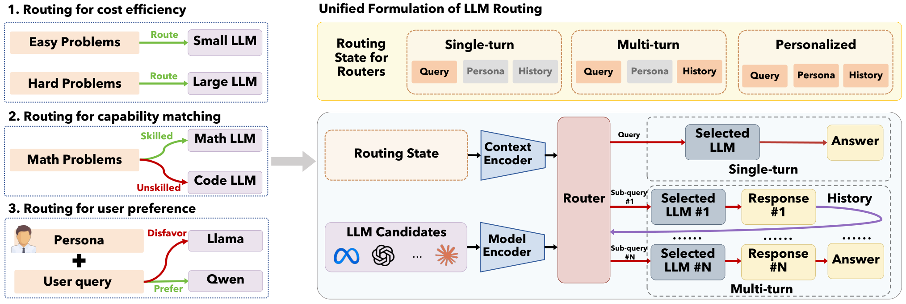

### TL;DR

Unified formulation and open-source library for LLM routing — the decision of which model in a pool to send a given query to for the best quality/cost tradeoff. Routers are cast as a sequential decision process assembled from five reusable components (context encoder, model encoder, scorer, decision rule, learning signal), and >16 existing methods are re-implemented under one interface with a shared benchmark, xRouteBench.

### Key idea

Every prior router — binary quality predictors, cost-aware cascades, graph routers, agentic routers — is a specific instantiation of the same 5-component pipeline. Once that formulation exists, a benchmark can compare them on equal footing, and a new router only needs a routing method plus a loss function to slot in.

### Main finding

On xRouteBench (LLM, memory-augmented, vision, video, time-series, personalized), learned routers deliver **14.6%** average quality gain over the strongest fixed-model baseline. Router rankings *reverse* under tight cost budgets — lightweight routers dominate — and user-conditioned routing yields consistent personalization gains.

### Why it matters

Routing has been the "second-order infrastructure" behind cost-effective LLM serving but has lacked a common substrate. A shared library plus benchmark turns routing into a comparable, extensible research target rather than a bespoke component each team rebuilds.

### Knowledge graph integration

**Builds on / relates to existing pages:**
- [../architectures/_moe.md](../architectures/_moe.md) — MoE token routing is a distant cousin (routing inside a model vs across models); shared concept of gated scoring.
- [../evaluation/README.md](../evaluation/README.md) — xRouteBench is a routing-specific benchmark family.
- [../agents/README.md](../agents/README.md) — "agentic routers" fall under this folder's remit.

**Suggested new pages:**
- `agents/_llm-routing.md` *(taxonomy)* — covers binary predictors, cost-aware cascades, graph routers, agentic routers as one family.

---

## 2. Alaya-EVOKE

**Authors:** Yuanyang Yin, Gongxuan Wang, Yifan Zhan, Chuanhao Li, Kaipeng Zhang, Feng Zhao — *Shanghai AI Lab*
**Links:** [arXiv:2608.13546](https://arxiv.org/abs/2608.13546) · [HF](https://huggingface.co/papers/2608.13546) · [AlphaXiv](https://www.alphaxiv.org/abs/2608.13546)
**Topics:** `world-model`, `diffusion`, `video`, `multimodal`

### TL;DR

Interactive video world model that supports arbitrarily long, low-latency generation by externalizing scene geometry into a camera-indexed **world-state bank** and redesigning the teacher for long-horizon supervision. A 3-step distilled student inherits both properties.

### Key idea

Two-part fix for interactive world models: (1) an external, view-retrievable memory replaces growing KV cache/context — only relevant scene features re-enter the denoiser per camera view, keeping cost bounded; (2) the teacher uses sparse attention with chunk grouping + retrieved distant frames + linear-attention global state, giving linear-in-length supervision that exposes long-range drift the student can correct.

### Main finding

State-of-the-art on WBench, competitive on VBench-Long / VBench-2.0. Each 1.5 s chunk generated in **2.11 s on one H200 at 384×640**, sustaining open-ended interactive play with no classifier-free guidance in the student.

### Why it matters

Long-horizon interactive world models have been bounded by KV-cache growth *and* by teacher horizon. Separating geometry into an external bank and giving the teacher a linear cost model addresses both, pointing at a scalable architecture for playable video worlds.

### Knowledge graph integration

**Suggested new pages:**
- `multimodal/world-state-bank.md` *(depth)* — the camera-indexed external memory pattern for video world models.
- `case-studies/alaya-evoke.md` *(case study)* — if the system as a whole is worth an end-to-end write-up.

---

## 3. DarwinX

**Authors:** Yifan Zhang, Yutong Dai, Juntao Tan, Luyu Yang, Rishi Mullur, Thai Hoang, Zhiyuan Hu, James Zhu, Phil Mui, Silvio Savarese, Ran Xu, Zeyuan Chen — *Salesforce AI Research*
**Links:** [arXiv:2608.07545](https://arxiv.org/abs/2608.07545) · [HF](https://huggingface.co/papers/2608.07545) · [AlphaXiv](https://www.alphaxiv.org/abs/2608.07545)
**Topics:** `agents`, `RL`, `evolution`

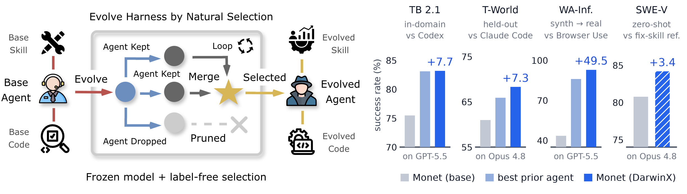

### TL;DR

Treats agent self-improvement as **selection over a population of harnesses** (prompts, tools, skills, control flow) with the base model frozen. Variants that regress any benchmark are rejected; an archive keeps alternative lineages for recombination; per-benchmark verifiers provide fitness — no gold solutions needed.

### Key idea

Single-lineage self-editing loops are path-dependent and produce local wins that regress on other tasks. Population-based evolution with a preserve-and-extend contract fixes both: extend coverage without regressions, keep diverse lineages, share failure / teacher / self edits through one interface.

### Main finding

One evolution loop adds **~17 points on average** across four benchmarks: Terminal-Bench 2.1 → 83.2 / 84.7% (verified frontier), TerminalWorld held-out → 68.3% (SOTA), WebArena-Infinity pass@1 43.5% → 93.0%. A Terminal-Bench-evolved harness transfers unchanged to SWE-bench Verified — evidence the search produces *general* agent competence.

### Why it matters

Frontier agent competence has been leveraging frozen models — DarwinX shows the harness itself is a large, evolvable capability surface. Turns test-time evaluation compute into durable capability without touching weights.

### Knowledge graph integration

**Builds on / relates to existing pages:**
- [../agents/README.md](../agents/README.md) — this is a training-free agent-capability method, adjacent to tool calling / MCP agents.
- [../post-training/_rl.md](../post-training/_rl.md) — an alternative to RL post-training when the model is frozen or hard to retrain.

**Suggested new pages:**
- `agents/agent-harness-evolution.md` *(depth)* — the population-based harness search technique.

---

## 4. PlayWorld

**Authors:** Kaixin Ding, Xi Chen, Minghong Cai, Zhiyuan Xu, Yiyang Wang, Yuxiang Lu, Junyi Li, Shuyang Chen, Yuan Gao, Xin Tao, Pengfei Wan, Hengshuang Zhao — *HKU + Kling / Kuaishou*
**Links:** [arXiv:2608.13552](https://arxiv.org/abs/2608.13552) · [HF](https://huggingface.co/papers/2608.13552) · [AlphaXiv](https://www.alphaxiv.org/abs/2608.13552)
**Topics:** `eval`, `world-model`, `agents`, `multimodal`

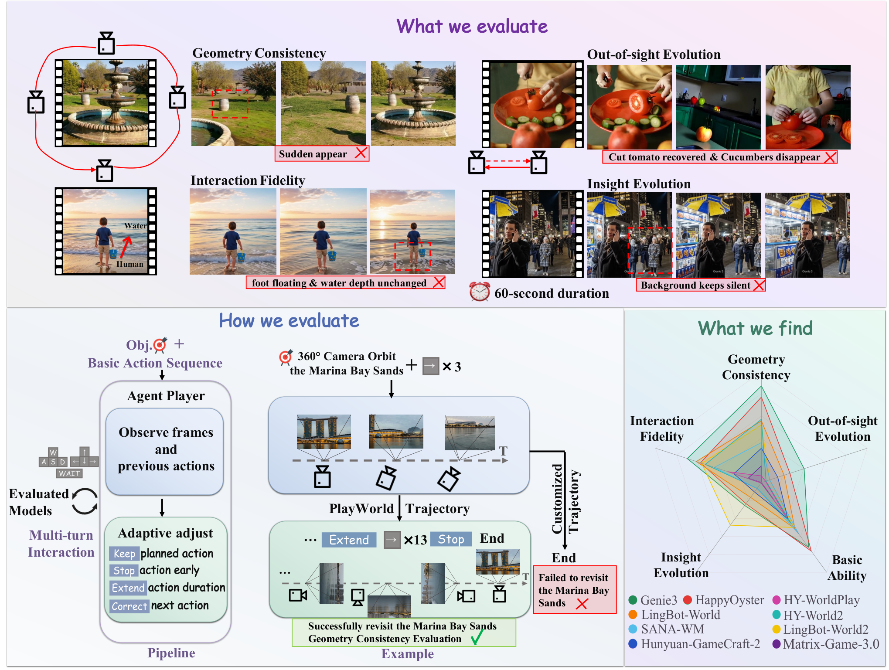

### TL;DR

Benchmark for **video world models** driven by multimodal *Agent Players* pursuing long-horizon objectives (turn 360°, walk into water and check ripples). Fixed action-conditioned eval breaks down across models because required action sequences differ — agent-driven eval fixes this.

### Key idea

Delegate the "human tester" role to a multimodal agent that plans and executes actions toward a specified objective. Score models along four axes: geometry consistency, interaction fidelity, out-of-sight evolution, insight evolution, plus base video-quality / controllability metrics.

### Main finding

171 scenarios across nine SOTA world models. All models remain unreliable on long-horizon interactive objectives, especially **spatial consistency** and **persistent state evolution** — the hard modes not exposed by short action clips.

### Why it matters

World-model progress has been reported on short, action-fixed clips that don't measure what a player actually cares about. Agent-driven eval decouples "did you generate a realistic 5-frame clip" from "did the world stay consistent over 30 seconds of interaction," which is the real product surface.

### Knowledge graph integration

**Builds on / relates to existing pages:**
- [../evaluation/README.md](../evaluation/README.md) — new benchmark family for interactive video world models.
- [../agents/README.md](../agents/README.md) — the Agent Player pattern is an eval-time agent use case.

**Suggested new pages:**
- `evaluation/playworld.md` *(depth)* — the benchmark itself.
- `evaluation/agent-driven-eval.md` *(depth)* — the general pattern of using agents to probe generative models.

---

## 5. Intern-S2-Preview

**Authors:** Lei Bai, Jiaqi Cao, Chiyu Chen, Kai Chen, Dahua Lin, Bowen Zhou, et al. (~150 authors) — *Shanghai AI Lab*
**Links:** [arXiv:2608.13505](https://arxiv.org/abs/2608.13505) · [HF](https://huggingface.co/papers/2608.13505) · [AlphaXiv](https://www.alphaxiv.org/abs/2608.13505)
**Topics:** `LLM`, `MoE`, `agents`, `multimodal`, `RL`

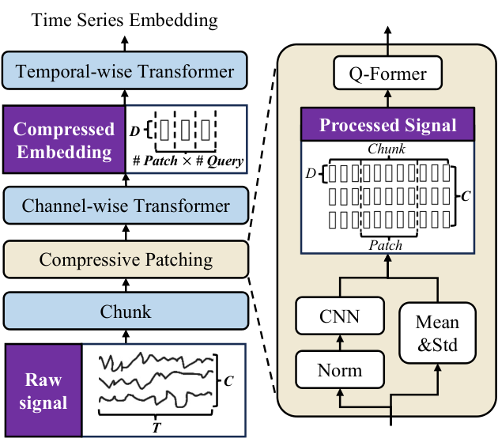

### TL;DR

Scientific agentic foundation model line-up (up to 397B) built for multimodal scientific reasoning, tool use, and long-horizon tasks. Full training pipeline covers scientific multimodal pretraining, SFT, multi-task RL, black- and white-box **agentic RL**, and on-policy distillation, with a set of new practical training-loop techniques.

### Key idea

Combine domain-focused scientific pretraining (rendered docs + interleaved image-text + scientific corpora) with a unified post-training pipeline that treats scientific tools as environments. Ship several stability/efficiency tricks specifically for agentic RL rollouts: partial rollout with off-policy correction, adaptive length regularization, online speculative decoding, robust multi-task optimization, trace-aware experience assembly.

### Main finding

Intern-S2-Preview-397B is competitive or leading across scientific, multimodal, agentic, and general benchmarks. Architecture separately introduces time-series modeling extending long-sequence understanding into **numerical forecasting**, and a Memory Decoder path for rapid scientific specialization without touching the frozen 397B backbone.

### Why it matters

A full, open-published pipeline for a large scientific agentic model — plus a bundle of documented rollout / training-loop techniques — is a rare artifact. Sets a reference stack for other groups building domain-specialized agentic foundation models.

### Knowledge graph integration

**Builds on / relates to existing pages:**
- [../systems/partial-rollouts.md](../systems/partial-rollouts.md) — extends partial-rollout scheduling with an off-policy correction step for agentic RL.
- [../post-training/_rl.md](../post-training/_rl.md) — sits inside the family of large-model RL post-training pipelines.
- [../case-studies/deepseek-v3.md](../case-studies/deepseek-v3.md) — comparable "full-stack" 397B-class tech report.

**Suggested new pages:**
- `case-studies/intern-s2.md` *(case study)* — if a dedicated write-up is warranted.
- `post-training/reasoning/adaptive-length-regularization.md` *(depth)* — the new length regularizer.
- `systems/off-policy-corrected-partial-rollout.md` *(depth)* — the training-time trick.

---

## 6. Rhetorical Reward Hacking of AI Reviewers

**Authors:** Ming Li, Chenguang Wang, Xirui Li, Xinyue Zeng, Dianqi Li, Peng Shi, Dawei Zhou, Tianyi Zhou — *(mixed academic)*
**Links:** [arXiv:2608.08975](https://arxiv.org/abs/2608.08975) · [HF](https://huggingface.co/papers/2608.08975) · [AlphaXiv](https://www.alphaxiv.org/abs/2608.08975)
**Topics:** `safety`, `eval`, `LLM-judge`

### TL;DR

Controlled study of how rhetorical rewriting — while keeping scientific content constant — shifts AI-reviewer judgments. Six rhetorical dimensions, two rewriters, five LLM reviewers, 4,200 rewritten manuscripts derived from 120 real ICLR 2026 submissions.

### Key idea

Isolate rhetoric from content. Compare *opposing-direction* rewrites along six dimensions (evidence framing, novelty stance, scope framing, etc.) and see which move review scores. Adds joint / recursive / reviewer-guided rewriting variants to test compound attacks.

### Main finding

**Evidence framing** and **novelty stance** produce the largest positive-negative score contrasts; scope framing forms a weaker second tier. The rewriter primarily determines *separation* between opposing variants; the reviewer determines *magnitude and sign*. Strict-review protocols lower mean scores by 1.36 points but don't reduce rhetorical sensitivity. More elaborate rewriting workflows show diminishing returns.

### Why it matters

LLM reviewers are creeping into real scientific evaluation. This paper quantifies a specific reward-hacking surface — content-preserving rewriting — and identifies which rhetorical levers move which reviewers, giving a defensible starting point for robust review-eval design.

### Knowledge graph integration

**Builds on / relates to existing pages:**
- [../safety/_attacks.md](../safety/_attacks.md) — new attack family targeting LLM judges rather than models under deployment.
- [../safety/style-injection.md](../safety/style-injection.md) — closest existing style-based manipulation entry.
- [../evaluation/README.md](../evaluation/README.md) — motivates a robustness axis for LLM-judge benchmarks.

**Suggested new pages:**
- `safety/rhetorical-reward-hacking.md` *(depth)* — the attack pattern and its rewriter/reviewer factorization.

---

## 7. AutoDesign

**Authors:** Yaxin Luo, Haobin Jiang, Jialv Zou, Xu Huang, Wenhao Yan, Haodong Li, Zhengrong Yue, Jing Li, Xiaofu Chen, Xiaohan Zhao, Jiacheng Liu, Jiacheng Cui, Zhiqiang Shen, Xiaotong Li — *(mixed academic)*
**Links:** [arXiv:2608.13560](https://arxiv.org/abs/2608.13560) · [HF](https://huggingface.co/papers/2608.13560) · [AlphaXiv](https://www.alphaxiv.org/abs/2608.13560)
**Topics:** `agents`, `multimodal`, `eval`

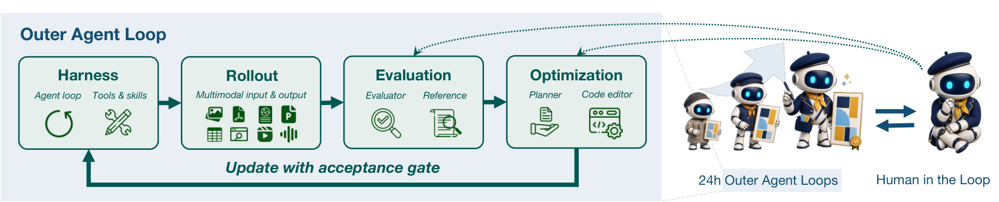

### TL;DR

**Meta-harness optimizer** that guides a code agent to recursively improve its own long-horizon harness based on rollout feedback, aligned with human design priors. Instantiated on academic paper-to-poster generation with a new benchmark, PosterBench.

### Key idea

Harnesses used by long-horizon agents are usually static. AutoDesign puts a meta-optimizer above the code agent: the agent runs, the meta-optimizer inspects rollout traces, then rewrites/refines the harness — accumulating "DesignHarness" experience the code agent can reuse across model configurations.

### Main finding

Highest score on PosterBench Main Track (**78.32**), beating Claude Design by **+7.45**. Across seven controlled code-agent configs, integrating the learned DesignHarness lifts avg PosterBench score from **54.99 → 67.39 (+12.4)**. In a fully autonomous loop: 253 tool calls, 11 editing turns, 40 minutes, under $3 for conference-quality posters.

### Why it matters

Puts a repeatable *design loop* into the agent stack — the harness itself becomes a learned artifact per task, not a hand-crafted prompt. Complements DarwinX (evolution over harnesses) with an optimizer-driven variant.

### Knowledge graph integration

**Builds on / relates to existing pages:**
- [../agents/README.md](../agents/README.md) — same family as DarwinX (harness-level self-improvement).
- [../evaluation/README.md](../evaluation/README.md) — introduces PosterBench.

**Suggested new pages:**
- `agents/meta-harness-optimizer.md` *(depth)* — the optimizer-driven harness improvement pattern.

---

## 8. Spatial Memory Agent

**Authors:** Haokai Zhang, Yuhang Ding, Yunshu Zhou, Xinze Du, Shengtao Zhang, Zhiyue Zhao, Yuling Xi, Hao Chen — *(mixed academic)*
**Links:** [arXiv:2608.12743](https://arxiv.org/abs/2608.12743) · [HF](https://huggingface.co/papers/2608.12743) · [AlphaXiv](https://www.alphaxiv.org/abs/2608.12743)
**Topics:** `agents`, `multimodal`, `reasoning`

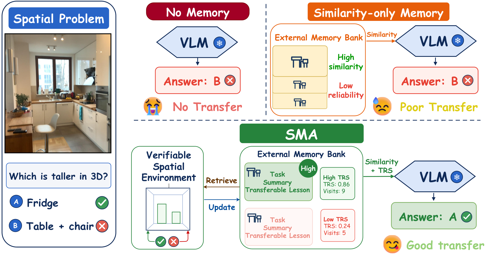

### TL;DR

Parameter-update-free spatial reasoning for VLM agents: cache verified past spatial experience as reusable "lessons" with a **Transfer Reliability Score**, and retrieve them at inference to guide a frozen VLM. No SFT, no RL, no external depth/3D tools.

### Key idea

Instead of fine-tuning the VLM or attaching expert spatial tools, use a verifier-guided reflection loop over past queries to distill compact transferable lessons; assign each a TRS that gets calibrated from later retrieval outcomes; at deploy time retrieve by semantic filter + similarity-TRS ranking to condition inference.

### Main finding

Best macro-average across five spatial benchmarks and four base VLMs; best accuracy in the majority of 20 evaluations — establishing a practical parameter-update-free path for spatial self-evolution.

### Why it matters

An orthogonal axis to post-training / tool use: model stays frozen, capability grows via reusable evidence at inference. Cheap to add, cheap to remove, and doesn't compete for weight updates with other capabilities.

### Knowledge graph integration

**Builds on / relates to existing pages:**
- [../agents/README.md](../agents/README.md) — memory-augmented frozen agents.
- [../multimodal/README.md](../multimodal/README.md) — spatial reasoning for VLMs.

**Suggested new pages:**
- `agents/experience-grounded-memory.md` *(depth)* — the verify → lesson → TRS-ranked-retrieval pattern.

---

## 9. Massive Activations in HLA

**Authors:** Zunhai Su, Bohan Sun, Xialie Zhuang, Shuibai Zhang, He Xiao, Jing Xiong, Hengyuan Zhang, Zhongzhu Zhou, Tiantian Zhang, Ngai Wong, Chuan-Wei Kuo — *HKU + others*
**Links:** [arXiv:2608.12149](https://arxiv.org/abs/2608.12149) · [HF](https://huggingface.co/papers/2608.12149) · [AlphaXiv](https://www.alphaxiv.org/abs/2608.12149)
**Topics:** `interp`, `architectures`, `linear-attention`

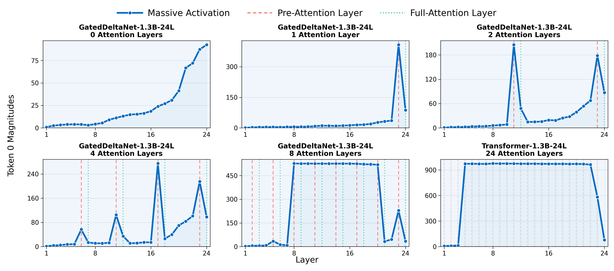

### TL;DR

First systematic study of massive activations (MAs) in **layer-interleaved hybrid linear-attention** LLMs. Two architecture-aligned morphologies: **Pre-Attention Spikes** immediately before every full-attention layer, and **Inter-Spike Plateaus** that persist across intervening linear-attention layers.

### Key idea

MAs previously observed in dense transformers behave *differently* when linear-attention layers are interleaved with full-attention ones. The architecture creates predictable spike-and-plateau patterns tied to attention type. A lifecycle model attributes both to the timing of cancellation processes and shows the patterns emerge early in training and react distinctly to output gating.

### Main finding

The two morphologies are reproducible across multiple hybrid architectures, configurations, and model scales. Output gating modulates spike behavior in a predictable direction. Code released.

### Why it matters

Hybrid linear/full attention is the dominant efficient-context architecture direction (Jamba, Zamba, Falcon Mamba, hybrid RWKV variants). Massive activations drive quantization difficulty and interpretability behavior; knowing where they spike and plateau tells kernel and quant designers exactly where to allocate precision budget.

### Knowledge graph integration

**Builds on / relates to existing pages:**
- [../architectures/multi-head-attention.md](../architectures/multi-head-attention.md) — MHA behavior context.
- [../architectures/mla.md](../architectures/mla.md) — related low-rank attention variants.
- [../interpretability/README.md](../interpretability/README.md) — activation-analysis findings sit here.

**Suggested new pages:**
- `interpretability/massive-activations.md` *(depth)* — MAs in dense and hybrid architectures with the PAS/ISP dichotomy.
- `architectures/hybrid-linear-attention.md` *(taxonomy)* — a class-level overview of layer-interleaved hybrid designs.

---

## 10. Full-bandwidth Transformer

**Authors:** Xi Wang, Ziyang Cai, Zheng Zhan, Harry Dong, Ying Fan, Gustavo de Rosa, Tim Pearce, John Langford — *Microsoft Research*
**Links:** [arXiv:2608.08888](https://arxiv.org/abs/2608.08888) · [HF](https://huggingface.co/papers/2608.08888) · [AlphaXiv](https://www.alphaxiv.org/abs/2608.08888)
**Topics:** `architectures`, `LLM`, `reasoning`

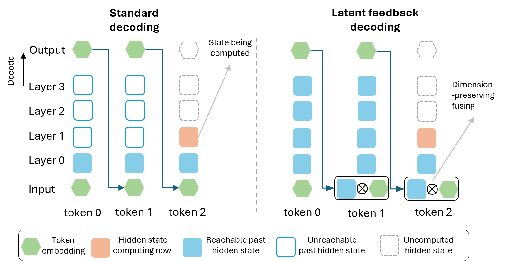

### TL;DR

Widens the vertical channel between decoding steps: at each step the previous **top-layer hidden state** is fused with the sampled token embedding via a gated linear unit and fed back as the next input. Non-verbalized computation gets a renewed depth budget, while KV cache and language-modeling objective stay intact.

### Key idea

Autoregressive transformers only feed back the *sampled token* between steps — the top-layer hidden state is thrown away. Adding a gated latent-feedback path lets the model carry deeper implicit computation across positions, without changing the architecture in ways that break KV cache or teacher forcing. Trained with a scheduled multi-pass objective (feedback added late in pretraining, with a small fraction of deeper feedback passes for stability).

### Main finding

1B-parameter full-bandwidth transformers trained to 400B tokens improve validation loss, 5-shot LM eval, math and coding generation, and instruction-tuned performance. Matches / approaches standard transformers trained with **~1.5× more tokens**, with **negligible per-token decode overhead** and *shorter* reasoning traces at equal or better accuracy.

### Why it matters

A rare "free axis" for transformer capacity: standard KV cache preserved, same objective, decode cost unchanged. If it scales up, it's a cheap way to buy the equivalent of 1.5× more training data — and the shorter-reasoning-trace effect is interesting for inference cost.

### Knowledge graph integration

**Builds on / relates to existing pages:**
- [../architectures/transformer-block.md](../architectures/transformer-block.md) — modifies the block-to-block feedback channel.
- [../fundamentals/attention.md](../fundamentals/attention.md) — leaves attention unchanged; the modification is orthogonal.

**Suggested new pages:**
- `architectures/latent-feedback.md` *(depth)* — the gated top-layer-hidden-state feedback trick.

---

## 11. AutoPrune

**Authors:** Zhen Liu, Wenli Huang, Wei Song, Yuhan Liu, Zhiqin Yang, Jingwen Fu — *(mixed academic)*
**Links:** [arXiv:2608.07193](https://arxiv.org/abs/2608.07193) · [HF](https://huggingface.co/papers/2608.07193) · [AlphaXiv](https://www.alphaxiv.org/abs/2608.07193)
**Topics:** `efficient-inference`, `multimodal`, `agents`

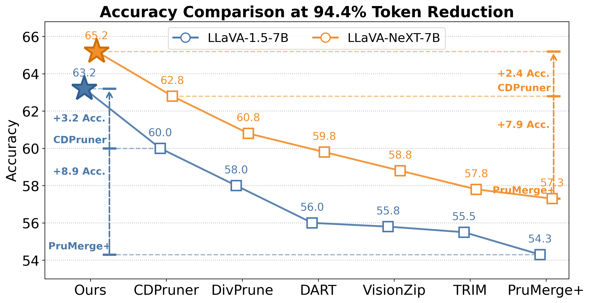

### TL;DR

Training-free framework where an LLM *designs* visual-token pruning policies for MLLMs, via a Token Pruning Domain-Specific Language (**TPDSL**) with 131 reusable atoms covering budget control, token scoring, selection constraints, and reassembly.

### Key idea

Give an LLM a DSL narrow enough to be searchable but expressive enough to compose real pruning policies. Represent each search state as a **residual modification of a strong base policy** — that residual formulation narrows the search space and focuses the LLM on the components that matter for performance.

### Main finding

Across 14 multimodal benchmarks and three MLLM backbones: even removing **94.4%** of visual tokens preserves **>99%** of full-token performance while reducing FLOPs by **9.9×** and prefill latency by **6.4×**.

### Why it matters

Visual token count dominates MLLM inference cost. Auto-designed pruning policies replace human trial-and-error tuning and generalize across backbones — instance of "LLMs as compiler-optimizer" for efficient inference.

### Knowledge graph integration

**Builds on / relates to existing pages:**
- [../multimodal/README.md](../multimodal/README.md) — visual-token pruning is an MLLM-specific efficient-inference technique.
- [../inference/README.md](../inference/README.md) — belongs in the inference-efficiency family.

**Suggested new pages:**
- `inference/visual-token-pruning.md` *(depth)* — the pruning family for MLLMs, including the AutoPrune residual-DSL approach.

---

## 12. Gambit

**Authors:** Lijie Yang, Hongyin Luo, Jiawei Zhao, Tri Dao, Ravi Netravali — *Princeton, MIT, Nvidia*
**Links:** [arXiv:2608.08020](https://arxiv.org/abs/2608.08020) · [HF](https://huggingface.co/papers/2608.08020) · [AlphaXiv](https://www.alphaxiv.org/abs/2608.08020)
**Topics:** `reasoning`, `efficient-inference`, `LLM`

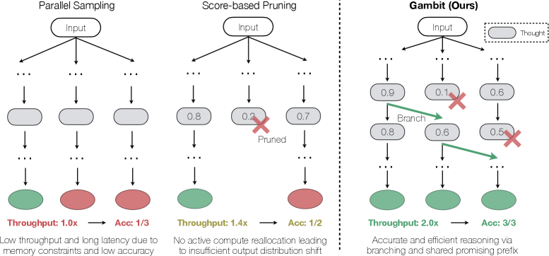

### TL;DR

Formalizes test-time reasoning as a **constrained compute-allocation problem over partial trajectories**, and introduces Gambit: a thought-level beam search that periodically prunes weak partial trajectories and immediately branches from strong prefixes, guided by a lightweight scorer that reads hidden states.

### Key idea

Parallel sampling treats reasoning traces as independent — memory bottlenecks and no cross-trace reallocation. Pure pruning starves hardware and doesn't sufficiently reshape the output distribution. Gambit sits between: dynamic branching from top prefixes with continuous high hardware utilization, using hidden-state probes as the value function.

### Main finding

Under identical hardware budgets: up to **+6.7%** absolute accuracy on HMMT-24, **+3.3%** on AIME-25, **>2×** throughput for trace completion, and up to **68.5%** fewer total tokens vs standard parallel sampling.

### Why it matters

Test-time compute is the primary lever for reasoning models — spending it well matters more than spending more of it. A hardware-aware beam-search formulation between "no pruning" and "pure pruning" is a clean, deployable point in the space.

### Knowledge graph integration

**Builds on / relates to existing pages:**
- [../post-training/reasoning/README.md](../post-training/reasoning/README.md) — sits in the reasoning-inference stack.
- [../post-training/reasoning/mcts.md](../post-training/reasoning/mcts.md) — sibling of MCTS as a tree/beam search over partial reasoning.
- [../post-training/reasoning/prm.md](../post-training/reasoning/prm.md) — the light hidden-state scorer plays a role similar to a process reward model.

**Suggested new pages:**
- `inference/thought-level-beam-search.md` *(depth)* — the Gambit algorithm and its compute-allocation framing.

---

## 13. SKILLER

**Authors:** Chenhao Dang, Siyuan Xiong, Conghui He, Weijia Li — *Sun Yat-sen + others*
**Links:** [arXiv:2608.10538](https://arxiv.org/abs/2608.10538) · [HF](https://huggingface.co/papers/2608.10538) · [AlphaXiv](https://www.alphaxiv.org/abs/2608.10538)
**Topics:** `RL`, `agents`, `LLM`

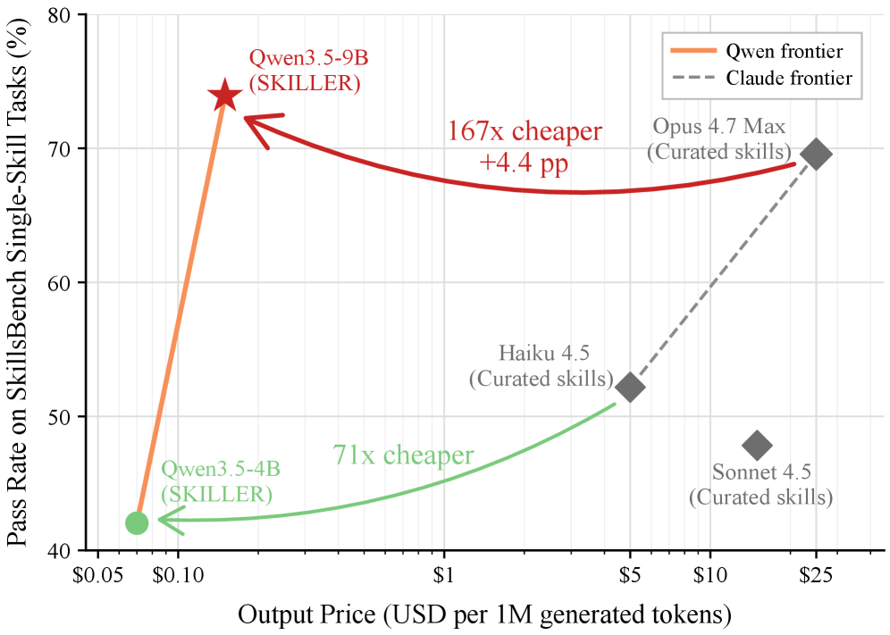

### TL;DR

Natural-language-driven RL framework that generates **executor-specific agent skills** for small (4B–9B) open-source models. Strong model plays actor/critic; the small-model agent system is the environment; all RL signals propagate as natural-language messages, no gradient updates.

### Key idea

Agent skills package procedural expertise as reusable behavioral constraints, but they've been tuned for large closed-source executors. SKILLER auto-generates skills *tailored to* a specific small executor by running an RL loop where the critic proposes, the small model executes, and NL feedback shapes the next skill — all without model finetuning.

### Main finding

Across five benchmarks with Qwen3.5-9B / 4B: absolute gains of **4.3–20.4 pp (9B)** and **1.8–13.3 pp (4B)** over three open-source and one closed-source skill-generation baseline. Matches strong closed-source model performance on single-skill tasks in SkillsBench.

### Why it matters

Deployment cost pressure keeps pushing agents toward smaller open models, but off-the-shelf skills don't fit them. Executor-specific skill synthesis is a plausible path to close the small-model gap without retraining.

### Knowledge graph integration

**Builds on / relates to existing pages:**
- [../agents/README.md](../agents/README.md) — skill-based agent behavior belongs here.
- [../post-training/_rl.md](../post-training/_rl.md) — a training-free RL variant using natural language as the reward channel.

**Suggested new pages:**
- `agents/executor-specific-skills.md` *(depth)* — the NL-RL loop for skill synthesis.

---

## 14. Maglev

**Authors:** Bo Liu, Qiang Liu — *UT Austin*
**Links:** [arXiv:2608.02870](https://arxiv.org/abs/2608.02870) · [HF](https://huggingface.co/papers/2608.02870) · [AlphaXiv](https://www.alphaxiv.org/abs/2608.02870)
**Topics:** `architectures`, `linear-attention`, `LLM`

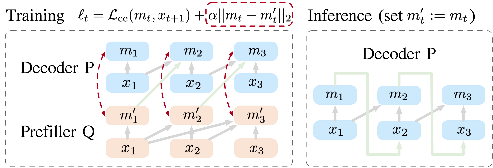

### TL;DR

Recurrent Transformer with fixed-size memory that generalizes sliding-window attention. Two coupled models: a **prefiller Q** using full attention produces memory targets $m'_t$; a **decoder P** uses only sliding-window attention plus recurrent K/V injection to produce decoder memories $m_t$. A memory-consistency loss aligns $m_t$ with $m'_t$ so inference uses P alone.

### Key idea

Sliding-window transformers are fast but lose long-context. Latent recurrent transformers keep long context but are hard to train. Maglev decouples training (prefiller sees full attention, teaches decoder) from inference (decoder alone) — parallelizable to train, fixed-cost to serve.

### Main finding

Improves validation loss and downstream pretraining benchmarks over sliding-window and latent recurrent transformer baselines. Sharing parameters between P and Q reduces parameter footprint while preserving most of the gains.

### Why it matters

Fixed-size-memory recurrent transformers are the long-runner efficient-context bet. Maglev's train-with-teacher / infer-alone recipe is a clean way to sidestep the recurrent-training gradient headache. Slots naturally next to Mamba-family SSMs and hybrid linear-attention designs.

### Knowledge graph integration

**Builds on / relates to existing pages:**
- [../architectures/multi-head-attention.md](../architectures/multi-head-attention.md) — sliding-window and MHA context.
- [../fundamentals/attention.md](../fundamentals/attention.md) — attention primitives.

**Suggested new pages:**
- `architectures/maglev.md` *(depth)* — the prefiller/decoder + memory-consistency-loss trick.

---

## 15. Knowing When to Quit

**Authors:** Xinyan Guan, Jiali Zeng, Chunlei Xin, Yaojie Lu, Hongyu Lin, Xianpei Han, Le Sun, Fandong Meng — *CAS, Tencent*
**Links:** [arXiv:2607.29211](https://arxiv.org/abs/2607.29211) · [HF](https://huggingface.co/papers/2607.29211) · [AlphaXiv](https://www.alphaxiv.org/abs/2607.29211)
**Topics:** `reasoning`, `RL`, `safety`, `eval`

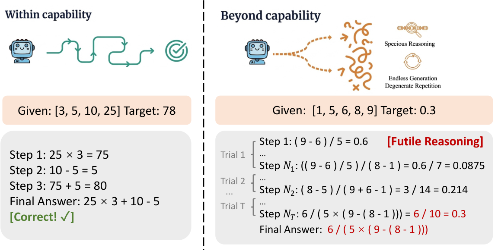

### TL;DR

Diagnoses **futile reasoning** — long, expensive, plausible-sounding but wrong chains on beyond-capability tasks — and introduces **CaRL** (Capability-aligned RL) that rewards refusal over specious reasoning and augments training with hindsight-refusal supervision derived from past failures.

### Key idea

LLMs systematically overreach and miscalibrate: the harder the task, the more likely the model produces subtly wrong ("specious") reasoning that looks valid. CaRL fixes this with two reward-shaping moves: (1) explicit refusal reward that dominates any partial-credit for a wrong long chain, (2) convert failed rollouts into refusal supervision so the policy learns to abort futile chains it would otherwise complete.

### Main finding

Substantial reduction in futile reasoning while preserving performance across task difficulties — behavior aligns with capability boundaries without sacrificing utility on tasks the model *can* do.

### Why it matters

Reasoning models routinely burn tokens producing confident nonsense on hard tasks — a UX and safety problem. Training-time capability-alignment beats inference-time heuristics (like max-thinking-tokens) because it changes the policy's behavior, not just its cutoff.

### Knowledge graph integration

**Builds on / relates to existing pages:**
- [../post-training/reasoning/README.md](../post-training/reasoning/README.md) — new reasoning post-training method.
- [../post-training/grpo.md](../post-training/grpo.md) — CaRL sits on top of GRPO-style RLVR pipelines.
- [../post-training/rlvr.md](../post-training/rlvr.md) — verifiable-reward + refusal reward composition.
- [../safety/refusal-suppression.md](../safety/refusal-suppression.md) — related to how refusal training interacts with reasoning.

**Suggested new pages:**
- `post-training/reasoning/futile-reasoning.md` *(depth)* — the CaRL method for aborting beyond-capability chains.

---

## Notes

- Borderline inclusions were skipped silently — the digest keeps only papers with a clear KEEP-list fit.
- Hero figures pulled from each paper's arXiv HTML render (first non-logo figure, teaser preferred).
- No existing concept files, `READING-LIST.md`, or `PAPERS.md` were modified.

### Suggested new depth / taxonomy / case-study files (aggregated)

- `agents/_llm-routing.md` *(taxonomy)*
- `agents/agent-harness-evolution.md` *(depth)*
- `agents/meta-harness-optimizer.md` *(depth)*
- `agents/experience-grounded-memory.md` *(depth)*
- `agents/executor-specific-skills.md` *(depth)*
- `architectures/latent-feedback.md` *(depth)*
- `architectures/hybrid-linear-attention.md` *(taxonomy)*
- `architectures/maglev.md` *(depth)*
- `interpretability/massive-activations.md` *(depth)*
- `inference/thought-level-beam-search.md` *(depth)*
- `inference/visual-token-pruning.md` *(depth)*
- `post-training/reasoning/futile-reasoning.md` *(depth)*
- `post-training/reasoning/adaptive-length-regularization.md` *(depth)*
- `systems/off-policy-corrected-partial-rollout.md` *(depth)*
- `safety/rhetorical-reward-hacking.md` *(depth)*
- `evaluation/playworld.md` *(depth)*
- `evaluation/agent-driven-eval.md` *(depth)*
- `multimodal/world-state-bank.md` *(depth)*
- `case-studies/intern-s2.md` *(case study)*
- `case-studies/alaya-evoke.md` *(case study)*
