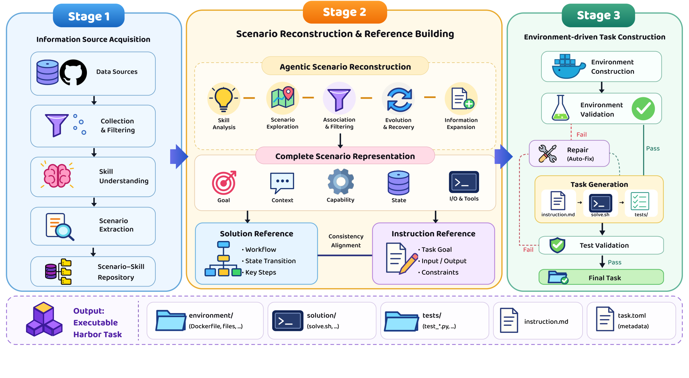
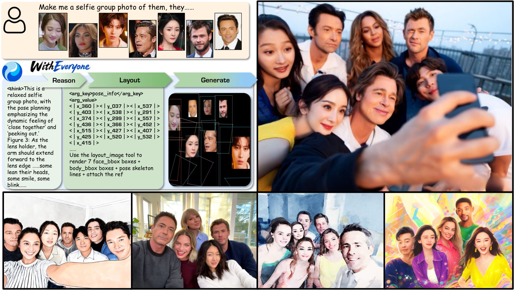
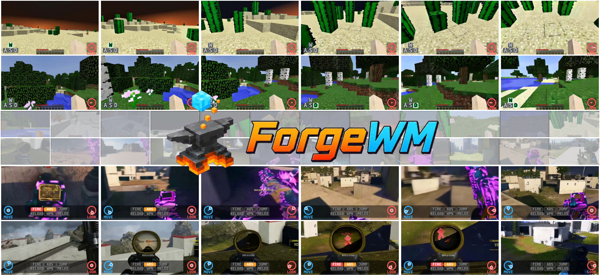
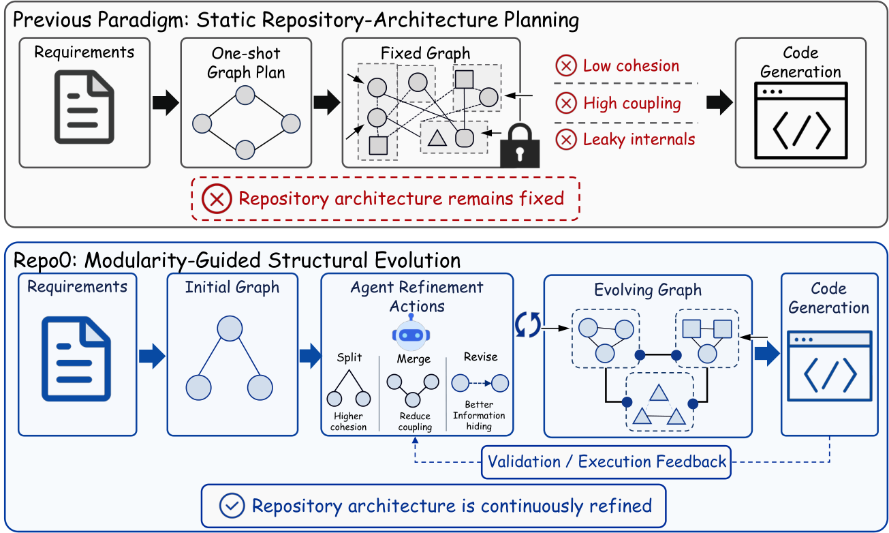
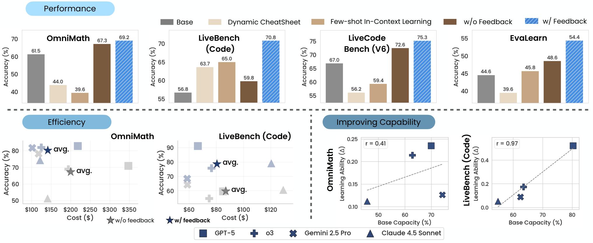

# Daily AI papers — 2026-08-22

*Curated from HF Daily Papers. 14 of 26 papers kept after relevance filter.*

## Papers at a glance

| # | Title | Topics | Org |
| --- | --- | --- | --- |
| 1 | [EnvHarness: Awakening Static Worlds for Agent Learning](#1-envharness) | `agents`, `RL`, `environments` | Google |
| 2 | [FACET: Preserving Source Intent and Executable State in Terminal Task Synthesis](#2-facet) | `agents`, `data`, `code` | (13-author consortium) |
| 3 | [4DAnyone: Create Anyone in 4D from a Casual Monocular Video](#3-4danyone) | `diffusion`, `video`, `4D` | Zhejiang U. / Ant / HKUST |
| 4 | [SWE-bench Science: Can Coding Agents Resolve Engineering Tasks in Science?](#4-swe-bench-science) | `eval`, `agents`, `code` | Fudan U. |
| 5 | [WithEveryone: Unified Planning and Identity Grounding for Group Image Generation](#5-witheveryone) | `diffusion`, `multimodal`, `identity` | Fudan U. |
| 6 | [MemTrapBench: Benchmarking Cognitive Traps in LLM Memory Use](#6-memtrapbench) | `eval`, `agents`, `memory` | Zhejiang U. |
| 7 | [SkillEvo: Self-Renewing Evolution Gradients from Multi-Turn Interaction Feedback](#7-skillevo) | `agents`, `RL`, `self-improvement` | (unspecified) |
| 8 | [ForgeWM: Progressive Causal Training for Few-Step Action-Conditioned Video World Models](#8-forgewm) | `diffusion`, `video`, `world-models` | (multi-org) |
| 9 | [Repo0: Design-Driven Zero-to-All Code Generation](#9-repo0) | `agents`, `code`, `planning` | SJTU / Harbin IT |
| 10 | [FlashPrefill V2: Block-Sparse Prefill Attention for Long-Context LLM Serving](#10-flashprefill-v2) | `efficient-inference`, `attention`, `long-context` | CASIA / Baichuan |
| 11 | [Thinking in a Low-Resource Language: What SFT Builds, What RL Fixes](#11-thinking-in-low-resource) | `post-training`, `SFT`, `RLVR`, `eval` | Sophea AI / KIEFER SA |
| 12 | [Inject, Align, Recover: Staged Post-Training for Retrieval-Free Document Knowledge](#12-inject-align-recover) | `post-training`, `data`, `RAG` | (unspecified) |
| 13 | [PolicyGuide: From Guarding One Action to Guiding the Whole Workflow](#13-policyguide) | `agents`, `safety`, `workflows` | KAIST / DeepAuto.ai |
| 14 | [Chain-of-Experience for Continual LLM Improvement](#14-chain-of-experience) | `agents`, `test-time`, `eval` | UC Santa Cruz / Bytedance Seed |

---

## 1. EnvHarness

**Authors:** Chengsong Huang, Zifeng Wang, Rujun Han, Jun Yan, Yanfei Chen, Zoey CuiZhu, Ke Jiang, Peng Xia, Han Yu, Yufan Zhuang, Yifei Ming, Jiaqi Pan, Bhavana Dalvi Mishra, Jiaxin Huang, Burak Gokturk, Tomas Pfister, Chen-Yu Lee — *Google*
**Links:** [arXiv:2608.19880](https://arxiv.org/abs/2608.19880) · [HF](https://huggingface.co/papers/2608.19880) · [AlphaXiv](https://www.alphaxiv.org/abs/2608.19880)
**Topics:** `agents`, `RL`, `environments`

### TL;DR

Existing agent-training environments are hand-built and static — they don't adapt to an agent's specific weaknesses and go stale as the policy improves. EnvHarness is a programmable "plug-in layer" that wraps a static environment and reshapes its behavior through standard interfaces, preserving the original verifier. A companion tool (EnvRigger) diagnoses the agent's failure modes from execution traces and *synthesizes* new EnvHarness components to target them.

### Key idea

Decouple **environment logic** (fixed, with the trusted verifier) from **environment behavior** (mutable via plug-in components at standard interfaces). Treat the target policy as a black box, run rollouts, diagnose what it gets wrong, and generate targeted "harness" components to expose those flaws. Validation is via fresh rollouts on the reshaped environment — the same verifier stays authoritative, so the RL signal is trusted.

### Main finding

Across five benchmarks in four domains, EnvHarness beats both original environments and domain-specific env-generation pipelines by up to **9.0 points** on held-out instances while using **9.8% fewer** execution steps. As an RL reward source, it enables continuous co-evolution of the policy and environment.

### Why it matters

Agent RL is bottlenecked by the environments you can train against. This flips environment construction from a one-shot engineering job into a **closed-loop, per-policy** artifact — the same shift RLHF once made for reward models. If it generalizes, "environment engineering" becomes another automatic post-training stage.

### Knowledge graph integration

**Builds on / relates to existing pages:**
- [../post-training/rlvr.md](../post-training/rlvr.md) — every reshaped environment still ships its original programmatic verifier, so the reward stays RLVR-shaped.
- [../post-training/rl-prompt-curation.md](../post-training/rl-prompt-curation.md) — extends "curate the prompt distribution" to "curate the environment distribution."
- [../post-training/_post-training.md](../post-training/_post-training.md) — proposes a new stage between rollout collection and gradient step.

**Suggested new pages:**
- `agents/env-harness.md` *(depth)* — the plug-in layer + EnvRigger recipe.
- `agents/_agent-environments.md` *(taxonomy)* — hand-built vs. LLM-generated vs. harness-reshaped environments for RL.

---

## 2. FACET

**Authors:** Kou Shi, Zun Wang, Qisheng Su, Shiting Huang, Ziao Zhang, Zhen Fang, Qingnan Ren, Jin Liu, Yu Zeng, Yiming Zhao, Lin Chen, Zehui Chen, Feng Zhao — *(affiliations not disclosed)*
**Links:** [arXiv:2608.18580](https://arxiv.org/abs/2608.18580) · [HF](https://huggingface.co/papers/2608.18580) · [AlphaXiv](https://www.alphaxiv.org/abs/2608.18580)
**Topics:** `agents`, `data`, `code`

### TL;DR

Synthesizing training tasks for terminal (shell/CLI) agents is hard: each task needs a coherent (instruction, initialized environment, reference solution, executable verifier) tuple, and multi-stage synthesis pipelines routinely lose information from the source material. FACET is a synthesis framework built around two guarantees: **information preservation** from source artifacts and **cross-artifact consistency** so tasks are actually solvable and correctly graded.

### Key idea

"Fine-grained Agentic Construction of Executable Tasks": break synthesis into small agentic steps that thread the original source's goals, dependencies, state transitions, and procedural constraints through to every artifact — instruction, env init, reference solution, verifier. Each step is checked against the others so an unsolvable or mis-verified task can't slip through.

### Main finding

The paper positions FACET as a data-engine for terminal-agent training. The abstract sketches the two failure modes (assumption drift → unsolvable tasks; multi-stage information loss → wrong evaluation) and claims the framework addresses both; per-task-family numbers are in the body.

### Why it matters

Terminal agents (Codex-style, `bash`-driving copilots) are one of the hottest deployment surfaces for LLM agents, but training data at scale means synthesized tasks — and the failure mode "the RL task itself was wrong" is silent and pervasive. Frameworks that make executable-task synthesis auditable are becoming a bottleneck-lifter for agent RL.

### Knowledge graph integration

**Builds on / relates to existing pages:**
- [../data/_data-curation.md](../data/_data-curation.md) — a synthesis-pipeline design pattern for executable tasks.
- [../post-training/rl-prompt-curation.md](../post-training/rl-prompt-curation.md) — same "keep the training signal valid" motivation on the RL side.
- [../post-training/rlvr.md](../post-training/rlvr.md) — the executable verifier is the RLVR reward channel.

**Suggested new pages:**
- `agents/terminal-task-synthesis.md` *(depth)* — the FACET recipe for `(instruction, env, solution, verifier)` synthesis.

---

## 3. 4DAnyone

**Authors:** Yudong Jin, Tao Xie, Qihang Zhang, Zehong Shen, Zhen Xu, Yujun Shen, Hujun Bao, Xiaowei Zhou, Yinghao Xu — *Zhejiang U., Robbyant, CUHK, Ant Group, HKUST*
**Links:** [arXiv:2608.20335](https://arxiv.org/abs/2608.20335) · [HF](https://huggingface.co/papers/2608.20335) · [AlphaXiv](https://www.alphaxiv.org/abs/2608.20335)
**Topics:** `diffusion`, `video`, `4D`

### TL;DR

Reconstruct a 4D (dynamic 3D) human from a single casual monocular video by generating many multiview-consistent novel-view videos with a video diffusion model, then lifting the ensemble into 4D Gaussian Splatting. The paper identifies why prior camera-controlled video diffusion models drift when scaled to tens of target views — a bounded-attention-context problem — and introduces two mechanisms to fix it.

### Key idea

Two coupled bottlenecks appear once you need more target views than fit in one DiT forward pass: (a) *reference context* grows O(N), diluting appearance guidance, and (b) target-view groups can't exchange info, causing global drift. **Reference Context Packing (RCP)** compresses growing reference views into a fixed-length mixed-resolution O(1) context. **Target Context Routing (TCR)** rotates target-view groupings across denoising steps — cross-group sharing at high noise, stable per-group refinement at low noise.

### Main finding

The abstract frames the contribution qualitatively; RCP + TCR let the DiT scale past the bounded-context limit while maintaining cross-view consistency good enough to feed 4DGS reconstruction. Comparative numbers vs. prior camera-controlled video DiTs are in the paper.

### Why it matters

Video diffusion + 3D reconstruction is the dominant recipe for 4D avatars today, but consistency at the "tens of views" scale has been the ceiling. Fixed-context conditioning + noise-schedule-aware group rotation is a general recipe — it should transfer to any long-context DiT sampling problem.

### Knowledge graph integration

**Builds on / relates to existing pages:**
- [../fundamentals/attention.md](../fundamentals/attention.md) — RCP and TCR are attention-context engineering, not architectural changes.
- (No existing `diffusion/` or `multimodal/` depth files to link — this is where a `multimodal/dit.md` and a diffusion sampling taxonomy would sit.)

**Suggested new pages:**
- `multimodal/dit.md` *(depth)* — the DiT (Diffusion Transformer) backbone assumed by RCP/TCR.
- `multimodal/_video-diffusion-context.md` *(taxonomy)* — long-context conditioning tricks for video diffusion.

---

## 4. SWE-bench Science

**Authors:** Zhipeng Xu, Jiahao Lu, Yining Zheng, Yuxin Wang, Xipeng Qiu — *Fudan University (inferred from Qiu group)*
**Links:** [arXiv:2608.19799](https://arxiv.org/abs/2608.19799) · [HF](https://huggingface.co/papers/2608.19799) · [AlphaXiv](https://www.alphaxiv.org/abs/2608.19799)
**Topics:** `eval`, `agents`, `code`

### TL;DR

A repository-level benchmark for scientific-software repair: **119 tasks from 98 GitHub repos across 20 scientific domains**, split into Issue-driven, Expert-exploratory, and Engineering-integration paradigms. Even Claude Code with Opus-5 (max) scores **below 50% pass@1**. The paper identifies four recurring failure mechanisms and shows that "scientific guidance" is a double-edged sword.

### Key idea

Move past aggregate SWE-bench-style pass rates by (a) targeting a domain where correctness has scientific consequence and (b) running a **paired ablation** where explicit scientific guidance is stripped but the executable repo context is kept. This decouples "the agent's engineering ability" from "the agent's ability to use grounded scientific knowledge."

### Main finding

Frontier agents ceiling out sub-50% on pass@1. Four failure modes: scientific-knowledge deficits, misguided/surface-level exploration, incomplete repair coverage, and failure to generalize scientific knowledge beyond observed cases. Guidance quality matters: well-grounded guidance helps average performance and token efficiency; poorly-aligned guidance *anchors* the agent and doesn't necessarily improve exact-repair success.

### Why it matters

The next generation of coding-agent benchmarks needs domains where surface success isn't enough (scientific code that runs but silently corrupts results). This is also a rare eval that decomposes *why* agents fail — those decompositions are what feeds the next round of training-data curation.

### Knowledge graph integration

**Builds on / relates to existing pages:**
- [../evaluation/humaneval.md](../evaluation/humaneval.md) — sits above HumanEval-scale eval; repo-level, executable, scientific.
- [../evaluation/livecodebench.md](../evaluation/livecodebench.md) — same "beyond aggregate accuracy" push, different domain.
- [../data/decontamination.md](../data/decontamination.md) — 98 GitHub repos raise obvious contamination questions the eval must confront.

**Suggested new pages:**
- `evaluation/swe-bench-science.md` *(depth)* — the benchmark spec, three task paradigms, and the paired-ablation methodology.

---

## 5. WithEveryone

**Authors:** Hengyuan Xu, Qixun Wang, Yiji Cheng, Miles Yang, Zhao Zhong, Wei Cheng, Xingjun Ma, Yu-gang Jiang — *Fudan University (Ma/Jiang group)*
**Links:** [arXiv:2608.20336](https://arxiv.org/abs/2608.20336) · [HF](https://huggingface.co/papers/2608.20336) · [AlphaXiv](https://www.alphaxiv.org/abs/2608.20336)
**Topics:** `diffusion`, `multimodal`, `identity`

### TL;DR

Identity-preserving image generation with **up to ten specified people in one scene**. Injects each identity as an addressed token, predicts a structured identity–layout plan, and renders the plan as a visual condition. The training objective grounds ID loss on annotated face regions rather than fuzzy embedding matching.

### Key idea

Two things break with many-identity generation: (a) diffusion tends to *copy-paste* faces from references, and (b) embedding-based face matching is noisy when the model outputs multiple predicted faces. **Layout-Grounded ID Loss** uses annotated face-region supervision — the layout plan tells the loss exactly which output patch corresponds to which reference identity, avoiding the matching step entirely. **ID Representation Forcing** additionally predicts each identity latent before pixels are synthesized.

### Main finding

On an identity-disjoint benchmark: face similarity **0.462 → 0.499** vs. GPT-Image-2, copy-paste artifact rate **0.169 → 0.055**, coverage **97.3%** of requested identities with a **2.8%** duplicate rate.

### Why it matters

"Give me these ten specific people" has been the pain point of consumer image-gen products since the ID-preservation era began. The key structural insight — plan the identity–layout binding *first*, condition on the plan — echoes how planner-executor patterns work in agents; another instance of "hard multi-object grounding wants an explicit plan."

### Knowledge graph integration

**Builds on / relates to existing pages:**
- (No diffusion/identity-preservation depth files exist yet in the graph — this paper triggers a foundational cluster.)

**Suggested new pages:**
- `multimodal/identity-preserving-generation.md` *(depth)* — the Layout-Grounded ID Loss + ID Representation Forcing recipe.
- `multimodal/_diffusion-conditioning.md` *(taxonomy)* — text, mask, layout, identity-token, and plan-based conditioning modes.

---

## 6. MemTrapBench

**Authors:** Mengru Wang, Haozhe Luo, Zhenqian Xu, Zhixiang Cui, Haoming Xu, Qu Yang, Jizhan Fang, Junfeng Fang, Ningyu Zhang — *Zhejiang U. (Zhang group)*
**Links:** [arXiv:2608.20202](https://arxiv.org/abs/2608.20202) · [HF](https://huggingface.co/papers/2608.20202) · [AlphaXiv](https://www.alphaxiv.org/abs/2608.20202)
**Topics:** `eval`, `agents`, `memory`

### TL;DR

A benchmark that measures how retrieved memories *distort* the model's reasoning on the current task, not just whether memory retrieval was accurate. Two failure modes: **Reasoning Fixation** (memory locks in a stale reasoning path) and **Belief Distortion** (memory shifts the model's answer despite being irrelevant). Every evaluated memory strategy underperforms *no-memory* baseline, even when the memory is correct and relevant.

### Key idea

Existing memory evals check "was the right thing stored and retrieved?" — this one asks "given that the right thing *was* retrieved, does it hurt performance?" The paper introduces **AdaptiveMem**, an inference-time prompt-side intervention that tells the LLM to actively watch for memory traps, mitigating both failure modes while preserving standard-benchmark performance.

### Main finding

Across two model families and five representative memory frameworks, all memory strategies fall below the no-memory setting on MemTrapBench, with the strongest methods still losing **>10 percentage points**. AdaptiveMem recovers most of the loss.

### Why it matters

Agent-memory frameworks (long-term stores, persistent scratchpads, episodic recall) are becoming default infrastructure. If faithful memory can *hurt* the current task, we need memory eval that measures the interaction with reasoning — not just retrieval quality. This paper stakes out that ground.

### Knowledge graph integration

**Builds on / relates to existing pages:**
- (Nothing directly in the graph on LLM long-term memory yet.)
- [../post-training/reasoning/README.md](../post-training/reasoning/README.md) — the two failure modes are reasoning defects triggered by retrieval.

**Suggested new pages:**
- `agents/memory-cognitive-traps.md` *(depth)* — Reasoning Fixation + Belief Distortion + AdaptiveMem.
- `evaluation/memtrap-bench.md` *(depth)* — the benchmark spec.

---

## 7. SkillEvo

**Authors:** Qianxi Yan, Chunrong Chen, Jiuzhou Zhao, Min Zhang, Yongzhou Xu, Xiaochuan Xu — *(affiliations not disclosed)*
**Links:** [arXiv:2608.13120](https://arxiv.org/abs/2608.13120) · [HF](https://huggingface.co/papers/2608.13120) · [AlphaXiv](https://www.alphaxiv.org/abs/2608.13120)
**Topics:** `agents`, `RL`, `self-improvement`

### TL;DR

Agent skills (small policies / prompts / tools that specialize an agent for a class of tasks) are usually authored by hand or generated in a single LLM pass, with no feedback loop closing over the *interactions* they eventually cause. SkillEvo introduces a multi-turn simulator that produces trustworthy feedback and an active governance layer that prevents skill degradation across evolution rounds.

### Key idea

Two components: (1) **multi-turn user simulation** that generates realistic feedback trajectories rather than single-turn evaluations — single-turn eval is where prior "self-evolving skills" pipelines silently break, and (2) an active **governance layer** that stops rewrite steps from regressing the skill.

### Main finding

Improvements of **+23.0** over self-reflection and **+15.4** over single-turn QA-based skill evolution across six cloud-service task categories.

### Why it matters

Skill evolution is closely coupled with agent RL: if the evaluation signal is broken, the skill drifts. Multi-turn simulated feedback + guardrails against regression is the same shape as EnvHarness's "reshape the environment to expose weaknesses" — the field is converging on "close the loop, but only with a signal you trust."

### Knowledge graph integration

**Builds on / relates to existing pages:**
- [../post-training/_rl.md](../post-training/_rl.md) — multi-turn evolution is on the same axis as multi-turn RL.
- [../post-training/rejection-sampling.md](../post-training/rejection-sampling.md) — the governance layer is a filtering step over candidate rewrites.

**Suggested new pages:**
- `agents/skill-evolution.md` *(depth)* — the multi-turn simulation + governance recipe.

---

## 8. ForgeWM

**Authors:** Xinye Li, Lingshuai Lin, Lei Wang, Liuzhou Zhang, Jialin Cui, Qingshan Li, Guanchu Wang, Qingbin Liu, Xi Chen, Jiang Bian, Wai Lam — *(affiliations not disclosed)*
**Links:** [arXiv:2608.14022](https://arxiv.org/abs/2608.14022) · [HF](https://huggingface.co/papers/2608.14022) · [AlphaXiv](https://www.alphaxiv.org/abs/2608.14022)
**Topics:** `diffusion`, `video`, `world-models`

### TL;DR

Turn a bidirectional action-conditioned video generator into a **few-step causal world model** that responds to game-native controls (keyboard + mouse) with low latency. The core difficulty: discrete keyboard state and continuous mouse motion must stay aligned with latent chunks that a causal training regime compresses temporally.

### Key idea

A four-stage progressive pipeline: **domain adaptation** → **teacher-forced causal training** → **causal consistency distillation** → **on-policy distribution matching** against a bidirectional teacher. Each stage tightens a different property (data domain, causal ordering, step-count reduction, on-policy fidelity) without collapsing the previous ones.

### Main finding

Interactive world models with one-to-few-step generation are historically brittle — this paper claims stable few-step causal generation with retained action controllability; benchmark numbers vs. the bidirectional teacher and other causal-distillation baselines are in the paper body.

### Why it matters

Video world models are one of the front-lines for both game-native agents (playable neural games) and embodied policy pretraining. Getting them to few-step latency without losing causal action-following is what makes them usable inside a real interactive or RL loop.

### Knowledge graph integration

**Builds on / relates to existing pages:**
- (No existing pages on video diffusion or world models in the graph — foundational gap.)

**Suggested new pages:**
- `multimodal/video-world-models.md` *(depth)* — action-conditioned causal video generation and the ForgeWM pipeline.
- `multimodal/causal-consistency-distillation.md` *(depth)* — few-step causal distillation for video generators.

---

## 9. Repo0

**Authors:** Silin Chen, Haoyi Teng, Xiaodong Gu, Yuling Shi, Jiale Huang, Yongpan Wang, Hongyu Zhang, Haibing Guan — *SJTU / HIT / others (Gu group)*
**Links:** [arXiv:2608.19854](https://arxiv.org/abs/2608.19854) · [HF](https://huggingface.co/papers/2608.19854) · [AlphaXiv](https://www.alphaxiv.org/abs/2608.19854)
**Topics:** `agents`, `code`, `planning`

### TL;DR

Most repository-scale code-generation agents assume a predefined project structure. Repo0 tackles **zero-to-all** generation: build an entire modular repository from a natural-language spec, evolving the architecture as generation proceeds. State is kept as a **Dual-DAG** — one DAG over requirements, one over components, plus an alignment relation — with iterative structural actions until convergence.

### Key idea

Explicit *architectural state*, not just files. Requirement-level DAG + component-level DAG + alignment → the agent takes structural actions (split, save, revise, merge, add) driven by modularity metrics. Once structure converges, test-driven development takes over to fill code. This separates "what should the repo look like" from "what should each file contain."

### Main finding

On six real-world repos in RepoCraft with GPT-5 mini and DeepSeek V3.2, Repo0 leads all baselines. Vs. the strongest planning baseline (RPG): **+20.08 pp Functionality Coverage**, **+29.74 pp Pass Rate**.

### Why it matters

Repo-scale agent evaluation is where SWE-bench-style benchmarks are heading (see #4). Repo0 argues the missing primitive is a persistent, mutable architectural state that the agent can reason over — an idea likely to leak into general planner-executor agents.

### Knowledge graph integration

**Builds on / relates to existing pages:**
- [../evaluation/humaneval.md](../evaluation/humaneval.md) — scoreboards for code gen; Repo0 targets repo-level, not function-level.
- [../evaluation/livecodebench.md](../evaluation/livecodebench.md) — related axis of "code-agent capability" evaluation.

**Suggested new pages:**
- `agents/dual-dag-code-planning.md` *(depth)* — the Dual-DAG state + structural actions recipe.

---

## 10. FlashPrefill V2

**Authors:** Qihang Fan, Huaibo Huang, Zhiying Wu, Bingning Wang, Ran He — *CASIA / Baichuan (inferred)*
**Links:** [arXiv:2608.19758](https://arxiv.org/abs/2608.19758) · [HF](https://huggingface.co/papers/2608.19758) · [AlphaXiv](https://www.alphaxiv.org/abs/2608.19758)
**Topics:** `efficient-inference`, `attention`, `long-context`

### TL;DR

Long-context prefill is the compute-hungry side of LLM inference — quadratic attention on tens of thousands of tokens. FlashPrefill V2 is a **block-sparse prefill attention** kernel with a mean-correction term to keep approximation error low, a redesigned memory-optimized operator, and native support for modern serving frameworks.

### Key idea

Block-sparse attention throws away most (query, key) blocks to hit sub-quadratic cost, but the approximation error compounds. V2 adds an explicit **mean correction term** that adjusts for the dropped mass, plus a rewrite of the operator to keep on-chip memory traffic in check.

### Main finding

Up to **47.26×** speedup over FlashAttention-2 at 128K context in FP8, **27.19×** in BF16, on NVIDIA H20 GPUs.

### Why it matters

Prefill throughput is the bottleneck for long-context RAG, code, and agentic serving. If block-sparse prefill can hit 27–47× with drop-in kernels and native framework support, it moves from research-artifact into serving-stack territory — the same trajectory FlashAttention itself took.

### Knowledge graph integration

**Builds on / relates to existing pages:**
- [../fundamentals/attention.md](../fundamentals/attention.md) — direct optimization of the base attention op.
- [../architectures/mla.md](../architectures/mla.md) — sibling long-context attention move (MLA changes the shape; block-sparse changes the compute pattern).
- [../inference/README.md](../inference/README.md) — this is exactly the kind of inference-kernel page the folder wants.

**Suggested new pages:**
- `inference/block-sparse-prefill.md` *(depth)* — the FlashPrefill V2 kernel + mean-correction trick.
- `inference/_sparse-attention.md` *(taxonomy)* — block-sparse, sliding-window, native-sparse-attention, linear-attention as points on one space.

---

## 11. Thinking in Low-Resource

**Authors:** Ayoub Kirouane, Christos Petrocheilos — *Sophea AI · KIEFER SA (Athens)*
**Links:** [arXiv:2608.17744](https://arxiv.org/abs/2608.17744) · [HF](https://huggingface.co/papers/2608.17744) · [AlphaXiv](https://www.alphaxiv.org/abs/2608.17744)
**Topics:** `post-training`, `SFT`, `RLVR`, `eval`

### TL;DR

Fine-tune three frontier MoE reasoning models to reason in **Greek**. Aggregate accuracy barely moves after SFT+RL — but behavioral metrics reveal huge shifts: base models never reason in Greek (0/1000 traces); after SFT, ~98% of reasoning is in the target language. RLVR then fixes specific defects SFT introduces. The paper releases five checkpoints, pre-registered controls, and six measurable behavioral dimensions beyond accuracy.

### Key idea

Accuracy is the wrong yardstick for language-of-thought interventions. Measure **six behavioral dimensions** — the paper's contribution is naming them and showing which are moved by SFT and which by RL: SFT moves the *language* of reasoning; RL fixes narrower defects (specific reasoning-quality failures) that SFT can't. Pre-registered protocol, open checkpoints.

### Main finding

Base → SFT: language-of-thought jumps ~0% → ~98%; accuracy stays roughly flat. SFT → RLVR: accuracy stays flat again but specific defects on behavioral dimensions close. "What accuracy cannot see" is the framing — a whole set of properties the field has been ignoring because the top-line metric moves.

### Why it matters

There's a well-established English-centrism in modern reasoning models. This paper gives a clean methodology for auditing what post-training *actually* changes when you target a low-resource language, and separates cleanly the roles of SFT (build) and RL (fix) — a division that keeps re-appearing across post-training case studies.

### Knowledge graph integration

**Builds on / relates to existing pages:**
- [../post-training/rlvr.md](../post-training/rlvr.md) — RL side of the SFT+RL split the paper analyzes.
- [../post-training/rejection-sampling.md](../post-training/rejection-sampling.md) — a canonical SFT-data pattern for the SFT stage.
- [../safety/low-resource-language-jailbreak.md](../safety/low-resource-language-jailbreak.md) — same language axis, opposite direction (jailbreak vs. deliberate multilingual reasoning training).
- [../case-studies/olmo-2.md](../case-studies/olmo-2.md) — canonical SFT + RLVR pipeline for reference.

**Suggested new pages:**
- `evaluation/behavioral-reasoning-metrics.md` *(depth)* — the six behavioral dimensions the paper names.
- `post-training/_sft-vs-rl.md` *(taxonomy)* — what SFT builds vs. what RL fixes, drawing on this paper and the DeepSeek/Kimi/Olmo case studies.

---

## 12. Inject, Align, Recover

**Authors:** Qian Kou, Xiaofeng Shi, Xiaosong Qiu, Hua Zhou — *(affiliations not disclosed)*
**Links:** [arXiv:2608.20281](https://arxiv.org/abs/2608.20281) · [HF](https://huggingface.co/papers/2608.20281) · [AlphaXiv](https://www.alphaxiv.org/abs/2608.20281)
**Topics:** `post-training`, `data`, `RAG`

### TL;DR

For **retrieval-free** QA on a fixed document corpus, LLMs need to *internalize* the corpus into their weights. IAR is a three-stage post-training recipe: (1) **Inject** — three complementary corpus-conversion objectives (continuation, rewrite, instruction-conditioned reconstruction); (2) **Align** — SFT on answer-only QA; (3) **Recover** — merge the domain-adapted model with the base instruct model to restore general capability.

### Key idea

Continued-pretraining recipes usually inject knowledge but crater general capability; QA SFT alone doesn't teach the model the source facts. IAR separates the three concerns and adds **model merging** as an explicit stage to recover general skills, avoiding the LoRA / FAPM tradeoff where you win on one axis at the cost of the other.

### Main finding

Across Common Corpus (CC) + CCI and four model families (Llama, Phi, Qwen, SmolLM): IAR beats Vanilla SFT on all four reported metrics in **7 of 8** dataset-model settings, with average gains of **+3.6 pp** domain-QA accuracy and **+12.1 pp** on the mean of IFEval/MMLU/MSBench. LoRA and FAPM can win individual general metrics but not the domain-vs-general frontier.

### Why it matters

"Retrieval or fine-tuning?" has been dominated by RAG because internalization was too destructive. Injecting knowledge via multi-objective conversion + explicit merge-based recovery is a plausible route back to weight-only knowledge for bounded corpora — with implications for on-device / offline / IP-restricted deployments.

### Knowledge graph integration

**Builds on / relates to existing pages:**
- [../pre-training/mid-training.md](../pre-training/mid-training.md) — Inject is essentially a mid-training-like stage for a single corpus.
- [../pre-training/model-souping.md](../pre-training/model-souping.md) — Recover is a merge; souping ideas apply directly.
- [../post-training/_post-training.md](../post-training/_post-training.md) — inserts a "domain-knowledge internalization" stage into the standard pipeline.
- [../post-training/fine-tuning/README.md](../post-training/fine-tuning/README.md) — LoRA is the baseline that IAR beats on the frontier.

**Suggested new pages:**
- `post-training/fine-tuning/inject-align-recover.md` *(depth)* — the three-stage recipe with the three Inject objectives.

---

## 13. PolicyGuide

**Authors:** Taehyung Yu, Sung Ju Hwang — *KAIST · DeepAuto.ai*
**Links:** [arXiv:2608.19861](https://arxiv.org/abs/2608.19861) · [HF](https://huggingface.co/papers/2608.19861) · [AlphaXiv](https://www.alphaxiv.org/abs/2608.19861)
**Topics:** `agents`, `safety`, `workflows`

### TL;DR

Customer-service LLM agents fail organizational policy in two ways: forbidden actions (grant an ineligible refund) or omitted procedural steps (skip identification). Action-local guardrails don't help with procedures; workflow-following systems target completion not compliance. PolicyGuide compiles each policy into a **workflow graph** and invokes a proactive verifier at user-turn boundaries, returning step-specific remediation on a policy-compliant path.

### Key idea

Represent policy as an executable graph; persist the graph state across turns; on every user turn, reconcile open requests against the graph and inject compliance-restoring hints back into the agent. It's a compilation step from natural-language policy to a workflow representation the verifier can reason over deterministically.

### Main finding

On τ²-bench (airline / retail / telecom) with a GPT 5.4 agent + verifier: **Pass⁴ 0.42 → 0.62** mean; the largest gain on the most workflow-structured domain (telecom): **0.19 → 0.61**. Same workflows transfer to Claude Sonnet 4.6 and Gemini 2.5 Pro agents.

### Why it matters

Business-deployed agents run into "the model was helpful but wildly out of policy" as their dominant failure mode. Compile-once, verify-per-turn workflow enforcement is a general pattern — one that treats policy as first-class artifact rather than something rediscovered per-prompt.

### Knowledge graph integration

**Builds on / relates to existing pages:**
- [../safety/cot-monitoring.md](../safety/cot-monitoring.md) — an action-trace / workflow-state analogue of CoT monitoring.
- [../safety/refusal-suppression.md](../safety/refusal-suppression.md) — related axis of "the model's compliance behavior is a soft output that can drift."
- [../safety/safety-case.md](../safety/safety-case.md) — workflow-graph compliance is a natural chunk of an agent safety case.

**Suggested new pages:**
- `agents/policy-workflow-graphs.md` *(depth)* — compile-and-verify pattern; τ²-bench numbers.
- `safety/_agent-runtime-guardrails.md` *(taxonomy)* — action-local vs. workflow-graph vs. output-side moderation for agent loops.

---

## 14. Chain-of-Experience

**Authors:** Haoqin Tu, Yizhong Wang, Cihang Xie, Shen Yan — *UC Santa Cruz · Bytedance Seed*
**Links:** [arXiv:2608.18027](https://arxiv.org/abs/2608.18027) · [HF](https://huggingface.co/papers/2608.18027) · [AlphaXiv](https://www.alphaxiv.org/abs/2608.18027)
**Topics:** `agents`, `test-time`, `eval`

### TL;DR

Language models improve within a session by accumulating reasoning traces from **iterative self- and environmental feedback** — Chain-of-Experience (CoE). Standard LLM evals ignore this; the paper measures it across GPT-5, Gemini-2.5 Pro, Claude-4.5 Sonnet and eight models total, and finds consistent gains with lower API cost.

### Key idea

Frame test-time as a *sequence* of interactions where each attempt produces feedback (self-reflection, environment error, judge signal) that the model can incorporate. Study how different feedback channels compose: they turn out to be complementary rather than substitutable, and the model is robust to weak feedback.

### Main finding

Aggregate: **+5.6 pp** performance and **−19% API cost** across tasks and models when iterative experience is used. Combined feedback channels stack. Robust when individual feedback signals are noisy or weak.

### Why it matters

The "test-time compute" conversation has been dominated by longer chains within a single response. CoE is the multi-attempt, multi-channel version: cheaper, more general, and directly usable with today's frontier APIs. It's also the natural interface between agent memory work (see #6) and inference-time reasoning.

### Knowledge graph integration

**Builds on / relates to existing pages:**
- [../post-training/reasoning/README.md](../post-training/reasoning/README.md) — test-time reasoning; CoE is the multi-attempt axis.
- [../post-training/reasoning/long-cot-rl.md](../post-training/reasoning/long-cot-rl.md) — long single-response CoT vs. iterative multi-attempt CoE as two levers on the same knob.

**Suggested new pages:**
- `post-training/reasoning/chain-of-experience.md` *(depth)* — the CoE protocol, feedback taxonomy, and cost-perf numbers.
- `agents/inference-time-feedback-loops.md` *(depth)* — self / env / judge feedback and how they compose.

---

## Notes

- Borderline inclusions are none this batch — every kept paper hits a KEEP topic in the filter table.
- Hero figures live in `assets/2026-08-22/`. Missing figures (6 of 14) mean either no `og:image` was available on the HF page and no discoverable teaser existed on the arXiv HTML mirror.
- HF's date/2026-08-22 page returned 26 papers labeled "Aug 21" — HF's cutoff date behavior; the dominant submission cluster is the 2608.19xxx / 2608.20xxx range.
- This digest is informational. No existing concept files, `READING-LIST.md`, or `PAPERS.md` were modified to produce it.
