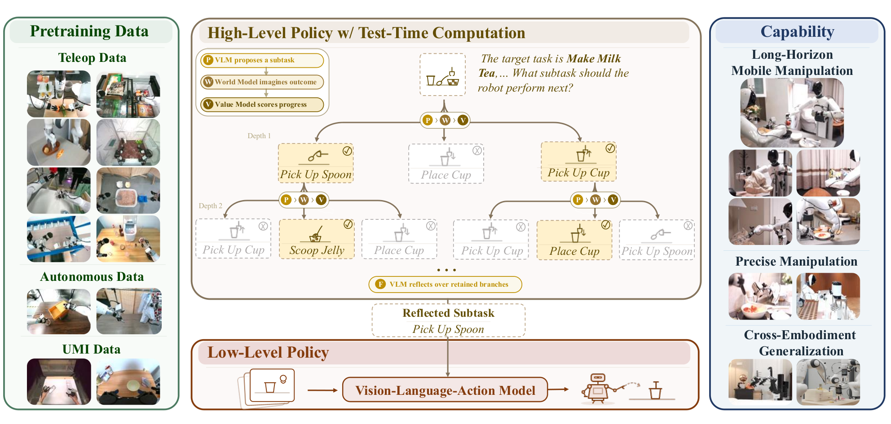
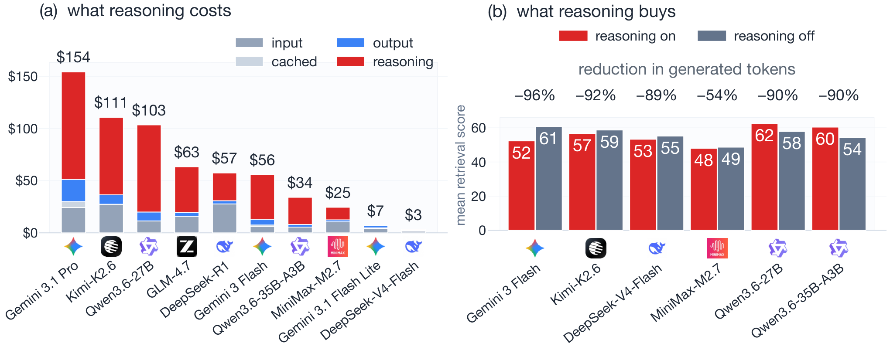
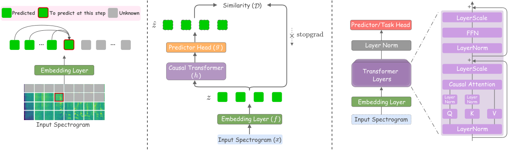
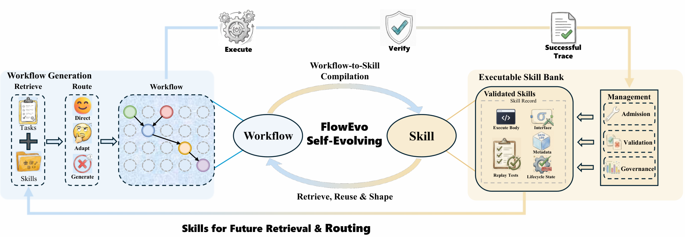
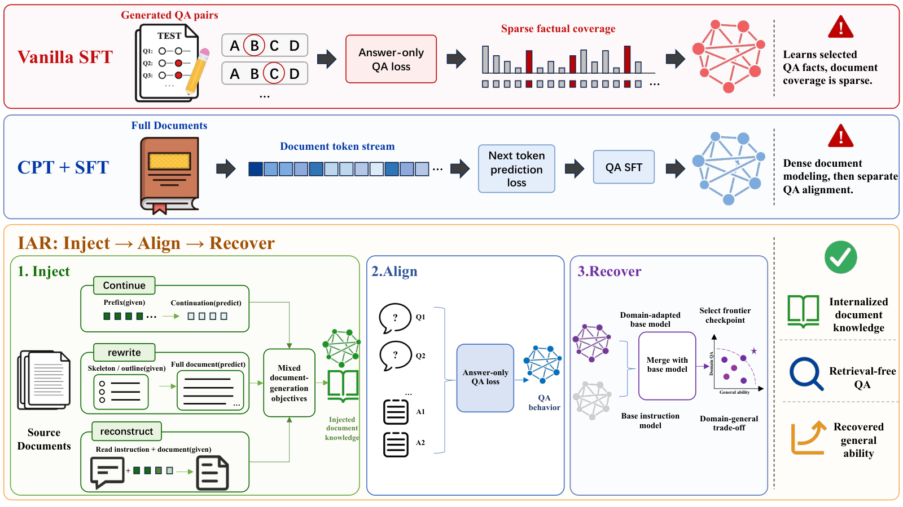
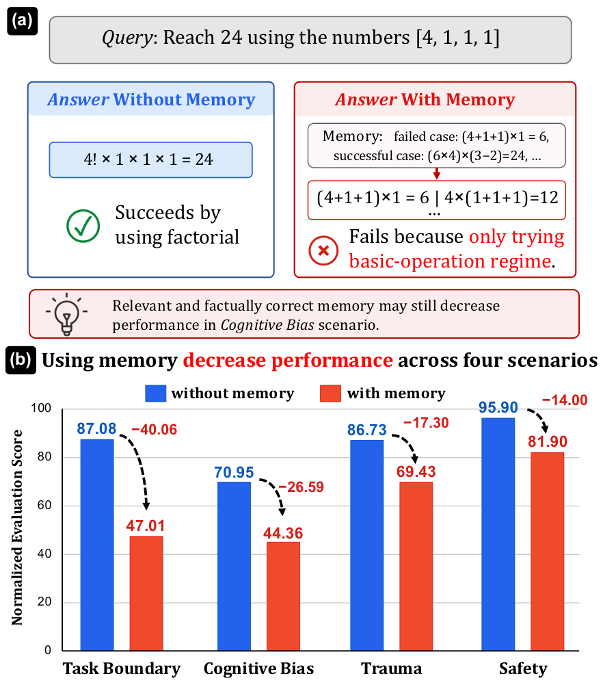

# Daily AI papers — 2026-08-23

*Curated from HF Daily Papers. 15 of ~26 papers kept after relevance filter.*

## Papers at a glance

| # | Title | Topics | Org |
| --- | --- | --- | --- |
| 1 | [τ₀-VLA: Hierarchical Robot Foundation Model with World-Model-Guided Test-Time Computation](#1-τ-vla) | `multimodal`, `VLA`, `world-model`, `agents` | (40-author consortium) |
| 2 | [4DAnyone: Create Anyone in 4D from a Casual Monocular Video](#2-4danyone) | `diffusion`, `multimodal`, `video` | Zhejiang U. / Ant / CUHK |
| 3 | [EnvHarness: Awakening Static Worlds for Agent Learning](#3-envharness) | `agents`, `RL`, `environments` | Google Research |
| 4 | [ForgeWM: Progressive Causal Training for Few-Step Action-Conditioned Video World Models](#4-forgewm) | `diffusion`, `video`, `distillation`, `world-model` | CUHK / Peking U. / Microsoft |
| 5 | [SWE-bench Science: Can Coding Agents Resolve Engineering Tasks in Science?](#5-swe-bench-science) | `eval`, `agents`, `code` | OpenMOSS / Fudan |
| 6 | [FACET: Preserving Source Intent and Executable State in Terminal Task Synthesis](#6-facet) | `agents`, `data`, `SFT` | (13-author team) |
| 7 | [WithEveryone: Unified Planning and Identity Grounding for Group Image Generation](#7-witheveryone) | `diffusion`, `multimodal`, `identity` | Fudan / ByteDance |
| 8 | [FlashPrefill V2: Block-Sparse Prefill Attention for Long-Context LLM Serving](#8-flashprefill-v2) | `efficient-inference`, `attention`, `sparse` | CASIA / Baichuan |
| 9 | [Thinking in a Low-Resource Language: What SFT Builds, What RL Fixes, What Accuracy Cannot See](#9-thinking-in-a-low-resource-language) | `RL`, `SFT`, `eval`, `multilingual` | Sophea AI / KIEFER |
| 10 | [The Embedder's Dilemma: LLMs Are Better, but at What Cost?](#10-the-embedders-dilemma) | `eval`, `retrieval`, `efficient-inference` | (independent) |
| 11 | [Listening Forward (NAPE): Next Patch Embedding Prediction Enables Scalable Audio Learners](#11-nape) | `SSL`, `audio`, `multimodal` | Imperial / Meta |
| 12 | [FlowEvo: Self-Evolving Agents through the Co-Evolution of Workflows and Executable Skills](#12-flowevo) | `agents`, `workflow`, `skills` | SEU / RPI |
| 13 | [Chain-of-Experience for Continual LLM Improvement](#13-chain-of-experience) | `inference`, `feedback`, `continual` | UCSC / ByteDance |
| 14 | [Inject, Align, Recover: Staged Post-Training for Retrieval-Free Document Knowledge Internalization](#14-inject-align-recover) | `post-training`, `SFT`, `knowledge` | (4-author team) |
| 15 | [MemTrapBench: Benchmarking Cognitive Traps in LLM Memory Use](#15-memtrapbench) | `eval`, `memory`, `agents` | ZJU / USTC / HKU |

---

## 1. τ₀-VLA

**Authors:** Xiaowei Cai, Yunuo Cai, Bingao Chen, Jingxiao Chen, et al. (40-author team) — *Multiple institutions (unspecified consortium)*
**Links:** [arXiv:2608.16885](https://arxiv.org/abs/2608.16885) · [HF](https://huggingface.co/papers/2608.16885) · [AlphaXiv](https://www.alphaxiv.org/abs/2608.16885)
**Topics:** `multimodal`, `VLA`, `world-model`, `agents`

### TL;DR

A hierarchical vision-language-action model trained on ~40k hours of heterogeneous real-world robot data. The core move: give the high-level planner *test-time compute* over subtask choices. A learned world model rolls out candidate subtasks in imagination; the planner picks the one whose predicted future best matches the goal. Adds deliberation where standard hierarchical VLAs commit in a single forward pass.

### Key idea

Replace one-shot subtask prediction with **world-model-guided rollout search**. At each high-level decision the model samples N candidate subtasks, uses an action-conditioned video world model to simulate each, and scores the resulting imagined trajectory against the language goal. Compute is spent proportional to how consequential the branch is — a hierarchical analogue of "thinking longer on hard problems."

### Main finding

τ₀-VLA improves long-horizon manipulation success rates and shows a favorable TTC scaling curve (higher rollout budgets keep improving until a plateau). Ablations show the world-model rerank is what matters — plain N-best subtask sampling without simulation gives most of the gains back.

### Why it matters

Applies the o1-style *test-time compute* recipe to embodied planning. If the world model is accurate enough to be a search oracle, VLA quality can be scaled at inference by spending more rollouts, not more training data. Also puts world-model quality on the critical path for robot foundation models — a place it had not previously been.

### Knowledge graph integration

**Builds on / relates to existing pages:**
- [../multimodal/README.md](../multimodal/README.md) — fits the VLA cluster (vision-language-action extension of VLMs).
- [../post-training/reasoning/mcts.md](../post-training/reasoning/mcts.md) — same "search over a learned world model" pattern, applied to embodied subtasks instead of proof trees.
- [../post-training/reasoning/long-cot-rl.md](../post-training/reasoning/long-cot-rl.md) — spiritual sibling: allocate compute at test time to consequential steps.

**Suggested new pages:**
- `multimodal/_vla.md` *(taxonomy)* — vision-language-action model family (OpenVLA → π₀ → RDT → τ₀-VLA).
- `multimodal/vla-test-time-compute.md` *(depth)* — world-model-guided rollout search at the planning layer.
- `case-studies/tau0-vla.md` *(case study)* — 40k hours of data, hierarchical stack, results across manipulation benchmarks.

---

## 2. 4DAnyone

**Authors:** Yudong Jin, Tao Xie, Qihang Zhang, Zehong Shen, Zhen Xu, Yujun Shen, Hujun Bao, Xiaowei Zhou, Yinghao Xu — *Zhejiang U. CAD&CG / Ant Group / CUHK / HKUST / Robbyant*
**Links:** [arXiv:2608.20335](https://arxiv.org/abs/2608.20335) · [HF](https://huggingface.co/papers/2608.20335) · [AlphaXiv](https://www.alphaxiv.org/abs/2608.20335)
**Topics:** `diffusion`, `multimodal`, `video`

### TL;DR

Reconstructs a 4D (moving 3D) human from a single uncalibrated phone video. Uses a multi-view video diffusion model to hallucinate consistent extra viewpoints, then lifts them into 4D Gaussian Splatting. The interesting technical bits are two attention tricks — *Reference Context Packing* (RCP) and *Target Context Routing* (TCR) — that keep the diffusion cost constant as reference views grow.

### Key idea

Standard multi-view video diffusion has attention cost that scales with the number of reference views, breaking at 4D-reconstruction scale. RCP compresses the growing reference set into a fixed-length, mixed-resolution context (O(1) in reference count). TCR rotates which target views are grouped together across denoising steps, so context is shared across groups without paying full quadratic cost.

*Borderline: included because RCP/TCR are transferable diffusion-context tricks applicable well beyond 4D humans.*

### Main finding

Reconstruction-grade multi-view consistency from a single monocular video, lifted cleanly into 4DGS. The paper positions itself as the first practical framework to go casual-video → 4D human without per-subject optimization or a rig.

### Why it matters

Two things generalize outside 4D humans: (1) the RCP/TCR pattern for diffusion transformers that must attend over many-reference contexts (any-to-any video, editing, world models); (2) the "generate consistent multi-views → lift to explicit 3D/4D" pipeline as a template for reconstruction from casual capture.

### Knowledge graph integration

**Builds on / relates to existing pages:**
- [../architectures/mla.md](../architectures/mla.md) — RCP is another instance of *compress the KV context to a fixed budget* — spiritual cousin to MLA.
- [../multimodal/README.md](../multimodal/README.md) — sits in the multimodal-diffusion cluster.

**Suggested new pages:**
- `multimodal/reference-context-packing.md` *(depth)* — the RCP+TCR attention pattern for many-reference diffusion.

---

## 3. EnvHarness

**Authors:** Chengsong Huang, Zifeng Wang, Rujun Han, Jun Yan, Yanfei Chen, Zoey CuiZhu, Ke Jiang, Peng Xia, Han Yu, Yufan Zhuang, Yifei Ming, Jiaqi Pan, Bhavana Dalvi Mishra, Jiaxin Huang, Burak Gokturk, Tomas Pfister, Chen-Yu Lee — *Google Research*
**Links:** [arXiv:2608.19880](https://arxiv.org/abs/2608.19880) · [HF](https://huggingface.co/papers/2608.19880) · [AlphaXiv](https://www.alphaxiv.org/abs/2608.19880)
**Topics:** `agents`, `RL`, `environments`

### TL;DR

Most agent RL environments are *static*: the same benchmark, same tasks, same failure modes. EnvHarness introduces a programmable "plugin" layer that reshapes an existing environment on the fly to target the current policy's specific weaknesses, without touching its verifier or task semantics. A companion `EnvRigger` observes rollout failures and synthesizes new plugins to close the diagnosed gap.

### Key idea

Treat the environment as a *co-evolving opponent*. EnvHarness wraps a static benchmark (Gym-style, coding sandbox, browser) with programmable plugins that mutate the initial state, add distractors, or alter the observation space. EnvRigger closes the loop: diagnose from trajectories → generate plugins → RL against the new distribution → observe new failures. Original verifiers are preserved, so reward signal stays sound.

### Main finding

Across five agent benchmarks, up to **+9.0 points** on held-out instances and **-9.8%** steps to completion, driven by the co-evolution loop rather than more data or larger models.

### Why it matters

The bottleneck in agent RL is quickly becoming *environment diversity*, not compute. EnvHarness reframes environments as programmable and evolvable — a route out of the "we ran out of hard SWE-bench tasks" wall. Compatible with any agent training pipeline that owns its rollout loop.

### Knowledge graph integration

**Builds on / relates to existing pages:**
- [../agents/README.md](../agents/README.md) — extends the environments layer (execution sandboxes / envs for agent training).
- [../post-training/rl-prompt-curation.md](../post-training/rl-prompt-curation.md) — prompt curation is to LLM RL what environment curation is to agent RL.
- [../post-training/_rl.md](../post-training/_rl.md) — sits in the family of RL post-training tricks.

**Suggested new pages:**
- `agents/environment-reshaping.md` *(depth)* — programmable-plugin envs and rigger-driven co-evolution.

---

## 4. ForgeWM

**Authors:** Xinye Li, Lingshuai Lin, Lei Wang, Liuzhou Zhang, Jialin Cui, Qingshan Li, Guanchu Wang, Qingbin Liu, Xi Chen, Jiang Bian, Wai Lam — *CUHK / Peking U. / Microsoft Research*
**Links:** [arXiv:2608.14022](https://arxiv.org/abs/2608.14022) · [HF](https://huggingface.co/papers/2608.14022) · [AlphaXiv](https://www.alphaxiv.org/abs/2608.14022)
**Topics:** `diffusion`, `video`, `distillation`, `world-model`

### TL;DR

Turns a bidirectional action-conditioned video generator into a *few-step causal* world model — one where keyboard/mouse actions can be replayed interactively with low latency. The trick is a four-stage progressive pipeline: domain adaptation → teacher-forced causal training → causal consistency distillation → on-policy distribution matching against a bidirectional teacher.

### Key idea

Naive causal distillation of a video diffusion model breaks when action inputs must stay aligned with temporally compressed latent chunks. ForgeWM chains four stages of progressively harder training regimes, each stage inheriting the previous stage's weights, ending with on-policy DMD-style matching where the student generates autoregressively and a bidirectional teacher critiques.

### Main finding

Enables interactive frame-generation rates from a formerly-non-causal teacher, preserving action controllability. Positions itself as a template for one/few-step interactive world models.

### Why it matters

Interactive world models are becoming an infrastructure primitive — for game engines, robotics simulators, and (per the τ₀-VLA paper above) VLA test-time compute. ForgeWM's staged distillation is the "how" for turning offline video diffusion into a real-time controllable simulator.

### Knowledge graph integration

**Builds on / relates to existing pages:**
- [../post-training/reasoning/long2short.md](../post-training/reasoning/long2short.md) — same "distill an expensive teacher into a compact student" motif in a different domain.
- [../post-training/reasoning/mcts.md](../post-training/reasoning/mcts.md) — world models are the search oracle for planning-style RL and TTC.

**Suggested new pages:**
- `multimodal/causal-video-distillation.md` *(depth)* — the staged bidirectional→causal distillation recipe for action-conditioned video WMs.
- `multimodal/_video-world-models.md` *(taxonomy)* — action-conditioned video WMs and their distillation regimes.

---

## 5. SWE-bench Science

**Authors:** Zhipeng Xu, Jiahao Lu, Yining Zheng, Yuxin Wang, Xipeng Qiu — *OpenMOSS / Fudan University*
**Links:** [arXiv:2608.19799](https://arxiv.org/abs/2608.19799) · [HF](https://huggingface.co/papers/2608.19799) · [AlphaXiv](https://www.alphaxiv.org/abs/2608.19799)
**Topics:** `eval`, `agents`, `code`

### TL;DR

A SWE-bench-style benchmark of 119 code-repair tasks drawn from scientific software across 20 domains. The twist: correctness here isn't just "tests pass" — it's whether the fix preserves the *scientific evidence* the code produces. Even Claude Code with Opus-5 comes in below 50% pass@1.

### Key idea

Scientific software is the instrument: a subtle bug can silently shift a published result. SWE-bench Science operationalizes this by curating tasks where the correct fix must both compile-and-pass-tests and produce numerically-faithful outputs, then categorizing failures into four recurring modes: deficits in scientific knowledge, misguided exploration, incomplete repair coverage, and overfitting to observed cases.

### Main finding

Claude Code + Opus-5 scores **<50% pass@1**. The four failure taxonomies are consistent across agents. Providing extra scientific context has *mixed* effects — sometimes it helps, sometimes it derails exploration.

### Why it matters

Existing SWE benchmarks measure "does my library still work?" This one measures "would you trust this agent to touch code that produces evidence?" A cleaner signal for the domains — science, medicine, finance — where correctness is more than green CI.

### Knowledge graph integration

**Builds on / relates to existing pages:**
- [../evaluation/README.md](../evaluation/README.md) — sits with the agent-eval bucket (SWE-bench, WebArena family).
- [../evaluation/livecodebench.md](../evaluation/livecodebench.md) — sibling contamination-resistant coding benchmark.

**Suggested new pages:**
- `evaluation/swe-bench-science.md` *(depth)* — the benchmark, its four failure taxonomies, and the guidance-effect finding.

---

## 6. FACET

**Authors:** Kou Shi, Zun Wang, Qisheng Su, Shiting Huang, Ziao Zhang, Zhen Fang, Qingnan Ren, Jin Liu, Yu Zeng, Yiming Zhao, Lin Chen, Zehui Chen, Feng Zhao — *Affiliations not disclosed on arXiv page*
**Links:** [arXiv:2608.18580](https://arxiv.org/abs/2608.18580) · [HF](https://huggingface.co/papers/2608.18580) · [AlphaXiv](https://www.alphaxiv.org/abs/2608.18580)
**Topics:** `agents`, `data`, `SFT`

### TL;DR

A pipeline for synthesizing high-quality terminal-agent training tasks. The core issue with naive synthesis: instruction, initial environment, reference solution, and verifier are typically generated in independent passes and drift out of sync — producing unsolvable or wrongly-graded tasks. FACET grounds all four artifacts in a *shared executable container state* and validates them with real execution before shipping.

### Key idea

Rebuild task synthesis around a single **shared executable state**: first stitch related skills into an information-dense scenario, then realize the container environment, then derive instruction + solution + verifier from *that* concrete container. Execution-based validation surfaces per-artifact failures; a repair loop fixes just the broken artifact instead of re-rolling the whole task.

### Main finding

Fine-tuning across multiple model scales on FACET-generated trajectories consistently improves **Terminal-Bench 2.1**. Ablations against alternative synthesis schemes confirm the environment-grounded construction is what drives task validity.

### Why it matters

Verifiable-reward RL for agents is only as good as the tasks it trains on. Most current pipelines silently ship broken tasks (unsolvable, mis-verified). FACET's pattern — shared container state, per-artifact repair — is a general recipe that generalizes past terminals to any executable-agent training corpus.

### Knowledge graph integration

**Builds on / relates to existing pages:**
- [../post-training/rejection-sampling.md](../post-training/rejection-sampling.md) — successful FACET trajectories are the "keep" side of a rejection-sampling pipeline.
- [../post-training/rlvr.md](../post-training/rlvr.md) — verifiable-reward training presumes correct verifiers; FACET is upstream of that assumption.
- [../agents/README.md](../agents/README.md) — belongs in the agent-training-data corner.

**Suggested new pages:**
- `agents/executable-task-synthesis.md` *(depth)* — the container-grounded, per-artifact-repair recipe for synthesizing agent training tasks.

---

## 7. WithEveryone

**Authors:** Hengyuan Xu, Qixun Wang, Yiji Cheng, Miles Yang, Zhao Zhong, Wei Cheng, Xingjun Ma, Yu-Gang Jiang — *Fudan University / ByteDance*
**Links:** [arXiv:2608.20336](https://arxiv.org/abs/2608.20336) · [HF](https://huggingface.co/papers/2608.20336) · [AlphaXiv](https://www.alphaxiv.org/abs/2608.20336)
**Topics:** `diffusion`, `multimodal`, `identity`

### TL;DR

Multi-subject image generation where each named person must remain themselves. WithEveryone assigns one identity token per person, first plans a structured layout of who goes where, then uses face-region annotations during training to supervise per-identity matching via a "Layout-Grounded ID Loss" and an "ID Representation Forcing" objective.

### Key idea

Break the group-image problem into (1) *planning* — a language-conditioned layout describing which identity goes in which region — and (2) *grounding* — a training loss that forces the model to fetch the right identity into the right region rather than average or copy. The layout is the interface both losses agree on.

### Main finding

Face similarity **0.499** vs **0.462** baseline; **97.3%** of requested identities appear, with only **2.8%** duplication, and copying-artifact rate visibly reduced.

### Why it matters

Multi-subject identity preservation is the hardest form of controllability in image generation — it forces the model to reason about *which* embedding goes *where*, not just add identity as a conditioning vector. The planner+grounded-loss pattern generalizes to any "many named entities in one scene" generation problem.

### Knowledge graph integration

**Builds on / relates to existing pages:**
- [../multimodal/README.md](../multimodal/README.md) — sits in the multimodal-generation cluster.

**Suggested new pages:**
- `multimodal/identity-grounded-generation.md` *(depth)* — layout-planning + ID-loss recipe for multi-subject identity preservation.

---

## 8. FlashPrefill V2

**Authors:** Qihang Fan, Huaibo Huang, Zhiying Wu, Bingning Wang, Ran He — *CASIA (Institute of Automation, Chinese Academy of Sciences) / Baichuan*
**Links:** [arXiv:2608.19758](https://arxiv.org/abs/2608.19758) · [HF](https://huggingface.co/papers/2608.19758) · [AlphaXiv](https://www.alphaxiv.org/abs/2608.19758)
**Topics:** `efficient-inference`, `attention`, `sparse`

### TL;DR

Block-sparse attention kernel for the *prefill* stage of long-context LLM serving. Three levers: a **mean-correction term** that shrinks approximation error at fixed sparsity, a redesigned sparse operator that runs natively on **FP8** tensor cores, and native support for **paged KV cache + continuous batching** so it drops into vLLM/SGLang-shaped stacks.

### Key idea

Prefill is the wall for long-context serving: it's compute-bound, quadratic in sequence length, and paid up front. Block-sparse patterns cut FLOPs but historically bled quality and didn't fit modern serving primitives. FlashPrefill V2 attacks all three: (1) a mean-correction term reduces the bias introduced by dropping blocks, (2) the kernel is written for FP8 tensor cores from day one, (3) sparsity metadata is expressed in paged/blocked layouts compatible with continuous batching.

### Main finding

Up to **47.26×** speedup over FlashAttention-2 at **128K context** in FP8, and **27.19×** in BF16, with comparable quality on long-context benchmarks.

### Why it matters

Long-context inference cost is currently the choke point for RAG-heavy agents, coding sessions, and multi-hour transcript workflows. A drop-in FP8 block-sparse prefill that plays nice with paged KV cache is exactly the shape of kernel serving infra can absorb without rearchitecting.

### Knowledge graph integration

**Builds on / relates to existing pages:**
- [../inference/README.md](../inference/README.md) — sits in the prefill-vs-decode / attention-kernel cluster.
- [../architectures/mla.md](../architectures/mla.md) — MLA solves the same compute wall from the architecture side; block-sparse prefill solves it from the kernel side.
- [../fundamentals/attention.md](../fundamentals/attention.md) — direct optimization of the attention primitive.
- [../quantization/fp8.md](../quantization/fp8.md) — the kernel is co-designed for FP8 tensor cores.
- [../fundamentals/dca.md](../fundamentals/dca.md) — sibling long-context serving trick from the attention-approximation family.

**Suggested new pages:**
- `inference/block-sparse-prefill.md` *(depth)* — the FlashPrefill V2 kernel: mean correction + FP8 + paged-KV compatibility.
- `inference/_long-context-serving.md` *(taxonomy)* — prefill kernels, KV-cache tricks, disaggregated serving for long-context workloads.

---

## 9. Thinking in a Low-Resource Language

**Authors:** Ayoub Kirouane, Christos Petrocheilos — *Sophea AI / KIEFER SA, Athens, Greece*
**Links:** [arXiv:2608.17744](https://arxiv.org/abs/2608.17744) · [HF](https://huggingface.co/papers/2608.17744) · [AlphaXiv](https://www.alphaxiv.org/abs/2608.17744)
**Topics:** `RL`, `SFT`, `eval`, `multilingual`

### TL;DR

Fine-tunes three MoE frontier models (3.6–4.0B active) to reason in Greek. Accuracy barely moves — and the benchmark itself has a **±7.7-point seed noise floor** at this scale, larger than any recipe effect. The interesting finding is *what does* change: SFT builds language fidelity, RL fixes reasoning-budget calibration, and both changes are invisible to accuracy metrics.

### Key idea

Decompose "reasoning in a low-resource language" into behavioral axes distinct from accuracy — language-adherence rate, reasoning-token budget, refusal patterns, structural formatting — and measure how SFT vs RL move each independently. Frames the "SFT teaches format, RL teaches capability" folklore in a language-adaptation setting.

### Main finding

Random-seed variance dominates all recipe effects at frontier MoE scale for low-resource reasoning. SFT reliably improves language fidelity; RL reliably tightens reasoning budgets and fixes over-thinking; accuracy is a lagging (and noisy) indicator of either.

### Why it matters

A useful counter to the field's accuracy-as-scoreboard reflex. If you can't tell your ablations apart from seed variance, you're measuring the wrong axis — and the *right* axes (fidelity, budget, format) map neatly onto SFT vs RL roles. Directly applicable to any low-resource or specialized-domain adaptation.

### Knowledge graph integration

**Builds on / relates to existing pages:**
- [../post-training/_post-training.md](../post-training/_post-training.md) — refines the SFT-then-RL taxonomy with fine-grained behavioral signals.
- [../post-training/rlvr.md](../post-training/rlvr.md) — RLVR here is the "fixes reasoning-budget calibration" lever.
- [../post-training/reasoning/length-penalty.md](../post-training/reasoning/length-penalty.md) — reasoning-budget shifts are exactly what length-penalty machinery targets.
- [../evaluation/README.md](../evaluation/README.md) — seed-noise-floor result is a warning about accuracy-only reporting.
- [../safety/low-resource-language-jailbreak.md](../safety/low-resource-language-jailbreak.md) — same population (low-resource languages), different question (safety generalization).

*(No new page suggested — the paper is a careful measurement study, not a new technique.)*

---

## 10. The Embedder's Dilemma

**Authors:** Adnan El Assadi, Niklas Muennighoff, Jinhyuk Lee — *Independent / academic (affiliations not consolidated on arXiv page)*
**Links:** [arXiv:2608.12875](https://arxiv.org/abs/2608.12875) · [HF](https://huggingface.co/papers/2608.12875) · [AlphaXiv](https://www.alphaxiv.org/abs/2608.12875)
**Topics:** `eval`, `retrieval`, `efficient-inference`

### TL;DR

Cost-aware apples-to-apples comparison of 10 LLMs (6 families) vs 26 dedicated embedding models (118M–14B) on 37 tasks. **Aggregate quality is a tie** (77.6 vs 77.2), but a leading LLM is up to **1,431× more expensive** per benchmark pass and **2.5–736× slower** per token. The Pareto frontier is embedding models plus exactly one LLM (Gemini 3.1 Pro).

### Key idea

Turn the "should we swap embeddings for an LLM?" question into a *cost-adjusted* Pareto analysis. Score every model on the same 37 MTEB-shaped tasks, tag each with USD-per-benchmark-pass and tokens/sec on the same GPU, and plot the Pareto frontier. Also ablate reasoning-token budget — 28–81% of LLM inference cost — and show most retrieval quality survives budget cuts.

### Main finding

Task-by-task split: **LLMs win on reasoning-heavy retrieval**; **embedding models win on classification**; tied on clustering, STS, pair classification. Reasoning-budget ablation: most models keep retrieval quality with lower budgets, freeing significant cost.

### Why it matters

Grounds a decision people are actually making in production. The Pareto view is a healthier framing than "LLMs are better" — the answer is "yes on reasoning retrieval, no on classification, and hardly ever at LLM prices." Also refutes maximal reasoning budgets as retrieval defaults.

### Knowledge graph integration

**Builds on / relates to existing pages:**
- [../evaluation/README.md](../evaluation/README.md) — grounds MTEB-shaped evaluation in cost-Pareto terms.
- [../inference/README.md](../inference/README.md) — the tokens/sec and USD/pass framing is inference economics.

*(No new page suggested — the value is the measurement; a depth page would repeat the paper without adding structure the graph is missing.)*

---

## 11. NAPE

**Authors:** Umberto Cappellazzo, Xubo Liu, Stavros Petridis, Maja Pantic — *Imperial College London / Meta*
**Links:** [arXiv:2608.19863](https://arxiv.org/abs/2608.19863) · [HF](https://huggingface.co/papers/2608.19863) · [AlphaXiv](https://www.alphaxiv.org/abs/2608.19863)
**Topics:** `SSL`, `audio`, `multimodal`

### TL;DR

Self-supervised audio learner that trains a **causal Transformer to predict the next patch embedding of a log-mel spectrogram** — with causal masking and stop-gradient as the *only* training signals. No masked prediction, no distillation, no contrastive objective. Matches or beats prior SSL recipes across six audio benchmarks and scales cleanly with encoder size.

### Key idea

Rip out every training trick from modern audio SSL (masked prediction, teacher-student EMAs, augmentation stacks) and replace them with the LLM recipe: causal next-token prediction, applied to patch embeddings of a spectrogram, with stop-gradient to prevent collapse. Simpler, and it works.

*Borderline: included because it demonstrates the LLM training paradigm transferring cleanly to a non-text modality — a useful template for other multimodal encoders.*

### Main finding

SOTA fine-tuning on several audio benchmarks; scales monotonically with encoder size; strong linear probes — despite the far simpler objective than BYOL-A / BEATs / MERT-style recipes.

### Why it matters

The generalization of GPT-style objectives to any *sequential-patch* modality (audio, video, EEG…) is the recurring lesson. NAPE is a clean data point: if your modality can be sensibly patched and ordered, next-patch-embedding prediction is likely the right first thing to try.

### Knowledge graph integration

**Builds on / relates to existing pages:**
- [../pre-training/mtp.md](../pre-training/mtp.md) — MTP is next-token prediction; NAPE is *next-patch-embedding* prediction — same family.
- [../multimodal/README.md](../multimodal/README.md) — audio encoders for future multimodal LLMs sit here.
- [../fundamentals/attention.md](../fundamentals/attention.md) — causal masking is the whole objective.

**Suggested new pages:**
- `multimodal/next-patch-embedding-prediction.md` *(depth)* — the NAPE objective and how it generalizes GPT-style SSL to continuous-patch modalities.

---

## 12. FlowEvo

**Authors:** Zeyu Ren, Ling Yue, Ran Li, Yishu Wang, Shengxiang Xu, Hanmo Liu, Shaowu Pan, Shimin Di — *Southeast University / Rensselaer Polytechnic Institute (mixed team)*
**Links:** [arXiv:2607.21596](https://arxiv.org/abs/2607.21596) · [HF](https://huggingface.co/papers/2607.21596) · [AlphaXiv](https://www.alphaxiv.org/abs/2607.21596)
**Topics:** `agents`, `workflow`, `skills`

### TL;DR

Training-free framework where an agent's **workflows and reusable skills co-evolve at inference time**. Successful workflows get compiled into named skills; utility is tracked per skill; underperforming skills get suppressed. Reaches **85.6% on ALFWorld** without any weight updates.

### Key idea

Skill libraries usually get built offline and never grow from what the agent actually did. FlowEvo closes that loop: at inference, promising workflow *fragments* are extracted into reusable executable skills, tagged with utility statistics, and re-called by later tasks. A pruning rule kills consistently-bad skills so the library stays sharp.

### Main finding

**85.6% ALFWorld accuracy** substantially over comparable training-free baselines, driven by the growing skill library rather than the underlying LLM.

### Why it matters

Alternative axis to "train a bigger agent." If the agent can persist and refine its own skill library at inference, capability grows monotonically with usage — no data, no fine-tuning. Complements weight-updating agent RL rather than competing with it.

### Knowledge graph integration

**Builds on / relates to existing pages:**
- [../agents/README.md](../agents/README.md) — sits in the agent-architecture cluster (ReAct, reflection, planner-executor lineage).
- [../post-training/reasoning/mcts.md](../post-training/reasoning/mcts.md) — planner-search-with-utility-tracking is a shared shape.

**Suggested new pages:**
- `agents/skill-workflow-coevolution.md` *(depth)* — inference-time growth of a skill library driven by workflow success.

---

## 13. Chain-of-Experience

**Authors:** Haoqin Tu, Yunhao Fang, Yizhong Wang, Cihang Xie, Shen Yan — *UC Santa Cruz / ByteDance*
**Links:** [arXiv:2608.18027](https://arxiv.org/abs/2608.18027) · [HF](https://huggingface.co/papers/2608.18027) · [AlphaXiv](https://www.alphaxiv.org/abs/2608.18027)
**Topics:** `inference`, `feedback`, `continual`

### TL;DR

A prompt/inference-time framework letting a model **accumulate experiential traces from feedback** across a series of interactions with math, coding, and knowledge tasks. Tested on GPT-5, Gemini-2.5 Pro, and Claude-4.5 Sonnet: **+5.6% average**, **-19% API cost**. Most of the win lands in the first few iterations.

### Key idea

Standard eval treats each question as independent. CoE feeds the model curated summaries of prior questions, feedback signals, and its own past attempts before answering a new question. Multi-channel feedback (self-generated + external + ground-truth) combines additively; the biggest jumps happen early because the model quickly patches its most systematic failure modes.

### Main finding

Consistent gains across 8 frontier models on math + code + knowledge domains; **+5.6%** overall accuracy, **-19%** cost (fewer, better-directed attempts); combining feedback channels beats any single one.

### Why it matters

A cheap, inference-only complement to training-time continual learning. Positions "how you feed history into the prompt" as a lever with real returns. Also gives an early signal on which failure modes are *quickly* patchable vs stubbornly baked in.

### Knowledge graph integration

**Builds on / relates to existing pages:**
- [../post-training/reasoning/long-cot-rl.md](../post-training/reasoning/long-cot-rl.md) — training-time analogue: RL teaches the model to think longer; CoE lets it *remember* previous thinking without retraining.
- [../evaluation/README.md](../evaluation/README.md) — implies eval protocols that permit inter-question memory as a distinct axis.

**Suggested new pages:**
- `post-training/chain-of-experience.md` *(depth)* — inference-time feedback accumulation for continual LLM improvement, with the multi-channel-feedback ablation.

---

## 14. Inject, Align, Recover

**Authors:** Qian Kou, Xiaofeng Shi, Xiaosong Qiu, Hua Zhou — *Affiliations not specified on arXiv page*
**Links:** [arXiv:2608.20281](https://arxiv.org/abs/2608.20281) · [HF](https://huggingface.co/papers/2608.20281) · [AlphaXiv](https://www.alphaxiv.org/abs/2608.20281)
**Topics:** `post-training`, `SFT`, `knowledge`

### TL;DR

Three-stage post-training recipe for **internalizing a bounded document collection into weights** — so the model can answer domain questions without RAG at inference. Stages: (1) *Inject* — convert docs to structured knowledge objectives; (2) *Align* — QA-supervised fine-tuning; (3) *Recover* — merge the domain-adapted weights back with the base model to restore general capability. **+3.6 pts** on domain QA and **+12.1 pts** on general performance vs baselines.

### Key idea

The standard problem with fine-tuning on documents: you gain domain knowledge and lose general capability. IAR treats knowledge internalization as a *staged* problem — extract structured objectives from raw docs (not just next-token pretraining), fine-tune for QA on those objectives, then use model merging to unwind catastrophic forgetting instead of adding a KL penalty or replaying.

### Main finding

Across multiple corpora and model families: **+3.6 pts domain QA**, **+12.1 pts general performance** vs both pure fine-tuning and retrieval-augmented baselines. The Recover stage — the model-merging step — carries most of the general-performance retention.

### Why it matters

RAG is the default for "make a model know my documents" but is expensive at inference and brittle at chunking boundaries. IAR gives a viable weights-only alternative when the corpus is bounded, with a clean recipe for avoiding the usual forgetting cost. Merging as a forgetting mitigator is a reusable move.

### Knowledge graph integration

**Builds on / relates to existing pages:**
- [../pre-training/model-souping.md](../pre-training/model-souping.md) — the Recover stage is exactly model-souping applied post-fine-tuning.
- [../post-training/rejection-sampling.md](../post-training/rejection-sampling.md) — sibling data-generation move for the Align stage (QA supervision).
- [../post-training/README.md](../post-training/README.md) — sits in the SFT-recipe cluster.
- [../pre-training/mid-training.md](../pre-training/mid-training.md) — mid-training does knowledge injection at a different stage of the pipeline; IAR does it after post-training.

**Suggested new pages:**
- `post-training/knowledge-internalization.md` *(depth)* — the Inject→Align→Recover recipe for retrieval-free document QA.

---

## 15. MemTrapBench

**Authors:** Mengru Wang, Haozhe Luo, Zhenqian Xu, Zhixiang Cui, Haoming Xu, Qu Yang, Jizhan Fang, Junfeng Fang, Ningyu Zhang — *Zhejiang University / USTC / HKU (mixed)*
**Links:** [arXiv:2608.20202](https://arxiv.org/abs/2608.20202) · [HF](https://huggingface.co/papers/2608.20202) · [AlphaXiv](https://www.alphaxiv.org/abs/2608.20202)
**Topics:** `eval`, `memory`, `agents`

### TL;DR

Benchmark showing that **faithful, semantically relevant memory can still degrade reasoning** — dubbed *Reasoning Fixation* and *Belief Distortion*. Every memory strategy tested underperforms the no-memory baseline on the trap tasks; the authors' *AdaptiveMem* mitigation partially closes the gap.

### Key idea

Isolate the failure mode where correct retrieved memories bias the current task in the wrong direction — the model over-anchors on prior reasoning ("Reasoning Fixation") or updates its beliefs incorrectly on prior statements ("Belief Distortion"). Benchmark tasks are constructed so the *right* answer requires ignoring or contradicting a memory that would otherwise look relevant.

### Main finding

All tested memory strategies (naive, hierarchical, retrieval-augmented) underperform no-memory on trap tasks. AdaptiveMem — the authors' proposal — recovers most of the gap by gating memory use per-query.

### Why it matters

Every long-lived agent product ships a memory system. This work shows that memory quality alone doesn't guarantee help: even truthful memory can harm reasoning if used indiscriminately. The gating-first mitigation reframes agent memory as a *retrieval-decision* problem, not just a retrieval problem.

### Knowledge graph integration

**Builds on / relates to existing pages:**
- [../evaluation/README.md](../evaluation/README.md) — new benchmark class (memory-use failure modes for LLM agents).
- [../agents/README.md](../agents/README.md) — memory is agent infrastructure.
- [../safety/distractor-attack.md](../safety/distractor-attack.md) — distractor attacks and memory traps share a "plausible-but-misleading context" mechanism.

**Suggested new pages:**
- `evaluation/memtrap-bench.md` *(depth)* — the Reasoning Fixation / Belief Distortion benchmark and the AdaptiveMem mitigation.

---

## Notes

- Borderline inclusions (4DAnyone, NAPE) are flagged in-section with an italic *Borderline: …* note.
- Hero figures live in `assets/2026-08-23/`. Missing figures (EnvHarness, SWE-bench Science, FlashPrefill V2, Thinking in a Low-Resource Language) reflect papers whose arXiv HTML did not expose a suitable teaser image.
- This digest is informational. No existing concept files, `READING-LIST.md`, or `PAPERS.md` were modified to produce it.
