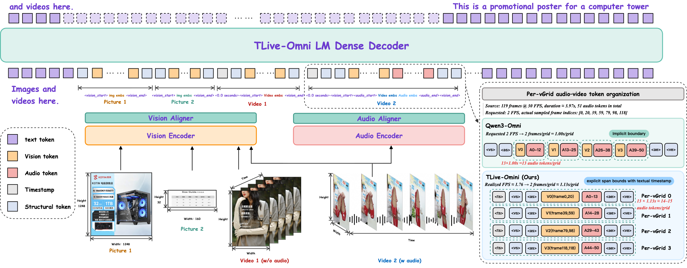
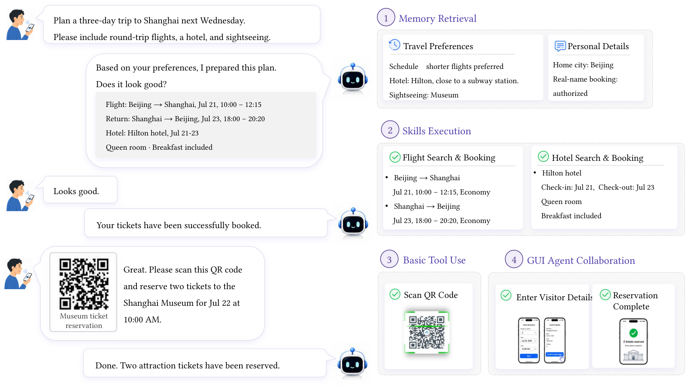
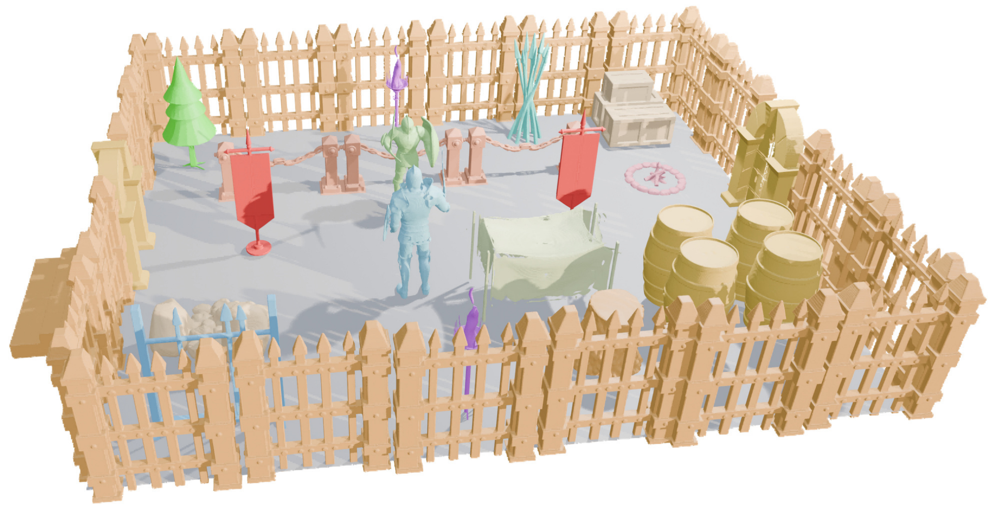
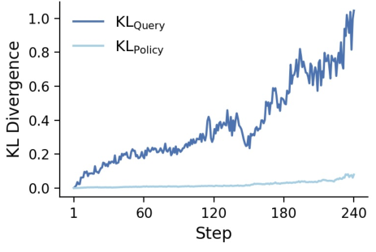

# Daily AI papers — 2026-08-25

*Curated from HF Daily Papers. 15 of 35 papers kept after relevance filter.*

## Papers at a glance

| # | Title | Topics | Org |
| --- | --- | --- | --- |
| 1 | [Prime Agent: A Self-Improving RLM Harness](#1-prime-agent) | `agents`, `RL`, `eval` | Prime Intellect |
| 2 | [Apodex 1.1: Scaling Agentic Intelligence for Complex Work](#2-apodex-11) | `agents`, `RL`, `case-study` | Apodex team |
| 3 | [EchoWM: Open and Enterable Omnimodal World Models](#3-echowm) | `multimodal`, `diffusion`, `world-models` | (unspecified) |
| 4 | [TLive-Omni: An Omni-Modal Understanding Model for E-Commerce Live Streaming](#4-tlive-omni) | `multimodal`, `RL`, `LLM` | (unspecified) |
| 5 | [Unlocking the Potential of Image Editing via Concept Scaling and Dense Supervision](#5-concept-scaling-editing) | `diffusion`, `data`, `eval` | (unspecified) |
| 6 | [MobilePA-Bench: Benchmarking Mobile Planner Agents on Complex Real-World Tasks](#6-mobilepa-bench) | `agents`, `eval` | Alibaba Token Foundry |
| 7 | [The Mask Is Not the Model: Auditing Prefix Invariance in Attention, State-Space, and Hybrid Sequence Models](#7-mask-is-not-the-model) | `architectures`, `interp`, `eval` | (unspecified) |
| 8 | [Block3D: Efficient Text-to-3D Generation via Block-Wise Diffusion](#8-block3d) | `diffusion`, `efficient-inference` | Zhejiang University (ZipLab) |
| 9 | [RISE: Adaptive Imagination for World Action Models](#9-rise) | `agents`, `world-models` | (unspecified) |
| 10 | [Beyond the Stability-Exploration Dilemma: Environmental Regularization for LLM Policy Optimization](#10-erpo) | `RL`, `reasoning`, `post-training` | Alibaba (AMAP) |
| 11 | [ARC: Fair Relative Advantage Comparison in Open-Ended Real-World Interaction](#11-arc) | `RL`, `agents`, `post-training` | (unspecified) |
| 12 | [LongRCA Bench: Diagnosing Responsible Roles and Root Causes in Long-Horizon Agent Failures](#12-longrca-bench) | `agents`, `eval` | (unspecified) |
| 13 | [Quantization-Aware Healing: A Practical Recipe for Recovering Compressed, 4-Bit LLMs](#13-quantization-aware-healing) | `quantization`, `efficient-inference` | Multiverse Computing |
| 14 | [Beyond Imitation: Filtering On-Policy Distillation by Reasoning Progress](#14-r2-opd) | `post-training`, `reasoning`, `distillation` | (unspecified) |
| 15 | [TileMix: Tile-Centric Mixed-Precision Attention for LLM Inference Acceleration](#15-tilemix) | `efficient-inference`, `quantization`, `attention` | (unspecified) |

---

## 1. Prime Agent: A Self-Improving RLM Harness {#1-prime-agent}

**Authors:** Seth Karten, Alex L. Zhang, Kevin Thomas, Sebastian Müller, Elie Bakouch, Daniel Auras, Mika Senghaas, Fares Obeid, Konstantin Dunas, Johannes Hagemann, Sami Jaghouar — *Prime Intellect*
**Links:** [arXiv:2608.23552](https://arxiv.org/abs/2608.23552) · [HF](https://huggingface.co/papers/2608.23552) · [AlphaXiv](https://www.alphaxiv.org/abs/2608.23552)
**Topics:** `agents`, `RL`, `eval`

### TL;DR

Prime Agent is an open-source harness for running language models as long-horizon agents, built around a persistent IPython REPL, a *Continual Harness* that carries state (histories, memories, skills, subagent specs) across trajectories, and recursive subagents that talk to each other directly. The pitch: keep strategy in the model, keep plumbing outside — so harness failure stops masking model capability.

### Key idea

Treat the harness as a "membrane" that must be low-friction and expressive: standardize execution, recovery, verification, and resource accounting, but never take strategic decisions itself. Coordination happens through the *Recursive Language Model* abstraction — subagents are first-class, communicate agent-to-agent, and share a persistent REPL that doubles as programmatic context.

### Main finding

Raises ARC-AGI-3 RHAE Best@1 from **30% → 95.5%** on the same underlying model, and matches or beats native/popular harnesses across long-context coding, GPU-kernel generation, emulator construction, and nanoGPT speedruns. On Factorio, refinement loops keep unlocking technology and subagents parallelize the work.

### Why it matters

Most "agent" benchmarks conflate harness quality with model capability. This paper argues the two must be measured separately, and provides an open harness good enough to expose the model's real ceiling. Practical impact: model comparisons that had been noisy because of scaffolding differences become cleaner.

### Knowledge graph integration

**Builds on / relates to existing pages:**
- [agents/README.md](../agents/README.md) — agents folder is empty apart from README; this paper is a natural first entry.
- [systems/partial-rollouts.md](../systems/partial-rollouts.md) — Prime Agent's persistent state / recovery mirrors long-horizon rollout accounting.

**Suggested new pages:**
- `agents/rlm-harness.md` *(depth)* — Recursive Language Model harness pattern (REPL + recursive subagents + continual state).
- `agents/_agent-harness.md` *(taxonomy)* — harness class: React vs ReAct vs Recursive-LM vs OpenHands-style shell.

---

## 2. Apodex 1.1: Scaling Agentic Intelligence for Complex Work {#2-apodex-11}

**Authors:** 70+ contributors (Apodex team)
**Links:** [arXiv:2608.23283](https://arxiv.org/abs/2608.23283) · [HF](https://huggingface.co/papers/2608.23283) · [AlphaXiv](https://www.alphaxiv.org/abs/2608.23283)
**Topics:** `agents`, `RL`, `case-study`

### TL;DR

Apodex 1.1 is a frontier agentic model + system stack aimed at *working capability* — sustained, verifiable progress on real professional tasks (finance, scientific research, math, coding, search). It scales along two axes: environment diversity/verifiability, and coordination between agents. A 35B "Mini" variant retains most of the capability locally.

### Key idea

Two coupled scaling axes: **Environment Scaling** (larger, more verifiable set of file/search/code environments used during training) and **Agentic Coordination Scaling** (training decompose→delegate→integrate→replan behaviors over long horizons). A shared *AgentOS* execution harness maintains task state and provenance across tools and subagents, and coordination traces feed back as training data.

### Main finding

Reaches the "leading performance band" on a broad basket of professional-work benchmarks using a substantially smaller model than frontier peers; the 35B Mini is deployable locally while retaining strong working capability.

### Why it matters

The paper is the first sizable release to explicitly train the *coordination* layer (planner/delegate/replan) as a target, rather than treating multi-agent scaffolding as an inference-time trick. Signals a shift from single-agent post-training to system-level agent training.

### Knowledge graph integration

**Builds on / relates to existing pages:**
- [post-training/rlvr.md](../post-training/rlvr.md) — verifiable-reward RL is the training signal Apodex claims to scale environment-side.
- [systems/partial-rollouts.md](../systems/partial-rollouts.md) — long-horizon rollout accounting under real environments.

**Suggested new pages:**
- `case-studies/apodex-1-1.md` *(case study)* — tech-report-scale system, worth a full breakdown.
- `agents/agent-os.md` *(depth)* — the shared execution harness / state model.
- `agents/coordination-scaling.md` *(depth)* — training decompose/delegate/replan behaviors.

---

## 3. EchoWM: Open and Enterable Omnimodal World Models {#3-echowm}

**Authors:** Songchun Zhang, Yaowei Li, Junhao Zhuang, Weiyang Jin, Haoyu Wang, Xin Lu, et al.
**Links:** [arXiv:2608.23189](https://arxiv.org/abs/2608.23189) · [HF](https://huggingface.co/papers/2608.23189) · [AlphaXiv](https://www.alphaxiv.org/abs/2608.23189)
**Topics:** `multimodal`, `diffusion`, `world-models`

### TL;DR

EchoWM is an omnimodal, enterable world model: given continuous navigation input, it jointly generates 720p video, ambient sound, music, and speech, letting the user "enter" a generated scene and steer through it. It handles both first-person (observer motion) and third-person (learned camera–character dynamics) scenes with a shared architecture.

### Key idea

Organize the interaction around **camera intent** as a unified control signal. First-person and third-person are handled without view-specific controllers — camera–character dynamics are learned from data. Training uses trajectory-mapped heterogeneous datasets and a progressive schedule ending in autoregressive post-training.

### Main finding

Strong trajectory adherence and visual quality across both first- and third-person scenarios, with audio (sound + music + speech) staying synchronized to video. Presented as one of the first open, jointly audio-video generative world models at 720p.

### Why it matters

Sets an open-source bar for the "generative game engine" line of work: continuous input, joint audio-video, and first/third-person coverage in one model. Also a strong stress test for long-horizon multimodal diffusion training pipelines.

### Knowledge graph integration

**Suggested new pages:**
- `multimodal/omnimodal-world-model.md` *(depth)* — pattern for jointly generating video+audio conditioned on navigation.
- `multimodal/camera-intent-conditioning.md` *(depth)* — camera intent as a unified control signal for first/third-person scenes.

---

## 4. TLive-Omni: An Omni-Modal Understanding Model for E-Commerce Live Streaming {#4-tlive-omni}

**Authors:** Yibo Hu (lead), Yu Qian, Mao Gu, Yingfan Tao, Yuhao Chen, Yongdong Luo, Zhuoqun Liu, Meiguang Jin, Junfeng Ma
**Links:** [arXiv:2608.20958](https://arxiv.org/abs/2608.20958) · [HF](https://huggingface.co/papers/2608.20958) · [AlphaXiv](https://www.alphaxiv.org/abs/2608.20958)
**Topics:** `multimodal`, `RL`, `LLM`

### TL;DR

TLive-Omni is an omni-modal LLM tailored to noisy, hours-long e-commerce live streams. It ingests image, video, audio, and text in a shared representation space and is post-trained with a *Faithful-RFT* stage — reinforcement fine-tuning that scores final answers directly with task-verifiable feedback, not reasoning-style exploration.

### Key idea

Two mechanisms stand out. **Per-vGrid** organizes tokens by timestamp: each video grid is grouped with its temporally corresponding audio inside explicit boundary tokens, giving cheap temporal alignment across modalities. On the training side, **Faithful-RFT** replaces exploration-oriented RL rollouts with rollouts scored by verifiable end-answer signals; a *dynamic sampling* trick regenerates rollout groups with near-zero reward variance to keep GRPO's relative advantages meaningful.

### Main finding

Strong performance on domain-specific live-commerce benchmarks (product grounding, temporal grounding, dense caption, omni-modal QA) with good generalization to standard multimodal benchmarks.

### Why it matters

A blueprint for turning noisy real-world multimodal streams into training signal: a compact data engine + timestamp-aware token layout + verifiable-reward RFT. The dynamic-sampling trick for GRPO's zero-variance groups is broadly reusable.

### Knowledge graph integration

**Builds on / relates to existing pages:**
- [post-training/grpo.md](../post-training/grpo.md) — Faithful-RFT builds on GRPO, addresses its zero-variance-group failure mode.
- [post-training/rlvr.md](../post-training/rlvr.md) — task-verifiable reward is the signal used.

**Suggested new pages:**
- `post-training/faithful-rft.md` *(depth)* — verifiable-reward RFT with dynamic zero-variance-group regeneration.
- `multimodal/per-vgrid.md` *(depth)* — timestamp-grouped video/audio token layout.

---

## 5. Unlocking the Potential of Image Editing via Concept Scaling and Dense Supervision {#5-concept-scaling-editing}

**Authors:** Long Cui, Xiaoqian Liu, Qi Qin, Yi Xin, Tao Lin, Jianguo Li, Linfeng Zhang
**Links:** [arXiv:2608.16812](https://arxiv.org/abs/2608.16812) · [HF](https://huggingface.co/papers/2608.16812) · [AlphaXiv](https://www.alphaxiv.org/abs/2608.16812)
**Topics:** `diffusion`, `data`, `eval`

### TL;DR

The paper argues text-to-image editing has been bottlenecked by two mismatches with the T2I recipe it borrows: coarse concept granularity and sparse supervision. Fix: a >1000-concept hierarchical edit taxonomy, a synthesized 12M-pair dataset (ConceptEdit-12M), and a dense-supervision training strategy that packs multiple non-interfering edits into a single image pair.

### Key idea

**Concept scaling** — replace the tiny concept set most editing datasets use with a 1000+ fine-grained taxonomy, synthesized via a library-driven pipeline that avoids distribution collapse. **Dense supervision** — combine multiple non-interfering edits (e.g. change color + add object + restyle background) into single training pairs so every image contributes more gradient signal per step.

### Main finding

Beats prior editing baselines on their new ConceptEdit-Bench evaluation suite; the dense-supervision strategy alone gives large training-efficiency gains.

### Why it matters

For image editing specifically, the paper reframes the problem as a data problem (granularity + supervision density) rather than an architecture problem. The library-driven synthesis pattern is transferable to other targeted generation datasets.

### Knowledge graph integration

**Builds on / relates to existing pages:**
- [data/_data-curation.md](../data/_data-curation.md) — data-side contribution; concept-taxonomy-driven synthesis is a curation strategy.

**Suggested new pages:**
- `data/dense-supervision.md` *(depth)* — packing multiple non-interfering targets into one training pair.

---

## 6. MobilePA-Bench: Benchmarking Mobile Planner Agents on Complex Real-World Tasks {#6-mobilepa-bench}

**Authors:** Yi Zhu, Xiongwei Wu, Qiyi Wang, Tingyu Qu, Jiajun Liu, Sihan Cao, Long Chen, Weigao Sun, Feida Zhu, Yiran Zhong, Steven Hoi — *Alibaba Token Foundry (MAI Team)*
**Links:** [arXiv:2608.23035](https://arxiv.org/abs/2608.23035) · [HF](https://huggingface.co/papers/2608.23035) · [AlphaXiv](https://www.alphaxiv.org/abs/2608.23035)
**Topics:** `agents`, `eval`

### TL;DR

MobilePA-Bench evaluates *planner* agents on a mobile OS in a stateful, tool-centric sandbox (13 domains, 212 tools). Beyond basic tool use, it scores sub-agent collaboration, memory usage, and skill (macro) usage — the coordination dimensions most existing mobile benchmarks skip.

### Key idea

An **executable sandbox** with live app databases and structured feedback, replacing the static function-calling and GUI-manipulation benchmarks. Evaluates three "advanced" dimensions explicitly: sub-agent delegation, memory recall (profiles, preferences), and skill invocation (pre-packaged composites) so agents don't replan from scratch every time.

### Main finding

Frontier LLMs remain unreliable under strict tool ordering, permission limits, and runtime errors — performance drops sharply. The benchmark surfaces failure modes hidden by static function-call evals.

### Why it matters

Provides a mobile analog of terminal/agent RL environments — a stateful playground where agentic RL training can plausibly happen, not just evaluation.

### Knowledge graph integration

**Builds on / relates to existing pages:**
- [agents/README.md](../agents/README.md) — foundational agents entry point.
- [evaluation/README.md](../evaluation/README.md) — benchmark folder home.

**Suggested new pages:**
- `evaluation/mobilepa-bench.md` *(depth)* — the benchmark itself.

---

## 7. The Mask Is Not the Model: Auditing Prefix Invariance in Attention, State-Space, and Hybrid Sequence Models {#7-mask-is-not-the-model}

**Authors:** Taebong Kim, Youngsik Hong, Minsik Kim, Sunyoung Choi, Jaewon Jang, Minseo Kim
**Links:** [arXiv:2608.22876](https://arxiv.org/abs/2608.22876) · [HF](https://huggingface.co/papers/2608.22876) · [AlphaXiv](https://www.alphaxiv.org/abs/2608.22876)
**Topics:** `architectures`, `interp`, `eval`

### TL;DR

The paper formalizes **prefix invariance** — the invariant that representations at position `t` must not depend on future inputs — and gives a lightweight, gradient-free audit (two forward passes) that produces a per-layer score localizing where causality actually breaks. Applied to attention, SSM, and hybrid models, they show that just checking the mask misses violations coming through other pathways.

### Key idea

Distinguish *intent* (the mask) from *behavior* (the actual dependency graph). The audit perturbs the suffix and measures prefix-side change per layer, so any implicit future-leakage — via normalization, cache reuse, or a hybrid mixer — surfaces even when the mask looks correct.

### Main finding

Across eight model checkpoints, several "causal by design" architectures leak future information in specific layers. The audit flags them without any training or gradients.

### Why it matters

Causality bugs quietly inflate benchmark numbers (train-eval mismatch) and can silently break generation. A cheap post-hoc audit is a nice complement to unit tests on attention-mask kernels — especially for hybrid attention/SSM stacks where the failure surface is bigger.

### Knowledge graph integration

**Builds on / relates to existing pages:**
- [architectures/multi-head-attention.md](../architectures/multi-head-attention.md) — the attention path being audited.
- [interpretability/README.md](../interpretability/README.md) — mechanistic-audit style paper.

**Suggested new pages:**
- `interpretability/prefix-invariance-audit.md` *(depth)* — the audit method.

---

## 8. Block3D: Efficient Text-to-3D Generation via Block-Wise Diffusion {#8-block3d}

**Authors:** Bowen Cui, Weijie Wang, Zeyu Zhang, Yefei He, Mingda Lin, Haoyu Zhao, Yuanyu He, Donny Y. Chen, Feng Chen, Bohan Zhuang — *ZipLab, Zhejiang University*
**Links:** [arXiv:2608.19567](https://arxiv.org/abs/2608.19567) · [HF](https://huggingface.co/papers/2608.19567) · [AlphaXiv](https://www.alphaxiv.org/abs/2608.19567)
**Topics:** `diffusion`, `efficient-inference`

### TL;DR

Block3D is a block-wise autoregressive diffusion model for text→3D. Instead of generating one shape token at a time (slow) or all tokens in parallel (quality drops), it partitions the shape-token sequence into contiguous blocks and denoises each block in one shot, with confidence-guided correction inside the block.

### Key idea

Move autoregressive granularity from tokens to **blocks**. Within a block, denoise all tokens jointly; between blocks, causal dependency is preserved. **Confidence-guided correction** revisits low-confidence tokens in a block before finalizing, catching errors before they cascade to the next block.

### Main finding

**5.15× speedup** end-to-end (25.71s → 4.99s per shape) without a measurable quality drop.

### Why it matters

Block-wise autoregressive diffusion is a general recipe — same idea should transfer to token-based image or video generation. Sits in the sweet spot between the two extremes (token AR vs full-parallel diffusion) that has been the focus of a wave of 2025–26 papers.

### Knowledge graph integration

**Suggested new pages:**
- `architectures/block-wise-ar-diffusion.md` *(depth)* — block-autoregressive with in-block denoise + confidence correction.

---

## 9. RISE: Adaptive Imagination for World Action Models {#9-rise}

**Authors:** Hongbo Lu, Liang Yao, Chenghao He, Hao Han, Fan Liu, Wenlong Liao, Tao He, Pai Peng
**Links:** [arXiv:2608.20430](https://arxiv.org/abs/2608.20430) · [HF](https://huggingface.co/papers/2608.20430) · [AlphaXiv](https://www.alphaxiv.org/abs/2608.20430)
**Topics:** `agents`, `world-models`

### TL;DR

World Action Models (WAMs) predict future world states as part of action generation, but existing WAMs imagine for a fixed number of steps at every scene. RISE learns to allocate imagination adaptively — keep rolling out where the value of doing so is high, stop early where it isn't — and ships CounterDrive, a counterfactual driving dataset with expert risk annotations to train that decision.

### Key idea

Learn a **stop-or-continue policy** on top of an imagination rollout: at each step, decide whether an extra imagined step is likely to change the action. Trained with the CounterDrive dataset (counterfactual outcomes at varying risk levels), so the model learns to spend imagination where it matters and skip it where it doesn't.

### Main finding

Improved planning on NAVSIM and nuScenes while cutting unnecessary imagination compute.

### Why it matters

The adaptive-compute story generalizes: any policy that trades compute for prediction quality can borrow this pattern. Also a template for planner–world-model coupling where the world model is expensive.

### Knowledge graph integration

**Suggested new pages:**
- `agents/adaptive-imagination.md` *(depth)* — learned stop-or-continue on world-model rollouts.

---

## 10. Beyond the Stability-Exploration Dilemma: Environmental Regularization for LLM Policy Optimization {#10-erpo}

**Authors:** Xiangdi Meng, Yu He, Tianyu Qi, Shuyan Guan, Xianli Zhang, Jian Zhang, Xin Li, Qika Lin, Jun Liu — *Alibaba (AMAP)*
**Links:** [arXiv:2608.23311](https://arxiv.org/abs/2608.23311) · [HF](https://huggingface.co/papers/2608.23311) · [AlphaXiv](https://www.alphaxiv.org/abs/2608.23311)
**Topics:** `RL`, `reasoning`, `post-training`

### TL;DR

Standard LLM policy optimization mediates the stability–exploration tradeoff with an *action-side* Policy-KL term. ERPO adds a *query-side* KL — bounding how much the induced query distribution can drift — plus a static, reference-derived per-query weight. The pitch: stabilize training without clamping down on exploration.

### Key idea

Existing Policy-KL constrains per-token action shifts, which either over-restricts (kills exploration) or under-restricts (destabilizes long-horizon rollouts). **Query-KL (QKL)** treats the *query distribution* the policy induces during rollouts as the object to bound, giving a cheaper, more targeted regularizer. A per-query weight, derived once from a reference policy, focuses the KL where it matters.

### Main finding

On six math-reasoning benchmarks, ERPO gives stronger accuracy and, notably, much more stable behavior under high-temperature decoding and long training horizons — the two regimes where GRPO/PPO variants usually blow up.

### Why it matters

Stability under long-horizon RL is the current bottleneck for reasoning training. Moving the KL term from actions to induced-queries is a clean structural fix.

### Knowledge graph integration

**Builds on / relates to existing pages:**
- [post-training/grpo.md](../post-training/grpo.md) — direct comparison and ancestor.
- [post-training/ppo.md](../post-training/ppo.md) — Policy-KL story that ERPO reframes.
- [post-training/_rl.md](../post-training/_rl.md) — belongs in the RL taxonomy.

**Suggested new pages:**
- `post-training/query-kl.md` *(depth)* — QKL regularizer + reference-weighted per-query term.

---

## 11. ARC: Fair Relative Advantage Comparison in Open-Ended Real-World Interaction {#11-arc}

**Authors:** Yongqi Tong, Tan Li Hui Faith, Choy Zhen Wen Marcus, Zhou Jin, Kewei Fu, Jiang-Ming Yang, Jianshe Li, Xin Zhang
**Links:** [arXiv:2608.13622](https://arxiv.org/abs/2608.13622) · [HF](https://huggingface.co/papers/2608.13622) · [AlphaXiv](https://www.alphaxiv.org/abs/2608.13622)
**Topics:** `RL`, `agents`, `post-training`

### TL;DR

Group-based RL (GRPO family) assumes every rollout in a group is a comparable "attempt at the same thing." In open-ended interaction — an agent may answer, clarify, ask for progress, or confirm before acting — that assumption breaks. ARC introduces advantage regularization by conditioning on the *type* of interaction so comparisons stay fair.

### Key idea

Separate **visible communication** (turn taken with the user/environment) from **internal reasoning**, and condition the group-advantage comparison on interaction type. Rollouts that took different valid actions (e.g. "answer now" vs "ask for clarification") no longer compete against each other on the same scale.

### Main finding

Reported gains on tool-use benchmarks together with substantially reduced response latency vs group-RL baselines.

### Why it matters

A concrete fix for a widespread GRPO failure mode when moving from closed-form reasoning (math, coding) to open-ended agent interaction. Should slot into any GRPO-style trainer.

### Knowledge graph integration

**Builds on / relates to existing pages:**
- [post-training/grpo.md](../post-training/grpo.md) — direct extension of GRPO's group-advantage scheme.
- [post-training/_rl.md](../post-training/_rl.md) — RL taxonomy.

**Suggested new pages:**
- `post-training/interaction-conditioned-advantage.md` *(depth)* — conditioning group advantages on interaction type.

---

## 12. LongRCA Bench: Diagnosing Responsible Roles and Root Causes in Long-Horizon Agent Failures {#12-longrca-bench}

**Authors:** Yunfei Zhang, Boyu Feng, Changhua Pei, Zexin Wang, Zhihuang Peng, Xinlong Liu, Hengyue Jiang, Difeng Ma, Jiayi Zhang, Yongzhou Yao, Yanan Zhao, Fei Sun, Yintong Huo, Zhaoyang Liu, Jingjing Li, Gaogang Xie, Dan Pei
**Links:** [arXiv:2608.15242](https://arxiv.org/abs/2608.15242) · [HF](https://huggingface.co/papers/2608.15242) · [AlphaXiv](https://www.alphaxiv.org/abs/2608.15242)
**Topics:** `agents`, `eval`

### TL;DR

Most agent-failure benchmarks operate on short traces. LongRCA covers 1,140 real failed trajectories (median 145 steps) across five domains, each labeled by humans with both the *responsible role* and the *earliest decisive root-cause step*. It also proposes RCTA, a training-free retrieval-based localizer.

### Key idea

Score two separate targets: **responsible role** (which agent/tool/user turn is at fault) and **earliest decisive root-cause step** (exact index in the trace). A strong baseline reaches only 13.2% root-step accuracy; **RCTA** — retrieve candidate error steps from segment summaries, then trace them back to earlier handoff instructions — jumps to 24.1% root-step / 51.1% responsible-role.

### Main finding

Big headroom on both axes, and separating them exposes that even a good responsible-role predictor can miss the exact step by a lot.

### Why it matters

A prerequisite for scalable agent debugging: without exact root-step localization, you can only iterate on outcomes, not causes.

### Knowledge graph integration

**Builds on / relates to existing pages:**
- [evaluation/README.md](../evaluation/README.md) — benchmark folder.
- [agents/README.md](../agents/README.md) — agent-side story.

**Suggested new pages:**
- `evaluation/longrca-bench.md` *(depth)* — the benchmark.
- `agents/failure-attribution.md` *(depth)* — role + root-cause-step localization pattern.

---

## 13. Quantization-Aware Healing: A Practical Recipe for Recovering Compressed, 4-Bit LLMs {#13-quantization-aware-healing}

**Authors:** Bakbergen Ryskulov, Iker García-Ferrero, David Montero, David Jansen, Ali Hashemi, Jezabel R. Garcia, Antonio Tiene, Román Orús
**Links:** [arXiv:2608.20953](https://arxiv.org/abs/2608.20953) · [HF](https://huggingface.co/papers/2608.20953) · [AlphaXiv](https://www.alphaxiv.org/abs/2608.20953)
**Topics:** `quantization`, `efficient-inference`

### TL;DR

Shipping cheap LLMs increasingly means "compressed *and* quantized." Instead of the usual quantization-aware training loop, this paper introduces **Quantization-Aware Healing (QAH)**: distill a 4-bit compressed student directly from the uncompressed original in one shot. On GPT-OSS 120B → 60B at MXFP4, they get Hypernova-60B — matching or beating the bf16 source on 7/9 benchmarks.

### Key idea

Treat the compressed-and-quantized model as a "wounded" version of the original and *heal* it: distill from the pre-compression teacher, at target precision, in a single stage. Sidesteps the usual chain of prune → distill → quantize → QAT that leaks quality at every hop.

### Main finding

Half the parameters at 4× lower precision, and it **matches or beats bf16 on 7 of 9 benchmarks**, with real memory savings at serve time.

### Why it matters

Compression + quantization recipes are increasingly the deployment story. This is a cleaner, one-shot alternative to multi-stage pipelines.

### Knowledge graph integration

**Builds on / relates to existing pages:**
- [quantization/fp8.md](../quantization/fp8.md) — sibling in low-precision serving.
- [quantization/_number-formats.md](../quantization/_number-formats.md) — MXFP4 is one of the covered formats.
- [pre-training/fp8-training.md](../pre-training/fp8-training.md) — related low-precision training story.

**Suggested new pages:**
- `quantization/quantization-aware-healing.md` *(depth)* — single-stage distill-from-source into compressed 4-bit target.
- `quantization/mxfp4.md` *(depth)* — MXFP4 as a serving format (referenced but no depth file yet).

---

## 14. Beyond Imitation: Filtering On-Policy Distillation by Reasoning Progress {#14-r2-opd}

**Authors:** Chen Yang, Haiyuan Wan, Rengrong Xiong, Yize Chen, Danny H.K. Tsang
**Links:** [arXiv:2608.19408](https://arxiv.org/abs/2608.19408) · [HF](https://huggingface.co/papers/2608.19408) · [AlphaXiv](https://www.alphaxiv.org/abs/2608.19408)
**Topics:** `post-training`, `reasoning`, `distillation`

### TL;DR

On-policy distillation (OPD) treats every teacher-derived token reward as ground truth, but teacher rewards often disagree with what actually advances reasoning — a step that clearly makes progress can still get a low reward simply because it deviates from the teacher's own outputs. **R²-OPD** filters supervision when teacher-derived rewards and independent progress rewards disagree.

### Key idea

Build **two within-trajectory rankings** of reasoning spans: one from teacher-derived rewards, one from an independently estimated *reasoning-progress* reward. Distillation rewards are suppressed for spans where the rankings disagree, so teacher signal only reinforces spans that both signals agree are actually good.

### Main finding

Consistent gains over standard OPD, especially on reasoning benchmarks.

### Why it matters

Teacher-imitation has been the default for reasoning distillation. R²-OPD is a clean statement that "imitate teacher" and "advance reasoning" aren't the same objective, and shows a lightweight way to reconcile them.

### Knowledge graph integration

**Builds on / relates to existing pages:**
- [post-training/reasoning/orm.md](../post-training/reasoning/orm.md) — outcome-reward story adjacent to the progress signal.
- [post-training/reasoning/long-cot-rl.md](../post-training/reasoning/long-cot-rl.md) — reasoning post-training family.
- [post-training/rejection-sampling.md](../post-training/rejection-sampling.md) — same filtering-on-quality pattern.

**Suggested new pages:**
- `post-training/reasoning/on-policy-distillation.md` *(depth)* — OPD as a training recipe.
- `post-training/reasoning/r2-opd.md` *(depth)* — the progress-vs-teacher rank-disagreement filter.

---

## 15. TileMix: Tile-Centric Mixed-Precision Attention for LLM Inference Acceleration {#15-tilemix}

**Authors:** Hanzhi Zhang, Qiao Zhang, Qinglei Cao, Heng Fan, Yan Huang, Kewei Sha, Yunhe Feng
**Links:** [arXiv:2608.17336](https://arxiv.org/abs/2608.17336) · [HF](https://huggingface.co/papers/2608.17336) · [AlphaXiv](https://www.alphaxiv.org/abs/2608.17336)
**Topics:** `efficient-inference`, `quantization`, `attention`

### TL;DR

Long-context prefill is bottlenecked by dense self-attention. Existing accelerations either pick a *uniform* low-precision path or *sparsify* interactions, neither of which does spatial precision routing over hardware-aligned tiles. TileMix partitions the score matrix into hardware-aligned tiles and dispatches each tile group to either FP16 or INT8 score compute, keeping both paths on a shared online-softmax state.

### Key idea

**Per-tile precision routing** inside fused dense attention. Routing decisions pack into compact bitmasks, so the dispatcher is cheap. Both FP16 and INT8 tiles feed into the same online-softmax accumulator, so no numerical seams between tile groups.

### Main finding

Prefill acceleration over uniform-low-precision baselines while preserving quality; the tile-level routing decouples precision from sparsity.

### Why it matters

Complements sparse attention with orthogonal precision routing — you can now do both together on the same tile grid. Directly relevant to any long-context prefill deployment.

### Knowledge graph integration

**Builds on / relates to existing pages:**
- [architectures/multi-head-attention.md](../architectures/multi-head-attention.md) — the attention op being tiled.
- [quantization/_number-formats.md](../quantization/_number-formats.md) — FP16/INT8 routing on the same op.
- [inference/README.md](../inference/README.md) — prefill acceleration.

**Suggested new pages:**
- `inference/tilemix-attention.md` *(depth)* — tile-level mixed-precision attention with shared online-softmax.
- `inference/_prefill-acceleration.md` *(taxonomy)* — sparsity / low-precision / mixed-precision approaches to prefill.

---

## Notes

- Borderline inclusions are flagged in-section with an italic *Borderline: …* note.
- Hero figures live in `assets/2026-08-25/`. Missing figures mean either no `og:image` was available on the source page or the download failed (Prime Agent, Apodex 1.1, EchoWM, Concept-Editing, Mask-Model, RISE, ARC, LongRCA, QAH, R²-OPD, TileMix).
- This digest is informational. No existing concept files, `READING-LIST.md`, or `PAPERS.md` were modified to produce it.
