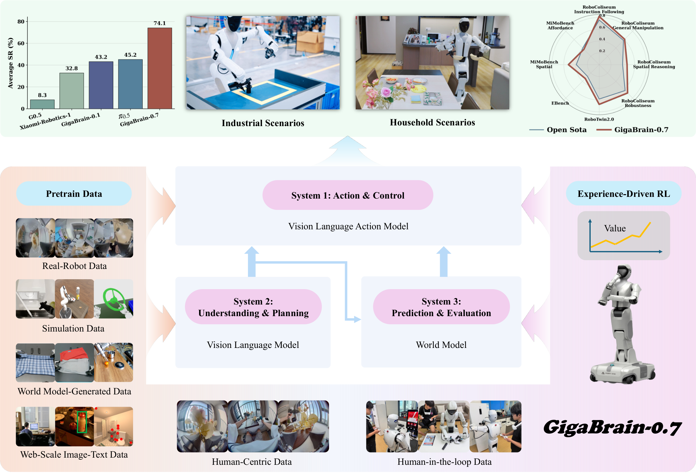
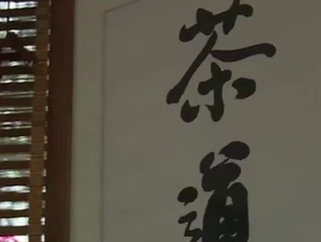
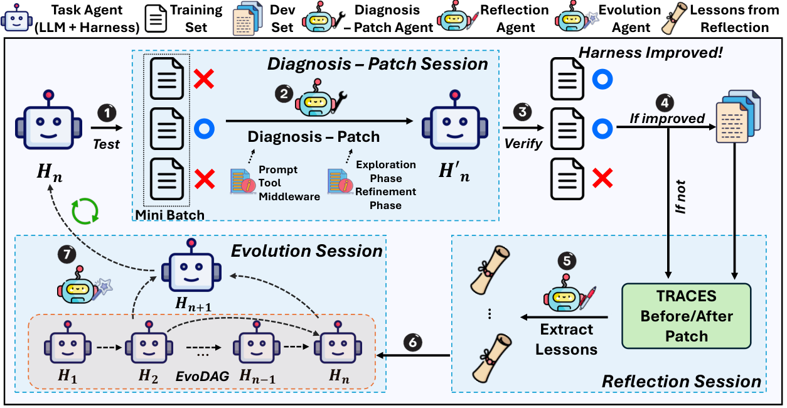
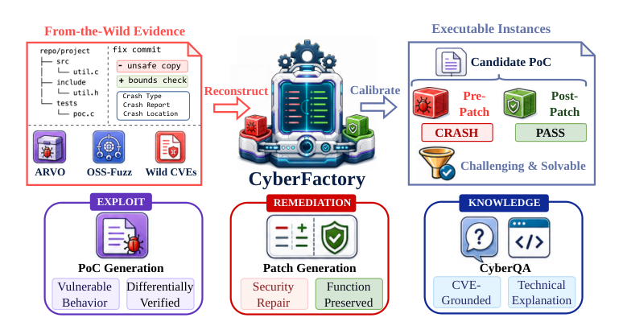
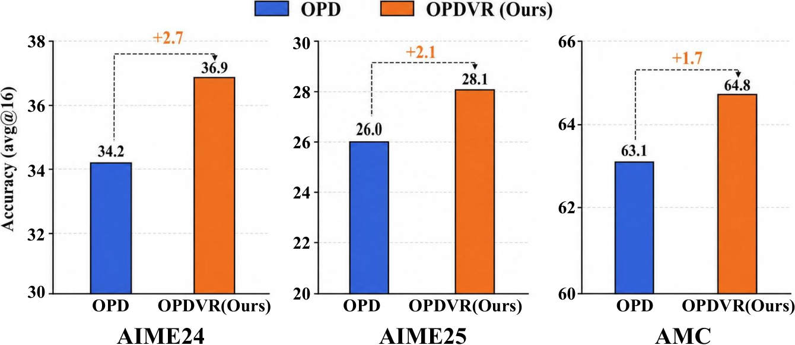
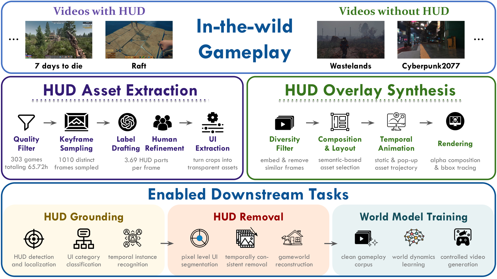

# Daily AI papers — 2026-08-26

*Curated from HF Daily Papers. 14 of 26 papers kept after relevance filter.*

## Papers at a glance

| # | Title | Topics | Org |
| --- | --- | --- | --- |
| 1 | [GigaBrain-0.7: Scaling Embodied Foundation Models](#1-gigabrain-07) | `multimodal`, `VLA`, `agents` | GigaBrain Team |
| 2 | [Annotations as Rollouts (OraRL)](#2-orarl) | `RL`, `multimodal`, `reasoning` | Nankai / NWPU / CAS |
| 3 | [WeMM-Embedding: WeChat Multi-Modal Embedding](#3-wemm-embedding) | `multimodal`, `eval` | Tencent WeChat |
| 4 | [On-Policy Self-Distillation in Diffusion Models](#4-diffusionopsd) | `diffusion`, `RL`, `distillation` | ByteDance Seed |
| 5 | [AutoSaddler: Automatic Harness Optimization](#5-autosaddler) | `agents`, `eval` | (unspecified) |
| 6 | [SecOPD: Token-Level Distillation for Prompt Injection](#6-secopd) | `safety`, `RL`, `distillation` | UC Berkeley |
| 7 | [CyberFactory: Cybersecurity Capabilities in the Wild](#7-cyberfactory) | `safety`, `agents`, `eval` | (multi-org open-source) |
| 8 | [Recuris: Recursive Experiential-Working Memory](#8-recuris) | `agents`, `RL` | Princeton / Skywork |
| 9 | [Best Practice Critic Optimization (BPCO)](#9-bpco) | `RL`, `reasoning` | NUS |
| 10 | [OPDVR: On-policy Distillation with Verifiable Reward](#10-opdvr) | `RL`, `reasoning`, `distillation` | Tsinghua LeapLab |
| 11 | [Meta^n: Recursive Self-Improvement through Emergent Depth](#11-meta-n) | `agents`, `reasoning` | UMinnesota NLP |
| 12 | [Game2World Engine: Gameplay Videos for World Models](#12-game2world) | `multimodal`, `diffusion`, `data` | (unspecified) |
| 13 | [LAION-BVD: 10-Million-Hour Open Video Dataset](#13-laion-bvd) | `data`, `multimodal` | LAION / Tübingen |
| 14 | [Length-Adaptive Decoding for Masked Diffusion MT](#14-entropy-valley) | `diffusion`, `efficient-inference` | (unspecified) |

---

## 1. GigaBrain-0.7

**Authors:** GigaBrain Team (60+ authors including Zheng Zhu, Angen Ye, Guan Huang) — *GigaBrain*
**Links:** [arXiv:2608.15875](https://arxiv.org/abs/2608.15875) · [HF](https://huggingface.co/papers/2608.15875) · [AlphaXiv](https://www.alphaxiv.org/abs/2608.15875)
**Topics:** `multimodal`, `VLA`, `agents`

### TL;DR

A vision-language-action foundation model that unifies **understanding, prediction, and action** in a three-system architecture, pretrained on 37,000+ hours of heterogeneous embodied data across many robot embodiments. One-stage alignment training jointly optimizes VLM comprehension and multi-embodiment action generation, delivering strong zero-shot generalization and instruction following on both home and industrial platforms.

### Key idea

Three coupled systems — a VLM understanding backbone (System 1), a world-prediction module (System 2), and an action-generation head (System 3) — trained jointly rather than as separate cascaded stages. Instead of the common two-stage recipe (pretrain VLM, then bolt on an action head), GigaBrain-0.7 uses a **one-stage alignment** that keeps the three systems coupled so understanding, forecasting, and control co-adapt.

### Main finding

Substantial gains over the previous GigaBrain-0 series and π₀.₅ on foundation zero-shot capability, language-conditioned instruction following, and post-training task success, evaluated on the in-house Maker H01 humanoid plus mainstream embodiments. Training code and weights promised.

### Why it matters

Scaling VLAs has been the open question of the year: does more heterogeneous embodied data give emergent capabilities the way LLM pretraining does? GigaBrain-0.7 is the largest single-system evidence point, and the three-system + one-stage recipe pushes past the fragmented VLM-then-action-head convention that dominates open VLAs.

### Knowledge graph integration

**Builds on / relates to existing pages:**
- [../multimodal/README.md](../multimodal/README.md) — extends the multimodal cluster into vision-language-*action* territory.
- [../case-studies/qwen2-5.md](../case-studies/qwen2-5.md) — comparable VLM-backbone recipe, one embodiment step further.

**Suggested new pages:**
- `multimodal/_vla.md` *(taxonomy)* — vision-language-action models (RT-2, OpenVLA, π0, GigaBrain).
- `multimodal/three-system-vla.md` *(depth)* — the understanding/prediction/action decomposition and one-stage joint training.
- `case-studies/gigabrain-07.md` *(case study)* — full recipe, data, embodiments, evaluation.

---

## 2. OraRL

**Authors:** Yunheng Li, Guohong Mu, Hao Li, Shengsheng Qian, Dingwen Zhang, Qibin Hou, Ming-Ming Cheng — *Nankai / NWPU / CAS*
**Links:** [arXiv:2608.20492](https://arxiv.org/abs/2608.20492) · [HF](https://huggingface.co/papers/2608.20492) · [AlphaXiv](https://www.alphaxiv.org/abs/2608.20492)
**Topics:** `RL`, `multimodal`, `reasoning`

### TL;DR

RL post-training for video MLLMs is bottlenecked by sample efficiency: GRPO groups often contain few high-reward rollouts even with expensive CoT sampling. OraRL turns dataset **annotations into oracle rollouts** that enter the on-policy group directly, but does so via a decoupled advantage estimator to avoid an "advantage inversion" failure mode where the oracle raises the baseline and flips previously positive advantages.

### Key idea

For each prompt, sample $G$ policy rollouts *plus* inject the ground-truth annotation as an extra "oracle" rollout. Compute an **oracle-free baseline** from the policy rollouts, then form a **directional gain** from the oracle-policy reward gap and a **detached oracle advantage** so the oracle doesn't corrupt the policy's own advantage sign. Add sign-balanced pruning — keep only the oracle plus the strongest rollouts of each sign — for compute savings.

### Main finding

OraRL runs at just **2.2× SFT step time** vs 4.9× for GRPO+CoT, scales from 0.8B → 9B, and Video-ORA-9B decodes in **130 ms without CoT** vs 4,780 ms. Beats prior SOTA: temporal mIoU 62.5→66.0, tracking AO 73.0→78.2, segmentation 64.3→70.4, VSI-Bench 73.1 vs GPT-5's 55.0 and Gemini-3-Pro's 55.1.

### Why it matters

Two things generalize beyond video MLLMs: (1) using dataset annotations as *direct optimization targets* rather than just reward-scoring functions is a lever most RLVR pipelines throw away; (2) the "advantage inversion" failure mode is a concrete gotcha whenever you mix teacher/oracle trajectories with on-policy groups — a hazard shared by any hybrid SFT+RL scheme.

### Knowledge graph integration

**Builds on / relates to existing pages:**
- [../post-training/grpo.md](../post-training/grpo.md) — direct GRPO extension with oracle-injected groups.
- [../post-training/rlvr.md](../post-training/rlvr.md) — annotations are the verifiable-reward signal repurposed as trajectories.
- [../post-training/_rl.md](../post-training/_rl.md) — the decoupled advantage estimator is a variance-reduction trick.
- [../multimodal/README.md](../multimodal/README.md) — evaluated on video MLLM benchmarks.

**Suggested new pages:**
- `post-training/oracle-rollouts.md` *(depth)* — annotations as directly-injectable on-policy trajectories, with decoupled advantage.

---

## 3. WeMM-Embedding

**Authors:** Junjie Zhou, Ke Mei, Lei Li, Tianyi Wang, Fengyun Rao, Jing Lyu — *Tencent WeChat*
**Links:** [arXiv:2608.24053](https://arxiv.org/abs/2608.24053) · [HF](https://huggingface.co/papers/2608.24053) · [AlphaXiv](https://www.alphaxiv.org/abs/2608.24053)
**Topics:** `multimodal`, `eval`

### TL;DR

A family of universal multimodal embedding models (2B / 4B / 9B) covering text, images, videos, visual documents, and arbitrarily interleaved multimodal inputs, with flexible output dimensions. Trained in two stages — large-scale multimodal alignment followed by a refinement stage with curated data, fine-grained relevance supervision, and cross-scale knowledge transfer.

### Key idea

Two-stage recipe with three refinement-stage ingredients: (1) fine-grained relevance supervision that scores at a granularity finer than binary in-batch contrastive, (2) **cross-scale knowledge transfer** where the larger variants distill representation structure into the smaller ones, and (3) curated data mixtures per modality tuned to reduce collapse to any single input type.

### Main finding

The 2B variant surpasses the previous best 8B open-source baseline on MMEB-v2; the 9B variant sets a new SOTA at 80.6 overall. Consistent wins across 26 in-house benchmark tasks and 14 online A/B tests, and now deployed across WeChat Channels, Official Accounts, Moments, and e-commerce.

### Why it matters

Universal multimodal embeddings are becoming plumbing for RAG, agents, and recommendation. The distinct move here is *scale-parametric* deployment (2B/4B/9B) with cross-scale distillation — an operator-friendly pattern where the same recipe produces small serving models and a strong large model in one training run.

### Knowledge graph integration

**Builds on / relates to existing pages:**
- [../multimodal/README.md](../multimodal/README.md) — squarely fits the multimodal cluster.

**Suggested new pages:**
- `multimodal/_multimodal-embedding.md` *(taxonomy)* — universal multimodal embedding models (E5-V, mmE5, BGE-M3, WeMM-Embedding).
- `multimodal/wemm-embedding.md` *(depth)* — two-stage recipe and cross-scale knowledge transfer.

---

## 4. DiffusionOPSD

**Authors:** Wei Zhou, Xiongwei Zhu, Lingdong Kong, Bo Chen, Lei Zhang, Yongyuan Liang, Julian McAuley, Tat-Seng Chua, et al. — *ByteDance Seed*
**Links:** [arXiv:2608.24646](https://arxiv.org/abs/2608.24646) · [HF](https://huggingface.co/papers/2608.24646) · [AlphaXiv](https://www.alphaxiv.org/abs/2608.24646)
**Topics:** `diffusion`, `RL`, `distillation`

### TL;DR

Aligning diffusion models with rewards is hard because endpoint rewards don't tell an intermediate denoiser *what its clean prediction should look like*. DiffusionOPSD closes the gap: reward gradients construct explicit positive/negative targets around a frozen anchor, and the trainable policy fits them via **detached supervision**, refreshing the anchor via EMA. It decouples target *construction* from *fitting*, letting each be measured on its own.

### Key idea

At each outer iteration: (1) a frozen behavior policy generates trajectories and supplies query states and anchors; (2) reward gradients construct bounded positive/negative targets around each anchor; (3) the trainable policy performs finite fitting steps against these detached targets; (4) an EMA update refreshes the behavior policy. Endpoint reward becomes intermediate supervision at sampled queries.

### Main finding

Best final held-out scores in **19 of 20** reward-matched settings across SD 3.5-M and step-distilled Z-Image-Turbo, over ten evaluators. Beats the strongest competitor by up to **44.0%** and cuts training GPU-hours by 40% on SD 3.5-M and 63% on Z-Image-Turbo relative to DiffusionNFT.

### Why it matters

Turns diffusion alignment into a *diagnosable* pipeline where you can separately debug "did we build a good target?" and "did we fit the target?" That decoupling matters as diffusion RL scales — most failures collapse into a single scalar score today.

### Knowledge graph integration

**Builds on / relates to existing pages:**
- [../post-training/_post-training.md](../post-training/_post-training.md) — a diffusion-model analogue of LLM RL post-training.
- [../post-training/_rl.md](../post-training/_rl.md) — reward-guided policy update via on-policy trajectories.

**Suggested new pages:**
- `post-training/on-policy-distillation.md` *(depth)* — the general recipe of turning rewards into detached-target supervision refreshed by EMA.

---

## 5. AutoSaddler

**Authors:** Sungho Park, Wonjoong Kim, Rongyuan Tan, Jue Zhang, Wook-Shin Han, Pengfei Gao, Chanyoung Park, Yongqiang Yao, Rao Fu, Qingwei Lin, Saravan Rajmohan, Dongmei Zhang, et al. — *Microsoft / academic collab*
**Links:** [arXiv:2608.23041](https://arxiv.org/abs/2608.23041) · [HF](https://huggingface.co/papers/2608.23041) · [AlphaXiv](https://www.alphaxiv.org/abs/2608.23041)
**Topics:** `agents`, `eval`

### TL;DR

Long-horizon LLM agents are unreliable because tiny local failures compound. External **harnesses** help but designing them is manual and expensive. AutoSaddler formulates harness improvement as **offline learning** — collect failure traces in mini-batches, diagnose them, generate structured patches that treat the harness as code, and pick updates via validation.

### Key idea

Three coupled components: (1) failure-trace diagnosis that localizes the harness bug (prompt phrasing, tool schema, control-flow glitch); (2) structured patch generation that edits the harness as a code artifact rather than a monolithic prompt; (3) validation-based update selection so bad patches roll back. Iterate over mini-batches of failures.

### Main finding

+9.0 points on GAIA2, +9.6 on SWE-Bench Pro, +10.0 on Terminal-Bench 2.0 over the corresponding base harnesses.

### Why it matters

Harness engineering is where most of the practical agent progress happens right now, but it's ad-hoc and brittle. AutoSaddler is a serious attempt at making it a formal optimization problem — the same "treat the meta-layer as code" move that Meta^n (paper #11) takes, applied to the harness rather than the reasoning strategy.

### Knowledge graph integration

**Builds on / relates to existing pages:**
- [../agents/README.md](../agents/README.md) — agent harness optimization is squarely in the agents cluster.
- [../evaluation/livecodebench.md](../evaluation/livecodebench.md) — SWE-Bench Pro and Terminal-Bench are the same benchmark class.

**Suggested new pages:**
- `agents/harness-optimization.md` *(depth)* — offline learning over harness code from failure traces.

---

## 6. SecOPD

**Authors:** Yibo Peng, Long Lian, David Wagner, Sizhe Chen — *UC Berkeley*
**Links:** [arXiv:2608.21500](https://arxiv.org/abs/2608.21500) · [HF](https://huggingface.co/papers/2608.21500) · [AlphaXiv](https://www.alphaxiv.org/abs/2608.21500)
**Topics:** `safety`, `RL`, `distillation`

### TL;DR

Existing defensive fine-tuning against prompt injection (DPO, GRPO) uses sequence-level signals — it can't say *which tokens* were insecure. SecOPD trains with **token-level feedback** by generating a rollout on injected input and scoring each token against what the initialization model would have produced on the clean input.

### Key idea

**Secure On-Policy Distillation.** Feed the model an injected sample and let it roll out. Then, for the *same rollout*, score each token by the initialization model's probability under the *clean* (uninjected) input. That per-token distillation signal tells the model which parts of the output diverged from safe behavior and why.

### Main finding

Qwen3.6-27B trained with SecOPD hits **9.0% ASR** against SoTA PISmith adaptive injections vs 94.0% for the previous SoTA Meta-SecAlign — a >10× reduction. Generalizes to unseen agentic tool-calling (4.7% ASR vs 5.5%). Code + model released.

### Why it matters

Prompt injection is the #1 threat to deployed agents, and the field was stuck on defensive recipes that plateaued near 100% ASR against adaptive attacks. The token-level distillation lens is more broadly reusable: it's a way to convert "output is bad" signals into per-token training gradients for any behavior-shaping problem.

### Knowledge graph integration

**Builds on / relates to existing pages:**
- [../safety/_attacks.md](../safety/_attacks.md) — direct extension of the prompt-injection attack taxonomy.
- [../safety/payload-splitting.md](../safety/payload-splitting.md) — payload splitting is a specific prompt-injection variant SecOPD defends against.
- [../safety/prefix-injection.md](../safety/prefix-injection.md) — the "ignore prior instructions" prefix is one class of adaptive injection.
- [../post-training/dpo.md](../post-training/dpo.md) — SecOPD explicitly contrasts with DPO's sequence-level feedback.

**Suggested new pages:**
- `safety/_prompt-injection-defenses.md` *(taxonomy)* — StruQ, SecAlign, Meta-SecAlign, SecOPD; sequence-vs token-level feedback.
- `safety/secopd.md` *(depth)* — token-level clean-vs-injected distillation for prompt-injection defense.

---

## 7. CyberFactory

**Authors:** Jian Yang, Haau-Sing Li, Shawn Guo, Zixi Zhao, Yibo Tan, Jiajun Wu, Aishan Liu, Zhoujun Li, Xianglong Liu, Tianyu Zheng, Bryan Dai, Chengran Yang — *multi-org open-source*
**Links:** [arXiv:2608.23181](https://arxiv.org/abs/2608.23181) · [HF](https://huggingface.co/papers/2608.23181) · [AlphaXiv](https://www.alphaxiv.org/abs/2608.23181)
**Topics:** `safety`, `agents`, `eval`

### TL;DR

A unified open-source framework connecting data construction, trajectory synthesis, and model training across **proof-of-concept generation, vulnerability patching, and cybersecurity QA**. Aims to close the gap between closed-source cyber-capable LLMs (like Mythos) and open recipes, which have been fragmented across isolated tasks with weak agentic data.

### Key idea

Three-way scaling pipeline: (1) data construction from wild vulnerability instances, (2) trajectory synthesis that turns instances into agentic rollouts (browsing, tool calls, patch generation), and (3) task-conditioned training that treats PoC generation, patching, and QA as one family sharing a domain prior.

### Main finding

Model performance improvements on CyberGym (the abstract truncates, but the paper's target is CyberGym parity with closed cyber-capable models). Full stack open-sourced.

### Why it matters

Cyber capabilities are dual-use, and open recipes so far have been either isolated (single-task) or gated (closed weights). A unified open framework changes the field's baseline for both offensive and defensive evaluation — and directly informs safety-case work on dangerous-capability evaluations.

### Knowledge graph integration

**Builds on / relates to existing pages:**
- [../safety/README.md](../safety/README.md) — cyber capability is a canonical dangerous-capability evaluation area.
- [../safety/safety-case.md](../safety/safety-case.md) — model releases with cyber capability need safety-case reasoning.
- [../evaluation/livecodebench.md](../evaluation/livecodebench.md) — CyberGym is a code-execution benchmark in the same family.

**Suggested new pages:**
- `safety/cyber-capability-training.md` *(depth)* — data + trajectory + task-conditioned recipe for cybersecurity capabilities.

---

## 8. Recuris

**Authors:** Zhaochen Yu, Yingcheng Wu, Zhenfei Yin, Kaiyuan Chen, Zhe Zhao, Mengdi Wang, Shuicheng Yan, Ling Yang — *Princeton / Skywork / collaborators*
**Links:** [arXiv:2608.24876](https://arxiv.org/abs/2608.24876) · [HF](https://huggingface.co/papers/2608.24876) · [AlphaXiv](https://www.alphaxiv.org/abs/2608.24876)
**Topics:** `agents`, `RL`

### TL;DR

Long-horizon agents drown in their own histories: growing context obscures the task state and misroutes skill invocation. Recuris splits agent memory into a **Working Memory** (task state + skill dispatcher) and an **Experiential Memory** (past skills), with a fixed **Meta-Agent** that turns execution evidence into validation-gated updates to a **Skill Memory**. The result is a bounded recursive memory-evolution loop.

### Key idea

Two memory buffers do different jobs. Working Memory only carries the *current* task state and picks skills from Experiential Memory — the full history never enters skill selection. Execution outcomes are logged as structured evidence localizing failures to specific memory components; the Meta-Agent's job is only to write validation-gated patches to Skill Memory. Because the Meta-Agent is *fixed*, the recursion is bounded and stable.

### Main finding

Improves task success in **35 of 37** completed model-benchmark pairs across four long-horizon benchmarks and ten models. On τ-bench: +17.8 to GPT-5.6 Sol, +15.6 to Claude Opus 5 (to 87.9%). On SkillFlow: +16.6 / +13.5 to Qwen3.6-27B/35B. Advantage grows with horizon (+32.2 on the longest tasks), common failure modes drop up to 80%.

### Why it matters

Recuris and Meta^n (paper #11) both argue that self-improvement needs a *fixed* meta-layer to stay stable — a design principle that reappears whenever agents try to rewrite themselves. Recuris localizes the fixed layer at the memory-controller level; Meta^n does it at the strategy-composition level. Two views on the same architectural constraint.

### Knowledge graph integration

**Builds on / relates to existing pages:**
- [../agents/README.md](../agents/README.md) — long-horizon agent architecture.
- [../post-training/README.md](../post-training/README.md) — the meta-agent update loop is post-training-adjacent (training-free but structurally similar to policy update from evidence).

**Suggested new pages:**
- `agents/experiential-working-memory.md` *(depth)* — the Working/Experiential/Skill memory split with a fixed Meta-Agent.
- `agents/_recursive-self-improvement.md` *(taxonomy)* — RSI approaches (Recuris, Meta^n, Voyager-style skill libraries, self-editing agents).

---

## 9. BPCO

**Authors:** Penghui Qi, Xiangxin Zhou, Wee Sun Lee — *NUS*
**Links:** [arXiv:2608.23566](https://arxiv.org/abs/2608.23566) · [HF](https://huggingface.co/papers/2608.23566) · [AlphaXiv](https://www.alphaxiv.org/abs/2608.23566)
**Topics:** `RL`, `reasoning`

### TL;DR

GRPO avoids training a critic by sampling many responses per prompt. A reliable critic would let you get per-token advantages from *one* response — but critic-based training has been unstable. **Best Practice Critic Optimization** stacks five design choices (DPPO, bounded value predictions, Monte Carlo targets, unnormalized policy advantages, length-adaptive GAE) into a stable critic-based recipe that ties or beats GRPO while sampling one response per prompt.

### Key idea

The stability of critic-based RL isn't one broken thing — it's five. BPCO isolates each and applies a targeted fix: (1) DPPO for the actor update, (2) value predictions clamped to the reward range, (3) Monte Carlo value targets rather than bootstrapped, (4) unnormalized policy advantages, (5) length-adaptive GAE. Because the critic only lives at training time, BPCO can also condition it on *reference answers or rubrics hidden from the policy*.

### Main finding

Across math reasoning models from 1.5B to 30B-A3B MoE, BPCO consistently improves the strong critic baseline and matches or beats GRPO while sampling **one** response per prompt. Same recipe improves rubric-based reward learning.

### Why it matters

If BPCO holds up, group-relative sampling stops being the only viable path to RLVR: a critic that can be conditioned on hidden information (rubrics, reference answers) opens richer supervision than any group-relative estimator can offer, and needs only one response per prompt — a real compute lever.

### Knowledge graph integration

**Builds on / relates to existing pages:**
- [../post-training/grpo.md](../post-training/grpo.md) — direct alternative to GRPO's group baseline.
- [../post-training/ppo.md](../post-training/ppo.md) — a critic-based PPO variant done right.
- [../post-training/_rl.md](../post-training/_rl.md) — variance-reduction design choices in policy-gradient RL.
- [../post-training/reasoning/long-cot-rl.md](../post-training/reasoning/long-cot-rl.md) — same benchmark class (math reasoning at scale).
- [../post-training/rlvr.md](../post-training/rlvr.md) — rubric-based reward is a natural fit for verifiable-reward pipelines.

**Suggested new pages:**
- `post-training/bpco.md` *(depth)* — the five stability fixes for critic-based RL, and rubric-conditioned critics.

---

## 10. OPDVR

**Authors:** Wenze Lin, Jiale Zhao, Xitai Jiang, Songde Rao, Yining Li, Shenzhi Wang, Bingxiang He, Gao Huang — *Tsinghua LeapLab*
**Links:** [arXiv:2608.24696](https://arxiv.org/abs/2608.24696) · [HF](https://huggingface.co/papers/2608.24696) · [AlphaXiv](https://www.alphaxiv.org/abs/2608.24696)
**Topics:** `RL`, `reasoning`, `distillation`

### TL;DR

RLVR gives task-level correctness but sparse feedback; on-policy distillation gives dense token-level supervision but caps performance at the teacher. OPDVR combines them **without adding hyperparameters**: reformulate sampled-token OPD's implicit reward around trajectory correctness, then **ReLU-gate** it so correct trajectories get non-negative rewards and incorrect ones non-positive.

### Key idea

Rewrite sampled-token OPD as a policy-gradient method with an implicit per-token reward, then use trajectory correctness to *sign-gate* that reward: `ReLU(gate)` for correct trajectories, `-ReLU(-gate)` for incorrect. The distillation signal aligns with task success while preserving the teacher's distributional guidance, and the whole thing is a proper RLVR method that composes with GRPO.

### Main finding

Consistently outperforms standard OPD on six reasoning benchmarks. Code released.

### Why it matters

OPD-vs-RLVR was framed as a tradeoff (dense-but-teacher-bounded vs sparse-but-correctness-aligned). OPDVR shows a clean way to *combine* them without extra hyperparameters, opening a family of RLVR-compatible distillation methods. Same principle should transfer to other dense-supervision + sparse-reward hybrids.

### Knowledge graph integration

**Builds on / relates to existing pages:**
- [../post-training/rlvr.md](../post-training/rlvr.md) — directly extends the verifiable-reward paradigm with dense distillation.
- [../post-training/grpo.md](../post-training/grpo.md) — composes with GRPO as the underlying policy-gradient algorithm.
- [../post-training/_rl.md](../post-training/_rl.md) — a variance-reduction / reward-shaping move in policy gradient RL.

**Suggested new pages:**
- `post-training/opdvr.md` *(depth)* — ReLU-gated on-policy distillation reformulated as RLVR.

---

## 11. Meta^n

**Authors:** Zae Myung Kim, Young-Jun Lee, Seungyeon Jwa, Dongyeop Kang — *UMinnesota NLP*
**Links:** [arXiv:2608.24735](https://arxiv.org/abs/2608.24735) · [HF](https://huggingface.co/papers/2608.24735) · [AlphaXiv](https://www.alphaxiv.org/abs/2608.24735)
**Topics:** `agents`, `reasoning`

### TL;DR

Self-improving agents that add meta-levels either freeze the meta-level (giving up recursion) or edit themselves (destabilizing). Meta^n keeps a **fixed meta-operation Ω** and instead **recurses on Ω's input**: at each layer, Ω reads the solver stack's traces plus the code that produced them, then writes the next layer as a strategic pre-process + a library of helpers.

### Key idea

Ω never changes — so it can't destabilize the system — but its input strictly grows, so each layer reasons from a *higher vantage* than the last. Depth is set by convergence, not fixed a priori. An **evolutionary archive** searches over layer chains, so the system explores composition-space rather than committing to a single depth.

### Main finding

Beats prior self-improving agents on all eight benchmark families across two backbones. On ARC-AGI-2 (designed to resist skill memorization), Meta^n is the **only method to score above zero**. Ablations: most gains come from the conditioning each layer passes to the next; distinct layer roles emerge with depth without being prompted.

### Why it matters

The stability-vs-recursion tradeoff is arguably the core RSI puzzle. Fixing Ω and recursing on its input is a fresh design point that suggests emergent layered reasoning is possible without any of the layers themselves being learned. Same architectural principle as Recuris (fixed meta-agent, changing memory), just applied at the strategy composition level rather than memory management.

### Knowledge graph integration

**Builds on / relates to existing pages:**
- [../agents/README.md](../agents/README.md) — recursive self-improving agent design.
- [../post-training/reasoning/long-cot-rl.md](../post-training/reasoning/long-cot-rl.md) — related to reasoning emergence, but training-free.

**Suggested new pages:**
- `agents/meta-n.md` *(depth)* — fixed meta-operator, input-growing recursion, evolutionary archive over layer chains.
- `agents/_recursive-self-improvement.md` *(taxonomy)* — RSI approaches (shared with Recuris above).

---

## 12. Game2World

**Authors:** Wenxuan Shen, Dongna Jin, Dongping Chen — *(unspecified)*
**Links:** [arXiv:2608.24680](https://arxiv.org/abs/2608.24680) · [HF](https://huggingface.co/papers/2608.24680) · [AlphaXiv](https://www.alphaxiv.org/abs/2608.24680)
**Topics:** `multimodal`, `diffusion`, `data`

### TL;DR

Gameplay videos are a huge, cheap source of training data for video world models — but the on-screen HUD/UI overlay entangles game logic with irrelevant screen-space graphics. Game2World Engine formalizes a **UI taxonomy** and builds a mask-free UI removal model (GameCleaner) that identifies HUD elements semantically and paints them out while preserving temporal dynamics.

### Key idea

**GameUI-Taxonomy** (21 categories over 5,132 verified UI elements) + a **paired synthesis engine** that overlays extracted UI on clean footage to make training targets, + a **multimodal semantic + video-editing** cleaner. Unlike mask-based methods, GameCleaner detects and removes HUD elements without a spatial mask, using semantic understanding of what "belongs to the game".

### Main finding

World models trained on UI-free gameplay beat UI-overlaid training by **+6.83% VideoReward**. GameCleaner reaches **95.36 AAR** on synthetic evaluation (+57.3% over the strongest temporal mask baseline) and **80.05 AAR** on in-the-wild clips with 99.8% background preservation.

### Why it matters

World-model training data is one of the current bottlenecks. Turning YouTube-scale gameplay footage into clean world-model data is a real unlock, and the UI-removal problem is a general "structural noise removal from web video" problem that shows up beyond games (watermarks, subtitles, broadcast graphics).

### Knowledge graph integration

**Builds on / relates to existing pages:**
- [../multimodal/README.md](../multimodal/README.md) — video world models are a multimodal generative topic.
- [../data/quality-filtering.md](../data/quality-filtering.md) — HUD removal is a distribution-cleaning step comparable to quality filtering.

**Suggested new pages:**
- `data/gameplay-video-curation.md` *(depth)* — UI taxonomy + mask-free UI removal for world-model training data.

---

## 13. LAION-BVD

**Authors:** Andreas Hochlehnert, Marianna Nezhurina, Mehdi Cherti, Andrej Radonjic, Thaddäus Wiedemer, Christoph Schuhmann, Romain Beaumont, Wieland Brendel, Bernhard Schölkopf, A. Sophia Koepke, Jenia Jitsev, Matthias Bethge — *LAION / Tübingen*
**Links:** [arXiv:2608.24845](https://arxiv.org/abs/2608.24845) · [HF](https://huggingface.co/papers/2608.24845) · [AlphaXiv](https://www.alphaxiv.org/abs/2608.24845)
**Topics:** `data`, `multimodal`

### TL;DR

An open **10-million-hour** video dataset for multimodal pre-training: 1.3B platform-specific video URLs harvested from CommonCrawl → 80M downloaded videos → clips extracted with content-aware scene detection → synthetic video and audio captions generated per clip. Models trained on the dataset match standard video-text/audio-text benchmarks and improve consistently with training/model scale.

### Key idea

Three moves: (1) CommonCrawl-scale URL harvesting rather than platform APIs (open-web scale, licensing-friendly); (2) content-aware scene detection for clip extraction so temporal boundaries follow shot changes rather than fixed windows; (3) synthetic captioning of both video and audio streams — the audio caption stream is often what makes downstream audio-text models trainable at all.

### Main finding

Consistent scaling wins across video-text and audio-text benchmarks. Scene-changing frames from the dataset also give strong image-text retrieval, out-of-distribution from standard web image corpora. Fully released.

### Why it matters

The largest open video dataset by an order of magnitude, and one of the few open resources for audio-language pretraining at scale. Comparable in significance to LAION-5B for the image-text era.

### Knowledge graph integration

**Builds on / relates to existing pages:**
- [../data/README.md](../data/README.md) — data-curation cluster.
- [../data/quality-filtering.md](../data/quality-filtering.md) — synthetic captioning + scene detection are curation moves.
- [../data/deduplication.md](../data/deduplication.md) — Web-scale video needs deduplication analogous to image/text pipelines.
- [../multimodal/README.md](../multimodal/README.md) — multimodal pretraining resource.

**Suggested new pages:**
- `data/laion-bvd.md` *(depth)* — CommonCrawl → scene detection → synthetic bi-modal captioning pipeline.

---

## 14. Entropy-Valley (Length-Adaptive Decoding)

**Authors:** Yan Zhan, Mengkai Hou, Wanting Zhang, Zhijun Gao — *(unspecified)*
**Links:** [arXiv:2608.22274](https://arxiv.org/abs/2608.22274) · [HF](https://huggingface.co/papers/2608.22274) · [AlphaXiv](https://www.alphaxiv.org/abs/2608.22274)
**Topics:** `diffusion`, `efficient-inference`

### TL;DR

Masked diffusion LLMs use a fixed-canvas decoding: you must decide the target length *before* denoising. Existing work focused on *unmasking order*; length selection has been under-explored. **Entropy-Valley (EV)** is a training-free length selector that scores candidate canvases by mean predictive entropy from all-mask forward passes and picks the one the backbone is most prepared to fill.

### Key idea

Run an all-mask forward pass at each candidate target length, compute mean predictive entropy, and pick the length that minimizes entropy — the "canvas the model is most confident to write into". Purely inference-time and training-free.

### Main finding

Recovers **64.9% / 65.3% / 33.0%** of the COMET-22 gain from oracle reference lengths on En→Zh, Zh→En, En→De relative to a training-corpus-length baseline. Ties LLaMA-3-8B AR on En→Zh and leads on Zh→En under matched fine-tuning data. Oracle-length diagnostics: for MT, deciding *how much* target to generate matters more than *which tokens* to unmask first.

### Why it matters

Diffusion LMs remain a small but growing corner of the LM space; length selection is one of the concrete decoding-time levers that translates AR-model intuition into the diffusion setting. The entropy-of-all-mask trick is broadly useful for any masked-diffusion inference decision.

### Knowledge graph integration

**Builds on / relates to existing pages:**
- [../inference/README.md](../inference/README.md) — decoding-time technique for LM inference.

**Suggested new pages:**
- `inference/_masked-diffusion-decoding.md` *(taxonomy)* — decoding-time decisions for masked diffusion LMs (unmasking order, length selection, remasking).
- `inference/entropy-valley-length.md` *(depth)* — all-mask entropy for length selection at inference time.

---

## Notes

- Borderline inclusions: **GigaBrain-0.7** (VLA/embodied — kept because it's a foundation-model-flavored generalist system), **Game2World** (data engineering for world models, kept because the pipeline is transferable beyond gameplay).
- Hero figures live in `assets/2026-08-26/`. **Missing figures** for SecOPD (#6), BPCO (#9), DiffusionOPSD (#4), and LAION-BVD (#13) — arXiv HTML render for these papers had no non-placeholder figure available.
- This digest is informational. No existing concept files, `READING-LIST.md`, or `PAPERS.md` were modified to produce it.
