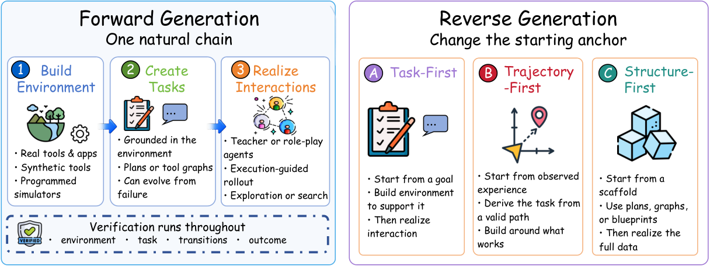

# Daily AI papers — 2026-08-28

*Curated from HF Daily Papers. 12 of ~23 papers kept after relevance filter.*

## Papers at a glance

| # | Title | Topics | Org |
| --- | --- | --- | --- |
| 1 | [Agentic Game Development as a Verifiable Trajectory Data Engine for Scaling World Models](#1-agentic-game-development-rlhev) | `RL`, `world-model`, `agents` | NUS / Shanghai AI Lab |
| 2 | [PAWBench: How Far Are We from Probabilistically Aligned World Modeling?](#2-pawbench) | `eval`, `diffusion`, `world-model` | Shanghai AI Lab / HKU |
| 3 | [TTPO: Test-Time Policy Optimization](#3-ttpo) | `RL`, `reasoning`, `test-time` | Zhejiang U. / Tencent |
| 4 | [Self-OPD: On-Policy Distillation for Flow Matching Models without Teacher](#4-self-opd) | `diffusion`, `flow-matching`, `distillation` | Zhejiang U. / Alibaba |
| 5 | [What Makes Good Agentic Data? An ACE Lens on Data Generation for LLM Agents](#5-ace-lens-on-agentic-data) | `agents`, `data`, `eval` | Huawei Noah's Ark / SJTU |
| 6 | [Training Agents to Evolve with Their Harness: TaoLive Digital Avatar Agent Technical Report](#6-taolive-hat) | `agents`, `RL`, `SFT`, `tech-report` | Taobao / Alibaba |
| 7 | [PILOT in the Loop: Live Self-Improvement for Long-Horizon Agents](#7-pilot-in-the-loop) | `agents`, `self-improvement` | Xiaohongshu / PolyU |
| 8 | [Understanding Evolution Strategies for LLM Reasoning: Broader Reasoning Coverage than GRPO](#8-es-for-llm-reasoning) | `RL`, `reasoning`, `exploration` | Huawei / SUSTech |
| 9 | [WikiSkill: Compiling Agent Experience into Persistent Knowledge for Skill Evolution](#9-wikiskill) | `agents`, `memory`, `self-improvement` | Google / Virginia Tech |
| 10 | [CaSKG: Counterfactual-Causal Skill Graphs for Scalable Agent Skill Retrieval](#10-caskg) | `agents`, `retrieval`, `memory` | JLU / Yale |
| 11 | [CritICL: Inference-Time Weak-to-Strong Generalization from Small Language Model Failure Modes](#11-criticl) | `inference`, `ICL`, `weak-to-strong` | USTC / Tsinghua |
| 12 | [What Does an Evaluation License? A Commit-Bound Census of Claim-Relative Inference in Inspect Evals](#12-inspect-evals-license-census) | `eval`, `methodology` | (independent) |

---

## 1. Agentic Game Development (RLHEV)

**Authors:** Pengfei Zhou, Hexin Wang, Zhengfeiyang Zhang, Yixing Ma, Zhenglin Wan, Kaipeng Zhang, Wangbo Zhao, Yang You — *National University of Singapore / Shanghai AI Lab*
**Links:** [arXiv:2608.25518](https://arxiv.org/abs/2608.25518) · [HF](https://huggingface.co/papers/2608.25518) · [AlphaXiv](https://www.alphaxiv.org/abs/2608.25518)
**Topics:** `RL`, `world-model`, `agents`

### TL;DR

Argues that scaling world models on raw crawled video is inefficient because the reward signals (CLIP-style embedding scores) are fuzzy and biased. Proposes to use interactive game development as a *verifiable execution environment* for RL post-training of spatial world models: the game engine gives dense low-level rewards (collision, physics, navigability, playability), and the human developer supplies terminal accept/reject judgments. The paradigm is called **RLHEV — Reinforcement Learning with Human-Engine Verification**.

### Key idea

Treat the game engine as a compiler-and-runtime for spatial specifications, in the same way code agents use `python` and unit tests as verifiers. The generative model proposes scenes (or scene edits) as agent actions; the engine emits multiple dense reward channels; the human developer's accept/reject decisions provide sparse but high-value trajectory-level rewards. RL trains the world model on the mixed signal.

### Main finding

Positions RLHEV as a data-engine paradigm rather than a benchmark result. The contribution is architectural: a recursive rollout → engine-scoring → human-verification pipeline that generates long-horizon spatial trajectories with grounded rewards, complementing pretraining on passive video.

### Why it matters

Frames a route around the "no verifier for spatial generation" bottleneck that has kept world-model RL post-training marginal. If the recipe scales, spatial models could see the same RLVR-style trajectory that reasoning LLMs took in 2024–2025.

### Knowledge graph integration

**Builds on / relates to existing pages:**
- [../post-training/rlvr.md](../post-training/rlvr.md) — RLHEV is spatial-generation's answer to RLVR: engine playability replaces unit tests as the machine-verifiable signal.
- [../post-training/grpo.md](../post-training/grpo.md) — standard policy optimizer for the mixed dense-engine + sparse-human rewards.
- [../post-training/_rewards.md](../post-training/_rewards.md) — composite reward design (engine channels + human accept/reject).

**Suggested new pages:**
- `post-training/rlhev.md` *(depth)* — RL from Human-Engine Verification: composite rewards from executable spatial specifications.

---

## 2. PAWBench

**Authors:** Yuandong Pu, Le Zhuo, Sayak Paul, Gabriel Jorge Menezes, Avram Đorđević, Shiyang Li, Yifan Zhou, Bin Fu, Wenlong Zhang, Junjun He, Yu Qiao, Yihao Liu, Jingbo Xing, Xi Chen — *Shanghai AI Lab / HKU*
**Links:** [arXiv:2608.27345](https://arxiv.org/abs/2608.27345) · [HF](https://huggingface.co/papers/2608.27345) · [AlphaXiv](https://www.alphaxiv.org/abs/2608.27345)
**Topics:** `eval`, `diffusion`, `world-model`

### TL;DR

A benchmark that treats a video generator not as a "single plausible-video" model but as a **stochastic sampler of world dynamics**: given the same initial frame and action, how well does the distribution over 20 rollouts match a reference distribution over physically-plausible outcomes? Introduces PAWBench (50 scenarios) and an outcome-level scoring protocol PAWEval that discretizes rollout outcomes into physical events and compares empirical to reference probabilities.

### Key idea

Reframe world-model evaluation from per-video plausibility to **distributional matching over outcomes**. Instead of asking "did this one video look real?", they ask "did the model's 20 rollouts recover the correct histogram of physical events?" This turns evaluation into a probability-distribution-comparison problem rather than a per-sample quality problem.

### Main finding

Across 11 current video generators, **no model consistently matches both the reference probabilities and the range of valid behaviors**. Failure modes split into mode collapse (all rollouts pick one outcome) and mis-calibrated tails (many valid outcomes appear, wrong frequencies).

### Why it matters

If world models are meant to be used for planning or model-based RL, distribution fidelity is what matters — a mode-collapsed sampler with high per-frame realism is useless. PAWBench gives that axis a first quantitative reading and shows current systems have significant headroom.

### Knowledge graph integration

**Builds on / relates to existing pages:**
- [../evaluation/README.md](../evaluation/README.md) — new eval axis for the generative-video family.
- [../data/decontamination.md](../data/decontamination.md) — physical-outcome discretization is a related idea: collapse continuous outputs to categorical events for comparison.

**Suggested new pages:**
- `evaluation/pawbench.md` *(depth)* — distributional world-model evaluation via repeated rollouts.

---

## 3. TTPO

**Authors:** Aozhe Wang, Zhengxi Lu, Jianze Wang, Shangke Lv, Ying Liu, Weiming Lu, Jun Xiao, Yueting Zhuang, Hua Yang, Qianglong Chen, Yongliang Shen — *Zhejiang University / Tencent*
**Links:** [arXiv:2608.27448](https://arxiv.org/abs/2608.27448) · [HF](https://huggingface.co/papers/2608.27448) · [AlphaXiv](https://www.alphaxiv.org/abs/2608.27448)
**Topics:** `RL`, `reasoning`, `test-time`

### TL;DR

A **label-free test-time training** procedure for reasoning models. Standard RL / on-policy self-distillation (OPSD) need ground-truth labels; naïvely swapping in majority-vote pseudo-labels is fragile because one wrong vote corrupts every rollout's teacher signal. TTPO's fix is an **asymmetric objective**: distill only the rollouts that *agree* with the majority vote (via OPSD) and RL-penalize only the ones that *disagree* (via grouped RL, GRPO-style), with token-level down-weighting on already-converged positions and only-confident-errors penalization.

### Key idea

Exploit the observation that a rollout disagreeing with the majority vote is almost always wrong, regardless of whether the majority itself is right. That lets you extract a clean training signal even under noisy pseudo-labels: distillation on the (mostly-correct) agreeing branch, RL-penalty on the (mostly-wrong) disagreeing branch, with GRPO-style group normalization gluing the two together.

### Main finding

Without any labels, TTPO **matches label-supervised OPSD** across five competition benchmarks. Raises **Qwen3-1.7B from 38.0% → 45.2%** in test-time training, and yields **+25.2% to +36.4%** in the no-thinking setting. Cross-task generalization is retained.

### Why it matters

Test-time adaptation for reasoning has been mostly majority-vote inference. TTPO shows you can actually *train* at test time from unlabeled inputs without collapsing, and match the labelled ceiling — a plausible ingredient for continual, per-user reasoning improvement.

### Knowledge graph integration

**Builds on / relates to existing pages:**
- [../post-training/grpo.md](../post-training/grpo.md) — the group-relative advantage on the disagreeing branch is GRPO.
- [../post-training/rlvr.md](../post-training/rlvr.md) — replaces the verifier's ground truth with a majority-vote pseudo-label plus asymmetric weighting.
- [../post-training/reasoning/long-cot-rl.md](../post-training/reasoning/long-cot-rl.md) — same objective family, applied at test time.

**Suggested new pages:**
- `post-training/reasoning/ttpo.md` *(depth)* — asymmetric distill-vs-penalize RL for unlabeled test-time training.

---

## 4. Self-OPD

**Authors:** Shiyi Zhang, Mushui Liu, Yunze Tong, Wanggui He, Siyu Zou, Jinlong Liu, Yunlong Yu, Jian Song, Hao Jiang, Pipei Huang, Bo Zheng — *Zhejiang University / Alibaba*
**Links:** [arXiv:2608.26872](https://arxiv.org/abs/2608.26872) · [HF](https://huggingface.co/papers/2608.26872) · [AlphaXiv](https://www.alphaxiv.org/abs/2608.26872)
**Topics:** `diffusion`, `flow-matching`, `distillation`

### TL;DR

On-Policy Distillation (OPD) traditionally needs a specialized teacher per objective, and the teacher-student distribution gap compounds along the generation trajectory. **Self-OPD** replaces the teacher with the student's own stochastic branching: at each timestep, branch the deterministic next-state prediction into K stochastic SDE candidates, roll each out with the ODE sampler, compare rewards to a deterministic self-reference baseline, and update the velocity field with an all-branch attract-repel objective.

### Key idea

Turn the student itself into its own teacher by exploiting stochastic branching over SDE candidates. Advantage is computed against a deterministic self-reference (rather than a separately-trained teacher), and high-advantage branches pull the velocity field toward them while low-advantage branches push it away, with direction-aware attenuation and SDE-variance normalization to keep gradients stable. Multi-objective alignment is done at the reward level rather than the gradient level, sidestepping cross-objective gradient conflict.

### Main finding

Outperforms prior RL and OPD baselines for flow-matching image generation on single- and mixed-reward benchmarks — **without any task-specific teacher model**.

### Why it matters

Teacher-free RL for flow matching removes one of the main costs of aligning diffusion models to task rewards. The self-baseline + branch-attract-repel structure is the diffusion-side echo of GRPO for LLMs (group-relative advantage from student rollouts, no critic), which is a nice cross-modality convergence.

### Knowledge graph integration

**Builds on / relates to existing pages:**
- [../post-training/grpo.md](../post-training/grpo.md) — SDE-branch advantage mirrors GRPO's group-relative-baseline trick, adapted to flow-matching trajectories.
- [../post-training/rejection-sampling.md](../post-training/rejection-sampling.md) — student-only preference selection is a soft, gradient-flavored cousin of rejection sampling.

**Suggested new pages:**
- `post-training/self-opd.md` *(depth)* — teacher-free on-policy distillation for flow-matching models via SDE branching.

---

## 5. ACE Lens on Agentic Data

**Authors:** Xingshan Zeng, Zishan Xu, Boju Zhang, Yuzhou Wu, Lingzhi Wang, Jianghao Lin, Liangyou Li, Yasheng Wang, Lifeng Shang, Xin Jiang, Weinan Zhang, Yong Yu, Qun Liu, Weiwen Liu — *Huawei Noah's Ark / SJTU / CUHK*
**Links:** [arXiv:2608.27260](https://arxiv.org/abs/2608.27260) · [HF](https://huggingface.co/papers/2608.27260) · [AlphaXiv](https://www.alphaxiv.org/abs/2608.27260)
**Topics:** `agents`, `data`, `eval`

### TL;DR

A survey / framework paper that reorganizes agentic-data-generation work along two axes. First: represent every agentic-data pipeline as the tuple **(E, q, τ, v)** — environment spec, task signal, interaction realization, optional verifier. Second: score every pipeline through the **ACE lens** — **A**ccuracy (grounded and consistent), **C**omplexity (relative to a declared learner's capability), and div**E**rsity (coverage and non-redundancy).

### Key idea

Argue that the field's current organization by domain (browser agents, code agents, computer-use) obscures the fact that all pipelines are choosing where on the ACE surface to place their generated data. Make that choice explicit and measurable, and separate the three decisions — how to construct candidates, how to verify them, and how to allocate learning mass — that current work usually conflates.

### Main finding

Reads the literature as trending toward **execution-grounded accuracy** (verifiers replacing surface match), **learner-relative complexity** (data adapted to the declared learner's frontier), and **behavioral-coverage diversity** (rather than surface-token diversity or dataset-size proxies).

### Why it matters

Agent training is bottlenecked by data, and the community has been talking past each other because pipelines look domain-specific. A shared factorization and a normalized scoring axis let people compare pipelines and identify structural gaps (e.g. verifier coverage as a systematic underinvestment).

### Knowledge graph integration

**Builds on / relates to existing pages:**
- [../data/_data-curation.md](../data/_data-curation.md) — extends curation taxonomy from static text to agentic interaction data.
- [../post-training/rl-prompt-curation.md](../post-training/rl-prompt-curation.md) — the "complexity" axis operationalizes the difficulty-calibration side of prompt curation.
- [../agents/README.md](../agents/README.md) — the framework lives in the empty "agent data" slot the folder README calls out.

**Suggested new pages:**
- `agents/_agentic-data.md` *(taxonomy)* — the (E, q, τ, v) factorization and the ACE (Accuracy / Complexity / divErsity) allocation lens.

---

## 6. TaoLive HAT

**Authors:** Yuhan Sun, Wenhao Lin, Yongdong Luo, Yibo Hu, Meiguang Jin, Junfeng Ma, Weihang Pan, Jiaxin Zhao, Zulong Chen — *Taobao / Alibaba*
**Links:** [arXiv:2608.15763](https://arxiv.org/abs/2608.15763) · [HF](https://huggingface.co/papers/2608.15763) · [AlphaXiv](https://www.alphaxiv.org/abs/2608.15763)
**Topics:** `agents`, `RL`, `SFT`, `tech-report`

### TL;DR

Deployment-focused tech report for Taobao Live's digital-avatar streamer agent. Frames the deployment reality of **evolvable harnesses**: skills, hooks, prompts, and tools change independently of model weights, so a compact model trained on a fixed harness overfits and fails when the harness is updated. Introduces **Harness-Aware Training (HAT)**: three-stage recipe (HSA-SFT + on-policy distillation + HSA-RL) with **Harness-State Augmentation** that applies task-preserving perturbations to skill names, tool schemas, prompt structure, and hook functions during training.

### Key idea

Treat the *harness* itself (the surrounding scaffolding: skill IDs, hook code, tool schemas, prompt formats) as a data-augmentation surface. During SFT and RL, permute and rewrite these harness elements while preserving task semantics, so the compact model learns *harness-invariant* tool use rather than the surface strings it happened to see.

### Main finding

On production benchmarks: **94.8 on Live-Stream QA** (base 80.3, strongest general LLM 93.0) and **94.6 on Harness-Variant QA** (base 75.4). Fixed-harness SFT loses **7.7 points** on IFEval vs the base model; HAT avoids the regression and reaches **83.5**. Latency on one H20: **P50 3.4 s, P95 8.1 s**. Deployed live in Taobao Live with positive A/B lift on GMV and item-page views.

### Why it matters

Agentic systems in production get updated much more often than model weights do — the harness churn is a real deployment problem. HAT is a concrete, deployed answer to it, and the augmentation-based fix is broadly applicable to any agent trained against a specific tool/prompt layout.

### Knowledge graph integration

**Builds on / relates to existing pages:**
- [../post-training/rlvr.md](../post-training/rlvr.md) — HSA-RL uses verifiable production task signals as the reward.
- [../post-training/grpo.md](../post-training/grpo.md) — RL stage of the recipe.
- [../post-training/_post-training.md](../post-training/_post-training.md) — three-stage SFT → distillation → RL is a canonical post-training shape here specialized to agents.
- [../agents/README.md](../agents/README.md) — first agent-training case study for the folder.

**Suggested new pages:**
- `agents/harness-aware-training.md` *(depth)* — HAT recipe and the Harness-State Augmentation trick.
- `case-studies/taolive-hat.md` *(case study)* — the end-to-end deployed agent system.

---

## 7. PILOT in the Loop

**Authors:** Yang Xiao, Yusong Sun, Haoyi Wu, Wenyang Hui, Wen Da, Zhaokai Luo, Mu Chuan, Yao Hu, Wenjie Li, Chengyue Jiang — *Xiaohongshu / Hong Kong Polytechnic University*
**Links:** [arXiv:2608.26530](https://arxiv.org/abs/2608.26530) · [HF](https://huggingface.co/papers/2608.26530) · [AlphaXiv](https://www.alphaxiv.org/abs/2608.26530)
**Topics:** `agents`, `self-improvement`

### TL;DR

Existing agent self-improvement methods look at trajectories only *after* execution ends. **PILOT** is a supervisor-worker harness that runs a separate supervisor concurrent with the worker and does two things live: (1) **live steering** — the supervisor can redirect or abort the active worker mid-run, and (2) **live self-evolution** — the harness distills procedures and failure modes revealed during the current run into reusable skills and memory that are immediately available.

### Key idea

Separate execution from assessment across two agents so that assessment can affect the run in progress, rather than only being harvested for the next run. Coupled with an immediately-updatable skill/memory store, the same run both benefits from and contributes to the persistent harness.

### Main finding

Ranks first in **5 of 6** frozen-backbone × benchmark configurations. On Terminal-Bench 2.0, up to **+9.8 pp** over counterpart harnesses. In the self-improvement setting: **+14.6 pts with GLM-5.1**, **+12.4 pts with Kimi-K2.6**. Mean output tokens fall **42.9–47.4%** while successful evaluations per million tokens rise **110–134%**.

### Why it matters

Most self-improving-agent work has been off-policy (learn from finished trajectories). PILOT is a concrete architecture for making self-improvement *on-policy at run time*, which is the more useful operating mode for long-horizon tasks that can be salvaged mid-run.

### Knowledge graph integration

**Builds on / relates to existing pages:**
- [../agents/README.md](../agents/README.md) — supervisor-worker is a new agent-architecture pattern for the folder.
- [../post-training/reasoning/long-cot-rl.md](../post-training/reasoning/long-cot-rl.md) — live steering is a distant cousin of self-reflection during CoT, but externalized to a second agent.

**Suggested new pages:**
- `agents/pilot-supervisor-worker.md` *(depth)* — live steering + live self-evolution supervisor-worker harness.

---

## 8. ES for LLM Reasoning

**Authors:** Yunpeng Ba, Zhi Zheng, Yue Xie, Jiaqing Li, Xialiang Tong, Tao Zhong, Mingxuan Yuan, Zhichao Lu, Xuyang Wu, Zhenkun Wang — *Huawei Noah's Ark / SUSTech / CityU HK*
**Links:** [arXiv:2608.27351](https://arxiv.org/abs/2608.27351) · [HF](https://huggingface.co/papers/2608.27351) · [AlphaXiv](https://www.alphaxiv.org/abs/2608.27351)
**Topics:** `RL`, `reasoning`, `exploration`

### TL;DR

Systematically studies **Evolution Strategies (ES)** as a post-training alternative to GRPO for reasoning. Shows theoretically and empirically that ES produces **broader reasoning coverage** (more distinct reasoning modes) than GRPO by better preserving policy diversity, and that this maps to higher pass@k and less entropy collapse. Also analyzes parameter drift, hyperparameter sensitivity, and where each paradigm wins.

### Key idea

ES perturbs *weights* rather than sampling *actions*, so its exploration operator is orthogonal to token-space rollouts. This gives it a different diversity dynamic than GRPO — instead of collapsing onto the highest-mean-reward mode over training, ES retains multiple modes because each perturbation is a coherent behavioral perturbation of the whole policy.

### Main finding

ES achieves broader reasoning coverage than GRPO across their reasoning benchmarks, at comparable memory cost. Diagnoses GRPO's entropy collapse and parameter-drift patterns as the mechanistic drivers of narrower coverage, and identifies hyperparameter regimes where ES wins.

### Why it matters

Reasoning-RL post-training has effectively been mono-cultured to GRPO for two years. This paper is the first careful side-by-side of ES with a mechanistic account of *why* the two differ. Even if ES doesn't dislodge GRPO as the default, the coverage-vs-sharpening axis is a useful frame.

### Knowledge graph integration

**Builds on / relates to existing pages:**
- [../post-training/grpo.md](../post-training/grpo.md) — the direct comparison baseline; the paper's mechanistic account of entropy collapse maps to gotchas already listed there.
- [../post-training/_rl.md](../post-training/_rl.md) — extends the RL taxonomy with a non-policy-gradient variant.
- [../post-training/reasoning/long-cot-rl.md](../post-training/reasoning/long-cot-rl.md) — same setting, different optimizer.

**Suggested new pages:**
- `post-training/evolution-strategies-llm.md` *(depth)* — ES for reasoning post-training; weight-space perturbation as an alternative exploration mechanism.

---

## 9. WikiSkill

**Authors:** Liyan Tang, Cyrus Rashtchian, Chun-Sung Ferng, Andrew Tomkins, Da-Cheng Juan, Tu Vu — *Google Research / Virginia Tech*
**Links:** [arXiv:2608.27454](https://arxiv.org/abs/2608.27454) · [HF](https://huggingface.co/papers/2608.27454) · [AlphaXiv](https://www.alphaxiv.org/abs/2608.27454)
**Topics:** `agents`, `memory`, `self-improvement`

### TL;DR

Agent-skill libraries usually let insights die inside optimization histories. **WikiSkill** co-evolves an agent's skills with a persistent **wiki** (knowledge base) that accumulates cross-iteration insights, and separates three layers explicitly: raw execution experience, accumulated wiki knowledge, and executable skills. Subsequent skill updates read from the wiki.

### Key idea

Introduce a persistent, human-readable intermediate representation (the wiki) between raw traces and executable skills, so that lessons learned in iteration *N* can be reused in iteration *N+k* even after the skills themselves have been rewritten. Ablations show the wiki is the critical ingredient.

### Main finding

Consistently outperforms state-of-the-art skill-evolution methods across benchmarks and models. Larger models benefit more from evolved skills. **Skills transfer across models and families**, and skills evolved by *another* model can outperform self-evolved skills.

### Why it matters

Cross-model skill transfer is a strong positive result: it implies the skills capture task structure rather than model-specific idiosyncrasies, which is exactly what you want if you're maintaining an agent stack across model upgrades.

### Knowledge graph integration

**Builds on / relates to existing pages:**
- [../agents/README.md](../agents/README.md) — fills the "agent skill library" slot the folder anticipates.

**Suggested new pages:**
- `agents/skill-evolution.md` *(depth)* — persistent-wiki-plus-executable-skills three-layer memory architecture.

---

## 10. CaSKG

**Authors:** Zhiyuan Li, Linyuan Gao, Xuechun Ding, Hongwei Chen, Yuan Wu, Yi Chang — *Jilin University / Yale*
**Links:** [arXiv:2608.25500](https://arxiv.org/abs/2608.25500) · [HF](https://huggingface.co/papers/2608.25500) · [AlphaXiv](https://www.alphaxiv.org/abs/2608.25500)
**Topics:** `agents`, `retrieval`, `memory`

### TL;DR

For agents with reusable skill libraries, prompt-all is expensive, vector retrieval is workflow-blind, and graph retrieval relies on edges being trustworthy. **CaSKG** builds a directed candidate graph from semantic/lexical/IO/structural evidence, then **calibrates each edge with a counterfactual probe** — removing, substituting, or reordering the skill pair and watching what happens — and aggregates with Bayesian smoothing before publishing a state-filtered weighted graph.

### Key idea

Use counterfactual textual probes as an *offline* edge-confidence calibrator for a skill graph, so that at retrieval time the graph's edges reliably reflect procedural relations (prerequisites, verification steps, completion). The graph is built once and used without touching the downstream policy.

### Main finding

Top task score in **12/12** model × benchmark combinations on ALFWorld ID-140 and ScienceWorld U211. Vs Graph-of-Skills (GoS): six-model macro-average **72.62 → 80.50** on ScienceWorld, **80.01% → 86.79%** ALFWorld success, with fewer environment steps.

### Why it matters

Skill libraries are becoming the standard memory for agentic systems. CaSKG shows that spending compute *offline* on edge calibration is much cheaper than the alternative (full-library prompting) and much more reliable (than raw graph retrieval), and lands the trade-off well.

### Knowledge graph integration

**Builds on / relates to existing pages:**
- [../agents/README.md](../agents/README.md) — skill-retrieval architecture for agents.

**Suggested new pages:**
- `agents/skill-graph-retrieval.md` *(depth)* — counterfactual-calibrated skill graphs (CaSKG-style) as an agent-memory retrieval architecture.

---

## 11. CritICL

**Authors:** Yufan Wu, Yinghui He, Zhengyi Hu, Lang Wei, Ruichen Li, Qifan Yang, Ting Zhu — *USTC / Tsinghua*
**Links:** [arXiv:2608.27455](https://arxiv.org/abs/2608.27455) · [HF](https://huggingface.co/papers/2608.27455) · [AlphaXiv](https://www.alphaxiv.org/abs/2608.27455)
**Topics:** `inference`, `ICL`, `weak-to-strong`

### TL;DR

Rather than doing test-time scaling by generating many responses and picking one, **CritICL** improves reasoning by feeding **critiques of a weaker model's failure modes** to a stronger model as in-context examples. Two variants: **CritICL-dynamic** predicts input-specific failure modes and retrieves the matching critiques; **CritICL-static** uses a global failure-mode profile.

### Key idea

Structured LLM failures are family-transferable: a small model in a family systematically fails in ways that a larger model in the same family also has a tendency to slip toward. Feeding critiques of those slips into the larger model's context nudges it away from the same pit — a lightweight "weak-to-strong" signal delivered entirely at inference time.

### Main finding

Consistently beats standard ICL and matches or beats test-time scaling methods, at **significantly fewer generations and lower token cost**.

### Why it matters

Sits in an interesting spot in the test-time-scaling literature: extracts a real signal from *cheap weak model outputs* to guide a stronger model, without any training. Complementary to majority-vote and self-consistency, and much cheaper than either.

### Knowledge graph integration

**Builds on / relates to existing pages:**
- [../post-training/cot-reward-model.md](../post-training/cot-reward-model.md) — critique-based ICL is inference-time cousin of critique-based reward models.
- [../inference/README.md](../inference/README.md) — new inference-time reasoning-boost primitive.
- [../post-training/reasoning/long-cot-rl.md](../post-training/reasoning/long-cot-rl.md) — motivates the failure-mode structure the paper exploits.

**Suggested new pages:**
- `inference/criticl.md` *(depth)* — critique-based ICL from weaker-model failure modes.

---

## 12. Inspect Evals License Census

**Authors:** Xi Qin — *(independent)*
**Links:** [arXiv:2608.19269](https://arxiv.org/abs/2608.19269) · [HF](https://huggingface.co/papers/2608.19269) · [AlphaXiv](https://www.alphaxiv.org/abs/2608.19269)
**Topics:** `eval`, `methodology`

*Borderline: included because the argument — that an "eval" is not the same as a "claim the eval licenses" — is directly relevant to reward and benchmark hygiene in the graph.*

### TL;DR

Argues that an evaluation task + scorer + metric does not automatically license the *claim* attached to that metric, because the historical evidence and alternative semantics needed to replay the claim may be unbound. Formalizes a "claim-replay" layer (substrate D, family F, claim query q, identified set) and runs it as a commit-bound census over **all 124 mechanically eligible Inspect Evals units** at a pinned commit.

### Key idea

Separate "the eval computes a number" from "the number licenses a claim." Force every claim to a typed disposition: deterministically-replayable, or a specific typed stop (unbound history, missing semantic grounding, etc.). The output is an audit of what current eval suites can and cannot actually assert.

### Main finding

Of 124 units, **110 stop before deterministic inference** because required historical evidence or semantic grounding is unavailable. Only 14 close deterministically; among those, exact values, winners, orders, and pairwise relations separate cleanly by claim resolution.

### Why it matters

Every reasoning/agent paper that cites an Inspect Evals result implicitly assumes the eval licenses its headline claim. This census suggests the assumption fails 89% of the time in one canonical suite, which is a big deal for how the field reads its own leaderboards.

### Knowledge graph integration

**Builds on / relates to existing pages:**
- [../evaluation/README.md](../evaluation/README.md) — a methodology critique of an eval suite the folder implicitly depends on.
- [../data/decontamination.md](../data/decontamination.md) — same underlying concern (are the numbers really about what we think they're about) from a data-provenance angle.

*No new page suggested — the paper is a critique of methodology rather than a new technique.*

---

## Notes

- Borderline inclusions are flagged in-section with an italic *Borderline: …* note.
- Hero figures live in `assets/2026-08-28/`. Only one figure (paper #5, ACE Lens) downloaded successfully — arXiv HTML figures were 404 or not-yet-rendered for the other 11 papers on this date. Missing figures were dropped rather than shown as broken references.
- This digest is informational. No existing concept files, `READING-LIST.md`, or `PAPERS.md` were modified to produce it.
