# Daily AI papers — 2026-08-30

*Curated from HF Daily Papers. 15 of 23 papers kept after relevance filter.*

## Papers at a glance

| # | Title | Topics | Org |
| --- | --- | --- | --- |
| 1 | [Agentic Game Development as a Verifiable Trajectory Data Engine for Scaling World Models](#1-agentic-game-development-rlhev) | `world-models`, `RL`, `agents` | NUS / Shanghai AI Lab |
| 2 | [PAWBench: How Far Are We from Probabilistically Aligned World Modeling?](#2-pawbench) | `world-models`, `eval`, `diffusion` | Shanghai AI Lab / HKUST |
| 3 | [TTPO: Test-Time Policy Optimization](#3-ttpo) | `RL`, `reasoning`, `test-time` | Zhejiang University |
| 4 | [Self-OPD: On-Policy Distillation for Flow Matching Models without Teacher](#4-self-opd) | `diffusion`, `RL`, `distillation` | Alibaba |
| 5 | [What Makes Good Agentic Data? An ACE Lens on Data Generation for LLM Agents](#5-ace-agentic-data) | `agents`, `data`, `LLM` | Huawei Noah's Ark |
| 6 | [GameWAM: A World Action Model for Video Games](#6-gamewam) | `world-models`, `agents`, `multimodal` | Sun Yat-sen University |
| 7 | [PILOT in the Loop: Live Self-Improvement for Long-Horizon Agents](#7-pilot) | `agents`, `LLM` | Xiaohongshu / SIST |
| 8 | [WikiSkill: Compiling Agent Experience into Persistent Knowledge for Skill Evolution](#8-wikiskill) | `agents`, `LLM` | Google / Virginia Tech |
| 9 | [Zero-WAM: In-Context World-Action Modeling from Human Videos for Open-Ended Task Generalization](#9-zero-wam) | `world-models`, `agents`, `multimodal` | HKUST / Ant Group |
| 10 | [Understanding Evolution Strategies for LLM Reasoning: Broader Reasoning Coverage than GRPO](#10-es-vs-grpo) | `RL`, `reasoning` | Huawei Noah's Ark / CityU |
| 11 | [CritICL: Inference-Time Weak-to-Strong Generalization from Small Language Model Failure Modes](#11-criticl) | `reasoning`, `LLM`, `test-time` | Univ. of Delaware |
| 12 | [CaRGo-T: Causal Reasoning Graph-of-Thought improves Multimodal Humor Comprehension](#12-cargo-t) | `multimodal`, `reasoning` | IIT Kharagpur |
| 13 | [CaSKG: Counterfactual-Causal Skill Graphs for Scalable Agent Skill Retrieval](#13-caskg) | `agents`, `LLM` | Jilin University |
| 14 | [Aphanta: Diagnosing Task-Aligned Image-Edited Intermediates for Multimodal Reasoning](#14-aphanta) | `multimodal`, `reasoning`, `eval` | StepFun |
| 15 | [What Does an Evaluation License? A Commit-Bound Census of Claim-Relative Inference in Inspect Evals](#15-eval-license) | `eval`, `safety` | Independent |

---

## 1. Agentic Game Development as a Verifiable Trajectory Data Engine for Scaling World Models {#1-agentic-game-development-rlhev}

**Authors:** Pengfei Zhou, Hexin Wang, Zhengfeiyang Zhang, Yixing Ma, Zhenglin Wan, Kaipeng Zhang, Wangbo Zhao, Yang You — *NUS / Shanghai AI Lab*
**Links:** [arXiv:2608.25518](https://arxiv.org/abs/2608.25518) · [HF](https://huggingface.co/papers/2608.25518) · [AlphaXiv](https://www.alphaxiv.org/abs/2608.25518)
**Topics:** `world-models`, `RL`, `agents`, `data`

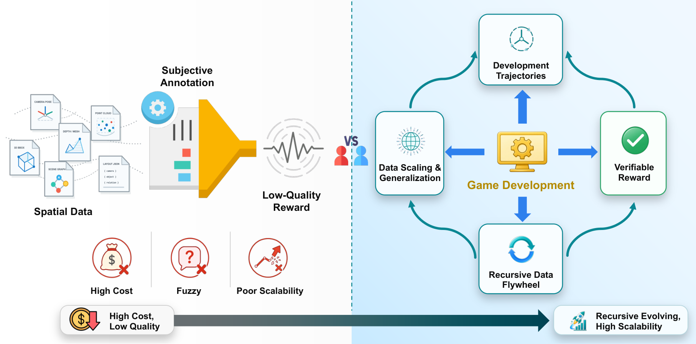

### TL;DR

World models trained by scraping more video hit a wall because CLIP-style rewards are too fuzzy for RL post-training. The authors reframe game development as a data engine: a game engine is an executable world spec, so collision, physics, navigability and playability checks give dense verifiable rewards, and human developer acceptance provides a global signal. They train with a new paradigm, RLHEV (Reinforcement Learning with Human-Engine Verification).

### Key idea

**RLHEV** combines *dense engine rewards* (compiler-like checks for spatial constraints) with *implicit human acceptance* from the actual development workflow. The engine acts like a code interpreter for spatial generation — verifying whether a scene is physically valid rather than "looks plausible."

### Main finding

Trajectory data from game-development sessions supplies both long-horizon rollouts and per-step verifiable rewards, closing the "reward gap" that has held back spatial world-model RL.

### Why it matters

Spatial generation has lacked the verifier equivalent of a code compiler. Anchoring world-model RL in a game engine gives the field a scalable, cheap, ground-truth reward source — the same recipe that made RLVR work for code and math.

### Knowledge graph integration

**Builds on / relates to existing pages:**
- [rlvr.md](../post-training/rlvr.md) — RLHEV is the spatial analogue of RLVR, swapping the verifier
- [_rl.md](../post-training/_rl.md) — new post-training paradigm to slot into the RL taxonomy
- [_rewards.md](../post-training/_rewards.md) — engine + human as reward source

**Suggested new pages:**
- `post-training/rlhev.md` *(depth)* — RL with engine + human verification
- `agents/_world-models.md` *(taxonomy)* — currently no world-models coverage in the graph

---

## 2. PAWBench: How Far Are We from Probabilistically Aligned World Modeling? {#2-pawbench}

**Authors:** Yuandong Pu, Le Zhuo, Sayak Paul, Yifan Zhou, et al. — *Shanghai AI Lab / HKUST*
**Links:** [arXiv:2608.27345](https://arxiv.org/abs/2608.27345) · [HF](https://huggingface.co/papers/2608.27345) · [AlphaXiv](https://www.alphaxiv.org/abs/2608.27345)
**Topics:** `world-models`, `eval`, `diffusion`

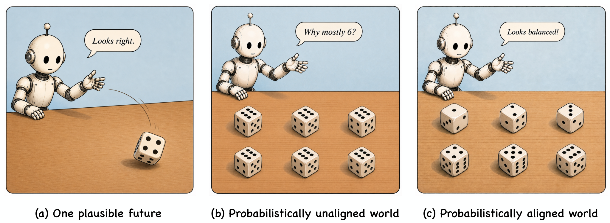

### TL;DR

Video generators pitched as world models are almost always evaluated on single-video plausibility. But physical processes are stochastic — a dropped ball might bounce left or right. The paper formalizes **probabilistic alignment** (distribution over rollouts must match reality) and builds PAWBench + PAWEval to measure it via repeated sampling.

### Key idea

Instead of scoring one generated video, sample N videos from the same initial condition and compare the *empirical distribution* of outcomes to a reference distribution. PAWEval converts video rollouts to outcome distributions over categorical physical events.

### Main finding

Across 50 scenarios and 11 current video-generation systems, **no model consistently matches reference probabilities** while covering the full valid outcome range. Prompts, noise seeds, and further training all partially reshape the distribution but none close the gap.

### Why it matters

If world models are meant to power planning or simulation, single-shot plausibility is the wrong metric. PAWBench gives the field a distributional yardstick, and reveals that current video models collapse onto a narrow mode rather than modeling stochastic physics.

### Knowledge graph integration

**Builds on / relates to existing pages:**
- [evaluation/README.md](../evaluation/README.md) — benchmark for generative world models

**Suggested new pages:**
- `evaluation/pawbench.md` *(depth)* — probabilistic-alignment benchmark for video world models
- `multimodal/video-world-models.md` *(depth)* — video-as-world-model class

---

## 3. TTPO: Test-Time Policy Optimization {#3-ttpo}

**Authors:** Aozhe Wang, Zhengxi Lu, Jianze Wang, Weiming Lu, Qianglong Chen, Yongliang Shen, et al. — *Zhejiang University*
**Links:** [arXiv:2608.27448](https://arxiv.org/abs/2608.27448) · [HF](https://huggingface.co/papers/2608.27448) · [AlphaXiv](https://www.alphaxiv.org/abs/2608.27448)
**Topics:** `RL`, `reasoning`, `test-time`

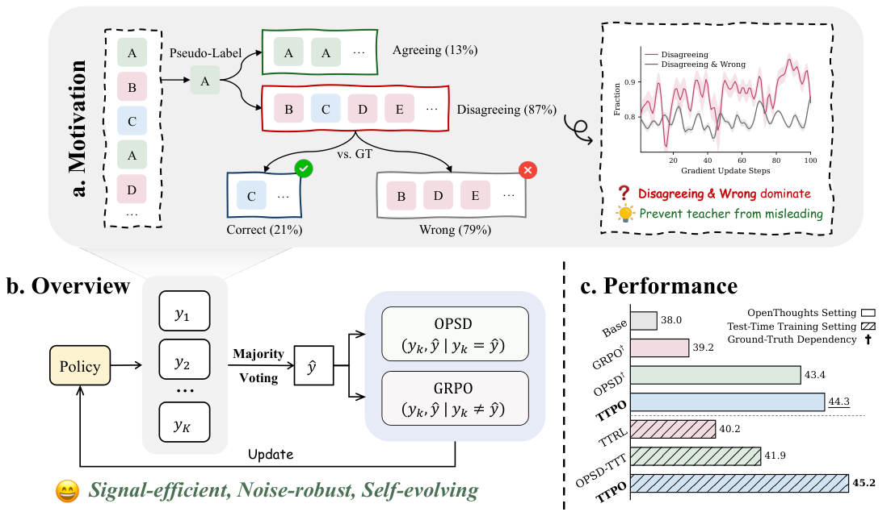

### TL;DR

Standard post-training (RL, on-policy self-distillation) needs ground-truth labels, which blocks true test-time training. TTPO removes the label dependency by combining self-distillation with RL asymmetrically — the model teaches itself at inference time.

### Key idea

Asymmetric hybrid of distillation and RL: strong reasoning branches supervise weaker ones on the fly, giving RL-style updates during inference without a labeled reward signal. The recipe is designed to prevent the entropy collapse typical of pure self-training.

### Main finding

TTPO matches label-supervised post-training on competition-level math benchmarks despite receiving no ground-truth signal at test time.

### Why it matters

Test-time training has been mostly limited to small vision models. If this scales, models can adapt to hard prompts at inference without any offline labeled data — extending the "compute at inference" story beyond majority voting and best-of-N.

### Knowledge graph integration

**Builds on / relates to existing pages:**
- [grpo.md](../post-training/grpo.md) — TTPO borrows the group-based advantage estimator
- [rejection-sampling.md](../post-training/rejection-sampling.md) — label-free self-supervision lineage
- [long-cot-rl.md](../post-training/reasoning/long-cot-rl.md) — targets the same reasoning regime

**Suggested new pages:**
- `post-training/reasoning/ttpo.md` *(depth)* — test-time policy optimization
- `inference/_test-time-training.md` *(taxonomy)* — TTT variants for LLMs

---

## 4. Self-OPD: On-Policy Distillation for Flow Matching Models without Teacher {#4-self-opd}

**Authors:** Shiyi Zhang, Mushui Liu, Yunze Tong, Wanggui He, Yunlong Yu, Hao Jiang, Bo Zheng, et al. — *Alibaba*
**Links:** [arXiv:2608.26872](https://arxiv.org/abs/2608.26872) · [HF](https://huggingface.co/papers/2608.26872) · [AlphaXiv](https://www.alphaxiv.org/abs/2608.26872)
**Topics:** `diffusion`, `RL`, `distillation`, `flow-matching`

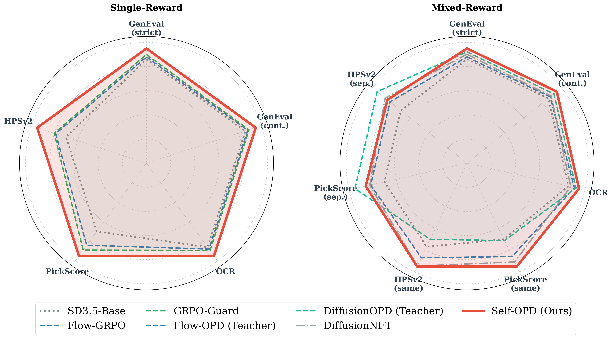

### TL;DR

On-policy distillation for flow-matching / diffusion models normally needs a task-specific teacher, and student–teacher distribution drift compounds errors along the trajectory. Self-OPD drops the teacher entirely: the student branches its own next-state prediction into K stochastic SDE candidates, scores them against a deterministic self-reference, and updates from the normalized advantages.

### Key idea

At each timestep, branch the ODE step into K SDE rollouts, compute rewards, subtract the deterministic self-baseline, and apply a **pull–push velocity-field update**: attract toward high-advantage branches, repel from low ones, with direction-aware attenuation and SDE-variance normalization. For multi-objective alignment, fuse rewards at the reward level rather than the gradient level.

### Main finding

On both single- and mixed-reward benchmarks, Self-OPD outperforms prior RL and OPD baselines for flow-matching without needing a specialized teacher per task.

### Why it matters

Flow-matching alignment has been bottlenecked by teacher cost and drift. A GRPO-style self-baseline for continuous-time generative models makes on-policy alignment tractable for image / video generation.

### Knowledge graph integration

**Builds on / relates to existing pages:**
- [grpo.md](../post-training/grpo.md) — group-relative advantage pattern transferred to flow matching
- [_rl.md](../post-training/_rl.md) — new RL variant

**Suggested new pages:**
- `multimodal/flow-matching.md` *(depth)* — the underlying generative framework (gap in graph)
- `post-training/self-opd.md` *(depth)* — teacher-free on-policy distillation for flow models

---

## 5. What Makes Good Agentic Data? An ACE Lens on Data Generation for LLM Agents {#5-ace-agentic-data}

**Authors:** Xingshan Zeng, Zishan Xu, Boju Zhang, Yasheng Wang, Lifeng Shang, Xin Jiang, Qun Liu, Weiwen Liu, et al. — *Huawei Noah's Ark Lab*
**Links:** [arXiv:2608.27260](https://arxiv.org/abs/2608.27260) · [HF](https://huggingface.co/papers/2608.27260) · [AlphaXiv](https://www.alphaxiv.org/abs/2608.27260)
**Topics:** `agents`, `data`, `LLM`

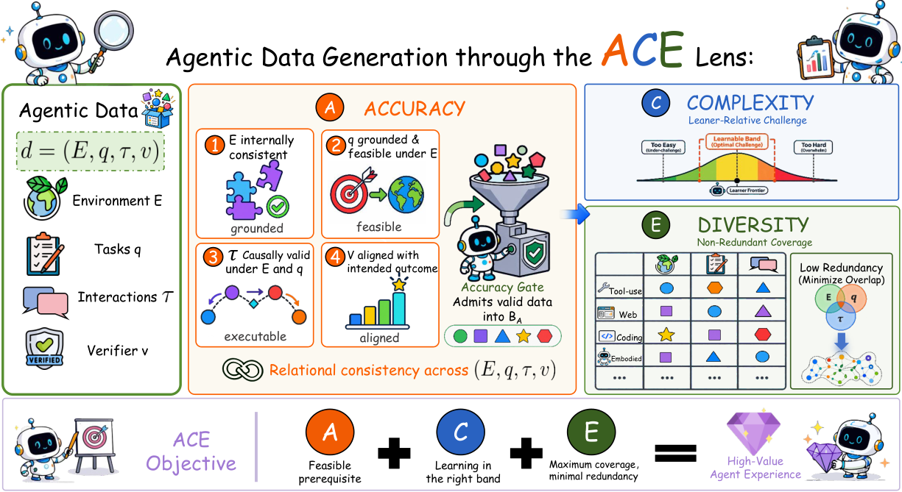

### TL;DR

Post-training LLM agents depends on synthetic interaction data, but nobody agrees on what makes it *good*. The paper formalizes agentic data as tuples `(E, q, τ, v)` (environment, query, trajectory, success signal) and organizes existing generation paradigms along three axes: **Accuracy, Complexity, divErsity** (ACE).

### Key idea

Rather than generating "more" trajectories, allocate along the ACE frontier: accurate (grounded in real environment feedback), complex (multi-step / branching), diverse (non-redundant across queries and environments). The ACE lens lets you diagnose which axis a generator is starving.

### Main finding

A survey / framework paper — the contribution is the taxonomy and its use in comparing existing agentic-data pipelines rather than a specific benchmark number.

### Why it matters

Agent post-training data is the current bottleneck. A shared vocabulary for "informative" data lets teams stop competing on volume and start optimizing the mix.

### Knowledge graph integration

**Builds on / relates to existing pages:**
- [_data-curation.md](../data/_data-curation.md) — extends curation thinking to agent trajectories
- [agents/README.md](../agents/README.md) — first structured take on agent-data quality in the graph

**Suggested new pages:**
- `agents/_agentic-data.md` *(taxonomy)* — ACE dimensions for agent trajectory data
- `data/synthetic-agent-trajectories.md` *(depth)* — trajectory synthesis recipes

---

## 6. GameWAM: A World Action Model for Video Games {#6-gamewam}

**Authors:** Yuncheng Guo, Zhanqiu Zhang, Yiwen Guo, Weijia Li — *Sun Yat-sen University*
**Links:** [arXiv:2608.26200](https://arxiv.org/abs/2608.26200) · [HF](https://huggingface.co/papers/2608.26200) · [AlphaXiv](https://www.alphaxiv.org/abs/2608.26200)
**Topics:** `world-models`, `agents`, `multimodal`

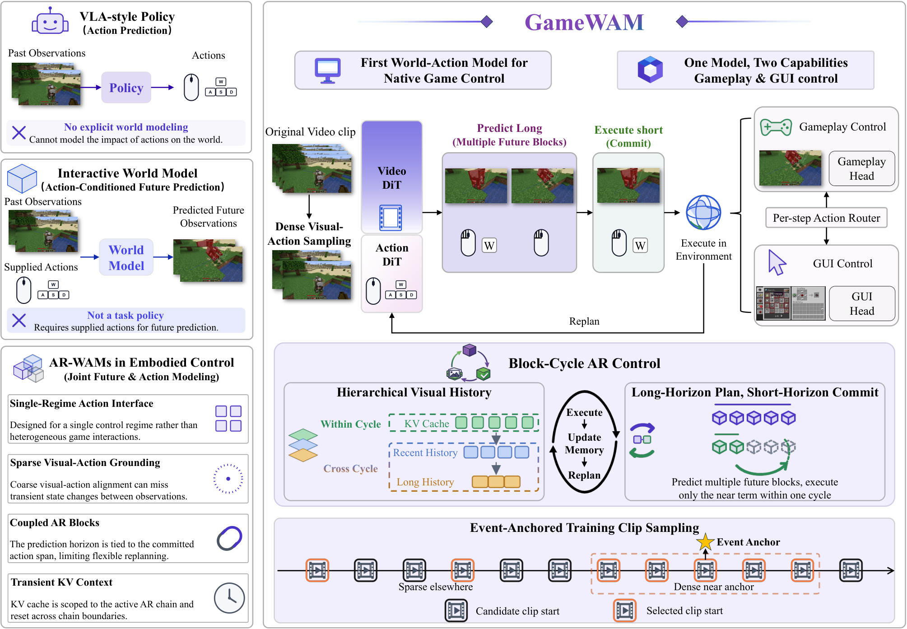

### TL;DR

Game agents map perception → action but ignore dynamics; game world models predict futures given actions but can't act. **World-Action Models (WAMs)** unify both: one model predicts the next frame *and* the next action jointly. GameWAM is the first WAM tuned for native closed-loop gameplay with heterogeneous GUI controls.

### Key idea

Parallel visual + action generation with mode-specific action heads for keyboard / mouse / menu, plus a long-horizon strategy that prevents "**Low-Frequency Action Source Imprinting**" — the model over-copying frequent-action prototypes and forgetting rare ones.

### Main finding

Closes the perception-vs-dynamics split for game agents; identifies and diagnoses the low-frequency-action imprinting failure mode as an obstacle to open-ended gameplay.

### Why it matters

WAMs are a plausible next step for embodied agents: predicting-your-own-outcome doubles as planning and doubles as a training signal. Games are the natural testbed because they give perfect state and cheap rollouts.

### Knowledge graph integration

**Builds on / relates to existing pages:**
- [agents/README.md](../agents/README.md) — GUI/game agent line
- [multimodal/README.md](../multimodal/README.md) — vision + action generation

**Suggested new pages:**
- `agents/_world-models.md` *(taxonomy)* — WAM vs pure-generator vs pure-agent
- `agents/gamewam.md` *(depth)* — GameWAM architecture and action mode heads

---

## 7. PILOT in the Loop: Live Self-Improvement for Long-Horizon Agents {#7-pilot}

**Authors:** Yang Xiao, Yusong Sun, Haoyi Wu, Yao Hu, Wenjie Li, Chengyue Jiang, et al. — *Xiaohongshu / ShanghaiTech*
**Links:** [arXiv:2608.26530](https://arxiv.org/abs/2608.26530) · [HF](https://huggingface.co/papers/2608.26530) · [AlphaXiv](https://www.alphaxiv.org/abs/2608.26530)
**Topics:** `agents`, `LLM`

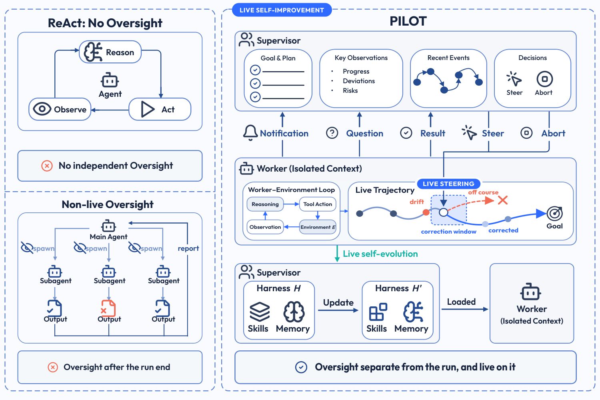

### TL;DR

Long-horizon agents only self-improve after the run ends, so they can't fix an active run they're currently getting wrong. PILOT is a supervisor–worker harness that redirects the worker mid-run and, when useful lessons appear, distills them into reusable skills immediately.

### Key idea

Two coupled loops: **live steering** (a supervisor process can abort or redirect the worker at any point) and **live self-evolution** (procedures and failure modes surfaced during execution get compiled into new skills / memory entries the same run can use).

### Main finding

Framework paper for in-run agent self-improvement, contrasted against post-hoc-only self-improvement methods; the specific benchmark numbers are in the paper's tables.

### Why it matters

For very long agent runs (browser tasks, computer use, coding), post-hoc improvement is too late — the run is already burned. Live steering gives agent harnesses a saveable middle option: catch bad trajectories early and re-plan.

### Knowledge graph integration

**Builds on / relates to existing pages:**
- [agents/README.md](../agents/README.md) — agent harness / supervisor design

**Suggested new pages:**
- `agents/live-self-improvement.md` *(depth)* — supervisor-driven in-run correction and skill distillation
- `agents/_agent-harness.md` *(taxonomy)* — harness architectures for long-horizon agents

---

## 8. WikiSkill: Compiling Agent Experience into Persistent Knowledge for Skill Evolution {#8-wikiskill}

**Authors:** Liyan Tang, Cyrus Rashtchian, Chun-Sung Ferng, Andrew Tomkins, Da-Cheng Juan, Tu Vu — *Google / Virginia Tech*
**Links:** [arXiv:2608.27454](https://arxiv.org/abs/2608.27454) · [HF](https://huggingface.co/papers/2608.27454) · [AlphaXiv](https://www.alphaxiv.org/abs/2608.27454)
**Topics:** `agents`, `LLM`

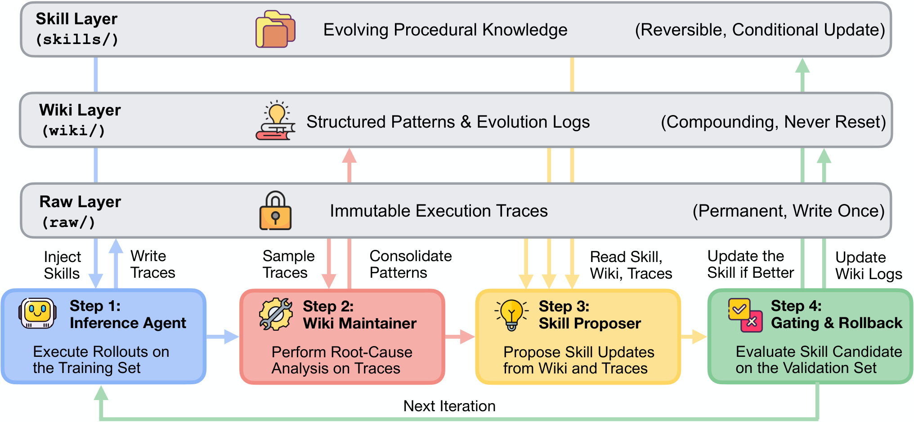

### TL;DR

Auto-generated agent skills capture procedures, but the *insights* behind them get lost across iterations. WikiSkill splits agent memory into three tiers — raw experience, accumulated knowledge (wiki), executable skills — and iterates all three together, using the wiki as durable ground.

### Key idea

A persistent **wiki** sits between raw episodes and reusable skills: experience is continuously distilled into wiki articles, and new skill updates read the wiki rather than the raw log. Skills evolve on top of stable, human-readable knowledge rather than an ever-growing trace.

### Main finding

Consistently beats prior skill-evolution methods; small models with evolved skills often outperform larger models without them; skills transfer across model families; ablations confirm the wiki tier is the critical component.

### Why it matters

Agent memory has been either "put everything in context" or "put embeddings in a vector DB." A curated wiki tier fits how humans actually accumulate procedural knowledge — refactor, generalize, cross-reference — and shows clear transfer.

### Knowledge graph integration

**Builds on / relates to existing pages:**
- [agents/README.md](../agents/README.md) — agent memory / skill libraries
- [_data-curation.md](../data/_data-curation.md) — curation applied to agent experience

**Suggested new pages:**
- `agents/skill-evolution.md` *(depth)* — WikiSkill wiki + skill co-evolution
- `agents/_agent-memory.md` *(taxonomy)* — memory tiers for agents (context, vector, wiki, skill)

---

## 9. Zero-WAM: In-Context World-Action Modeling from Human Videos for Open-Ended Task Generalization {#9-zero-wam}

**Authors:** Jiaming Zhou, Qihang Zhang, Gangwei Xu, Yiming Luo, Yujun Shen, Junwei Liang, Yinghao Xu, et al. — *HKUST / Ant Group*
**Links:** [arXiv:2608.26103](https://arxiv.org/abs/2608.26103) · [HF](https://huggingface.co/papers/2608.26103) · [AlphaXiv](https://www.alphaxiv.org/abs/2608.26103)
**Topics:** `world-models`, `agents`, `multimodal`

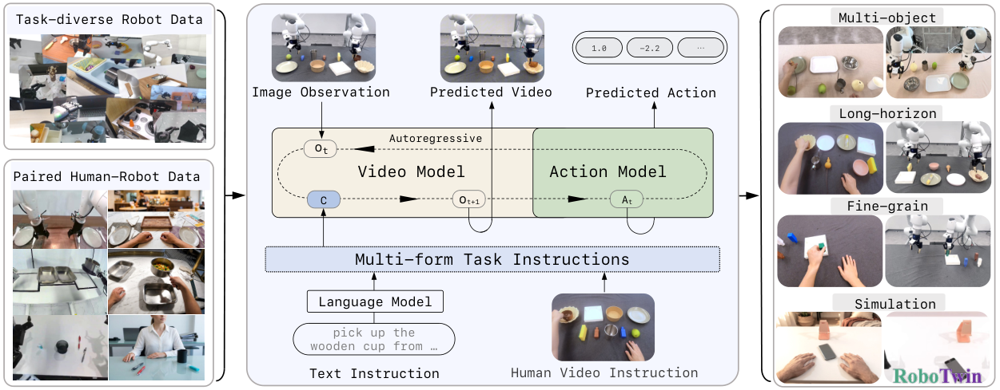

*Borderline: robot-manipulation setting, kept because the in-context conditioning mechanism is directly transferable to VLA foundation models.*

### TL;DR

A causal video-action model performs unseen manipulation tasks by conditioning on an in-context human demonstration video — no weight updates, no task-specific training. Like ICL for policies rather than for text.

### Key idea

Treat the demo video as context tokens for a WAM. The model conditions the next-action prediction on the current observation *and* the human-demo trajectory, letting a single model handle new tasks by swapping the demo.

### Main finding

**47.0% average success on seven unseen RoboTwin 2.0 tasks — +29.5 points absolute** over the strongest video-action baseline.

### Why it matters

In-context task specification for embodied agents scales the LLM ICL story to the physical world. If it holds up beyond simulation, VLA fine-tuning per task starts to look wasteful.

### Knowledge graph integration

**Builds on / relates to existing pages:**
- [multimodal/README.md](../multimodal/README.md) — VLA / video-action model

**Suggested new pages:**
- `agents/_world-models.md` *(taxonomy)* — WAM sub-class: in-context conditioning
- `multimodal/vla.md` *(depth)* — vision-language-action foundation models (gap)

---

## 10. Understanding Evolution Strategies for LLM Reasoning: Broader Reasoning Coverage than GRPO {#10-es-vs-grpo}

**Authors:** Yunpeng Ba, Zhi Zheng, Yue Xie, Xialiang Tong, Tao Zhong, Mingxuan Yuan, Zhichao Lu, Zhenkun Wang, et al. — *Huawei Noah's Ark Lab / CityU*
**Links:** [arXiv:2608.27351](https://arxiv.org/abs/2608.27351) · [HF](https://huggingface.co/papers/2608.27351) · [AlphaXiv](https://www.alphaxiv.org/abs/2608.27351)
**Topics:** `RL`, `reasoning`

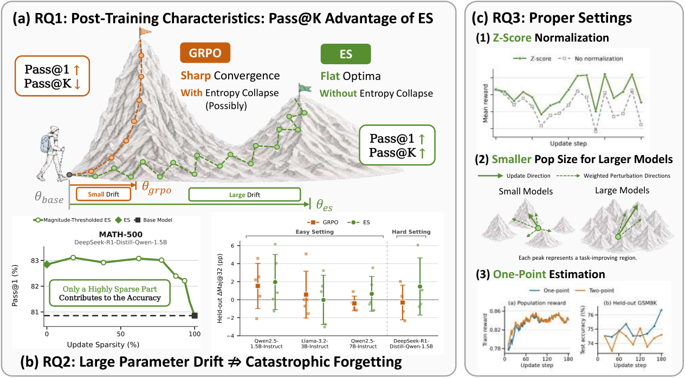

### TL;DR

Evolution Strategies (ES) — gradient-free black-box optimization via parameter-space noise — are memory-cheap for LLM post-training but poorly understood. This paper analyzes ES against GRPO and shows ES gets **broader reasoning coverage**: better Pass@K without the entropy collapse GRPO suffers.

### Key idea

ES's stochastic parameter perturbations act as a diversity regularizer, keeping solution modes alive that GRPO's on-policy sampling collapses. The authors propose a **combined GRPO+ES** recipe that gets GRPO's peak accuracy without losing ES's coverage. Gains come from *sparse* parameter updates even under substantial overall drift.

### Main finding

ES maintains Pass@K superiority where GRPO collapses to a single mode. Hybrid GRPO+ES outperforms either on both Pass@1 and Pass@K.

### Why it matters

Entropy collapse is the standing complaint against on-policy RL post-training. If a cheap noise-based optimizer restores coverage, hybrid training becomes the default for reasoning models where diverse solution paths matter.

### Knowledge graph integration

**Builds on / relates to existing pages:**
- [grpo.md](../post-training/grpo.md) — direct comparison and hybrid target
- [_rl.md](../post-training/_rl.md) — new axis (ES) in the RL taxonomy
- [long-cot-rl.md](../post-training/reasoning/long-cot-rl.md) — reasoning regime that benefits most

**Suggested new pages:**
- `post-training/evolution-strategies.md` *(depth)* — ES for LLM post-training
- `post-training/entropy-collapse.md` *(depth)* — failure mode across on-policy RL

---

## 11. CritICL: Inference-Time Weak-to-Strong Generalization from Small Language Model Failure Modes {#11-criticl}

**Authors:** Yufan Wu, Yinghui He, Zhengyi Hu, Lang Wei, Ruichen Li, Qifan Yang, Ting Zhu — *Univ. of Delaware*
**Links:** [arXiv:2608.27455](https://arxiv.org/abs/2608.27455) · [HF](https://huggingface.co/papers/2608.27455) · [AlphaXiv](https://www.alphaxiv.org/abs/2608.27455)
**Topics:** `reasoning`, `LLM`, `test-time`

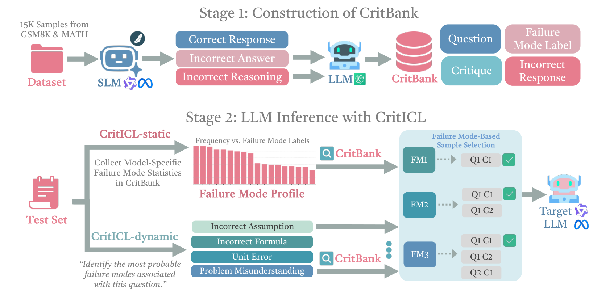

### TL;DR

Inference-time scaling usually means "generate a lot and verify." CritICL instead mines the *failure modes* of a smaller sibling model and injects those as in-context critique examples for the strong model — one-shot, no repeated sampling.

### Key idea

Failure modes are structured across scales in the same family. Convert small-model errors into critiques → retrieve or profile them → prepend to the strong model's context. Two variants: **CritICL-dynamic** (per-input retrieval) and **CritICL-static** (single global failure-mode profile).

### Main finding

Matches or beats standard test-time scaling methods while using **far fewer generations and lower token cost** than best-of-N / self-consistency style approaches.

### Why it matters

Weak-to-strong has been mostly a training-time story. Turning small-model errors into inference-time context is cheap alignment: no extra training, no reward model, no rollouts.

### Knowledge graph integration

**Builds on / relates to existing pages:**
- [long-cot-rl.md](../post-training/reasoning/long-cot-rl.md) — targets same reasoning regime
- [orm.md](../post-training/reasoning/orm.md) — critique-as-verifier lineage
- [grpo.md](../post-training/grpo.md) — alternative to sample-heavy inference-time methods

**Suggested new pages:**
- `inference/criticl.md` *(depth)* — critique-based in-context weak-to-strong
- `inference/_test-time-scaling.md` *(taxonomy)* — best-of-N, self-consistency, critique-based, TTPO (gap)

---

## 12. CaRGo-T: Causal Reasoning Graph-of-Thought improves Multimodal Humor Comprehension {#12-cargo-t}

**Authors:** Rahul Seetharaman, Aman Bansal, Rounak Saha, Manav Nitin Kapadnis, Millon Madhur Das, Pawan Goyal, Niloy Ganguly — *IIT Kharagpur*
**Links:** [arXiv:2608.23172](https://arxiv.org/abs/2608.23172) · [HF](https://huggingface.co/papers/2608.23172) · [AlphaXiv](https://www.alphaxiv.org/abs/2608.23172)
**Topics:** `multimodal`, `reasoning`

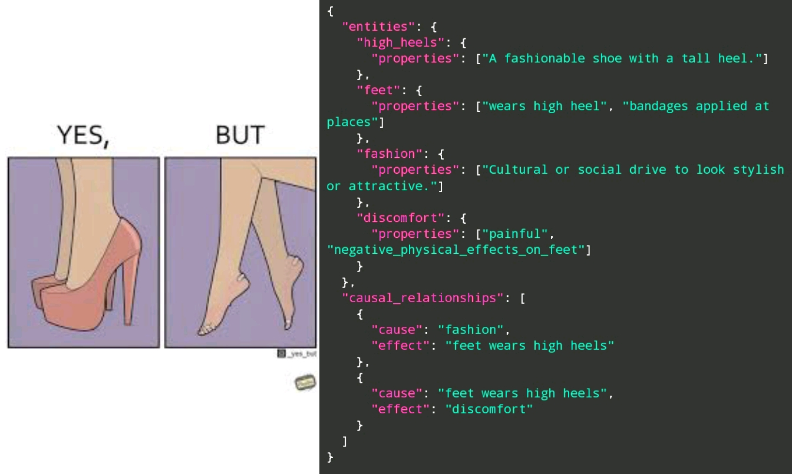

### TL;DR

VLMs are bad at humor because the joke lives in a causal chain across people, objects, and events. CaRGo-T generates a **causal reasoning graph** expressed as code that names the chain and the comedic signals, giving the VLM an explicit structure to reason over.

### Key idea

Serialize the causal-event chain as code (nodes = events / entities, edges = cause / setup / punchline), then have the VLM answer conditioned on that graph. Graph-of-Thought over causal structure rather than free-form CoT.

### Main finding

**1–20% gains** in humor understanding, **1–3%** in humor detection across four datasets (satire, sarcasm, memes) versus reasoning-based baselines.

### Why it matters

Humor is a stress-test for compositional multimodal reasoning. A code-form causal graph is a general pattern beyond humor — any domain where causality is the hard part could benefit.

### Knowledge graph integration

**Builds on / relates to existing pages:**
- [multimodal/README.md](../multimodal/README.md) — VLM reasoning
- [long-cot-rl.md](../post-training/reasoning/long-cot-rl.md) — chain-style reasoning lineage

**Suggested new pages:**
- `multimodal/graph-of-thought.md` *(depth)* — code-form causal graphs for VLM reasoning

---

## 13. CaSKG: Counterfactual-Causal Skill Graphs for Scalable Agent Skill Retrieval {#13-caskg}

**Authors:** Zhiyuan Li, Linyuan Gao, Xuechun Ding, Hongwei Chen, Yuan Wu, Yi Chang — *Jilin University*
**Links:** [arXiv:2608.25500](https://arxiv.org/abs/2608.25500) · [HF](https://huggingface.co/papers/2608.25500) · [AlphaXiv](https://www.alphaxiv.org/abs/2608.25500)
**Topics:** `agents`, `LLM`

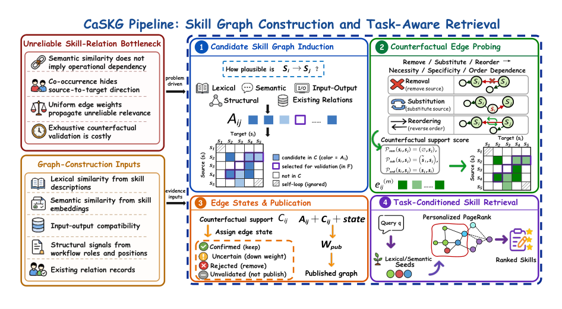

### TL;DR

Reusable skill libraries make memory-access a retrieval problem. CaSKG builds an offline skill graph from semantic + lexical + structural evidence, then **counterfactually probes** each edge to calibrate its reliability before serving retrieval.

### Key idea

Rather than trust cosine similarity, run a counterfactual probe — "would the downstream task succeed if this edge is followed?" — and use the result to reweight the graph. Retrieval then walks a graph whose edges reflect causal utility, not surface similarity.

### Main finding

Across six LLM backbones: **ScienceWorld 72.62 → 80.50** and **ALFWorld 80.01% → 86.79%** vs prior graph-based skill retrieval.

### Why it matters

Skill libraries scale to thousands of entries; naive retrieval breaks. Counterfactual edge calibration is a general pattern for turning heuristic graphs into causally-tested ones.

### Knowledge graph integration

**Builds on / relates to existing pages:**
- [agents/README.md](../agents/README.md) — agent skill libraries and retrieval

**Suggested new pages:**
- `agents/skill-retrieval.md` *(depth)* — counterfactual-causal skill graph retrieval

---

## 14. Aphanta: Diagnosing Task-Aligned Image-Edited Intermediates for Multimodal Reasoning {#14-aphanta}

**Authors:** Wei Cheng, Yumeng Ji, Xuanyang Zhang, Xianfang Zeng, Gang Yu, Xingjun Ma — *StepFun*
**Links:** [arXiv:2608.26993](https://arxiv.org/abs/2608.26993) · [HF](https://huggingface.co/papers/2608.26993) · [AlphaXiv](https://www.alphaxiv.org/abs/2608.26993)
**Topics:** `multimodal`, `reasoning`, `eval`

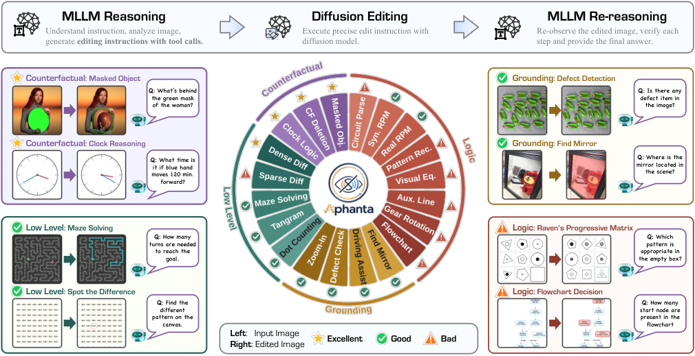

### TL;DR

"Draw-to-reason" pipelines (MLLM → image editor → MLLM) are only useful when the editor can actually realize the transformation. Aphanta is an automated diagnostic that splits **potential visual headroom** (with an idealized reference edit) from **practical utility** (with a real editor).

### Key idea

Compare three conditions per task: (1) direct MLLM reasoning, (2) reasoning with editor-generated intermediate, (3) reasoning with an idealized reference intermediate. The gap between (1) and (3) is headroom; the gap between (2) and (3) is editor-quality tax.

### Main finding

Utility is **strongly task-conditioned**: cue injection, grounding, and counterfactual state realization gain; symbol-sensitive or structural extrapolation tasks don't. The consolidated Qwen pipeline improves task score **0.343 → 0.445 (+29.7% relative)** on selected positive tasks.

### Why it matters

Reframes image editing as a **specialized visual workspace** rather than a universal chain-of-visual-thought mechanism. Gives the field a protocol to decide when a visual-intermediate pipeline is worth deploying at all.

### Knowledge graph integration

**Builds on / relates to existing pages:**
- [multimodal/README.md](../multimodal/README.md) — MLLM reasoning with image intermediates
- [long-cot-rl.md](../post-training/reasoning/long-cot-rl.md) — chain-of-thought with non-text steps

**Suggested new pages:**
- `evaluation/aphanta.md` *(depth)* — task-conditioned editor-utility benchmark
- `multimodal/visual-chain-of-thought.md` *(depth)* — reasoning with generated image intermediates

---

## 15. What Does an Evaluation License? A Commit-Bound Census of Claim-Relative Inference in Inspect Evals {#15-eval-license}

**Authors:** Xi Qin — *Independent*
**Links:** [arXiv:2608.19269](https://arxiv.org/abs/2608.19269) · [HF](https://huggingface.co/papers/2608.19269) · [AlphaXiv](https://www.alphaxiv.org/abs/2608.19269)
**Topics:** `eval`, `safety`

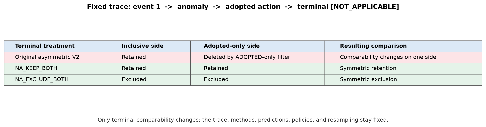

*Borderline: cs.SE, kept because it's a first-of-its-kind audit of the Inspect Evals suite used across safety orgs.*

### TL;DR

An evaluation ships a forward computation (task, scorer, metric) but not necessarily a **claim license** — the historical evidence and alternative semantics needed to *replay* the claim under different assumptions. The paper formalizes that missing "claim-replay" layer and censuses the entire Inspect Evals suite at a pinned commit.

### Key idea

A claim query `q` against a frozen substrate `D` and a grounded family `F` produces an identified set. Applied to Inspect Evals: 124 eligible units, **110 stop before deterministic inference** because required historical evidence or grounding is unavailable. Where execution does close, exact values / winners / orders separate by claim resolution and primary-vs-review family.

### Main finding

**110 / 124** Inspect Evals units cannot support deterministic claim-replay from their shipped artifacts. The audit outputs typed stops and stability witnesses instead of forcing a single "robust / not robust" label.

### Why it matters

Safety and capability evals often ship as reproducible scripts, but the *claims* attached to those scripts rely on data and semantics that aren't versioned with them. If this is broadly true, published leaderboard numbers are less replayable than assumed.

### Knowledge graph integration

**Builds on / relates to existing pages:**
- [evaluation/README.md](../evaluation/README.md) — eval methodology / auditing
- [safety/README.md](../safety/README.md) — capability-eval reliability for safety cases

**Suggested new pages:**
- `evaluation/claim-replay.md` *(depth)* — the substrate / grounded family / query framework for eval auditing

---

## Notes

- Borderline inclusions are flagged in-section (Zero-WAM, Evaluation License).
- Hero figures live in `assets/2026-08-30/`. All 15 hero figures downloaded from arXiv HTML sources.
- This digest is informational. No existing concept files, `READING-LIST.md`, or `PAPERS.md` were modified to produce it.
