# Daily AI papers — 2026-08-31

*Curated from HF Daily Papers. 15 of 31 papers kept after relevance filter.*

## Papers at a glance

| # | Title | Topics | Org |
| --- | --- | --- | --- |
| 1 | [LoopArena: Benchmarking Models as Runtime Controllers for Loop Engineering](#1-looparena) | `eval`, `agents`, `coding` | Alibaba DreamX |
| 2 | [DART-SD: Diamond-topology Aware Retrieval and Tuning for Self-Distillation of Multi-Turn Tool-Calling Agents](#2-dart-sd) | `agents`, `tool-calling`, `distillation`, `RL` | (unspecified) |
| 3 | [Beyond Data Scaling: Representation-Centric Continued Pre-training for Vision-Language-Action Models](#3-vlact) | `multimodal`, `VLA`, `pretraining` | CUHK / HKU |
| 4 | [Agentic Artifact Creation: Systems, Evaluation, Principles, and Opportunities](#4-agentic-artifact-creation) | `agents`, `survey`, `eval` | HKUST-GZ |
| 5 | [Code as Worlds: Agentic Discovery of Executable World Representations for Physical Reasoning](#5-code-as-worlds) | `agents`, `reasoning`, `multimodal` | Tsinghua / NTU / MIT |
| 6 | [J-Zero: Unified Challenger–Solver–Judge Co-Evolution from Zero Data](#6-j-zero) | `RL`, `self-play`, `reward-modeling` | KAIST |
| 7 | [Puro-2B: Poor Lab's Qwen2-1.5B Trained on RTX 5090 within $5090](#7-puro-2b) | `pretraining`, `FP8`, `scaling-laws`, `case-study` | Tsinghua PACMAN |
| 8 | [LayerRecall: A State-Conditioned Memory Router for Long-Horizon Consistency in Video Generation](#8-layerrecall) | `diffusion`, `video`, `memory` | Zhejiang U. |
| 9 | [ContextPilot: Teaching Agents for Proactive Context Management via Fine-grained RL](#9-contextpilot) | `agents`, `RL`, `long-context` | Tencent |
| 10 | [Fast Weight Attention for Continual Learning](#10-fast-weight-attention) | `architectures`, `attention`, `continual` | Tsinghua / Princeton |
| 11 | [Sliding-window beats linear attention](#11-swa-beats-linear) | `architectures`, `attention`, `efficient-inference` | Samsung SAIT / MSR |
| 12 | [StepGuard: Learning Step-Level Guardrails with Scalable Supervision and Safety-Utility Balancing](#12-stepguard) | `safety`, `agents`, `RL` | Shanghai AI Lab / Fudan |
| 13 | [Rubric-to-Code Credit Assignment for Reinforcement Learning](#13-rcca) | `RL`, `agents`, `coding`, `reward-modeling` | Ant Group |
| 14 | [Blind Men and the Elephant: Probing the Epistemic Myopia of LLMs under Long-Tail Divergent Knowledge](#14-elephantbench) | `eval`, `data`, `hallucination` | Tencent |
| 15 | [Ring Forcing: Towards Precise Long-Term Memory for Autoregressive Video Diffusion](#15-ring-forcing) | `diffusion`, `video`, `memory` | Stanford / MIT / ByteDance |

---

## 1. LoopArena

**Authors:** Yi Wang, Haopeng Zhang, Chengxiang Huang, Rui Dai, Kaikui Liu, Piotr Koniusz, Xiangxiang Chu — *DreamX Team, Alibaba Group (with UNSW / CSIRO Data61)*
**Links:** [arXiv:2608.28281](https://arxiv.org/abs/2608.28281) · [HF](https://huggingface.co/papers/2608.28281) · [AlphaXiv](https://www.alphaxiv.org/abs/2608.28281)
**Topics:** `eval`, `agents`, `coding`

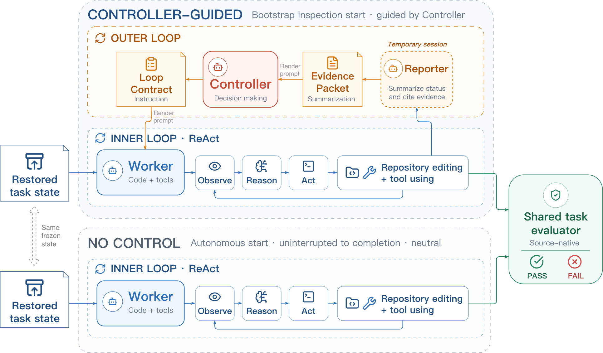

### TL;DR

A benchmark for the "Controller" role in coding-agent loops — the model that reads a run summary after each round and decides what the fixed Worker agent should do next (verify, keep coding, stop). Splits evaluation into three tiers of execution cost, from execution-validated MCQ over next-step Loop Contracts (Type I), to sliced control replay (Type II), to full paired runs (Type III).

### Key idea

Decouple the *loop-controller* from the coding agent. LoopArena freezes a Worker and scores a candidate Controller purely on its meta-decisions: pick the right Loop Contract, avoid trusting stale progress notes, budget verification, decide when to stop. Type II lets you approximate Type III's ranking at a fraction of the cost via slice replay.

### Main finding

On full end-to-end tasks the best observed Strict Success Rate is only **24.69%**, showing long-horizon loop control is far from solved. Across models, paired Controller choice saves an average of **64.4%** on estimated inference cost, and the cheap Type II protocol tracks the expensive Type III ordering at ρ=0.9747.

### Why it matters

"Loop Engineering" (as opposed to prompt engineering) is emerging as the way teams squeeze reliability out of frontier coding agents. LoopArena gives a way to shop for the Controller separately from the Worker — a precondition for economically routing meta-decisions to smaller/cheaper models while keeping a strong coder in the tool slot.

### Knowledge graph integration

**Builds on / relates to existing pages:**
- [../agents/README.md](../agents/README.md) — targets the meta-controller layer over a tool-using agent loop.
- [../evaluation/livecodebench.md](../evaluation/livecodebench.md) — sibling coding benchmark; LoopArena is about *guiding* an agent through such tasks rather than raw code capability.
- [../evaluation/README.md](../evaluation/README.md) — new capability-eval axis for agent orchestrators.

**Suggested new pages:**
- `evaluation/looparena.md` *(depth)* — the benchmark's three-tier evaluation protocol and the Loop Contract vocabulary.
- `agents/loop-engineering.md` *(depth)* — Controller/Worker decomposition as an agent-design pattern.

---

## 2. DART-SD

**Authors:** Hangrui Xu, Jiarui Wang, Yang Yang, Chuanbo Zhu, Fangda Chen, Ziqi Wu, Jingming Cai, Yan Song — *affiliation not disclosed on HF page*
**Links:** [arXiv:2608.18524](https://arxiv.org/abs/2608.18524) · [HF](https://huggingface.co/papers/2608.18524) · [AlphaXiv](https://www.alphaxiv.org/abs/2608.18524)
**Topics:** `agents`, `tool-calling`, `distillation`, `RL`

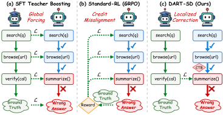

### TL;DR

Multi-turn tool-calling agents often have to solve tasks whose sub-goals are order-independent — the space of valid trajectories forms a combinatorial "diamond lattice". Naïve full-trajectory imitation collapses this diamond, penalizing valid alternatives and shrinking policy diversity. DART-SD instead models rollouts as an Interaction-State Transition Graph (ISTG), detects Critical Topological Breakpoints (CTB), and self-distills only on the recovery steps.

### Key idea

**Localized self-distillation.** Represent trajectories as a converging graph over interaction states; identify the exact step where an autonomous rollout diverged from a known-good path (the CTB); retrieve success-supported recovery references; then compute the training loss *only* on the generated recovery tokens, while masking gradients on the valid reasoning prefix. This preserves diverse-but-valid exploration and corrects only where it matters.

### Main finding

Beats full-trajectory imitation baselines on complex multi-turn tool-calling benchmarks — exact deltas depend on task, but the framing is what's new: no more monolithic teacher-forcing over the whole trajectory when the goals commute.

### Why it matters

Tool-calling curricula are increasingly synthesized by strong teacher models. The default recipe (SFT on whole teacher trajectories, or RL over full sequences) implicitly assumes a canonical solution. DART-SD is a principled fix for the *combinatorial* nature of tool use — a template other agent-distillation pipelines can borrow.

### Knowledge graph integration

**Builds on / relates to existing pages:**
- [../agents/README.md](../agents/README.md) — targets the multi-turn tool-calling agent regime.
- [../post-training/rejection-sampling.md](../post-training/rejection-sampling.md) — retrieval of "success-supported recovery references" is an ISTG-aware refinement of trajectory rejection sampling.
- [../post-training/rlvr.md](../post-training/rlvr.md) — motivates trajectory-level credit-assignment fixes that RLVR-style methods leave on the table.

**Suggested new pages:**
- `agents/multi-turn-tool-calling.md` *(taxonomy)* — the class of methods for training tool-using LLMs across multi-turn horizons.
- `post-training/dart-sd.md` *(depth)* — CTB detection + localized self-distillation as an SFT-successor.

---

## 3. VLAct

**Authors:** Senqiao Yang, Chengyao Wang, Yuxin Chen, Zixuan Wang, Longxiang Tang, Haokun Gui, Jinhui Ye, Changsheng Lu, Xiaoyang Wu, Mingkang Zhu, Pengguang Chen, Shu Liu, Zhuotao Tian, Hengshuang Zhao, Bei Yu, Jiaya Jia — *CUHK / HKU / SmartMore*
**Links:** [arXiv:2608.27550](https://arxiv.org/abs/2608.27550) · [HF](https://huggingface.co/papers/2608.27550) · [AlphaXiv](https://www.alphaxiv.org/abs/2608.27550)
**Topics:** `multimodal`, `VLA`, `pretraining`

### TL;DR

Argues that Vision-Language-Action (VLA) models don't need ever-more robot data — they need the right *representations*. Proposes a continued-pretraining recipe that preserves the base VLM's vision-language priors while introducing shared action semantics across embodiments, yielding strong sim and real-embodiment transfer at limited compute.

### Key idea

**Representation-centric continued pretraining.** Rather than co-training from scratch on huge robot trajectory datasets, warm-start from a strong VLM and add a small continued-pretraining phase that (a) preserves the language/vision alignment already learned and (b) folds in an action tokenization / semantics layer shared across embodiments. Data diversity matters less than protecting the priors.

### Main finding

Reaches strong performance across simulations and unseen embodiments under a limited compute budget, outperforming data-scaling baselines that keep pouring more robot trajectories through joint pretraining. Positioned explicitly as a challenge to the "just add more robot data" thesis.

### Why it matters

VLA data collection is orders of magnitude more expensive than web text or images. If continued-pretraining recipes can bridge from any strong VLM to a competitive VLA at low compute, it opens the door to per-lab embodiment fine-tuning without owning a data-collection fleet.

### Knowledge graph integration

**Builds on / relates to existing pages:**
- [../multimodal/README.md](../multimodal/README.md) — sits at the VLM→VLA boundary the folder is meant to grow into.
- [../pre-training/mid-training.md](../pre-training/mid-training.md) — canonical continued-pretraining framing; VLAct is a modality-extending mid-train.
- [../pre-training/model-souping.md](../pre-training/model-souping.md) — the "preserve priors" thread; souping / interpolation is the crude cousin of representation-preserving CPT.

**Suggested new pages:**
- `multimodal/_vla.md` *(taxonomy)* — VLM→VLA construction strategies: joint pretraining vs continued pretraining vs adapters.
- `multimodal/vla-continued-pretraining.md` *(depth)* — the representation-preserving recipe from this paper.

---

## 4. Agentic Artifact Creation

**Authors:** Tianfu Wang, Zhezheng Hao, Xilin Xia, Lixin Liu, Mengkang Hu, Hongzhang Liu, Xi Chen, Ziyan Liu, Xiankun Lin, Weijia Zhang, Nicholas Jing Yuan, Hui Xiong — *HKUST-GZ*
**Links:** [arXiv:2608.28122](https://arxiv.org/abs/2608.28122) · [HF](https://huggingface.co/papers/2608.28122) · [AlphaXiv](https://www.alphaxiv.org/abs/2608.28122)
**Topics:** `agents`, `survey`, `eval`

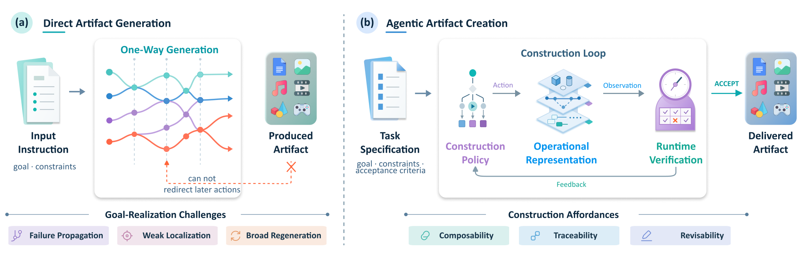

### TL;DR

A 259-work survey (230 systems + 29 benchmarks) of "agentic artifact creation" — stateful construction where an AI system iteratively builds or revises a concrete deliverable and lets intermediate observations redirect later work. Compares six artifact families (code, docs, images, video, audio, 3D/UI) and pulls out shared principles.

### Key idea

Reframes generative pipelines as an **operational representation + construction policy + runtime verification** triple. Failures visible while still repairable are the good case; the survey argues most current systems either (a) hide failures until deploy time or (b) use learned judges that inherit the generator's blind spots.

### Main finding

Across the six artifact families, construction difficulty reflects not just modality but *how tightly decisions are coupled* and *whether failures surface while repair is still cheap*. Decomposition reduces local complexity but adds coordination cost; shared-generator judges add little independent signal.

### Why it matters

Provides the missing shared vocabulary for "agent that builds X" systems that have been proliferating in isolation — code agents, presentation agents, doc agents, artifact-creation agents. Also flags the evaluation-integrity problem cleanly (judge-generator collusion), which will shape how the next generation of benchmarks is designed.

### Knowledge graph integration

**Builds on / relates to existing pages:**
- [../agents/README.md](../agents/README.md) — the survey's core subject is stateful, artifact-producing agent systems.
- [../evaluation/README.md](../evaluation/README.md) — surfaces evaluation pitfalls (judge-generator overlap) relevant to any agent-eval work.

**Suggested new pages:**
- `agents/_artifact-creation.md` *(taxonomy)* — the six-family, principle-driven map this survey lays out.

---

## 5. Code as Worlds

**Authors:** Hanyang Wang, Yimo Cai, Weiliang Chen, Jiawei Chi, Haowen Sun, Qiyu Dai, Yi-Hsin Hung, Xingzhuo Guo, Jinshan Ren, Runmao Yao, Ziwei Liu, Mingsheng Long, Yueqi Duan, Jun Gao, Jiangran Lyu, Fangfu Liu, Jialong Wu, et al. — *Tsinghua / NTU / MIT (large multi-institution list)*
**Links:** [arXiv:2608.27549](https://arxiv.org/abs/2608.27549) · [HF](https://huggingface.co/papers/2608.27549) · [AlphaXiv](https://www.alphaxiv.org/abs/2608.27549)
**Topics:** `agents`, `reasoning`, `multimodal`

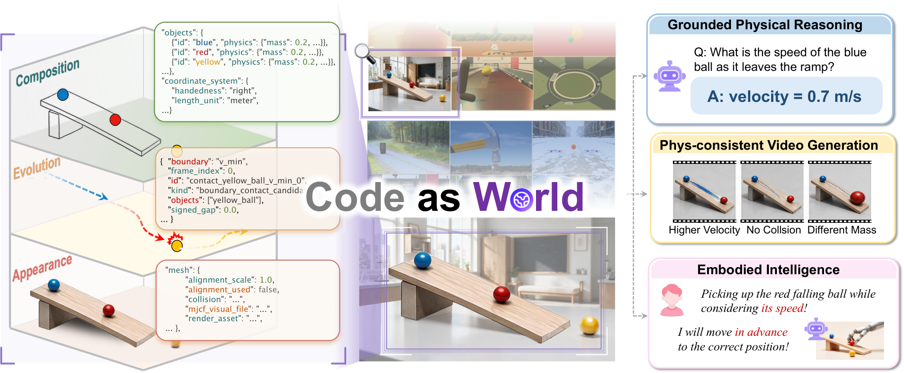

### TL;DR

Introduces **Code-as-World**, a paradigm where a VLM/agent discovers *executable* world representations for a physical scene: object states, physical parameters, dynamics — all written out as code — so it can then simulate, intervene, and predict outcomes explicitly instead of relying only on pattern-matched language answers.

### Key idea

Physical reasoning is grounded in **executable code that models the scene**. The agent iteratively proposes symbolic/numeric representations of the objects and dynamics; those get run; discrepancies with observations drive the next revision. The final artifact is a runnable world model, not a chain of thought.

### Main finding

Executable world representations yield more reliable physical predictions and support counterfactual interventions ("what if we push harder?") that pure vision-language chains cannot. Paper positions itself against VLM-only physical-reasoning baselines that lack an intermediate simulator.

### Why it matters

Two threads converge here: (1) code-as-tool for reasoning (self-verifying, executable) and (2) neuro-symbolic world models. If VLMs can *write and run* their own physics, we get an escape hatch from vibes-based physical reasoning — closer to what game engines already give reinforcement-learning agents.

### Knowledge graph integration

**Builds on / relates to existing pages:**
- [../agents/README.md](../agents/README.md) — an agentic loop that discovers and executes representations.
- [../post-training/reasoning/README.md](../post-training/reasoning/README.md) — code-execution as the reasoning substrate for physical tasks.
- [../multimodal/README.md](../multimodal/README.md) — vision-grounded representation discovery.

**Suggested new pages:**
- `agents/code-as-world.md` *(depth)* — the executable-world-representation loop.
- `post-training/reasoning/executable-world-models.md` *(depth)* — physical reasoning via code-based simulation.

---

## 6. J-Zero

**Authors:** Gyouk Chu, Myeongho Jeon, Eunho Yang — *KAIST*
**Links:** [arXiv:2608.26582](https://arxiv.org/abs/2608.26582) · [HF](https://huggingface.co/papers/2608.26582) · [AlphaXiv](https://www.alphaxiv.org/abs/2608.26582)
**Topics:** `RL`, `self-play`, `reward-modeling`

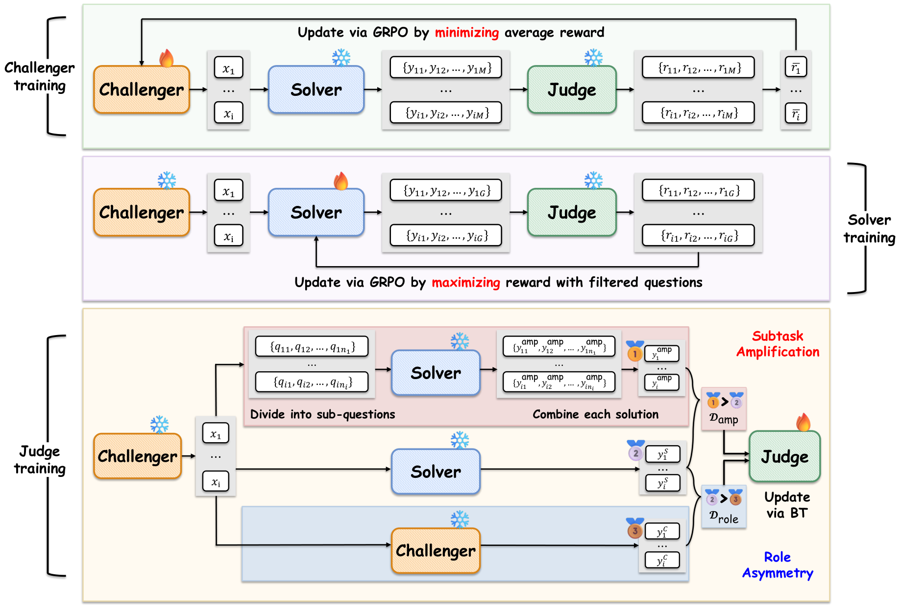

### TL;DR

A three-role self-improvement framework that runs from *zero training data*: a **Challenger** proposes tasks, a **Solver** attempts them, and a **Judge** scores the results — all co-adapted. Works in both verifiable domains (where the judge can be grounded) and, crucially, unverifiable ones (where the judge itself is what has to learn).

### Key idea

**Challenger–Solver–Judge co-evolution.** Rather than fixing a judge and running RLVR on the solver, all three roles are simultaneously updated. The Challenger surfaces failure modes the current Solver can't handle, and the Judge is trained to distinguish those failures from successes, closing the loop with no external labels.

### Main finding

Beats baselines by **+4.2 points** on verifiable tasks and **+8.0 points** on unverifiable ones, with monotone improvement continuing for at least 10 iterations. The unverifiable-domain gain is the notable result: it's where "just use RLVR" doesn't apply.

### Why it matters

Self-play-style RL has been the story in code and math (verifiable → RLVR works). J-Zero is a template for pushing the same paradigm into unverifiable domains — where judge quality is the ceiling — by learning the judge alongside the solver instead of imposing it up front.

### Knowledge graph integration

**Builds on / relates to existing pages:**
- [../post-training/_rl.md](../post-training/_rl.md) — sits inside the broader RL post-training taxonomy.
- [../post-training/rlvr.md](../post-training/rlvr.md) — generalizes RLVR beyond verifiable rewards by learning the verifier.
- [../post-training/_rewards.md](../post-training/_rewards.md) — the Judge is a co-adapted reward model.
- [../post-training/cot-reward-model.md](../post-training/cot-reward-model.md) — closest existing depth page on learned reward modeling.

**Suggested new pages:**
- `post-training/j-zero.md` *(depth)* — the three-role co-evolution recipe and its stability conditions.
- `post-training/_self-play.md` *(taxonomy)* — self-play, challenger–solver, R-Zero-style zero-data frameworks side by side.

---

## 7. Puro-2B

**Authors:** Kairong Luo, Jiarui Cui, Yaorui Yin, Shengqi Chen, Yiming Yang, Linxiang Gao, Yanmohan Wang, Mingzhe Zhang, Kaiyue Wen, Kaifeng Lyu, Wenguang Chen — *Tsinghua PACMAN*
**Links:** [arXiv:2608.27370](https://arxiv.org/abs/2608.27370) · [HF](https://huggingface.co/papers/2608.27370) · [AlphaXiv](https://www.alphaxiv.org/abs/2608.27370)
**Topics:** `pretraining`, `FP8`, `scaling-laws`, `case-study`

### TL;DR

An end-to-end open pretraining recipe that trains a **1.5B-parameter Qwen2-class model from scratch, on RTX 5090 consumer GPUs, for under $6.9K** — with model weights, data, and code released Apache 2.0. Also derives a "Puro Cost Scaling Law" relating training cost to average performance.

### Key idea

Stack a handful of cost levers: **consumer-hardware selection (RTX 5090)**, **FP8 low-precision training**, "**hyperball optimization**", **curriculum model averaging**, and a curated data recipe. Together they push the achievable pretraining cost frontier down by ~200× relative to Llama-3.2-3B ($1.5M) or SmolLM3-3B ($700K).

### Main finding

Best Puro-2B checkpoint approaches Qwen2.5-1.5B under the paper's eval protocol at <$6.9K compute. The fitted Puro Cost Scaling Law extrapolates that $4.4K is sufficient to reach Qwen2-1.5B performance. Also runs a controlled ablation on how pretraining data curricula shape post-training behavior.

### Why it matters

Small-model pretraining has been effectively closed to academic and open-source labs since Llama-2. Puro-2B is a proof-of-existence recipe that pushes it back within reach — and, unusually, publishes the whole pipeline so downstream controlled studies (like the pretraining-curriculum → post-training analysis in this paper) become possible without frontier-lab access.

### Knowledge graph integration

**Builds on / relates to existing pages:**
- [../pre-training/fp8-training.md](../pre-training/fp8-training.md) — one of the core cost levers.
- [../pre-training/wsd-schedule.md](../pre-training/wsd-schedule.md) — LR-schedule family relevant to short-budget training.
- [../pre-training/model-souping.md](../pre-training/model-souping.md) — closest existing page to "curriculum model averaging".
- [../quantization/fp8.md](../quantization/fp8.md) — FP8 number-format background.

**Suggested new pages:**
- `case-studies/puro-2b.md` *(case study)* — full end-to-end recipe: hardware, precision, optimizer, curriculum, data.
- `pre-training/curriculum-model-averaging.md` *(depth)* — averaging along a data-curriculum trajectory as an implicit regularizer.
- `pre-training/_pretraining-cost-scaling.md` *(taxonomy)* — cost-side scaling laws vs classical Chinchilla-style compute-optimal ones.

---

## 8. LayerRecall

**Authors:** Yixuan Ding, Jiahao Kong, Wei Huang, Ruijie Quan, Yi Yang — *Zhejiang University*
**Links:** [arXiv:2608.28460](https://arxiv.org/abs/2608.28460) · [HF](https://huggingface.co/papers/2608.28460) · [AlphaXiv](https://www.alphaxiv.org/abs/2608.28460)
**Topics:** `diffusion`, `video`, `memory`

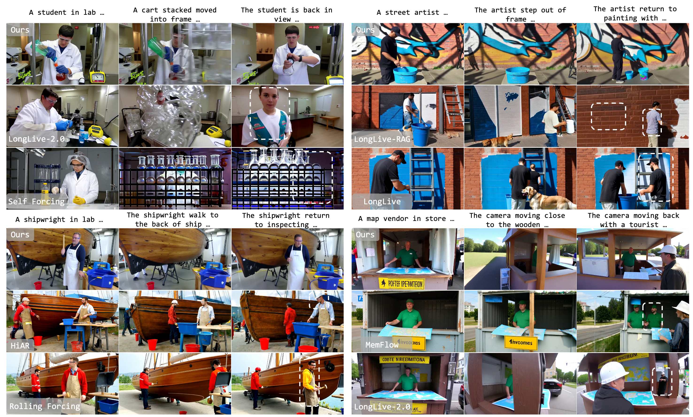

### TL;DR

Long-video autoregressive diffusion loses distant context under recency-based KV caching. LayerRecall analyzes video DiT layers, finds they differ sharply in preference for recent vs distant context, and adds a **layer-selective memory router** that only injects retrieved historical K/V into "memory-sensitive" layers. Trained with a supervision trick (Cross-Horizon Prediction Matching) that avoids needing long-video labels.

### Key idea

**Layer-selective retrieval.** Historical K/V states are retrieved for each new chunk but *only routed into a small subset of memory-sensitive layers*, keeping local attention intact elsewhere. Supervision uses a privileged long-context reference model to teach the bounded-memory router in prediction space (CHPM) — sidestepping the scarcity of high-quality long-horizon video labels.

### Main finding

Best overall on MemoBench and MovieBench across 100 multi-shot prompts, while matching backbone quality on VBench-Long. Enables "memory-guided self-correction": initially wrong local attributes snap back to their historical appearance without breaking motion/scene continuity.

### Why it matters

Long video generation is bottlenecked by memory, not resolution. LayerRecall shows the fix isn't to bolt on more attention windows uniformly — it's to *route* memory to the specific layers that use it, which comes almost free in inference cost and ports across backbones.

### Knowledge graph integration

**Builds on / relates to existing pages:**
- [../multimodal/README.md](../multimodal/README.md) — sits in video generative-modeling scope.
- [../fundamentals/attention.md](../fundamentals/attention.md) — analysis rests on layer-level attention behavior.

**Suggested new pages:**
- `multimodal/autoregressive-video-diffusion.md` *(depth)* — the AR-diffusion class of video generators.
- `multimodal/layer-selective-memory-router.md` *(depth)* — the LayerRecall router + CHPM supervision.

---

## 9. ContextPilot

**Authors:** Zhuoshi Pan, Qizhi Pei, Junru Lu, Honglin Lin, H. Vicky Zhao, Di Yin, Xing Sun — *Tencent*
**Links:** [arXiv:2608.28476](https://arxiv.org/abs/2608.28476) · [HF](https://huggingface.co/papers/2608.28476) · [AlphaXiv](https://www.alphaxiv.org/abs/2608.28476)
**Topics:** `agents`, `RL`, `long-context`

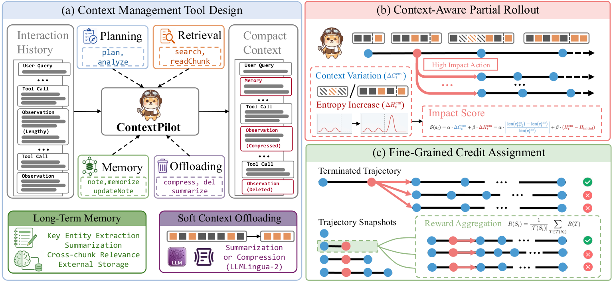

### TL;DR

Teaches long-horizon agents to *actively curate their own working context*. Extends the standard search/delete/summarize toolset with planning, long-term memory, and soft-context-offload tools, then trains context-editing decisions with **branch-sampling RL** and action-level advantage estimation so critical edits get real credit.

### Key idea

Two moves. (1) **Enlarged context-management toolset**: not just retrieval/deletion/summarization but planning, LTM writes, and adaptive compression. (2) **Fine-grained RL for context management**: use context and entropy variation to identify the critical editing decisions, then estimate action-level advantages across sampled branches that pass through that action — instead of assigning the whole trajectory reward uniformly.

### Main finding

Stronger long-context QA and deep-search performance across base models and benchmarks while keeping a *more compact* working context than baselines. Consistent gains attributed to targeted credit for high-leverage edits.

### Why it matters

Agent context has been the silent bottleneck: everything grows, then eviction is heuristic. ContextPilot moves eviction/summary/plan into a learned control problem with matched credit assignment — pushing agents toward *thinking about what to remember*, not just what to fetch.

### Knowledge graph integration

**Builds on / relates to existing pages:**
- [../agents/README.md](../agents/README.md) — this is an agent-runtime skill.
- [../post-training/grpo.md](../post-training/grpo.md) — branch-sampling advantage estimation is a close cousin of GRPO's group-relative baselines.
- [../post-training/rlvr.md](../post-training/rlvr.md) — long-horizon agent RL sibling.

**Suggested new pages:**
- `agents/proactive-context-management.md` *(depth)* — the enlarged toolset and its runtime protocol.
- `post-training/branch-sampling-credit-assignment.md` *(depth)* — action-level advantages via branched rollouts.

---

## 10. Fast Weight Attention

**Authors:** Yifan Zhang, Steve Ta, Jasper Zhang, Jichen Feng, Shuzhen Li, Yongxin Zhang, Yifeng Liu, Huizhuo Yuan, Mengdi Wang, Quanquan Gu, Andrew Chi-Chih Yao — *Tsinghua IIIS / Princeton / UCLA*
**Links:** [arXiv:2608.27763](https://arxiv.org/abs/2608.27763) · [HF](https://huggingface.co/papers/2608.27763) · [AlphaXiv](https://www.alphaxiv.org/abs/2608.27763)
**Topics:** `architectures`, `attention`, `continual`

### TL;DR

Recasts recurrent fast-weight memories and selective state-space models as **online learning rules** under autoregressive prefix-prediction. Derives a normalized update family — Falcon-1/2/3 (regression) and their inner-product variants — with stable renormalization that improves length extrapolation on variable-digit addition and stays competitive on language modeling.

### Key idea

Treat the fast-memory state transition as an online update. Under read-after-write causal semantics the local training example at step t is the prefix-aligned pair (φ(k_{t-1}), v_t), which is a slightly different object from the usual same-step pair (φ(k_t), v_t) — and that difference matters for what internal objective the recurrent state actually optimizes.

### Main finding

The Falcon update family (scalar NLMS, per-column NLMS, sliding-window mini-batch, plus inner-product variants) with positive-decay renormalization gives numerically stable recurrent, masked-parallel, and chunk-parallel implementations, competitive in LM and *notably better at length extrapolation* on variable-digit addition.

### Why it matters

Fast-weight / SSM / linear-attention hybrids keep resurfacing as attention alternatives. This paper offers a clean online-learning viewpoint that separates four axes people usually confuse: temporal alignment, plasticity, forgetting, and bounded rehearsal — a scaffold for reasoning about which knob to turn next.

### Knowledge graph integration

**Builds on / relates to existing pages:**
- [../architectures/README.md](../architectures/README.md) — new attention/SSM variant analysis.
- [../fundamentals/attention.md](../fundamentals/attention.md) — extends the attention story to fast-weight regimes.
- [../architectures/mla.md](../architectures/mla.md) — sibling low-rank / compressed-state attention variant.

**Suggested new pages:**
- `architectures/_attention-variants.md` *(taxonomy)* — full/linear/SSM/fast-weight side-by-side.
- `architectures/fast-weight-attention.md` *(depth)* — the Falcon online-learning update family.

---

## 11. Sliding-window beats linear attention

**Authors:** Alexia Jolicoeur-Martineau, Rhea Sanjay Sukthanker, Pashmina Cameron, Emy Gervais — *Samsung SAIT / Microsoft Research*
**Links:** [arXiv:2608.28444](https://arxiv.org/abs/2608.28444) · [HF](https://huggingface.co/papers/2608.28444) · [AlphaXiv](https://www.alphaxiv.org/abs/2608.28444)
**Topics:** `architectures`, `attention`, `efficient-inference`

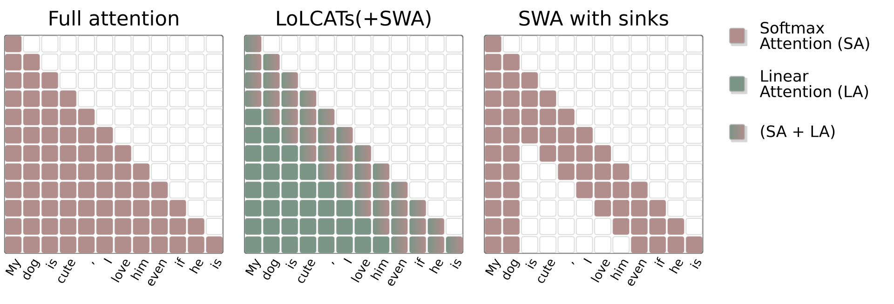

### TL;DR

A brutal baseline check on the linear-attention wave: retrofit a pretrained LLM with **Sliding Window Attention + sinks** (no post-training) and it matches or beats *post-trained* linear-attention retrofits across models and tasks — and destroys them on long-context retrieval (2×–10× on NIAH/BABILong).

### Key idea

The whole "retrofit LLMs to linear attention" line assumes you have to move to a subquadratic mechanism to escape KV-cache growth. This paper shows the simpler, older move — **capped sliding window + attention sinks** — needs no post-training, is fast, low-memory, and *outperforms* linear-attention retrofits at their own game.

### Main finding

- Multiple base LLMs, multiple downstream tasks: **SWA ≥ post-trained linear attention** on general tasks.
- On long-context reasoning (Needle-in-a-Haystack, BABILong): SWA is **2–10× higher** than linear attention.
- SWA needs zero training, is very fast, and low memory.

### Why it matters

Linear-attention retrofits have been a fashionable inference-efficiency direction. This is a strong "hold on, compare to the boring baseline" result — likely to reshape the retrofit vs from-scratch narrative for subquadratic attention, and suggests linear attention needs to be trained from scratch (or with heavy post-training) to be worth the switch at all.

### Knowledge graph integration

**Builds on / relates to existing pages:**
- [../architectures/README.md](../architectures/README.md) — attention-variant taxonomy home.
- [../architectures/multi-head-attention.md](../architectures/multi-head-attention.md) — the baseline SWA sits on top of.
- [../fundamentals/attention.md](../fundamentals/attention.md) — background on attention costs.

**Suggested new pages:**
- `architectures/sliding-window-attention.md` *(depth)* — SWA + attention-sinks as a retrofit recipe.
- `architectures/_attention-variants.md` *(taxonomy)* — placeholder for the class comparing full/SWA/linear/SSM.

---

## 12. StepGuard

**Authors:** Zhijie Zheng, Yu Li, Chen Qian, Yuqian Fu, Yanwei Fu, Lu Sheng, Jing Shao, Dongrui Liu — *Shanghai AI Lab / Fudan*
**Links:** [arXiv:2608.24777](https://arxiv.org/abs/2608.24777) · [HF](https://huggingface.co/papers/2608.24777) · [AlphaXiv](https://www.alphaxiv.org/abs/2608.24777)
**Topics:** `safety`, `agents`, `RL`

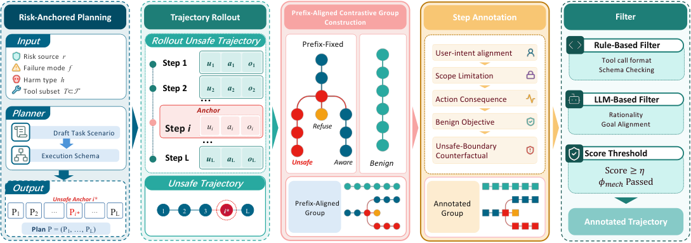

### TL;DR

A **step-level** agent guardrail: audits an agent's tool-call plan *before it executes*, not after the trajectory finishes. Trained on paired safe/unsafe trajectories generated by a purpose-built data engine (StepGen), and tuned with **Balance-GRPO** to keep safe-vs-unsafe learning in balance and reduce both over-defense and under-defense.

### Key idea

Two contributions. (1) **StepGen** generates matched (same-context, different-action) safe/unsafe rollouts around risky steps, giving a clean supervised signal for what "the same situation but wrong" looks like. (2) **Balance-GRPO** dynamically re-weights learning between safe and unsafe examples based on observed accuracy, so the model doesn't drift into refuse-everything or approve-everything.

### Main finding

- Highest average accuracy across open-weight guard models; comparable to GPT-5.4 in the paper's setting.
- Deployed on AgentDojo / AgentDyn as a pre-execution guard: **mean attack success rate down 77.3%** with only **2.8 pp** utility drop.

### Why it matters

Post-hoc trajectory review is too late for agents that touch files, send emails, or run code. Step-level pre-execution guardrails are the natural fit, but training them without over-refusing has been the sticking point. StepGuard's paired-rollout data engine + Balance-GRPO is one of the first clean recipes.

### Knowledge graph integration

**Builds on / relates to existing pages:**
- [../safety/README.md](../safety/README.md) — new class of agent-runtime safety mechanism.
- [../safety/cot-monitoring.md](../safety/cot-monitoring.md) — sibling monitoring approach (thoughts vs. actions).
- [../post-training/grpo.md](../post-training/grpo.md) — Balance-GRPO is a variant of GRPO.
- [../agents/README.md](../agents/README.md) — deployed on agent runtimes (AgentDojo/AgentDyn).

**Suggested new pages:**
- `safety/step-level-guardrails.md` *(depth)* — the pre-execution guard-model pattern.
- `post-training/balance-grpo.md` *(depth)* — GRPO with dynamic safe/unsafe balancing.
- `safety/_agent-guardrails.md` *(taxonomy)* — where StepGuard sits among trajectory- and step-level guards.

---

## 13. RCCA

**Authors:** Rui Jin, Jikai Chen, Yihan Chen, Hao Zhou, Demin Zhu, Kaichen Yang, Dong Wang, Chenyi Zhuang — *Ant Group*
**Links:** [arXiv:2608.27906](https://arxiv.org/abs/2608.27906) · [HF](https://huggingface.co/papers/2608.27906) · [AlphaXiv](https://www.alphaxiv.org/abs/2608.27906)
**Topics:** `RL`, `agents`, `coding`, `reward-modeling`

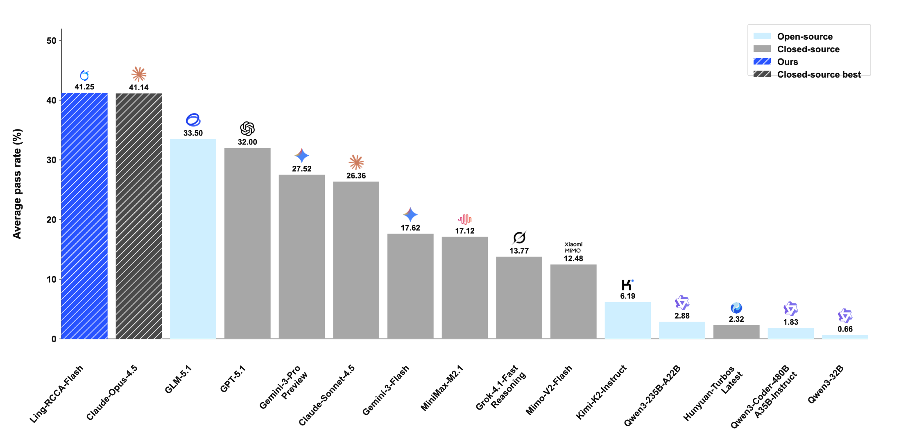

### TL;DR

**Rubric-to-Code Credit Assignment (RCCA)** — an RL framework for interactive web-app generation (HTML/CSS/JS) that converts rubric-level functional feedback into *localized* optimization signals over the responsible code spans, instead of collapsing multi-requirement scores into a single sequence-level reward. Yields Ling-RCCA-Flash, which improves the base model by 32.20 points on MiniAppBench.

### Key idea

Standard GRPO gives one advantage to the whole sequence when the reward is really the AND/sum of many localized requirements (a working button here, a right event handler there). RCCA (a) builds tasks around explicit functional rubrics, (b) uses a **hierarchical reward** that separates format / source-code / runtime / functional failures, and (c) uses an evaluator to attribute rubric outcomes to specific code spans and generated tokens — turning the reward into a per-span signal.

### Main finding

- **MiniAppBench:** Ling-RCCA-Flash **41.25** (+32.20 over Ling-3.0-Flash base), slightly above Claude Opus 4.5.
- **ArtifactsBench:** 76.19 (+4.48 over SFT), setting a new leaderboard top under the official setting and beating GPT-5 by 3.64.
- Suggests transferable implementation-level gains, not just style-fitting.

### Why it matters

Interactive-artifact generation is where RL for LLMs is now going to earn (or fail to earn) real product wins. RCCA is a general credit-assignment fix for the many-requirement, localized-code-region regime — a template beyond web apps, wherever one long output spans multiple independently scorable components.

### Knowledge graph integration

**Builds on / relates to existing pages:**
- [../post-training/grpo.md](../post-training/grpo.md) — RCCA is an explicit critique+extension of GRPO for structured outputs.
- [../post-training/_rewards.md](../post-training/_rewards.md) — hierarchical rubric rewards fit the rewards taxonomy.
- [../post-training/cot-reward-model.md](../post-training/cot-reward-model.md) — rubric-attribution is the reward-modeling side.
- [../post-training/reasoning/prm.md](../post-training/reasoning/prm.md) — process-reward relative, but over code spans instead of reasoning steps.

**Suggested new pages:**
- `post-training/rubric-credit-assignment.md` *(depth)* — the RCCA localized-reward recipe.
- `post-training/hierarchical-reward.md` *(depth)* — format/source/runtime/functional decomposition as a general RL reward pattern.

---

## 14. ElephantBench

**Authors:** Zhuoshi Pan, Junru Lu, Yan Qian, H. Vicky Zhao, Di Yin, Xing Sun — *Tencent*
**Links:** [arXiv:2608.28478](https://arxiv.org/abs/2608.28478) · [HF](https://huggingface.co/papers/2608.28478) · [AlphaXiv](https://www.alphaxiv.org/abs/2608.28478)
**Topics:** `eval`, `data`, `hallucination`

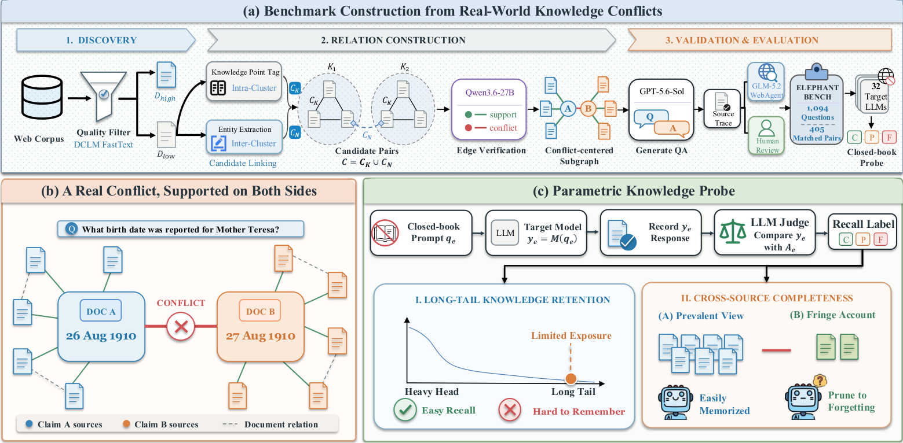

### TL;DR

A closed-book knowledge probe (1,094 questions) that specifically targets **long-tail facts with multiple, genuinely divergent accounts** — not "hallucination" but *epistemic myopia*: recovering one account and silently omitting the others. Generated via an auditable graph-based pipeline over a low-exposure web corpus, with human verification.

### Key idea

Standard factual QA assumes a canonical answer. ElephantBench flips this: for each question there are two (or more) legitimate accounts drawn from real disagreement in the web corpus. The probe measures whether the model can surface *both* — not just whether the top answer is right.

### Main finding

Across **32 models**, even the strongest recovers both accounts only **52.4%** of the time. On the remaining questions, models recall one account and omit the other. Scaling model size and adding test-time reasoning helps but doesn't close the gap. Corpus analysis shows exposure imbalance drives which account wins.

### Why it matters

If deployed LLMs are systematically one-sided on genuinely contested long-tail facts, that's a distinct failure mode from hallucination — and a training-data one, not a decoding one. The graph-based pipeline is also a useful blueprint for turning long-tail corpora into source-traceable knowledge probes.

### Knowledge graph integration

**Builds on / relates to existing pages:**
- [../evaluation/README.md](../evaluation/README.md) — new axis of factual-QA evaluation (multi-account recall).
- [../data/decontamination.md](../data/decontamination.md) — corpus-exposure analysis touches decontamination hygiene.
- [../data/quality-filtering.md](../data/quality-filtering.md) — filtering that suppresses minority accounts is exactly what this probe surfaces.

**Suggested new pages:**
- `evaluation/elephantbench.md` *(depth)* — the benchmark's construction, pipeline, and scoring.
- `evaluation/_knowledge-probing.md` *(taxonomy)* — closed-book probes vs contamination probes vs multi-account probes.

---

## 15. Ring Forcing

**Authors:** Bowen Xue, Brandon Y. Feng, Chenguo Lin, Yuchen Lin, Yujia Zeng, Lvmin Zhang, Maneesh Agrawala, Honglei Yan, Panwang Pan — *Stanford / MIT / Peking U / UC Berkeley / ByteDance*
**Links:** [arXiv:2608.26794](https://arxiv.org/abs/2608.26794) · [HF](https://huggingface.co/papers/2608.26794) · [AlphaXiv](https://www.alphaxiv.org/abs/2608.26794)
**Topics:** `diffusion`, `video`, `memory`

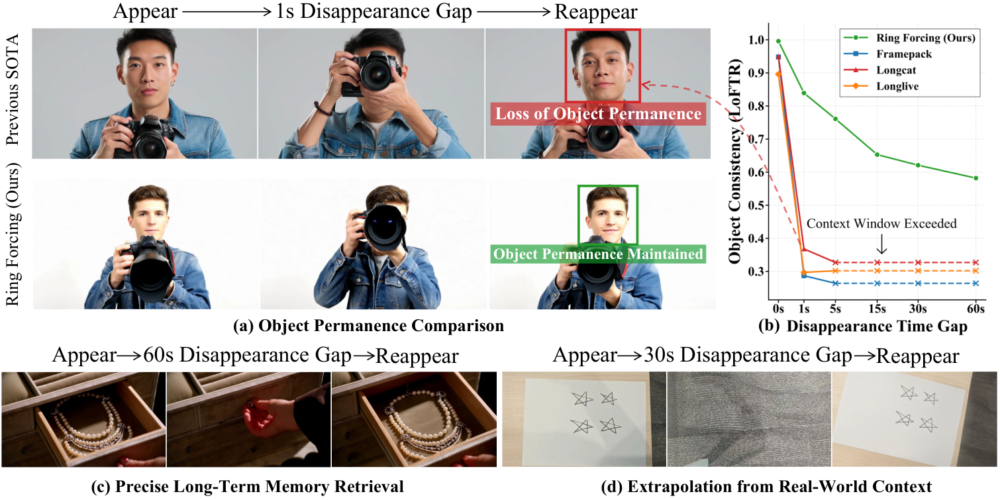

### TL;DR

Autoregressive video diffusion breaks along two axes at long durations — *object permanence* (do things look the same when they come back on screen?) and *memory capacity* (can the model even see far enough back?). Ring Forcing tackles both with a **ring-structured training curriculum**, **compression + timestep composition** to expand effective history, and a **sparse RoPE** memory mechanism.

### Key idea

Three integrated moves. (1) A ring-structured training strategy forces retrieval from distant history, resolving the tension between strict historical fidelity and generative diversity. (2) Compression + timestep composition stretches the effective historical span to minutes under fixed sequence-length constraints. (3) A sparse RoPE variant enables flexible, scalable memory adaptation while preserving the pretrained backbone's positional priors.

### Main finding

State-of-the-art minutes-long coherence and object permanence on the paper's evaluations, "significantly outperforming" prior long-video AR diffusion baselines.

### Why it matters

Text-to-video is quickly moving from "clean 8-second clips" to "coherent multi-minute scenes", and the bottleneck has shifted from per-frame quality to memory. Ring Forcing puts a training-side fix (ring curriculum) alongside architectural ones (sparse RoPE, compression), giving a broadly applicable recipe rather than a one-model trick.

### Knowledge graph integration

**Builds on / relates to existing pages:**
- [../multimodal/README.md](../multimodal/README.md) — long-video AR diffusion sits here.
- [../fundamentals/rope.md](../fundamentals/rope.md) — the sparse-RoPE variant extends RoPE for memory-token spans.
- [../fundamentals/_positional-encoding.md](../fundamentals/_positional-encoding.md) — positional encoding taxonomy home.

**Suggested new pages:**
- `multimodal/ring-forcing.md` *(depth)* — the ring curriculum + sparse-RoPE + compression recipe.
- `multimodal/autoregressive-video-diffusion.md` *(depth)* — general depth page on the AR-diffusion class of video models (shared with LayerRecall).

---

## Notes

- Borderline inclusions (VLA papers, video-diffusion papers) are kept because they touch generative modeling / foundation-model training pipelines directly.
- Hero figures live in `assets/2026-08-31/`. Three papers (VLAct, Puro-2B, Fast Weight Attention) had no usable image on the arxiv HTML view and their `![Hero figure]` lines were dropped.
- This digest is informational. No existing concept files, `READING-LIST.md`, or `PAPERS.md` were modified to produce it.
