# Daily AI papers — 2026-09-03

*Curated from HF Daily Papers. 15 of ~36 papers kept after relevance filter.*

## Papers at a glance

| # | Title | Topics | Org |
| --- | --- | --- | --- |
| 1 | [Repo-To-Skill: Distilling GitHub Repositories Into AI4AI Skills](#1-repo-to-skill) | `agents`, `distillation`, `AI4AI` | BAAI / USTC / RUC / PolyU |
| 2 | [HarnessDev: Can LLMs Create and Evolve Their Own Agent Harness?](#2-harnessdev) | `agents`, `eval`, `harness` | ByteDance Seed / M-A-P |
| 3 | [Aspire: Can Models Self-Evolve from Vague Goals?](#3-aspire) | `agents`, `eval`, `self-evolution` | ByteDance Seed / M-A-P |
| 4 | [SolarWM: Open Data and Scalable Training for Long-Horizon Video World Models](#4-solarwm) | `multimodal`, `video`, `world-models`, `distillation` | (multi-institution) |
| 5 | [EarlyEval: Cheaper Agent Evaluation via Early Outcome Prediction](#5-earlyeval) | `agents`, `eval`, `efficient-inference` | SJTU / SMU / ECNU |
| 6 | [It Takes Two to Match: Co-Evolving Generative Retriever with RL (CoGR)](#6-cogr) | `RL`, `retrieval`, `GRPO` | (industry search) |
| 7 | [Language Models Can Control Their Own Attention (Declarative Attention)](#7-declarative-attention) | `efficient-inference`, `sparse-attention`, `long-context` | KAIST / Google |
| 8 | [S3Gym: Self-Testing, Self-Judging and Self-Improvement](#8-s3gym) | `agents`, `eval`, `RL` | ByteDance Seed / M-A-P |
| 9 | [WHALE: Weight-Harness Alternating LEarning](#9-whale) | `agents`, `RL`, `post-training` | Stanford / U-Wisconsin |
| 10 | [NeoMME: Single-Tower Multimodal-Native Multilingual Foundation Encoder](#10-neomme) | `multimodal`, `retrieval`, `encoder` | H Company |
| 11 | [Cliff: Learning Process Rewards from the First Mistake](#11-cliff) | `RL`, `RLVR`, `process-rewards`, `reasoning` | (industry) |
| 12 | [Influence-Directed Distillation for On-Policy Distillation (IDA-OPD)](#12-ida-opd) | `distillation`, `post-training`, `reasoning` | (industry) |
| 13 | [Post-Training LMs for Gold-Medal Coding Competitions (Nemotron-CC)](#13-nemotron-cc) | `post-training`, `RL`, `reasoning`, `code` | NVIDIA |
| 14 | [CRISP: Cliff-awaRe Input-adaptive Sparse Prefilling](#14-crisp) | `efficient-inference`, `sparse-attention`, `long-context` | Adobe / U-Oregon |
| 15 | [Sparse Readout Prism: Explaining Logit-Lens in Features](#15-srp) | `interp`, `logit-lens`, `features` | Cambridge |

---

## 1. Repo-To-Skill

**Authors:** Jianlyu Chen, Yuyang Hu, Hongjin Qian, Jiawei Liu, Wenqing Wei, Xiaolong Chen, Defu Lian, Zhicheng Dou, Chaozhuo Li, Qiwei Ye, Zheng Liu — *Beijing Academy of AI · USTC · Renmin U. · Hong Kong PolyU*
**Links:** [arXiv:2609.02749](https://arxiv.org/abs/2609.02749) · [HF](https://huggingface.co/papers/2609.02749) · [AlphaXiv](https://www.alphaxiv.org/abs/2609.02749)
**Topics:** `agents`, `distillation`, `AI4AI`

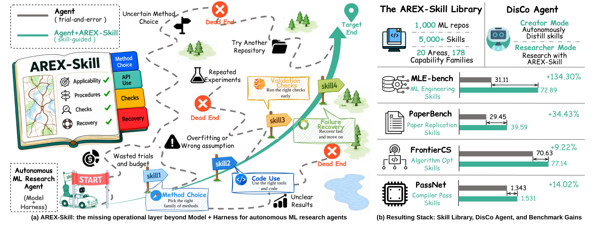

### TL;DR

DisCo is a coding agent that mines GitHub repositories for *operational knowledge* — the small, load-bearing "how to actually make this work" tricks that separate a method's paper from a runnable pipeline — and packages them as reusable, verified skills. The resulting AREX-Skill Library ships **5,000+ skills distilled from 1,000 repositories** and, when handed to downstream ML-research agents, lifts benchmark performance by **9.2% – 134.3%**.

### Key idea

Frame agent knowledge as a three-tier stack: declarative (facts), procedural (how to compose calls), and *operational* (project-specific quirks, undocumented flags, version-pinning gotchas). Repo-To-Skill's DisCo agent reads a repo, extracts candidate skills, executes them against the repo's own environment as ground truth, and stores only the skills that verify — a distillation-by-execution loop rather than a summarization pass.

### Main finding

Across multiple AI4AI benchmarks (agentic ML research, code-execution tasks), agents equipped with the AREX-Skill Library beat their skill-less baselines by **+9.2% to +134.3%**, with the biggest gains on tasks whose reference solutions live inside the mined repos.

### Why it matters

Most agent frameworks assume the model already knows how to use tools; in practice the bottleneck is knowing which flag / version / preprocessing quirk to apply. A programmatic skill-mining pipeline turns the world's GitHub corpus into a durable, verifiable, and cheap capability layer for downstream agents — closer to "software engineering by RAG-over-know-how" than by weight tuning.

### Knowledge graph integration

**Builds on / relates to existing pages:**
- [../agents/README.md](../agents/README.md) — enlarges the agent-side toolkit with a verified-skill library.
- [../post-training/rejection-sampling.md](../post-training/rejection-sampling.md) — execution-verified skill selection is a rejection-sampling cousin over code.

**Suggested new pages:**
- `agents/skill-libraries.md` *(depth)* — verified-skill libraries as agent memory.
- `agents/operational-knowledge.md` *(depth)* — Repo-To-Skill's three-tier framing.

---

## 2. HarnessDev

**Authors:** Yuhao Wu, Jingyuan Zhang, Jiajun Shi et al. — *ByteDance Seed · SUTD · Georgia Tech · M-A-P · TokenWave.AI*
**Links:** [arXiv:2609.01437](https://arxiv.org/abs/2609.01437) · [HF](https://huggingface.co/papers/2609.01437) · [AlphaXiv](https://www.alphaxiv.org/abs/2609.01437)
**Topics:** `agents`, `eval`, `harness`

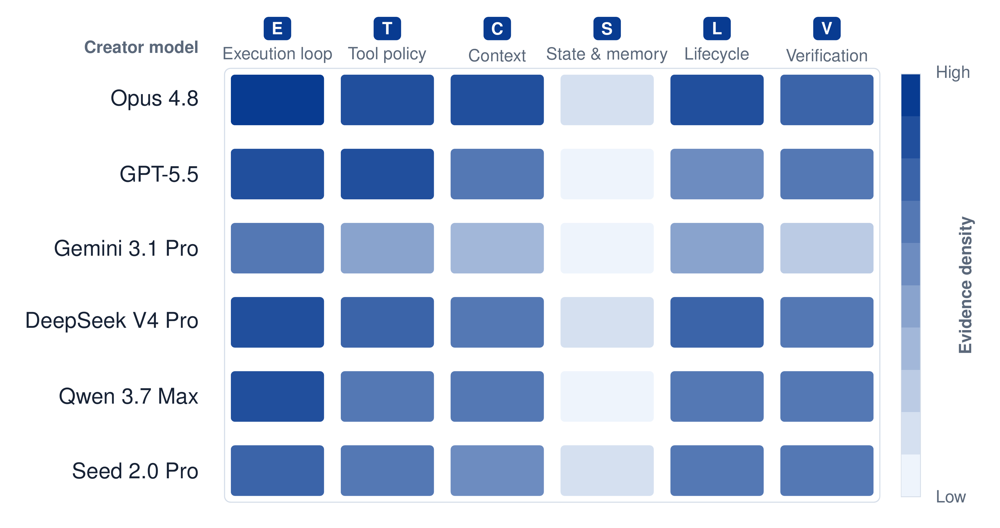

### TL;DR

A benchmark that stops asking "how well does this model solve tasks under a fixed scaffold?" and instead asks "can the model *build and evolve* the scaffold itself?" Two stages — **Creation** (build a full execution harness from a minimal seed) and **Evolution** (iteratively revise it from downstream feedback) — evaluated on capability *and* execution-token cost.

### Key idea

Treat the agent harness (context management, control flow, retries, tool wiring) as the unit of evaluation. Six creator LLMs are given a small seed and a handful of cases and must produce runnable infrastructure for four domains and five downstream benchmarks (2,207 held-out instances).

### Main finding

Generated harnesses stay well below mature human references on code and search/research, match or exceed them on writing and ML experimentation, with wide variance in execution cost. Evolution provides some gains but they're **unstable and only partially transfer** to held-out tasks — and the gains depend on which model executes the harness, i.e. limited cross-model transfer.

### Why it matters

Every benchmark score today implicitly credits some human-engineered scaffold. HarnessDev decouples the two axes and shows current agents are decent scaffold *executors* but weak scaffold *authors* — which reframes "agentic self-improvement" from weight updates toward code-artifact evolution.

### Knowledge graph integration

**Builds on / relates to existing pages:**
- [../agents/README.md](../agents/README.md) — direct evaluation target for agent-scaffold quality.
- [../evaluation/README.md](../evaluation/README.md) — introduces harness-as-artifact as a new evaluation unit.

**Suggested new pages:**
- `agents/agent-harness.md` *(depth)* — the harness concept, Creation/Evolution protocol, cost axis.

---

## 3. Aspire

**Authors:** Yuhao Wu, Jingyuan Zhang, Jiajun Shi, Yuxuan Zhang, Xinping Lei et al. — *ByteDance Seed · M-A-P*
**Links:** [arXiv:2608.31111](https://arxiv.org/abs/2608.31111) · [HF](https://huggingface.co/papers/2608.31111) · [AlphaXiv](https://www.alphaxiv.org/abs/2608.31111)
**Topics:** `agents`, `eval`, `self-evolution`

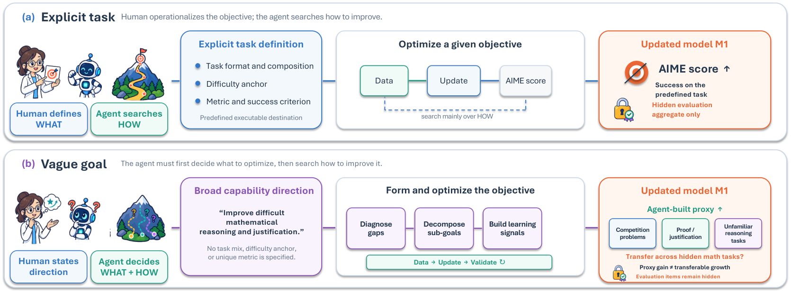

### TL;DR

ASPIRE evaluates whether an LLM agent, given only a **vague natural-language goal** ("become a better physicist"), can operationalize it — pick data, choose update methods, construct its own training and validation signals, and decide when to stop. Downstream tasks are hidden; the agent has to *decide what to learn*.

### Key idea

Rather than handing the model an explicit training set + metric, hand it a capability goal. The agent must self-supervise: propose curricula, run weight-level or harness-level updates, and self-eval. Held-out expert-authored evaluation on 520 items across six goals grades whether local self-eval gains actually transfer.

### Main finding

Current agents complete training/harness loops routinely, but **weight-level gains are sparse and unstable**. The best evolved harness still trails engineered Qwen-Agent references. Agents often train on mismatched data, trust narrow self-evals, and continued search can erase earlier gains — a diagnostic pattern that vague-goal self-evolution should target next.

### Why it matters

"Self-improving agents" is the marketing frontier. ASPIRE gives the first honest measurement stick: without a defined metric to hill-climb, current models mostly wander. The benchmark makes goal-interpretation errors visible and separable from optimizer weakness.

### Knowledge graph integration

**Builds on / relates to existing pages:**
- [../evaluation/README.md](../evaluation/README.md) — a new evaluation genre (vague-goal-driven).
- [../post-training/_post-training.md](../post-training/_post-training.md) — self-directed training loops as a post-training frontier.

**Suggested new pages:**
- `agents/self-evolution.md` *(depth)* — Aspire framing + failure taxonomy for goal-interpretation.

---

## 4. SolarWM

**Authors:** Junchao Huang, Guian Fang, Shengju Qian, Xianghao Kong, Zhuoran Zhao, Wei Huang, Yihua Du, Zixin Zhang, Justin Cui, Yuchao Gu, Yukang Chen, Xinting Hu, Tianyu He, Shaoshuai Shi, Zhuotao Tian, Xin Wang, Mike Zheng Shou, Li Jiang — *multi-institution consortium*
**Links:** [arXiv:2609.02886](https://arxiv.org/abs/2609.02886) · [HF](https://huggingface.co/papers/2609.02886) · [AlphaXiv](https://www.alphaxiv.org/abs/2609.02886)
**Topics:** `multimodal`, `video`, `world-models`, `distillation`

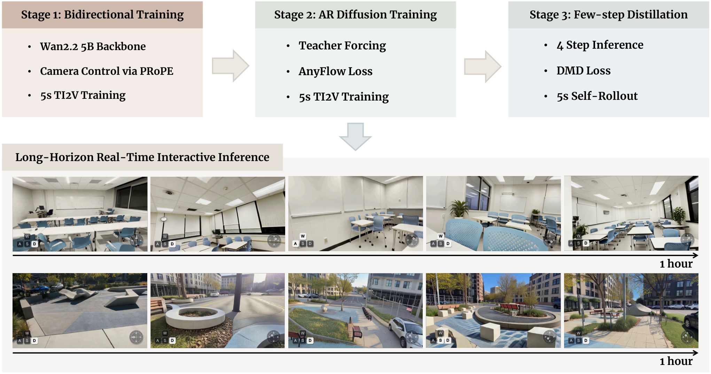

### TL;DR

Fully open, reproducible foundation for training interactive **video world models**. A data engine converts 1.43M canonical clips from 10 datasets into a frame-aligned schema (visual + metric camera + captions + quality + provenance), and a backbone-native adaptation framework instantiates 5B–33B models on top of Wan2.2, LTX-2.5 and MiniMax-H3 under shared camera-conditioning. A three-stage recipe — bidirectional adaptation, teacher-forced autoregressive init, distribution-matching distillation — turns them into causal generators supporting **minutes-to-hours-long real-time rollouts trained on only 5-second sequences**.

### Key idea

Decouple *source processing* (per-dataset normalization to a common contract) from *mixture construction*, so training runs are reproducible across data recipes. Preserve each backbone's native representation instead of forcing a single tokenizer / objective. Bootstrap long-horizon causal generation from short clips via teacher-forced AR + DMD distillation.

### Main finding

Same three-stage recipe scales cleanly across three heterogeneous backbones; distilled causal models sustain real-time interactive rollouts orders of magnitude longer than their training window. Full data pipeline, weights and framework are released.

### Why it matters

Video world models are the current frontier for embodied reasoning and interactive media. Existing training pipelines are siloed and irreproducible; SolarWM is the first open, backbone-agnostic recipe that shows the same DMD-style causal distillation transfers across three architectures — turning "world model" work into a shared substrate rather than a per-lab moat.

### Knowledge graph integration

**Builds on / relates to existing pages:**
- [../multimodal/README.md](../multimodal/README.md) — video-generation foundation extending the multimodal stack.
- [../data/_data-curation.md](../data/_data-curation.md) — the frame-aligned contract is a curation pattern for video.

**Suggested new pages:**
- `multimodal/video-world-models.md` *(depth)* — long-horizon rollout distillation from short clips.
- `multimodal/distribution-matching-distillation.md` *(depth)* — DMD for autoregressive video generators.

---

## 5. EarlyEval

**Authors:** Yuling Shi, Zhensu Sun, Junsen Dong, Chengcheng Wan, David Lo, Xiaodong Gu — *SJTU · Singapore Management U. · ECNU · Shanghai Innovation Institute*
**Links:** [arXiv:2609.02783](https://arxiv.org/abs/2609.02783) · [HF](https://huggingface.co/papers/2609.02783) · [AlphaXiv](https://www.alphaxiv.org/abs/2609.02783)
**Topics:** `agents`, `eval`, `efficient-inference`

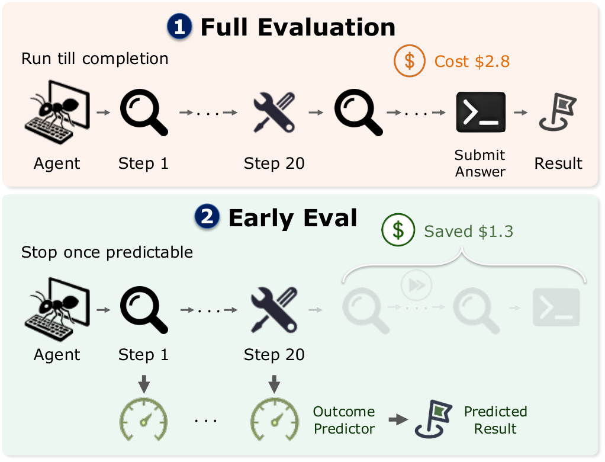

### TL;DR

Agent evaluation on benchmarks like SWE-bench costs hundreds to thousands of dollars per pass. EarlyEval trains a pair of LightGBM classifiers over behavioral, textual and reference-solution features and **halts an agent run the moment either predicts success or failure** at a calibrated confidence threshold — a *within-task* efficiency axis rather than task pruning.

### Key idea

Success and failure predictors are trained separately, both consulted every step; adaptive early stopping happens when either crosses its confidence bar. Features are cheap (behavioral + textual + reference-solution), so the classifier overhead is negligible next to the agent step it might skip.

### Main finding

Across SWE-bench Verified, TerminalBench and Toolathlon: **13–26% of agent steps eliminated**, **up to 44.1% input / 29.4% output tokens saved**, at 89–97% classifier accuracy, with only 1–2 pp change in per-agent resolve rate.

### Why it matters

Benchmark distillation shrinks task counts; EarlyEval shrinks execution *within* the tasks you kept. Combined, they cut the wall-clock and dollar cost of iterating on agentic systems by half or more — an enabler for tighter agent-training loops.

### Knowledge graph integration

**Builds on / relates to existing pages:**
- [../evaluation/README.md](../evaluation/README.md) — a new efficiency axis for agent benchmarks.
- [../agents/README.md](../agents/README.md) — early-halt classifier as an agent-loop control mechanism.

**Suggested new pages:**
- `evaluation/early-outcome-prediction.md` *(depth)* — feature stack, calibration, tradeoffs.

---

## 6. CoGR

**Authors:** Runpeng Dai, Kaili Huang, Changsung Kang, Ciya Liao
**Links:** [arXiv:2609.00638](https://arxiv.org/abs/2609.00638) · [HF](https://huggingface.co/papers/2609.00638) · [AlphaXiv](https://www.alphaxiv.org/abs/2609.00638)
**Topics:** `RL`, `retrieval`, `GRPO`

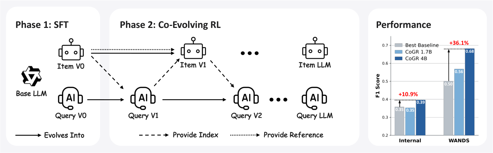

### TL;DR

CoGR trains **two LLMs — one query-side, one item-side — to emit compact keyword sets** that match through a standard inverted index. They are co-evolved with GRPO: the query generator optimizes retrieval F₁ directly, the item generator gets a **counterfactual marginal reward** (change in F₁ from *its* keywords with everything else frozen).

### Key idea

Keep the sparse retrieval infrastructure (inverted index), but replace both human-crafted keywording and dense encoders with LLM-authored keywords on both sides. Symmetric GRPO with a counterfactual reward on the item side makes the alternation stable — each side sees the marginal effect of its own change.

### Main finding

Against 10 sparse, dense, and generative baselines: **+10.9% F₁ over the strongest baseline** on an internal App Marketplace dataset, **+36.1%** on WANDS. Analysis shows the two keyword spaces align tighter over training and the co-evolution stays stable.

### Why it matters

Sparse retrieval is what production ad and search stacks actually run. CoGR shows you can graft GRPO-style RL onto both sides of that stack without giving up the inverted-index infrastructure — a template for RL-improved retrieval in high-QPS environments.

### Knowledge graph integration

**Builds on / relates to existing pages:**
- [../post-training/grpo.md](../post-training/grpo.md) — direct application of GRPO to a two-agent retrieval optimization.
- [../post-training/_rewards.md](../post-training/_rewards.md) — the item-side counterfactual reward is a shaping reward variant.

**Suggested new pages:**
- `post-training/counterfactual-marginal-reward.md` *(depth)* — the item-side signal formalism.

---

## 7. Declarative Attention

**Authors:** Namgyu Ho, Huzama Ahmad, Woosung Koh, Se-Young Yun, Tal Schuster, Cicero Nogueira dos Santos — *KAIST · Google*
**Links:** [arXiv:2609.02737](https://arxiv.org/abs/2609.02737) · [HF](https://huggingface.co/papers/2609.02737) · [AlphaXiv](https://www.alphaxiv.org/abs/2609.02737)
**Topics:** `efficient-inference`, `sparse-attention`, `long-context`

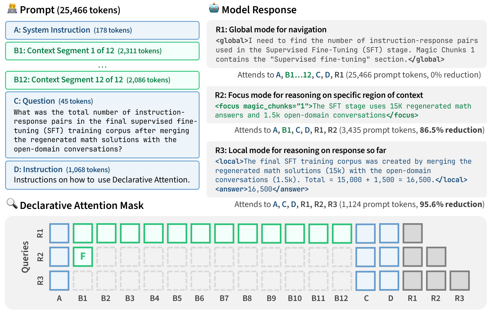

### TL;DR

Instead of a *proxy scorer* that ranks KV cache tokens per step, let the model **declare its own attention scope inside the chain-of-thought**: `<global>` (full context), `<focus>` (a named region), `<local>` (recent output). The inference engine parses these like tool-calls and simply skips the rest of the KV cache read.

### Key idea

Sparse attention has been *extrinsic* (proxy scores over the KV cache, still O(N) per step). Declarative Attention is *intrinsic* — the model knows what it's looking for; make it say so, and honor the declaration. Turns runtime attention scope into a scripted control-flow property of the CoT.

### Main finding

Zero-shot on Gemma-4-31B and Qwen-3.6-27B across 15 long-context tasks: **52.0% / 31.1% reduction in attended tokens during decoding** at only **1.27 / 2.75 pp accuracy loss** — a gap that shrinks with model scale, hinting training-based variants would close it entirely.

### Why it matters

Long-context inference is bottlenecked by KV-cache reads, not compute. Declarative attention shifts the sparsity decision from an ad-hoc scorer to the model itself, which turns out to already know the answer — a cleaner architectural direction than yet another proxy-score design.

### Knowledge graph integration

**Builds on / relates to existing pages:**
- [../inference/README.md](../inference/README.md) — a new sparse-attention family sits in this folder.
- [../fundamentals/attention.md](../fundamentals/attention.md) — modifies runtime attention scope.

**Suggested new pages:**
- `inference/declarative-attention.md` *(depth)* — the `<global>/<focus>/<local>` protocol and engine integration.
- `inference/_sparse-attention.md` *(taxonomy)* — proxy-score vs intrinsic sparse-attention.

---

## 8. S3Gym

**Authors:** Jiajun Shi, Siyuan Tao, Yuhao Wu, Zexuan Wang, Jingyuan Zhang et al. — *ByteDance Seed · M-A-P · TokenWave.AI*
**Links:** [arXiv:2608.31100](https://arxiv.org/abs/2608.31100) · [HF](https://huggingface.co/papers/2608.31100) · [AlphaXiv](https://www.alphaxiv.org/abs/2608.31100)
**Topics:** `agents`, `eval`, `RL`

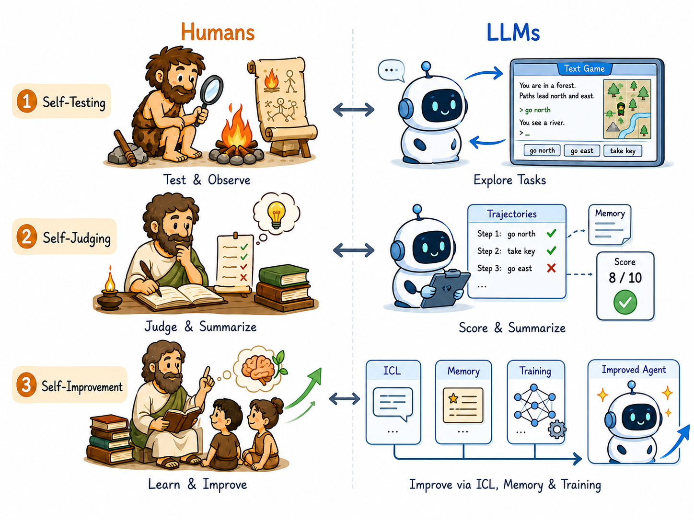

### TL;DR

An interactive benchmark for **self-improvement** as a *sequence of three coupled capabilities*: Self-Testing (design one's own probes), Self-Judging (score one's own trajectories), Self-Improvement (use those judgments to update). Seven text-based games with executable environment verifiers, permissive exploration on one split, strict held-out evaluation on another.

### Key idea

Rather than benchmarking agents as fixed policies, S3Gym gives them an interactive environment where the *evaluation signal itself* is something the agent must construct. Executable verifiers give ground truth after the fact — so self-judging errors are directly measurable.

### Main finding

The paper is primarily a benchmark; abstract highlights the framework but full quantitative comparisons are in the paper body. Companion to Aspire and HarnessDev — all three probe different aspects of self-directed agent development.

### Why it matters

S3Gym operationalizes "self-improvement" cleanly enough that each of its three sub-capabilities can be graded independently. The next generation of agent RL papers will need this decomposition to claim honest progress.

### Knowledge graph integration

**Builds on / relates to existing pages:**
- [../evaluation/README.md](../evaluation/README.md) — a new benchmark type (self-directed).
- [../agents/README.md](../agents/README.md) — evaluation target for agentic self-eval loops.

**Suggested new pages:**
- `evaluation/self-improvement-benchmarks.md` *(depth)* — S3Gym's testing/judging/improving decomposition.

---

## 9. WHALE

**Authors:** Haechan Kim, Yoonho Lee, Gisang Lee, Chelsea Finn, Kangwook Lee — *Stanford · U-Wisconsin*
**Links:** [arXiv:2609.00196](https://arxiv.org/abs/2609.00196) · [HF](https://huggingface.co/papers/2609.00196) · [AlphaXiv](https://www.alphaxiv.org/abs/2609.00196)
**Topics:** `agents`, `RL`, `post-training`

### TL;DR

Agent performance depends jointly on model weights and the harness code that manages context and control flow. WHALE (Weight-Harness Alternating LEarning) is a two-phase recipe: **update the model under the current harness, then search for a better harness under the updated model**, alternating.

### Key idea

Existing joint-adaptation methods optimize *weights* and *textual prompts*, but leave the broader harness (retries, tool routing, memory) fixed. WHALE treats the harness as first-class optimizable code and alternates its updates with weight updates so the two co-adapt instead of drifting apart.

### Main finding

Empirical section details in the paper body — the framing is the contribution: pairs naturally with HarnessDev/Aspire's benchmarks, and complements weight-only agent RL by giving a principled recipe for joint code+weight learning.

### Why it matters

Every deployed agent has a harness; freezing it during weight updates leaves compounding value on the table. WHALE gives the first clean protocol for treating the harness as a co-optimized artifact, closing a loop that current agent-RL work leaves open.

### Knowledge graph integration

**Builds on / relates to existing pages:**
- [../post-training/_rl.md](../post-training/_rl.md) — the weight-update phase reuses RL post-training methods.
- [../agents/README.md](../agents/README.md) — introduces harness-as-parameter to the agent stack.

**Suggested new pages:**
- `agents/joint-harness-weight-optimization.md` *(depth)* — the alternating recipe.

---

## 10. NeoMME

**Authors:** Aurélien Lac, Tony Wu — *H Company*
**Links:** [arXiv:2609.01657](https://arxiv.org/abs/2609.01657) · [HF](https://huggingface.co/papers/2609.01657) · [AlphaXiv](https://www.alphaxiv.org/abs/2609.01657)
**Topics:** `multimodal`, `retrieval`, `encoder`

### TL;DR

A 260M / 800M **single-tower bidirectional encoder** for multimodal (image + multilingual text) retrieval, pretrained from scratch with a **masked discrete-diffusion text objective** conditioned on visible image patches. Supports 16,384-token context (two 4K UHD images) and, with jointly trained dense + late-interaction heads, sets a new SOTA on ViDoRe v3 among sub-800M models.

### Key idea

Repurposing generative VLMs as document retrievers (ColPali-style) drags along the causal-LM overhead. NeoMME instead pretrains a bidirectional encoder specifically for the encoding task, using masked discrete diffusion as the pretraining objective, and adds an efficient hierarchical-pooling + asymmetric-quantization stack for storage.

### Main finding

NeoMME-Retriever 260M: **0.523 nDCG@10** on ViDoRe v3, best among <800M models; 800M variant reaches **0.556**. **~2× encoding throughput** vs ColModernVBERT at 2048×2048 input on an L40S. Late-interaction embeddings compressed **255×** while preserving **>95%** of baseline nDCG@10.

### Why it matters

Multimodal retrieval was inheriting VLM cost by default. A bidirectional, retrieval-native encoder pretrained with masked diffusion is dramatically cheaper per-page — the first serious challenge to the "just fine-tune a VLM" default for visual document retrieval.

### Knowledge graph integration

**Builds on / relates to existing pages:**
- [../multimodal/README.md](../multimodal/README.md) — introduces a retrieval-native multimodal encoder family.
- [../fundamentals/_tokenization.md](../fundamentals/_tokenization.md) — masked discrete diffusion is an alternative to causal LM pretraining.

**Suggested new pages:**
- `multimodal/masked-discrete-diffusion-pretraining.md` *(depth)* — the MDD objective for multimodal encoders.

---

## 11. Cliff

**Authors:** Peixuan Han, Runhui Wang, Ketan Ramaneti, Jie Hao, Gerald Friedland, Chris Kong
**Links:** [arXiv:2609.02817](https://arxiv.org/abs/2609.02817) · [HF](https://huggingface.co/papers/2609.02817) · [AlphaXiv](https://www.alphaxiv.org/abs/2609.02817)
**Topics:** `RL`, `RLVR`, `process-rewards`, `reasoning`

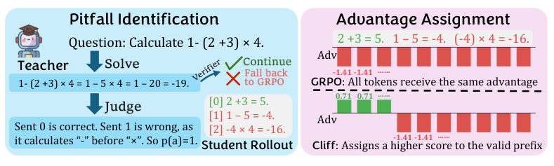

### TL;DR

Sidesteps the "PRMs are hackable / hard to define per-step" pain by using an **off-the-shelf teacher LLM to identify the first mistake** in each RLVR rollout. Everything *before* the mistake gets positive token-level advantage; everything *after* gets negative. No dedicated PRM; no assumption of matched teacher/student patterns.

### Key idea

Once reasoning goes wrong, later tokens are conditioned on an invalid prefix — so evaluating them further adds no information. Reduce process-reward modeling to *locate the first cliff*, then binary-shape the trace. The teacher LLM only has to identify one location, not score every step.

### Main finding

Across 12 scenarios: **+15% over on-policy distillation**, **+7% over standard GRPO**, holding even with modestly capable teacher models. Analysis of the "ground truth" role and training dynamics is included.

### Why it matters

Provides the reward density of PRMs without the PRM's brittleness or labeling cost, and without on-policy distillation's teacher-pattern assumptions — a practical middle path for RLVR that any team with a decent teacher model can adopt.

### Knowledge graph integration

**Builds on / relates to existing pages:**
- [../post-training/rlvr.md](../post-training/rlvr.md) — a reward-shaping strategy layered on RLVR.
- [../post-training/reasoning/prm.md](../post-training/reasoning/prm.md) — sidesteps PRMs while capturing their per-step benefit.
- [../post-training/grpo.md](../post-training/grpo.md) — evaluated against GRPO as the RL optimizer.
- [../post-training/_rewards.md](../post-training/_rewards.md) — introduces a "first-mistake shaping" variant.

**Suggested new pages:**
- `post-training/reasoning/first-mistake-reward.md` *(depth)* — Cliff's teacher-located cliff mechanism and comparisons.

---

## 12. IDA-OPD

**Authors:** Run Yang, Runpeng Dai, Jie Sun, Jielei Zhang, Fan Zhou, Hongtu Zhu, Peiyi Li, Longwen Gao
**Links:** [arXiv:2608.29846](https://arxiv.org/abs/2608.29846) · [HF](https://huggingface.co/papers/2608.29846) · [AlphaXiv](https://www.alphaxiv.org/abs/2608.29846)
**Topics:** `distillation`, `post-training`, `reasoning`

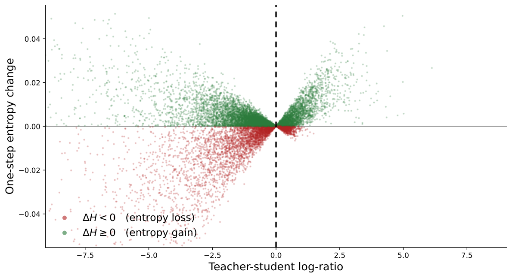

### TL;DR

Diagnoses **why sampled-token on-policy distillation (OPD) collapses diversity** — pass@1 improves while pass@k plateaus — using a signed *First-Order Local Entropy Influence* proxy, then proposes IDA-OPD: keep entropy-*expanding* updates as-is, and replace entropy-*contracting* ones with divergence-adaptive advantage shrinkage using only the teacher's sampled-token log-probability.

### Key idea

Full-vocabulary forward-KL to preserve diversity is expensive. IDA-OPD isolates the sign of each update's entropy influence from cheap local statistics, then only intervenes where the student is losing entropy — a targeted, sampled-token fix instead of a global objective change.

### Main finding

On reasoning-oriented distillation, IDA-OPD consistently improves pass@k (inheriting teacher diversity) while matching the strongest teacher-informed methods at **strictly lower cost**, and broadly preserving vanilla OPD's pass@1 — all without full-vocabulary teacher access.

### Why it matters

Sampled-token OPD is the practical default for distilling reasoning behavior into small models, but its diversity bottleneck limits downstream RL. A cheap, targeted fix keeps the same infra and unlocks the pass@k regime that self-consistency / RL post-training care about.

### Knowledge graph integration

**Builds on / relates to existing pages:**
- [../post-training/_post-training.md](../post-training/_post-training.md) — a variant in the distillation family of post-training methods.
- [../post-training/rejection-sampling.md](../post-training/rejection-sampling.md) — diversity preservation matters for pass@k rerank pipelines.

**Suggested new pages:**
- `post-training/on-policy-distillation.md` *(depth)* — OPD framing, diversity bottleneck, IDA fix.

---

## 13. Nemotron-CC

**Authors:** Aleksander Ficek, Sean Narenthiran, Mehrzad Samadi, Somshubra Majumdar, Boris Ginsburg — *NVIDIA*
**Links:** [arXiv:2609.02849](https://arxiv.org/abs/2609.02849) · [HF](https://huggingface.co/papers/2609.02849) · [AlphaXiv](https://www.alphaxiv.org/abs/2609.02849)
**Topics:** `post-training`, `RL`, `reasoning`, `code`

### TL;DR

End-to-end specialization pipeline for competitive programming: 22k curated problems → synthetic reasoning traces → SFT → RL. **Nemotron-3-Nano-CC (30B-A3B)** trained with SFT+RL and **Nemotron-3-Ultra-CC (550B-A55B)** with SFT alone. Plus **GenCorrect**, an iterative generate-evaluate-refine test-time compute strategy. First AI system to outscore the top human on an IOI problem set.

### Key idea

Combine large-scale problem curation, synthetic long-CoT trace generation, SFT, and RL specialization on both a dense-experts small model and a sparse-experts giant. Add GenCorrect as a feedback-driven test-time controller that iteratively refines a diverse pool of candidate solutions.

### Main finding

IOI 2025: **Nano-CC 130 → 291** points post-training, **→ 468** with GenCorrect (**exceeding the 438.3 gold threshold**); Ultra-CC reaches **502**. On IOI 2026, under human contest constraints (time / internet / submissions), the Ultra-CC system scores **535.4 / 600**, **exceeding both the 361.12 gold threshold and the top human score of 498.27** — the first AI to outscore the highest-scoring human on an IOI problem set.

### Why it matters

Competition programming was the last narrow reasoning benchmark where top humans still had daylight over AI systems. That gap just closed — under matched constraints. The paper also makes the SFT+RL+test-time-search stack more legible: dense-experts *and* sparse-experts models specialize cleanly, and the test-time controller is the biggest single lift.

### Knowledge graph integration

**Builds on / relates to existing pages:**
- [../post-training/rlvr.md](../post-training/rlvr.md) — competitive programming rewards are rule-verifiable at scale.
- [../post-training/reasoning/long-cot-rl.md](../post-training/reasoning/long-cot-rl.md) — long-CoT RL applied to competitive programming.
- [../post-training/rejection-sampling.md](../post-training/rejection-sampling.md) — GenCorrect iterates over sampled candidates.
- [../evaluation/codeforces-benchmark.md](../evaluation/codeforces-benchmark.md) — direct competitive-programming evaluation family.
- [../evaluation/livecodebench.md](../evaluation/livecodebench.md) — sibling code-reasoning benchmark.

**Suggested new pages:**
- `post-training/reasoning/gencorrect.md` *(depth)* — the iterative generate-evaluate-refine test-time controller.
- `case-studies/nemotron-3-cc.md` *(case study)* — end-to-end IOI-gold specialization pipeline.

---

## 14. CRISP

**Authors:** Huu Huy Nguyen, Chien Van Nguyen, Franck Dernoncourt, Ryan A. Rossi, Linh Ngo Van, Jieyang Chen, Thien Huu Nguyen — *Adobe Research · U-Oregon*
**Links:** [arXiv:2609.01925](https://arxiv.org/abs/2609.01925) · [HF](https://huggingface.co/papers/2609.01925) · [AlphaXiv](https://www.alphaxiv.org/abs/2609.01925)
**Topics:** `efficient-inference`, `sparse-attention`, `long-context`

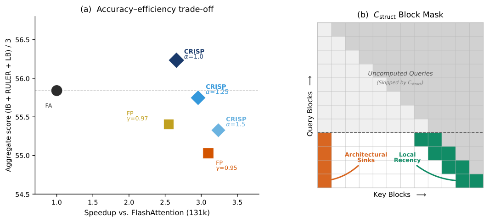

### TL;DR

Two structural fixes to input-adaptive sparse prefilling. (1) Replace JSD-based head routing with **C_struct**, which reads routing decisions off structural mass in Vertical-Slash-compatible positions — eliminating the pooled matmul + KL overhead. (2) Formalize the **post-softmax mass cliff** and replace strict cumulative-coverage thresholds (which accumulate O(N) background noise at long context) with a **sink-aware threshold** grounded in the noise floor.

### Key idea

The two dominant costs and errors in dynamic sparse prefilling — routing computation and coverage-threshold noise — both trace to ignoring the post-softmax mass structure. CRISP names that structure and reads both decisions directly off it.

### Main finding

Across InfiniteBench, RULER and LongBench on two model families: **strongest sparse method overall**, matches or exceeds *exact dense* on retrieval-heavy tasks (**+28 pp on retrieval** vs baselines), and up to **5.30× attention speedup at 512k tokens**, driven primarily by O(n) noise elimination during selection.

### Why it matters

Sparse prefilling papers have proliferated; CRISP unifies two of their biggest recurring gotchas (routing overhead, coverage noise) under one structural framing and delivers speedups that don't cost accuracy. A tidy candidate default for long-context inference stacks.

### Knowledge graph integration

**Builds on / relates to existing pages:**
- [../inference/README.md](../inference/README.md) — a new sparse-prefilling variant sits here.
- [../fundamentals/attention.md](../fundamentals/attention.md) — modifies prefill-time attention computation.

**Suggested new pages:**
- `inference/sparse-prefilling.md` *(depth)* — CRISP's structural-mass routing + sink-aware threshold.

---

## 15. SRP

**Authors:** Matteo He, William F. Shen, Xinchi Qiu, Nicholas D. Lane — *University of Cambridge*
**Links:** [arXiv:2609.01936](https://arxiv.org/abs/2609.01936) · [HF](https://huggingface.co/papers/2609.01936) · [AlphaXiv](https://www.alphaxiv.org/abs/2609.01936)
**Topics:** `interp`, `logit-lens`, `features`

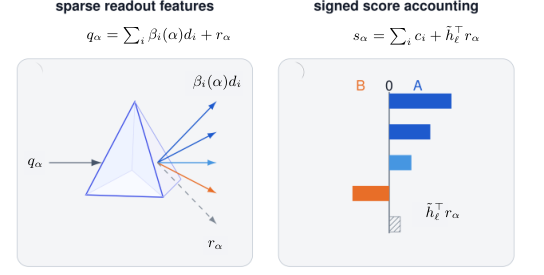

### TL;DR

Standard logit-lens readings mix two things — the hidden state *and* the readout (unembedding matrix) used to decode it. **Sparse Readout Prism (SRP)** decomposes the readout using only its weights (no corpus fit) and expresses any token logit / logit difference as a sum of contributions from **sparse readout features** — giving interpretability a corpus-independent unit of analysis.

### Key idea

Show that two lenses differing only in fitting corpus can return different tokens for the same hidden state (*corpus conditionality*). Then extract structure from the readout weights alone via SRP, so the analysis unit becomes a stable readout feature rather than a corpus-dependent token.

### Main finding

SRP reconstructs **8.9–17.3 pp more of the tested logit differences** than the strongest of six baselines built on geometric readout-row relations. Feature ablations shift logits proportionally to their SRP contributions. **Dominant readout features are stable across fitting corpora** even when tokens aren't — SRP provides a corpus-independent control for lens analyses.

### Why it matters

Logit-lens is a workhorse for mechanistic interpretability; corpus conditionality has been a nagging confound. SRP gives a principled substitute — features, not tokens — that decouples the lens from its dataset and provides sanity-checks any lens study can use as a control.

### Knowledge graph integration

**Builds on / relates to existing pages:**
- [../interpretability/README.md](../interpretability/README.md) — sits in the logit-lens family.

**Suggested new pages:**
- `interpretability/logit-lens.md` *(depth)* — the underlying lens family (currently unrepresented).
- `interpretability/sparse-readout-prism.md` *(depth)* — SRP mechanism and control usage.

---

## Notes

- Borderline inclusions are flagged in-section with an italic *Borderline: …* note.
- Hero figures live in `assets/2026-09-03/`. WHALE (2609.00196) and Nemotron-CC (2609.02849) had no accessible figure and their `![Hero figure]` line is omitted.
- This digest is informational. No existing concept files, `READING-LIST.md`, or `PAPERS.md` were modified to produce it.
